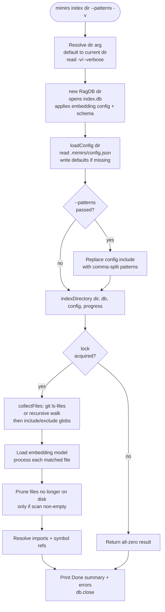

# CLI: index

`mimirs index [dir] [--patterns ...] [-v]` scans a project directory, embeds every matching file into the local index, and prints a one-line summary of how many files were indexed, skipped, and pruned. It is the command you run to build or refresh the searchable index that powers `search`, `read`, `map`, and the MCP server. Running it again after editing code re-indexes only what changed: files whose content hash matches the stored hash are skipped, and files deleted from disk are pruned out of the index.

The command is a thin CLI wrapper. The real work lives in `indexDirectory`, the same indexing engine the MCP `index_files` tool and the file watcher call (see [index_files](../tools/index-files.md)). This page follows the CLI path from argument parsing through the database writes.

## How it runs

The top-level CLI reads `process.argv`, matches the first word `index`, and calls `indexCommand(args, getFlag)` `src/cli/index.ts:119-120`. Everything after that is in the handler `src/cli/commands/index-cmd.ts:8-49`.



1. The user runs the command. `dir` is the first positional argument; if it is missing or looks like a flag (starts with `--`), the handler defaults to `.` and resolves it to an absolute path `src/cli/commands/index-cmd.ts:9`.
2. Verbose mode is on if the args contain `--verbose` or `-v` `src/cli/commands/index-cmd.ts:10`. This only changes how progress is printed, not what gets indexed.
3. A `RagDB` is opened for the directory. Its constructor creates the index directory, opens `index.db`, applies the project's embedding model and dimension from disk, loads the sqlite-vec extension, and creates the schema if it does not exist. The comment at `src/cli/commands/index-cmd.ts:12-13` notes that this is why the handler does not call `applyEmbeddingConfig` separately.
4. `loadConfig(dir)` reads `.mimirs/config.json`. If the file is absent it writes the defaults there first and returns them, so a first run always has a config on disk to edit `src/config/index.ts:140-147`.
5. If `--patterns` was passed, its comma-separated value replaces `config.include` entirely (each pattern trimmed) `src/cli/commands/index-cmd.ts:16-19`. This is an override, not an addition.
6. `indexDirectory(dir, db, config, progress)` does the scanning, embedding, and writing `src/cli/commands/index-cmd.ts:39`. It first guards against system directories and acquires a per-directory lock; if another live process holds the lock, the call returns immediately with an all-zero result `src/indexing/indexer.ts:809-831`.
7. With the lock held, the engine collects matching files (described under [Which files get scanned](#which-files-get-scanned)), loads the embedding model once files are found, and processes each matched file — upserting its rows into the database (details under State changes) `src/indexing/indexer.ts:835-872`.
8. After the file loop, files that are in the index but no longer on disk are pruned, then import paths and symbol references are resolved across all files `src/indexing/indexer.ts:876-901`.
9. `indexDirectory` returns an `IndexResult` with `indexed`, `skipped`, `pruned`, and `errors` `src/indexing/indexer.ts:47-54`. The handler prints the summary line with elapsed seconds, prints any errors, and closes the database `src/cli/commands/index-cmd.ts:41-48`.

## Which files get scanned

Before any embedding happens, `collectFiles` decides what to read. It does not just walk the directory tree: it first asks git for the project's non-ignored files, so `.gitignore` is honored end to end `src/indexing/indexer.ts:241-287`.

- **Git-aware listing.** `listGitFiles` runs `git ls-files --cached --others --exclude-standard -z` in the directory. `--cached` lists tracked files; `--others --exclude-standard` adds untracked files that are *not* ignored — so new, uncommitted source is still indexed, but anything matched by `.gitignore` (nested rules, negations, the global excludes file) is left out, and heavy ignored directories like `node_modules` are never even walked `src/indexing/indexer.ts:218-228`.
- **Fallback walk.** When the directory is not a git repo, git is missing, or the git command exits non-zero, `listGitFiles` returns `null` and `collectFiles` falls back to a plain recursive `readdir` of the whole tree `src/indexing/indexer.ts:236-238`, `src/indexing/indexer.ts:255-256`.
- **Empty output → walk, not wipe.** An empty `git ls-files` result is ambiguous — it can mean the user pointed mimirs at a gitignored subdirectory they clearly want indexed, not that every file was deleted. So empty output also returns `null` and triggers the recursive walk rather than being treated as "zero files," which would otherwise let the prune step delete the entire existing index `src/indexing/indexer.ts:229-235`.
- **Config globs on top.** Whichever source produced the file list, every entry is then filtered through the config `exclude` and `include` patterns: a path is dropped if it matches an exclude glob, and kept only if it matches an include glob `src/indexing/indexer.ts:247-267`. So `.gitignore` and the config patterns layer — git decides the candidate set, the config narrows it.

## Inputs

| name | type | required | description |
| --- | --- | --- | --- |
| `dir` | positional path | no | Directory to index. Defaults to the current directory. Ignored if it begins with `--` so flags are not mistaken for the path `src/cli/commands/index-cmd.ts:9`. |
| `--patterns` | comma-separated glob string | no | Overrides the config's `include` list with exactly these patterns, e.g. `--patterns "**/*.ts,**/*.md"`. Each entry is trimmed `src/cli/commands/index-cmd.ts:16-19`. |
| `-v` / `--verbose` | boolean flag | no | Prints per-file progress (`Indexing ...`, `Indexed: ...`) instead of a single updating progress line `src/cli/commands/index-cmd.ts:10`. |
| `.mimirs/config.json` | file on disk | no | Supplies `include`, `exclude`, embedding model/dim, chunk size, and indexing options. Created with defaults on first run `src/config/index.ts:140-147`. |
| `.gitignore` | file on disk | no | Honored automatically for git repos: ignored paths are excluded from the candidate file set via `git ls-files` `src/indexing/indexer.ts:218-228`. |

The default `include` list covers source languages (TypeScript, Python, Go, Rust, Java, C/C++, and more), Markdown and text, build files like `Makefile` and `Dockerfile`, shell scripts, and structured config such as YAML, TOML, and SQL `src/config/index.ts:48-93`. Passing `--patterns` discards all of that for the run and uses only what you supply.

## Outputs

| output | where it lands / shape / description |
| --- | --- |
| File and chunk rows | Written to `index.db`: a `files` row per indexed file plus `chunks` rows for its semantic pieces, each with an embedding mirrored into `vec_chunks` `src/db/files.ts:99-110` and full-text content mirrored into `fts_chunks` via triggers. |
| Graph + symbol data | `file_imports`, `file_exports`, and `symbol_refs` rows derived per file `src/indexing/indexer.ts:575-584`, then cross-resolved after the file loop `src/indexing/indexer.ts:892-901`. |
| Summary line | `Done: <indexed> indexed, <skipped> skipped, <pruned> pruned (<elapsed>s)` printed to stdout `src/cli/commands/index-cmd.ts:42-44`. |
| Error report | If any file failed, an `Errors: ...` block listing each message `src/cli/commands/index-cmd.ts:45-47`. |
| Progress output | Live progress to the terminal — a single updating line by default, or per-file lines under `-v`. |

A sample run looks like:

```
$ mimirs index . -v
Indexing /Users/example/project...
Indexing src/example.ts
Indexed: src/example.ts (12 chunks)
Skipped (unchanged): src/util.ts
...
Done: 84 indexed, 31 skipped, 2 pruned (6.3s)
```

## Verbose vs quiet progress

The handler builds the progress callback differently depending on the verbose flag `src/cli/commands/index-cmd.ts:26-37`.

| mode | callback | what the user sees |
| --- | --- | --- |
| `-v` / `--verbose` | `cliProgress` directly | Every message from the engine. `file:start`/`file:done` bookkeeping is suppressed, but `Indexing <path>`, `Indexed: <path> (N chunks)`, and `Skipped (...)` lines all print `src/cli/progress.ts:24-35`. |
| default (quiet) | a wrapper that lazily creates `createQuietProgress` | A single overwriting line, plus the persistent `Found`, `Pruned`, and `Resolved` summary lines `src/cli/progress.ts:42-101`. Per-file Indexed/Skipped noise is hidden. |

In quiet mode the wrapper waits for the engine's `Found <N> files to index` message, parses the count out of it, and only then constructs the quiet renderer sized to that total `src/cli/commands/index-cmd.ts:27-30`. Until that message arrives — during the initial directory scan and model load — messages fall through to `cliProgress` so early status is still visible. The quiet renderer tracks the current file from `file:start`, advances a counter on `file:done`, and shows per-file embedding progress parsed from `Embedded X/Y chunks` messages `src/cli/progress.ts:56-88`. The line it writes has the form `Indexing: <n>/<total> files (<pct>%) | <chunks-done>/<chunks-total> — <current file>`, with the chunk segment and file segment omitted when not yet known `src/cli/progress.ts:48-54`.

Both modes use a shared transient-line mechanism: transient messages overwrite the current terminal line, and a persistent message first clears any transient line before printing on its own line `src/cli/progress.ts:8-22`.

## State changes

### Index rows for each matched file: absent or stale → current

When `indexDirectory` processes a file, `processFile` reads it once, hashes the content, and looks up the stored row `src/indexing/indexer.ts:463-465`. If a row exists with the same hash, the file is skipped and nothing is written `src/indexing/indexer.ts:467-470`. Otherwise the file is (re)indexed:

- For a full re-index, `upsertFileStart` deletes the file's existing chunks and updates (or inserts) the `files` row, keeping the same `files.id` so foreign keys from other files' resolved imports stay intact `src/db/files.ts:50-76`. Deleting chunks fires the `chunks_vec_ad` trigger, so the matching `vec_chunks` and FTS entries are dropped automatically `src/db/files.ts:54-59`.
- New chunks are embedded in batches and inserted via `insertChunkBatch`, which also writes each embedding into `vec_chunks` in the same transaction `src/db/files.ts:89-115`.
- Graph metadata (`file_imports`, `file_exports`) and per-chunk symbol references (`symbol_refs`) are written for the file `src/indexing/indexer.ts:575-584`.

When incremental chunking is enabled and the file already has hashed chunks, `processFileIncremental` re-embeds only the chunks whose content hash changed and updates positions for the rest, falling back to a full re-index when incremental is not viable `src/indexing/indexer.ts:513-517`. Either way the observable result is the same: the index reflects the current file content. The state change is triggered by `indexDirectory(dir, db, config, progress)` `src/cli/commands/index-cmd.ts:39` and counted as `indexed` or `skipped` in the result `src/indexing/indexer.ts:861-865`.

### Deleted files: present in index → pruned

After the file loop, unless pruning is explicitly disabled, `indexDirectory` collects the set of files it just matched and calls `db.pruneDeleted(existingPaths)` `src/indexing/indexer.ts:876-890`. `pruneDeleted` deletes every `files` row whose path is not in that set, removing its chunks (and, via the trigger, its vectors) and clearing its graph rows `src/db/files.ts:284-303`. The returned count becomes `result.pruned`. This is why a full CLI index keeps the index honest: rename or delete a file and the next run drops it.

Two guards keep pruning from over-deleting. First, it only runs when the scan found at least one file: an empty `matchedFiles` almost always means a degenerate scan (git returned nothing, a transient filesystem error, a too-narrow filter) rather than a genuinely empty project, and pruning against the empty set would wipe the whole index `src/indexing/indexer.ts:876-885`. Second, pruning compares against just the matched set, so a narrowed `--patterns` run only ever reconciles the files those patterns match — see the failure note below.

### Cross-file resolution: per-file refs → resolved edges

Once at least one file was indexed, the engine resolves import paths across all files and then resolves symbol references against that import scope `src/indexing/indexer.ts:892-901`. Symbol resolution must follow import resolution because cross-file reference edges depend on `file_imports.resolved_file_id`. This is what makes `usages`, `depends_on`, and `dependents` return cross-file results after indexing.

## Branches and failure cases

- **Default directory.** No `dir` argument, or a first argument starting with `--`, falls back to the current directory `src/cli/commands/index-cmd.ts:9`.
- **`--patterns` override.** When present, `config.include` is replaced wholesale; the default include list is not used for that run `src/cli/commands/index-cmd.ts:16-19`. Combined with pruning, a too-narrow `--patterns` run only matches a subset of files. Because `pruneDeleted` compares against just that matched subset, files outside the patterns are not deleted here, but a follow-up full run is the way to reconcile the whole tree `src/indexing/indexer.ts:876-890`.
- **Non-git directory or missing git.** When `git ls-files` cannot run (not a repo, git not installed, non-zero exit) the scan falls back to a recursive walk of the whole tree, with the config include/exclude globs still applied `src/indexing/indexer.ts:236-238`, `src/indexing/indexer.ts:255-256`. The practical difference: `.gitignore` is only honored on the git path, so on the fallback path ignored files are kept out only if a config `exclude` pattern also matches them.
- **Empty git listing.** A repo where `git ls-files` returns nothing (for example, indexing a gitignored subdirectory) is treated as "ambiguous, not empty": the scan falls back to the recursive walk, and because the walk is non-empty, the prune step does not wipe the index `src/indexing/indexer.ts:229-235`.
- **Unsafe directory.** `indexDirectory` calls `checkIndexDir` and throws if the target is a system-level directory like `$HOME` or `/`, before any indexing happens `src/indexing/indexer.ts:809-812`.
- **Another process holds the lock.** Indexing funnels through a per-directory file lock. If another live mimirs process owns it, `indexDirectory` returns immediately with `locked: true` and indexes nothing; the handler still prints its summary (all zeros) `src/indexing/indexer.ts:823-831`. The lock is reentrant within one process and reclaims stale locks whose PID is gone `src/utils/index-lock.ts:28-65`.
- **Empty directory.** When no files match, the embedding model is not even loaded (that step is gated on `matchedFiles.length > 0`) and the result is all zeros `src/indexing/indexer.ts:841-844`.
- **Per-file skips.** A file is skipped — counted in `skipped`, not `indexed` — when it is larger than 50 MB `src/indexing/indexer.ts:455-459`, when its content hash is unchanged `src/indexing/indexer.ts:467-470`, when its average line length exceeds 1000 characters (minified/obfuscated detection) `src/indexing/indexer.ts:477-483`, when its extension is unsupported `src/indexing/indexer.ts:490-493`, or when it is empty `src/indexing/indexer.ts:495-498`. The directory scan also silently skips paths that git listed but no longer exist on disk, and bare directory or submodule entries `src/indexing/indexer.ts:440-454`.
- **Per-file errors.** An exception while processing one file is caught, pushed onto `result.errors`, and reported through progress; the loop continues with the next file `src/indexing/indexer.ts:866-870`. At the end the handler prints the collected errors `src/cli/commands/index-cmd.ts:45-47`.
- **Large project warning.** If more than 200,000 files match, the engine warns that the directory may be too broad but does not abort `src/indexing/indexer.ts:277-283`.
- **Abort signal.** `indexDirectory` accepts an optional `AbortSignal` and bails out at the start, between files, and before pruning `src/indexing/indexer.ts:806`, `src/indexing/indexer.ts:847`, `src/indexing/indexer.ts:874`. The CLI does not pass one, so this path is exercised by callers like the file watcher rather than by `mimirs index`.

## Example

```
# Index the current directory with default patterns, quiet progress
mimirs index

# Index a specific project, showing per-file output
mimirs index /path/to/project --verbose

# Index only TypeScript and Markdown, overriding the include list
mimirs index . --patterns "**/*.ts,**/*.md"
```

## Key source files

- `src/cli/index.ts` — top-level CLI dispatcher; routes the `index` command to the handler `src/cli/index.ts:119-120`.
- `src/cli/commands/index-cmd.ts` — the `index` command handler: parses args, loads config, applies `--patterns`, runs the engine, prints the summary.
- `src/indexing/indexer.ts` — `indexDirectory`, `collectFiles`/`listGitFiles`, and `processFile`: git-aware scanning, locking, embedding, writing, pruning, and cross-file resolution.
- `src/cli/progress.ts` — `cliProgress` and `createQuietProgress`: verbose vs quiet terminal output.
- `src/config/index.ts` — `loadConfig` and the default include/exclude patterns.
- `src/db/files.ts` — `upsertFileStart`, `insertChunkBatch`, and `pruneDeleted`: the file/chunk row writes and prune.

## Related

- [index_files](../tools/index-files.md) — the MCP tool that calls the same `indexDirectory` engine from inside the server.
- [init](init.md) — creates `.mimirs/config.json` and performs the first index.
- [status](status.md) — reports how many files and chunks the index currently holds.
- [server start](../server/start.md) — the long-running server that indexes on startup and via the watcher.
