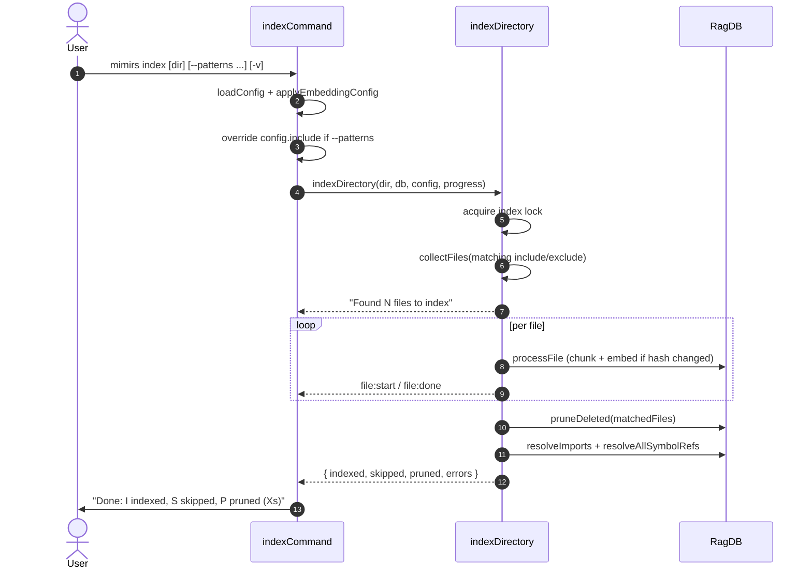

# CLI: index

`mimirs index` runs an incremental index of the project directory. It scans files matching the configured include patterns, re-chunks and re-embeds anything whose content hash has changed, prunes rows for files that no longer exist, and resolves the import/symbol graph.

Use it after editing many files outside an IDE session, when the file watcher is off, or when you want to apply a temporary include override without changing config.

## Flow



1. The CLI opens `RagDB` for the directory and calls `loadConfig`. `applyEmbeddingConfig` makes the embedding model selection in config take effect for this run (`src/cli/commands/index-cmd.ts:11-13`).
2. When `--patterns` is set, the CLI replaces `config.include` with the comma-separated list. This narrows (or expands) the file set for this single invocation only — the on-disk config is untouched (`src/cli/commands/index-cmd.ts:15-18`).
3. `indexDirectory` enforces the dir-guard against home/root directories, then acquires a process-level index lock so concurrent indexers can't double-insert chunks (`src/indexing/indexer.ts:707-730`).
4. `collectFiles` walks the directory, applying the include filter, the exclude filter, the `.gitignore`-style ignore set, and the binary-file filter. It emits `scanning files ...` transient messages.
5. For every matched file, `processFile` runs. When the file's stored content hash matches, the file is recorded as `skipped`; otherwise it is parsed, chunked, embedded, and the chunk rows are replaced.
6. After the file loop, `pruneDeleted` deletes rows for any file in the index that is no longer in the matched set. This runs only when the run was a full project index, not a `--patterns`-scoped subset (the option flag for that path is `prune`, default `true` — see `src/indexing/indexer.ts:774-782`).
7. When at least one file was re-indexed, `resolveImports` updates `file_imports.resolved_file_id`, and `db.resolveAllSymbolRefs()` resolves symbol-level cross-file edges (`src/indexing/indexer.ts:784-793`).
8. The CLI prints the summary and any per-file error messages.

## Inputs

| Input | Source | Notes |
| --- | --- | --- |
| `directory` | first positional arg | Defaults to `.`. The dir-guard rejects home and root directories (`src/indexing/indexer.ts:707-711`). |
| `--patterns` | flag value | Comma-separated glob list. Replaces `config.include` for this run only (`src/cli/commands/index-cmd.ts:15-18`). |
| `--verbose` / `-v` | bool flag | When set, uses `cliProgress` and emits a line per file. Otherwise uses `createQuietProgress` for a single updating line (`src/cli/commands/index-cmd.ts:10`, `src/cli/commands/index-cmd.ts:25-36`). |

## Outputs

| Output | Where | Notes |
| --- | --- | --- |
| `indexed` count | stdout | Files re-processed in this run. |
| `skipped` count | stdout | Files unchanged since the last index. |
| `pruned` count | stdout | Rows deleted because the file no longer exists. |
| `errors` list | stderr | Per-file error messages collected by `indexDirectory` (`src/cli/commands/index-cmd.ts:44-46`). |
| Updated DB | `.mimirs/rag.db` | Files, chunks, embeddings, symbols, file/symbol references. |

## State changes

### files / chunks / symbols / dependencies tables

Before: rows reflect the last index run, possibly stale.

After: every matched file with a changed content hash has fresh `chunks`, `chunk_vectors`, `symbols`, `chunk_symbols`, and `chunk_refs` rows; files deleted from disk are removed by `pruneDeleted`; cross-file resolution is re-run.

The chunk replacement is atomic per file because `processFile` first deletes the file's existing chunks then re-inserts. Without the process-level lock acquired in step 3, two concurrent indexers could both delete and both insert, producing duplicate chunk rows. The lock is mandatory (`src/indexing/indexer.ts:717-730`).

## Branches and failure cases

- **Locked.** Another mimirs process (server, watcher, parallel CLI) already holds the index lock for this directory. `indexDirectory` returns an `IndexResult` with `locked: true` and the CLI prints the lock reason; nothing is written (`src/indexing/indexer.ts:723-729`).
- **Unsafe directory.** `checkIndexDir` throws when the target is the user's home or a system root, so the command exits before any work runs (`src/indexing/indexer.ts:708-710`).
- **Per-file errors.** A file that fails to parse, embed, or store is captured in `result.errors` and the next file continues. The summary line still prints. Failed files are not counted as `indexed`.
- **`--patterns` prunes by default.** Because `indexCommand` does not pass `options.prune = false`, even a scoped run prunes files that are now outside the scope. This is the documented "prune semantics" surprise — narrow patterns will delete index rows for files outside them (`src/cli/commands/index-cmd.ts:38`, `src/indexing/indexer.ts:774-782`).
- **Empty match set.** When no files match, the loop is a no-op and pruning still runs. `resolveImports` and `resolveAllSymbolRefs` are skipped because `result.indexed === 0` (`src/indexing/indexer.ts:785`).

## Example

```bash
# Index the whole project with the configured patterns.
mimirs index

# Re-index only TypeScript sources, with per-file logging.
mimirs index --patterns "src/**/*.ts" -v

# Index a different directory.
mimirs index ../other-project
```

Verbose sample output:

```
Indexing /path...
scanning files (1234 found)
Found 312 files to index
Loading embedding model nomic-embed-text-v1.5
Indexed src/server/index.ts
Skipped src/utils/log.ts
Pruned 4 deleted files from index
Resolved 982 import paths

Done: 198 indexed, 110 skipped, 4 pruned (12.7s)
```

## Key source files

- `src/cli/commands/index-cmd.ts` — command entrypoint; flag parsing, progress wiring.
- `src/indexing/indexer.ts` — `indexDirectory`, lock acquisition, prune logic, symbol/import resolution.
- `src/db/index.ts` — `RagDB.pruneDeleted` and `resolveAllSymbolRefs`.
- `src/cli/progress.ts` — verbose vs quiet renderers.

## Related flows

- [CLI: init](init.md) — runs the same `indexDirectory` after first-time setup.
- [tools/index-files](../tools/index-files.md) — same indexer, called over MCP.
