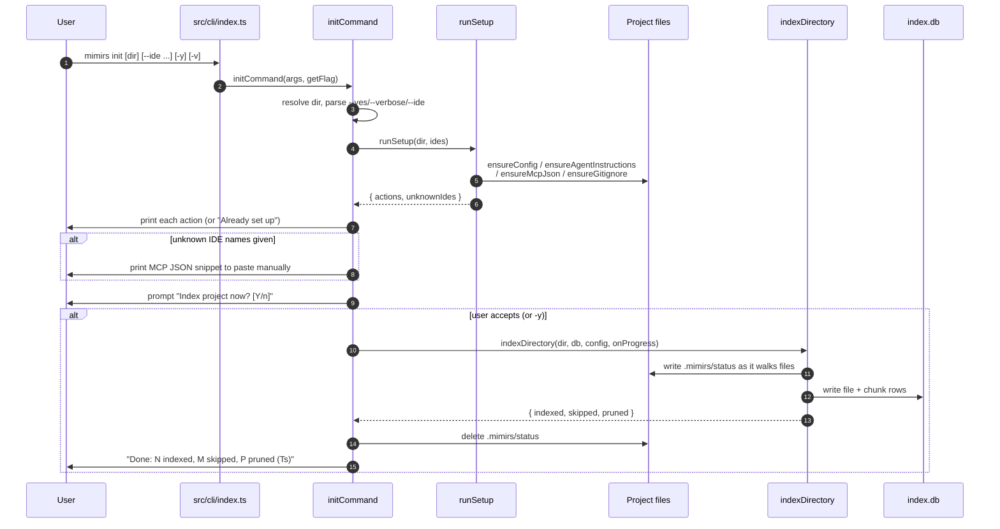

# CLI: init

`mimirs init` is the onboarding command. It prepares a project so that an AI coding agent can use the mimirs RAG tools: it writes the local config, registers the MCP server in the agent's config files, drops tool-usage instructions where the agent will read them, keeps the index out of version control, and then offers to build the search index immediately. It is usually the first command run in a repository, and it is safe to re-run — every step it performs is guarded so that a second run only reports what actually changed.

The command is reached through the top-level dispatcher. When the first argv token is `init`, the dispatcher calls `initCommand`, handing it the raw argument array and a `getFlag` helper that reads the token following a named flag (`src/cli/index.ts:112-113`, `src/cli/index.ts:81-84`). All of the real work lives in `src/cli/commands/init.ts` and the setup helpers in `src/cli/setup.ts`.

## What problem it solves

Wiring an MCP server into an agent by hand means editing several JSON and Markdown files whose formats differ per IDE (Claude Code, Cursor, Windsurf, JetBrains/Junie, GitHub Copilot), getting the server command and the project-directory environment variable exactly right, and remembering to gitignore the index. `init` does all of that in one pass and prints a line for each file it touched, so the user can see exactly what was created or updated.

## Flow



1. The user invokes `mimirs init`, optionally naming a directory and passing flags. The dispatcher matches the `init` case and calls `initCommand` (`src/cli/index.ts:112-113`).
2. `initCommand` resolves the target directory and reads its flags. The directory is the first positional argument if it exists and does not start with `--`, otherwise the current directory; `--yes`/`-y` and `--verbose`/`-v` are detected by membership in the argv array (`src/cli/commands/init.ts:11-13`).
3. The `--ide` value (if any) is read with `getFlag` and parsed into a list of IDE names by `parseIdeFlag`; when the flag is absent, `ides` stays `undefined` (`src/cli/commands/init.ts:14-15`).
4. `runSetup` performs the file-writing steps and returns the list of human-readable action strings plus any IDE names it did not recognize (`src/cli/setup.ts:324-340`).
5. `initCommand` prints each action line. If nothing changed and no unknown IDEs were given, it prints `Already set up — nothing to do.` instead (`src/cli/commands/init.ts:17-21`).
6. When the user passed IDE names that mimirs cannot configure automatically, the command prints a header naming those agents and a ready-to-paste MCP JSON snippet (`src/cli/commands/init.ts:23-26`).
7. The command then asks whether to index now. With `-y` it skips the prompt and proceeds; otherwise `confirm` reads a single line from stdin and treats anything other than `n` as yes (`src/cli/commands/init.ts:29`, `src/cli/setup.ts:314-322`).
8. If indexing is accepted, the command opens the database and loads config, then runs `indexDirectory`, forwarding progress both to the terminal and to a `.mimirs/status` file (`src/cli/commands/init.ts:30-77`).
9. When indexing finishes, the status file is deleted and a one-line summary of indexed / skipped / pruned counts plus elapsed seconds is printed; the database is closed (`src/cli/commands/init.ts:79-86`).

## Inputs

| name | type | required | description |
| --- | --- | --- | --- |
| `[dir]` | positional path | no | The project directory to set up. Used only if the first argument exists and does not start with `--`; otherwise the current working directory. It is passed through `resolve` to an absolute path (`src/cli/commands/init.ts:11`). |
| `--ide` | comma list or `all` | no | Which agents to configure beyond Claude Code. `parseIdeFlag` expands the literal `all` to every known IDE, otherwise splits on commas and trims/lowercases each name (`src/cli/setup.ts:157-160`). Recognized values: `claude`, `cursor`, `windsurf`, `copilot`, `jetbrains` (`src/cli/setup.ts:148-149`). |
| `-y` / `--yes` | flag | no | Skips the indexing prompt and indexes immediately (`src/cli/commands/init.ts:12`, `src/cli/commands/init.ts:29`). |
| `-v` / `--verbose` | flag | no | Switches the indexing output from a single updating progress line to per-file logging (`src/cli/commands/init.ts:13`, `src/cli/commands/init.ts:62-76`). |

## Outputs

| output | where it lands / shape / description |
| --- | --- |
| `.mimirs/config.json` | Written by `ensureConfig` the first time, which calls `loadConfig`; `loadConfig` materializes the defaults on disk when the file is missing (`src/cli/setup.ts:92-98`, `src/config/index.ts:136-139`). |
| Agent instruction blocks | A `## Using mimirs tools` Markdown section written to `CLAUDE.md` (always), plus rule files for any requested or detected IDE: `.cursor/rules/mimirs.mdc`, `.windsurf/rules/mimirs.md`, `.junie/guidelines/mimirs.md`, `.github/copilot-instructions.md` (`src/cli/setup.ts:162-215`). |
| MCP server entries | `mimirs` added under `mcpServers` in `.mcp.json` (always), and in `.cursor/mcp.json`, `.junie/mcp.json`, and the Windsurf global configs when relevant. Each entry runs `bunx mimirs@latest serve` with `RAG_PROJECT_DIR` set to the resolved project path (`src/cli/setup.ts:228-295`). |
| `.gitignore` entry | `.mimirs/` added (or the file created with that entry) so the local index is not committed (`src/cli/setup.ts:100-112`). |
| Printed action lines | One line per file created or updated, or `Already set up — nothing to do.` (`src/cli/commands/init.ts:17-21`). |
| Manual MCP snippet | Printed only when unknown IDE names were given (`src/cli/commands/init.ts:23-26`). |
| `.mimirs/status` | A short progress string (`scanning files`, `0/N files`, `12/40 files (30%)`) written during indexing and deleted on completion (`src/cli/commands/init.ts:35-80`). |
| Index rows | File and chunk rows written to the SQLite index under `.mimirs` when indexing runs (`src/cli/commands/init.ts:49-77`). |
| Summary line | `Done: N indexed, M skipped, P pruned (Ts)` after indexing (`src/cli/commands/init.ts:82-85`). |

## What `runSetup` writes

`runSetup` is a small orchestrator that runs four guarded helpers in order and concatenates whatever each reports (`src/cli/setup.ts:324-340`). Each helper checks for an existing marker or path before writing, so a second `init` produces no spurious changes.

- **Config.** `ensureConfig` returns `null` (no action) if `.mimirs/config.json` already exists. Otherwise it calls `loadConfig`, which writes the default config to disk the first time it is read, and reports `Created .mimirs/config.json` (`src/cli/setup.ts:92-98`). There is no merge step: what is on disk is what runs (`src/config/index.ts:127-140`).

- **Agent instructions.** `ensureAgentInstructions` always injects the tool-usage block into `CLAUDE.md`. For the other IDEs it writes only when that IDE's directory already exists, or when the IDE was explicitly named via `--ide` (in which case the directory is created first) (`src/cli/setup.ts:162-215`). The injected text differs per IDE wrapper: plain Markdown for Claude, Junie, and Copilot; Cursor's `.mdc` adds an `alwaysApply: true` frontmatter; Windsurf adds a `trigger: always_on` frontmatter (`src/cli/setup.ts:69-85`). Injection is guarded by a `<!-- mimirs -->` marker (and the `## Using mimirs tools` heading for the Markdown case), so re-running never duplicates the block (`src/cli/setup.ts:8`, `src/cli/setup.ts:114-124`).

- **MCP registration.** `ensureMcpJson` builds one server entry — `bunx mimirs@latest serve` with `RAG_PROJECT_DIR` pointing at the resolved directory — and upserts it under `mcpServers` in each relevant config file (`src/cli/setup.ts:228-295`). `.mcp.json` is always written for Claude Code. Cursor, Junie, and Windsurf are written when their directory exists or the IDE was requested; Windsurf targets two global paths under `~/.codeium` because it reads its MCP config from the user home, not the project (`src/cli/setup.ts:282-292`). `upsertMcpJson` reads and merges existing JSON, returns `null` if the `mimirs` entry is already present, and reports a skip line rather than crashing when the existing file is invalid JSON (`src/cli/setup.ts:236-256`).

- **Gitignore.** `ensureGitignore` creates `.gitignore` with a `.mimirs/` entry (reporting `Created .gitignore with .mimirs/`), or appends the entry if the file exists and does not already ignore the index (reporting `Added .mimirs/ to .gitignore`) (`src/cli/setup.ts:100-112`).

## The `--ide` flag

`--ide` is captured with the `getFlag` helper, which returns the token immediately after the flag (`src/cli/index.ts:81-84`). Its value is passed to `parseIdeFlag`, which normalizes the input (`src/cli/setup.ts:157-160`):

| input | result |
| --- | --- |
| `all` | every known IDE: `claude, cursor, windsurf, copilot, jetbrains` |
| `cursor,windsurf` | `["cursor", "windsurf"]` (trimmed and lowercased) |
| (flag absent) | `undefined` — only auto-detected IDEs plus the always-on Claude files |

When the flag is absent, `ides` is `undefined` and the IDE-specific helpers fall back to filesystem detection: they write Cursor, Windsurf, Junie, or Copilot files only if those tools' directories already exist in the project. Naming an IDE with `--ide` forces its directory to be created and its files written even on a fresh checkout (`src/cli/setup.ts:171-212`, `src/cli/setup.ts:268-292`).

## MCP snippet for unknown IDEs

`parseIdeFlag` accepts any string, so a typo or an unsupported agent name flows through unfiltered. `runSetup` runs the value through `unknownIdes`, which returns every name not in the known set (`src/cli/setup.ts:151-155`). When that list is non-empty, `initCommand` cannot configure those agents automatically, so it prints a header naming them followed by the ready-to-paste `mcpConfigSnippet` (`src/cli/commands/init.ts:23-26`). The snippet is the same `mimirs` server object used everywhere else — `bunx mimirs@latest serve` with `RAG_PROJECT_DIR` set to the absolute project path — formatted as indented JSON for the user to copy into whatever config their agent uses (`src/cli/setup.ts:217-226`).

## Optional index prompt and indexing

After setup, indexing is offered, not forced. `confirm` opens a readline interface, prints the question, and resolves true for any answer except `n` after trimming and lowercasing — so a bare Enter means yes (`src/cli/setup.ts:314-322`). With `-y`, the prompt is skipped entirely (`src/cli/commands/init.ts:29`).

If indexing proceeds, the command constructs a `RagDB` for the directory (which opens the SQLite index under `.mimirs`) and loads the config, then calls `indexDirectory` (`src/cli/commands/init.ts:31-33`, `src/cli/commands/init.ts:49`). The progress callback does double duty:

- It maintains a `.mimirs/status` file so other processes (for example the doctor command or a watching editor) can see progress out of band. It writes `scanning files`, then `0/N files` once the file count is known, then `processed/total (pct%)` after each completed file (`src/cli/commands/init.ts:35-69`).
- It drives terminal output. In the default mode it builds a `createQuietProgress` renderer (a single updating line); with `-v` it forwards every message to `cliProgress` for per-file logging (`src/cli/commands/init.ts:62-76`, `src/cli/progress.ts:24-102`).

`indexDirectory` walks the directory, embeds and stores file and chunk rows, prunes files that no longer exist, resolves imports, and returns an `IndexResult` with `indexed`, `skipped`, and `pruned` counts (`src/indexing/indexer.ts:695-799`, `src/indexing/indexer.ts:46-53`). On return, the command deletes the status file, prints the summary line with elapsed seconds, and closes the database (`src/cli/commands/init.ts:79-86`). The indexing portion is the same machinery the standalone [index](index.md) command uses.

## State changes

- **Setup files: absent → written.** Before `init`, a fresh project has no `.mimirs/config.json`, no MCP registration, and no tool instructions. `runSetup(dir, ides)` writes the config, the agent instruction blocks, the MCP server entries, and the gitignore line, then returns the list of files it touched (`src/cli/commands/init.ts:16`, `src/cli/setup.ts:324-340`). This matters because it is what makes the mimirs tools discoverable by the agent at all. Because every writer is marker- or existence-guarded, the transition is effectively one-way: a second run leaves the state unchanged.

- **Index rows: empty → indexed.** When the user accepts the index prompt, `indexDirectory` writes file and chunk rows into the SQLite index under `.mimirs` (`src/cli/commands/init.ts:49-77`, `src/indexing/indexer.ts:745-795`). This is the state that makes `search` and `read_relevant` return results. It is optional within `init`; declining the prompt leaves the index empty until [index](index.md) is run later.

## Branches and failure cases

- **Directory argument vs. default.** A first argument that does not start with `--` is treated as the project directory; otherwise the current directory is used (`src/cli/commands/init.ts:11`).
- **Nothing to do.** If `runSetup` returns no actions and there are no unknown IDEs, the command prints `Already set up — nothing to do.` and still proceeds to the index prompt (`src/cli/commands/init.ts:17-21`).
- **Unknown IDE names.** Counts as a reason to print output even when no files changed, and triggers the manual MCP snippet (`src/cli/commands/init.ts:17`, `src/cli/commands/init.ts:23-26`).
- **Auto-yes vs. prompt.** `-y` skips the prompt; without it, declining (`n`) skips indexing and the command exits after setup (`src/cli/commands/init.ts:29-30`).
- **Existing MCP config with the entry.** `upsertMcpJson` returns `null` when `mcpServers.mimirs` is already present, so the file is left untouched and no action line is printed (`src/cli/setup.ts:244`).
- **Invalid existing MCP JSON.** Rather than throwing, `upsertMcpJson` returns a `Skipped … (invalid JSON — fix it manually or delete it)` action so the user is told to repair the file (`src/cli/setup.ts:241-243`).
- **IDE files when the directory is absent and not forced.** Cursor, Windsurf, Junie, and Copilot files are skipped unless their directory exists or the IDE was requested via `--ide` (`src/cli/setup.ts:171-212`, `src/cli/setup.ts:268-292`).
- **Status-file write failures.** Writing `.mimirs/status` is wrapped in a try/catch and is best-effort; a failure there does not interrupt indexing (`src/cli/commands/init.ts:37-42`).
- **Index lock held by another process.** `indexDirectory` funnels concurrent indexers through a process lock; if another mimirs process owns it, indexing is skipped for this run, the progress callback reports it, and the result carries `locked: true` (`src/indexing/indexer.ts:722-730`). `init` still prints its summary line using the (zero) counts in that case.
- **Per-file indexing errors.** Errors on individual files are collected into `result.errors` and reported through progress without aborting the whole run (`src/indexing/indexer.ts:764-768`).

## Example

```bash
# Set up the current directory for Claude Code and Cursor, then index without prompting
mimirs init . --ide claude,cursor -y
```

Illustrative output:

```
Created .mimirs/config.json
Created CLAUDE.md
Created .cursor/rules/mimirs.mdc
Created .mcp.json with mimirs
Created .cursor/mcp.json with mimirs
Created .gitignore with .mimirs/

Indexing /path/to/project...
Found 158 files to index
Done: 158 indexed, 0 skipped, 0 pruned (12.4s)
```

The summary field names (`indexed`, `skipped`, `pruned`) and the action-line wording match the source; the specific paths, counts, and timing above are synthetic.

## Key source files

- `src/cli/index.ts` — top-level dispatcher; matches the `init` command and provides `getFlag` (`src/cli/index.ts:81-84`, `src/cli/index.ts:112-113`).
- `src/cli/commands/init.ts` — the command handler: flag parsing, setup invocation, the index prompt, and progress wiring (`src/cli/commands/init.ts:10-88`).
- `src/cli/setup.ts` — the guarded setup helpers: config, agent instructions, MCP registration, gitignore, IDE parsing, the snippet, and `confirm`.
- `src/cli/progress.ts` — the quiet and verbose terminal progress renderers passed to the indexer.
- `src/indexing/indexer.ts` — `indexDirectory`, the shared indexing routine that writes file/chunk rows and returns the summary counts (`src/indexing/indexer.ts:695-799`).

## Related commands

- [index](index.md) — runs the same indexing routine as a standalone command, for re-indexing after `init`.
- [cleanup](cleanup.md) — the inverse operation; removes the files and index `init` creates.
- [status](status.md) — reports index stats after the index rows exist.
