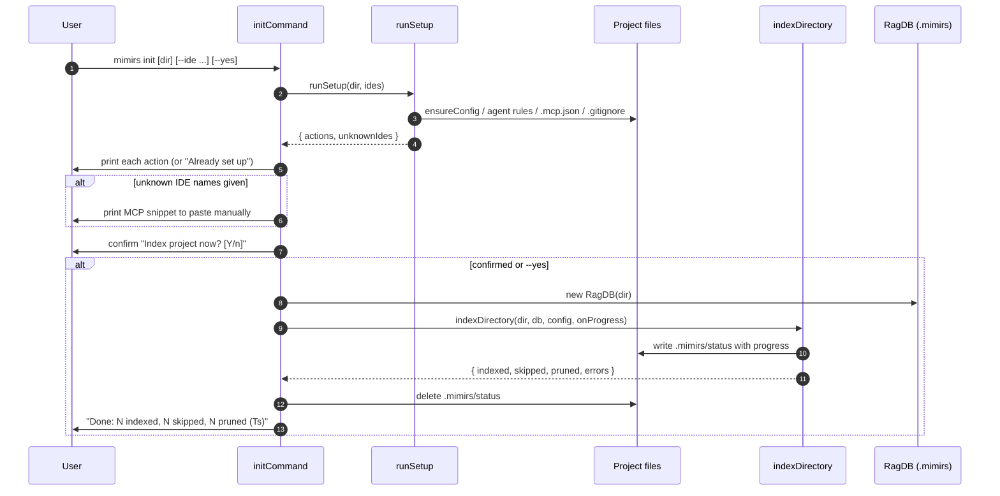

# CLI: init

`mimirs init` prepares a project to use mimirs. It writes a default
configuration file, drops agent-instruction snippets and MCP server
registrations for the editors you use, makes sure the index directory is
gitignored, and then offers to build the first search index. After running it
once, an AI agent (Claude Code, Cursor, Windsurf, Junie/JetBrains, or GitHub
Copilot) can call the mimirs MCP tools against your code.

Use it the first time you adopt mimirs in a repository. It is safe to re-run:
every setup step checks whether its work is already done and skips it, so a
second run reports "Already set up — nothing to do." when nothing changed.

The command lives in `src/cli/commands/init.ts:10`. The setup steps it drives
live in `src/cli/setup.ts`.

## What the command does

The entry point `initCommand` runs in two phases. First it performs idempotent
setup through `runSetup` (`src/cli/setup.ts:324`). Then it optionally builds the
first index through `indexDirectory` (`src/indexing/indexer.ts:695`).



1. The user runs the command. An optional first positional argument is the
   directory; `--ide`, `--yes`/`-y`, and `--verbose`/`-v` are flags
   (`src/cli/commands/init.ts:11-15`).
2. `initCommand` calls `runSetup`, passing the parsed list of target editors
   (or `undefined` when no `--ide` flag was given) (`src/cli/commands/init.ts:16`).
3. `runSetup` performs each setup step in order, collecting a human-readable
   action string for every file it actually creates or edits
   (`src/cli/setup.ts:324-340`).
4. `initCommand` prints each action line. If nothing was created and no unknown
   editor names were passed, it prints "Already set up — nothing to do."
   instead (`src/cli/commands/init.ts:17-21`).
5. If `--ide` named editors mimirs does not know how to configure, it prints a
   ready-to-paste MCP server snippet for those editors
   (`src/cli/commands/init.ts:23-26`).
6. Unless `--yes` was passed, it asks "Index project now? [Y/n]" and waits for
   the answer (`src/cli/commands/init.ts:29`).
7. On confirmation it opens the database, loads config, and starts the first
   full index (`src/cli/commands/init.ts:30-49`).
8. During indexing it mirrors progress into `.mimirs/status` and to the
   terminal (`src/cli/commands/init.ts:37-77`).
9. When indexing finishes it removes the status file and prints the indexed /
   skipped / pruned counts with elapsed time (`src/cli/commands/init.ts:80-86`).

## Inputs

| name | type | required | description |
|------|------|----------|-------------|
| directory | positional arg | no | Project directory to set up. Taken from `args[1]` only when present and not a flag; otherwise defaults to the current directory `.` and is resolved to an absolute path (`src/cli/commands/init.ts:11`). |
| `--ide` | flag with value | no | Comma-separated list of editors to configure, or `all`. Parsed by `parseIdeFlag` (`src/cli/setup.ts:157`). Without it, only the always-on targets (Claude Code) plus any editor folders already present are configured. |
| `--yes` / `-y` | boolean flag | no | Skip the interactive prompt and index immediately (`src/cli/commands/init.ts:12`,`:29`). |
| `--verbose` / `-v` | boolean flag | no | Show per-file indexing output instead of a single updating progress line (`src/cli/commands/init.ts:13`,`:62`). |

### Supported `--ide` targets

`parseIdeFlag` lowercases and splits on commas; the special value `all` expands
to every known editor (`src/cli/setup.ts:157-160`). The known set is defined in
`KNOWN_IDES` (`src/cli/setup.ts:149`). Any name outside this set is collected as
an unknown editor and surfaced as a manual snippet.

| `--ide` value | Agent-instruction file written | MCP registration written |
|---------------|--------------------------------|--------------------------|
| `claude` | `CLAUDE.md` (always, even without the flag) | `.mcp.json` (always) |
| `cursor` | `.cursor/rules/mimirs.mdc` | `.cursor/mcp.json` |
| `windsurf` | `.windsurf/rules/mimirs.md` | `~/.codeium/windsurf/mcp_config.json` and `~/.codeium/mcp_config.json` |
| `copilot` | `.github/copilot-instructions.md` | (none — Copilot reads the instructions file) |
| `jetbrains` | `.junie/guidelines/mimirs.md` | `.junie/mcp.json` |
| `all` | all of the above | all of the above |
| anything else | (none) | reported as an unknown editor with a manual snippet |

Naming an editor with `--ide` *forces* its folder to be created if missing
(for example `--ide cursor` runs `mkdir .cursor`) before writing into it
(`src/cli/setup.ts:171-205`,`:268-292`). Without the flag, mimirs only writes
into editor folders that already exist, with Claude Code's `CLAUDE.md` and
`.mcp.json` as the always-on exception.

## Outputs

| output | where it lands / shape / description |
|--------|--------------------------------------|
| Default config | `.mimirs/config.json`, created by `ensureConfig` via `loadConfig`, which writes defaults when the file is absent (`src/cli/setup.ts:92-98`). |
| Agent instruction files | The "## Using mimirs tools" instruction block injected into `CLAUDE.md` and any requested/detected editor rule file (`src/cli/setup.ts:162-215`). |
| MCP server registrations | A `mcpServers.mimirs` entry pointing at `bunx mimirs@latest serve` with `RAG_PROJECT_DIR` set to the absolute project path, merged into the relevant `mcp.json` files (`src/cli/setup.ts:228-295`). |
| `.gitignore` entry | `.mimirs/` added to `.gitignore` (file created if absent) (`src/cli/setup.ts:100-112`). |
| Manual MCP snippet | Printed to stdout for unknown editor names, from `mcpConfigSnippet` (`src/cli/setup.ts:217-226`). |
| Progress file | `.mimirs/status`, written during the first index and deleted on completion (`src/cli/commands/init.ts:36-80`). |
| First index | Populated rows in the project's `.mimirs` database when the user confirms (`src/indexing/indexer.ts:695`). |
| Summary line | `Done: N indexed, N skipped, N pruned (Ts)` printed after indexing (`src/cli/commands/init.ts:83-85`). |

## State changes

### Setup files written to disk

- Before: a project with no mimirs configuration, or one set up only partially.
- After: `.mimirs/config.json` exists, the agent-instruction snippet is present
  in the relevant rule files, the matching `mcp.json` files contain a `mimirs`
  server entry, and `.gitignore` ignores `.mimirs/`.
- Why it matters: this is what makes the MCP tools discoverable and runnable by
  the agent, and keeps the local index out of version control.
- Each step is individually idempotent. `ensureConfig` returns early if the
  config already exists (`src/cli/setup.ts:94`). The instruction injectors skip
  a file that already contains the `<!-- mimirs -->` marker or the
  `## Using mimirs tools` heading (`src/cli/setup.ts:117`,`:130`,`:141`). The
  MCP upsert returns `null` when a `mcpServers.mimirs` entry is already present
  (`src/cli/setup.ts:244`). `ensureGitignore` returns `null` when a `.mimirs/`
  line already exists (`src/cli/setup.ts:107-109`).

### First index populated

- Before: the `.mimirs` database has no rows for this project's files.
- After: files, chunks, and symbols are parsed, embedded, and stored, ready for
  the `search` and `read` commands and the MCP tools.
- Why it matters: setup alone does not make code searchable; the index is what
  every query reads from.
- Trigger: the user answers anything other than `n` to "Index project now?",
  or passed `--yes` (`src/cli/commands/init.ts:29`). The work is delegated to
  `indexDirectory` (`src/cli/commands/init.ts:49`).

## Branches and failure cases

- **No editors requested.** With no `--ide` flag, `ides` is `undefined`
  (`src/cli/commands/init.ts:15`). `CLAUDE.md` and `.mcp.json` are still written
  because they are unconditional, and any pre-existing `.cursor`, `.junie`,
  `.windsurf`, or `.github` folder is also configured by detection
  (`src/cli/setup.ts:171-292`).
- **Already fully set up.** When `runSetup` produces zero actions and there are
  no unknown editors, the command prints "Already set up — nothing to do."
  (`src/cli/commands/init.ts:17-18`).
- **Unknown editor names.** Names not in `KNOWN_IDES` are returned in
  `unknownIdes` (`src/cli/setup.ts:151-155`) and trigger the manual MCP snippet
  block (`src/cli/commands/init.ts:23-26`).
- **Invalid existing `mcp.json`.** If a target `mcp.json` exists but is not
  valid JSON, the upsert leaves it untouched and reports
  "Skipped … (invalid JSON — fix it manually or delete it)"
  (`src/cli/setup.ts:241-243`).
- **Declining the index.** Answering `n` skips indexing entirely; setup files
  remain written (`src/cli/commands/init.ts:29-30`). The confirm helper treats
  any answer except a bare `n` as yes, including pressing Enter
  (`src/cli/setup.ts:319`).
- **`--yes`.** Bypasses the prompt and indexes immediately
  (`src/cli/commands/init.ts:29`).
- **Verbose vs quiet progress.** Without `--verbose`, once the indexer reports
  how many files it found, a single updating progress line is shown via
  `createQuietProgress` (`src/cli/commands/init.ts:58-64`,
  `src/cli/progress.ts:42`). With `--verbose`, per-file messages stream through
  `cliProgress` instead (`src/cli/commands/init.ts:71-76`).
- **Status-file writes are best-effort.** `writeStatus` swallows any error so a
  failed write to `.mimirs/status` never aborts indexing
  (`src/cli/commands/init.ts:37-42`). The final cleanup `unlinkSync` is wrapped
  in a try/catch for the same reason (`src/cli/commands/init.ts:80`).

## Example

```bash
# Set up the current directory for Claude Code only, then index without asking.
mimirs init --yes

# Set up a specific project for Cursor and Windsurf.
mimirs init ./my-app --ide cursor,windsurf

# Configure every known editor.
mimirs init --ide all
```

Typical output for a fresh project that the user chooses to index:

```
Created .mimirs/config.json
Created CLAUDE.md
Created .mcp.json with mimirs
Created .gitignore with .mimirs/

Index project now? [Y/n] y
Indexing /Users/example/my-app...
Found 128 files to index
Indexing: 128/128 files (100%)

Done: 124 indexed, 4 skipped, 0 pruned (12.3s)
```

## Key source files

- `src/cli/commands/init.ts` — command entry point; parses flags, drives setup,
  runs the optional first index, and reports progress.
- `src/cli/setup.ts` — all idempotent setup steps: config creation, agent rule
  injection, MCP registration, `.gitignore` handling, the interactive
  `confirm` prompt, and the manual MCP snippet.
- `src/indexing/indexer.ts` — `indexDirectory`, the indexing routine that
  populates the database and emits the progress messages this command renders.
- `src/cli/progress.ts` — terminal progress rendering, including the quiet
  single-line progress mode.

## Related pages

- [index](index.md) — re-run indexing on demand after setup.
- [serve](serve.md) — start the MCP server that the registrations point at.
