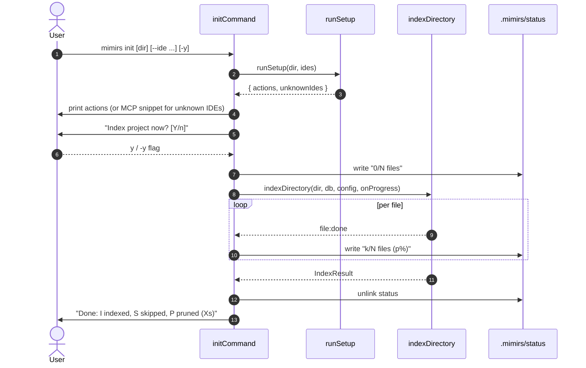

# CLI: init

`mimirs init` is the first command a user runs in a project. It writes the mimirs config, registers the MCP server with installed IDEs, makes sure `.mimirs/` is gitignored, and then offers to run the first index.

Run it once per project, or re-run it after installing a new editor to add that IDE's MCP entry.

## Flow



1. The user invokes `mimirs init`. `initCommand` resolves the target directory, parses `--yes`, `--verbose`, and `--ide` flags (`src/cli/commands/init.ts:10-15`).
2. `runSetup` writes `.mimirs/config.json`, agent instruction files, MCP config entries, and `.gitignore` in one pass and returns a list of human-readable actions plus any IDE names it didn't recognise (`src/cli/setup.ts:324-340`).
3. Actions are echoed to the terminal. When no actions ran, the command prints `"Already set up — nothing to do."` instead.
4. For each unrecognised IDE name, init prints a copy-pastable MCP JSON snippet generated by `mcpConfigSnippet` so the user can paste it into their agent's config (`src/cli/commands/init.ts:23-26`, `src/cli/setup.ts:217-226`).
5. Init asks `"Index project now? [Y/n] "` via `confirm`. The default is yes; `-y`/`--yes` skips the prompt (`src/cli/setup.ts:314-322`).
6. When indexing is confirmed, init opens a `RagDB`, loads config, and prepares a `.mimirs/status` writer keyed off progress messages.
7. `indexDirectory` runs. Init listens for `file:done`, `Found N files to index`, and `scanning files` messages to update `.mimirs/status` and pick a terminal renderer.
8. On completion init removes the status file and prints `"Done: <indexed> indexed, <skipped> skipped, <pruned> pruned (<seconds>s)"` (`src/cli/commands/init.ts:80-86`).

## Inputs

| Input | Source | Notes |
| --- | --- | --- |
| `directory` | first positional arg | Defaults to `.` when arg is missing or starts with `--` (`src/cli/commands/init.ts:11`). Resolved to an absolute path. |
| `--ide` | flag value | Comma-separated, or the literal `all`. Parsed by `parseIdeFlag` into a list. Known names: `claude`, `cursor`, `windsurf`, `copilot`, `jetbrains` (`src/cli/setup.ts:148-160`). |
| `--yes` / `-y` | bool flag | Skips the "Index project now?" confirmation. |
| `--verbose` / `-v` | bool flag | Switches the terminal progress renderer from `createQuietProgress` (single updating line) to `cliProgress` (per-event log) (`src/cli/commands/init.ts:62-76`). |

## Outputs

| Output | Where | Notes |
| --- | --- | --- |
| `.mimirs/config.json` | project | Auto-created with defaults by `loadConfig` via `ensureConfig` (`src/cli/setup.ts:92-98`). |
| IDE MCP config entries | per IDE | Added to `.mcp.json`, `.cursor/mcp.json`, `.junie/mcp.json`, and `~/.codeium/.../mcp_config.json` depending on what exists or what `--ide` requested (`src/cli/setup.ts:258-295`). |
| Agent instruction files | per IDE | `CLAUDE.md` always; `.cursor/rules/mimirs.mdc`, `.windsurf/rules/mimirs.md`, `.junie/guidelines/mimirs.md`, `.github/copilot-instructions.md` when their directories exist or are forced via `--ide` (`src/cli/setup.ts:162-215`). |
| `.gitignore` | project | Adds `.mimirs/` if missing (`src/cli/setup.ts:100-112`). |
| `.mimirs/status` | project | Per-file index progress; deleted on completion. |
| First index | DB | Only when the user confirms or passes `-y`. |
| MCP snippet (stdout) | terminal | Printed for each unknown IDE name. |

## State changes

### Setup files

Before init: project has no `.mimirs/config.json`, the local IDE's MCP config doesn't mention mimirs, and `.gitignore` may not exclude the index directory.

After init: `runSetup` has written defaults for each piece. Each helper is a no-op when its target already contains a mimirs marker, so re-running init is safe:

- `ensureConfig` short-circuits if `.mimirs/config.json` exists (`src/cli/setup.ts:92-98`).
- `injectMarkdown`, `injectMdc`, and `injectWindsurfRule` look for `<!-- mimirs -->` or `## Using mimirs tools` and bail out if present (`src/cli/setup.ts:114-146`).
- `upsertMcpJson` skips when `mcpServers.mimirs` already exists (`src/cli/setup.ts:236-256`).
- `ensureGitignore` skips if a `.mimirs/` line is already present (`src/cli/setup.ts:100-112`).

### First index

Before: index DB rows for files/chunks/symbols/dependencies are empty (fresh project) or stale.

After: `indexDirectory` populates files, chunks, embeddings, symbols and resolves cross-file import edges. The flow is identical to the standalone [CLI: index](index.md) command, except init wires the progress callback to also write to `.mimirs/status`.

The `.mimirs/status` file is unlinked on success (`src/cli/commands/init.ts:80`). If the process crashes mid-index, the leftover file is what `mimirs doctor` reports later.

## Branches and failure cases

- **`--ide` with unknown names.** `runSetup` returns them in `unknownIdes`. Init then prints the JSON snippet from `mcpConfigSnippet`, so the user has something to paste manually (`src/cli/commands/init.ts:23-26`).
- **Already set up.** When `actions` is empty and there are no unknown IDEs, init prints "Already set up — nothing to do." before still offering to index (`src/cli/commands/init.ts:17-21`).
- **User declines indexing.** When the user answers anything starting with `n` (case-insensitive), `confirm` returns false and indexing is skipped entirely (`src/cli/setup.ts:314-322`).
- **Status writes are best-effort.** Failures to write `.mimirs/status` are swallowed; they do not stop indexing (`src/cli/commands/init.ts:38-42`).
- **IDE directory hint.** Optional IDEs (`cursor`, `windsurf`, `jetbrains`, `copilot`) only receive instruction/MCP files if their config directory already exists, *or* if the user explicitly listed them in `--ide` (which causes init to create the directory first) (`src/cli/setup.ts:170-212`, `src/cli/setup.ts:268-294`).

## Example

```bash
# Set up for whichever IDEs are detected, then index.
mimirs init

# Explicitly enable Cursor + Windsurf even if their dirs don't exist yet.
mimirs init --ide cursor,windsurf

# Set up for every known IDE and skip the indexing prompt.
mimirs init --ide all -y
```

Sample output:

```
Created .mimirs/config.json
Updated /path/CLAUDE.md
Added mimirs to /path/.mcp.json
Added .mimirs/ to .gitignore

Index project now? [Y/n] y
Indexing /path...
Done: 312 indexed, 0 skipped, 0 pruned (8.4s)
```

## Key source files

- `src/cli/commands/init.ts` — command entrypoint; orchestrates setup, prompt, and indexing.
- `src/cli/setup.ts` — `runSetup` and helpers for config, agent instructions, MCP JSON, and `.gitignore`.
- `src/indexing/indexer.ts` — `indexDirectory` performs the first index.
- `src/cli/progress.ts` — `cliProgress` and `createQuietProgress` renderers used by the verbose / quiet branches.

## Related flows

- [CLI: index](index.md) — same indexing core, run standalone.
- [CLI: cleanup](cleanup.md) — the inverse of init.
- [CLI: serve](serve.md) — what the MCP entries written here point at.
