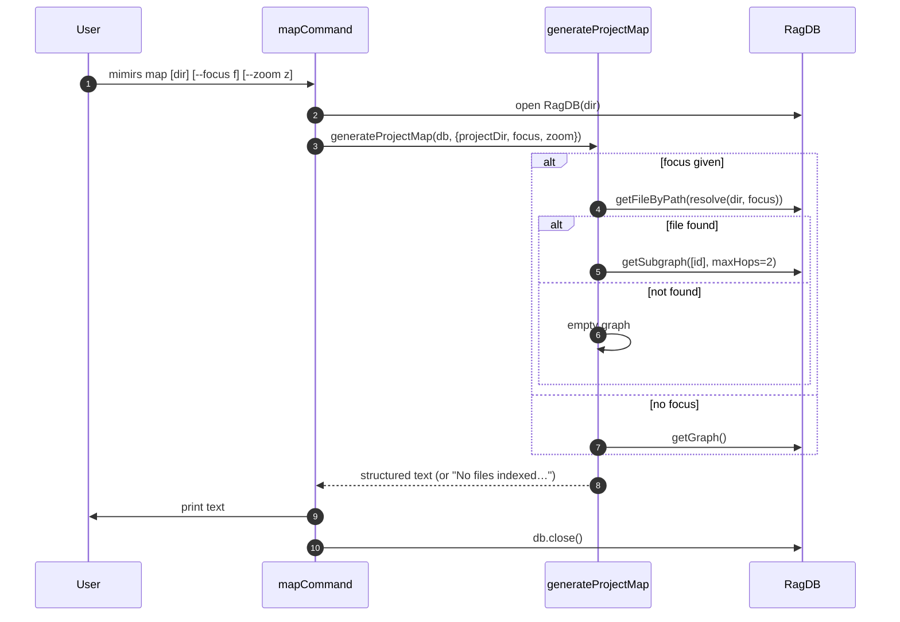

# CLI: map

`mimirs map` prints a dependency map of a project: which files exist, what they export, what they import, and who imports them. It reads the import graph that mimirs already built during indexing and renders it as structured plain text — no diagram tool required. Use it to get a quick overview of a codebase's shape, to find files that nothing imports, or to inspect the neighborhood around one file before changing it.

## Text output, not a diagram

The CLI command emits structured text. The map function it calls defaults to text format and the command never overrides that default, so a run always produces the human- and agent-readable text layout, never a Mermaid diagram or JSON (`src/cli/commands/map.ts:12-18`, `src/graph/resolver.ts:181-191`). The map generator does support a `json` format internally, but only callers that pass `format: "json"` get it; the CLI passes neither `format` nor `maxHops`, so it takes the text path with the default two-hop neighborhood for focused views (`src/graph/resolver.ts:185-191`).

This is the main difference from the [project_map](../tools/project-map.md) tool, which is the MCP-facing entry point for the same generator and can return the JSON shape for programmatic use. The CLI is for reading at a terminal.

## How it works



1. The directory is resolved from the first positional argument, or `.` when none is given or the first argument is a flag (`src/cli/commands/map.ts:7`).
2. The database is opened for that directory (`src/cli/commands/map.ts:8`).
3. The `--focus` and `--zoom` flags are read via the shared flag getter; `--zoom` defaults to `file` (`src/cli/commands/map.ts:9-10`).
4. `generateProjectMap` is called with the directory, the optional focus, and the zoom level (`src/cli/commands/map.ts:12-16`).
5. With a focus, the generator looks up that file's database id and pulls a subgraph of everything within two import hops; if the file is not indexed, the graph is empty. Without a focus, it pulls the whole project graph (`src/graph/resolver.ts:195-204`).
6. An empty graph yields the text `No files indexed or no dependencies found.` (`src/graph/resolver.ts:206-210`).
7. Otherwise the generator builds either a file-level or directory-level text map depending on zoom, and returns the string (`src/graph/resolver.ts:220-224`).
8. The command prints the string and closes the database (`src/cli/commands/map.ts:18-19`).

## Inputs

| name | type | required | description |
| --- | --- | --- | --- |
| directory | positional string | no | Project directory to map. Used when present and not starting with `--`; otherwise the current directory `.`. Resolved to absolute (`src/cli/commands/map.ts:7`). |
| `--focus` | flag value | no | A file path (resolved relative to the project directory) to center the map on. Produces a two-hop neighborhood subgraph instead of the whole project (`src/cli/commands/map.ts:9`, `src/graph/resolver.ts:195-198`). |
| `--zoom` | flag value | no | Either `file` (default) or `directory`. `file` lists individual files; `directory` groups files by folder and shows folder-to-folder import counts (`src/cli/commands/map.ts:10`, `src/graph/resolver.ts:220-224`). |

## Outputs

| output | where it lands / shape / description |
| --- | --- |
| Dependency map text | Printed to stdout. File-level or directory-level structured text — see the shapes below (`src/cli/commands/map.ts:18`). |
| Empty-graph message | `No files indexed or no dependencies found.` when the graph has no nodes (`src/graph/resolver.ts:210`). |

This command only reads; it makes no state changes beyond opening and closing the database.

## Output shapes

### File-level (`--zoom file`, default)

A header line gives the file count. Files are split into two sections: those with no indexed importers, then the rest. Each file lists its path and, when present, its exports (capped at 8 with a `+N more` suffix), its `depends_on` list, and its `depended_on_by` list (`src/graph/resolver.ts:266-306`).

```
## Project Map (file-level, 128 files)

### Files With No Importers
  src/cli/index.ts
    exports: main (function)
    depends_on: src/cli/commands/map.ts, src/cli/commands/search.ts

### Files
  src/db/index.ts
    exports: RagDB (class)
    depended_on_by: src/cli/commands/map.ts, src/graph/resolver.ts
```

The "Files With No Importers" section reflects structural fan-in within the index — a file no other indexed file imports. The code is explicit that this is not the same as an application entry point (`src/graph/resolver.ts:253-264`).

### Directory-level (`--zoom directory`)

A header gives the directory count. Each directory lists its file count and the basenames of its files. A `Dependencies` section then lists deduplicated directory-to-directory edges with an import count, skipping edges within a single directory (`src/graph/resolver.ts:311-355`).

```
## Project Map (directory-level, 14 directories)

### Directories
  src/cli/commands/ (12 files)
    files: map.ts, search.ts, demo.ts

### Dependencies
  src/cli/commands -> src/db (9 imports)
```

## Branches and failure cases

- **No directory argument or a leading flag:** defaults to `.` (`src/cli/commands/map.ts:7`).
- **`--focus` names an indexed file:** a two-hop subgraph around it is generated (`src/graph/resolver.ts:196-198`).
- **`--focus` names a file not in the index:** the lookup returns nothing, the graph is empty, and the command prints the empty-graph message (`src/graph/resolver.ts:199-210`).
- **No focus:** the entire project graph is used (`src/graph/resolver.ts:202-203`).
- **Empty graph (nothing indexed):** prints `No files indexed or no dependencies found.` (`src/graph/resolver.ts:206-210`).
- **`--zoom directory`:** switches to the folder-grouped layout (`src/graph/resolver.ts:220-221`).
- **Any other or missing `--zoom` value:** falls through to the file-level layout because `file` is the default and the cast does not validate the value (`src/cli/commands/map.ts:10`, `src/graph/resolver.ts:224`).
- **File with no exports / no deps / no importers:** the corresponding lines are simply omitted for that file (`src/graph/resolver.ts:273-290`).

## Example

```bash
# Whole-project file-level map
mimirs map

# Directory-level overview of another project
mimirs map /path/to/project --zoom directory

# Neighborhood around one file
mimirs map --focus src/db/index.ts
```

## Related

- [tools/project-map](../tools/project-map.md) — the MCP tool wrapping the same generator, which can also return JSON.

## Key source files

- `src/cli/commands/map.ts` — the command: argument parsing, flag reading, and printing.
- `src/graph/resolver.ts` — `generateProjectMap` and the text renderers `generateFileMap` / `generateDirectoryMap`.
- `src/db/index.ts` — `RagDB`, providing `getGraph`, `getSubgraph`, and `getFileByPath`.
- `src/utils/log.ts` — the `cli` logger used to print the map.
