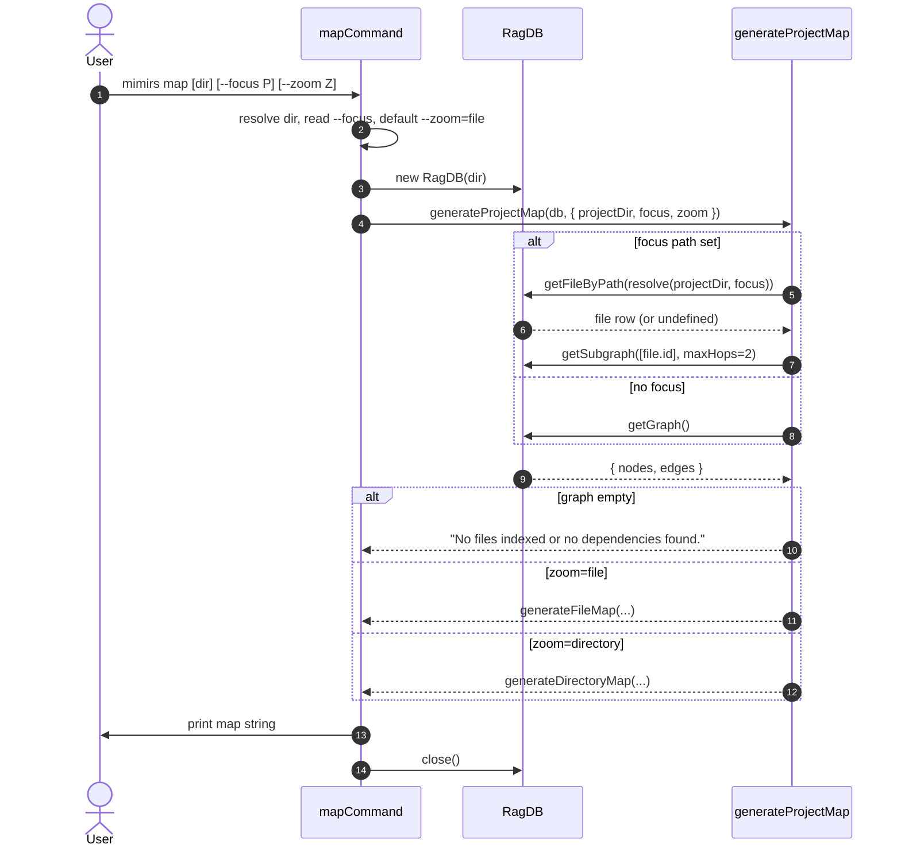

# CLI: map

`mimirs map [dir] [--focus PATH] [--zoom file|directory]` prints a
dependency graph for the project. It is a thin shell around
`generateProjectMap` in `src/graph/resolver.ts`. The CLI's only job is
to parse a directory and two flags, open the DB, call the resolver,
and pipe the resulting string to stdout (`src/cli/commands/map.ts:6-20`).

Use this when you want a quick text picture of how the codebase wires
together — which files have no importers (likely entry points or dead
code), what each file exports, and what each file depends on.

## Flow



1. The user invokes the command. The first positional argument is the
   project directory (when it does not start with `--`); otherwise the
   shell CWD is used (`src/cli/commands/map.ts:7`).
2. The CLI reads two flags via the shared `getFlag` helper:
   `--focus` (a relative path string) and `--zoom` (`file` or
   `directory`, defaulting to `file`) (`src/cli/commands/map.ts:9-10`).
3. `RagDB` opens the project database.
4. The CLI calls `generateProjectMap(db, { projectDir, focus, zoom })`
   with no `maxHops` or `format` override, so the resolver uses its
   defaults: `maxHops = 2`, `format = "text"`
   (`src/graph/resolver.ts:186-191`).
5. If `focus` was passed, the resolver looks up the file's id and
   calls `db.getSubgraph([file.id], maxHops)`. When the focus path
   does not match an indexed file, the subgraph is empty
   (`src/graph/resolver.ts:195-201`).
6. Without `focus`, the resolver calls `db.getGraph()` to load every
   indexed file and edge.
7. An empty `nodes` array short-circuits to a fixed message
   (`src/graph/resolver.ts:204-211`).
8. Otherwise the resolver dispatches to `generateFileMap` or
   `generateDirectoryMap` depending on `zoom`. The CLI never passes
   `format = "json"`, so the output is always the structured text
   format described below.

## Inputs

| Input | Source | Notes |
| --- | --- | --- |
| `directory` | first positional arg | Optional. Selects which project's DB to open. Defaults to `.`. |
| `--focus` | flag | Optional. A path (relative to `directory` or absolute) that selects one file as the center of a subgraph. The resolver does a literal `getFileByPath(resolve(projectDir, focus))` lookup — if the file is not indexed under that exact path, the subgraph is empty (`src/graph/resolver.ts:195-201`). |
| `--zoom` | flag | Optional. Either `file` (default) or `directory`. The CLI casts whatever string was passed to that union without validation, so unknown values flow into the resolver, which only branches on `directory` (treating everything else as `file`) (`src/cli/commands/map.ts:10`, `src/graph/resolver.ts:213-225`). |

## Outputs

| Output | What happens |
| --- | --- |
| Text dependency graph | Printed to stdout in the structured text format produced by `generateFileMap` or `generateDirectoryMap`. |

### File-level shape

`generateFileMap` (`src/graph/resolver.ts:230-309`) splits files into
two groups: **Files With No Importers** (entries with `fanIn = 0`) and
**Files** (everything else). Each file is rendered as:

```
  <relative path>
    exports: <name> (<kind>), ... [+N more]
    depends_on: <path>, <path>, ...
    depended_on_by: <path>, <path>, ...
```

`exports` is truncated to the first 8 entries with a `+N more` suffix.
The lines for `depends_on` and `depended_on_by` are omitted when
empty.

### Directory-level shape

`generateDirectoryMap` (`src/graph/resolver.ts:310-355`) groups every
node by `dirname(relative(projectDir, node.path))`. Each directory is
listed with its file basenames, then an aggregated `### Dependencies`
section enumerates cross-directory edges with a count, e.g.
`src/cli/commands -> src/db (5 imports)`.

## Branches and failure cases

- **No indexed files**: `getGraph()` returns an empty node list and
  the resolver returns the string
  `"No files indexed or no dependencies found."`
  (`src/graph/resolver.ts:206-211`). Run `mimirs index` first.
- **`--focus` path not indexed**: `getFileByPath` returns `undefined`
  and the resolver builds an empty graph for the subgraph branch
  (`src/graph/resolver.ts:198-200`), which then hits the same
  "no files" message.
- **Unknown `--zoom` value**: the cast to `"file" | "directory"` is
  unchecked. The resolver treats any value that isn't exactly
  `"directory"` as file-level (`src/graph/resolver.ts:213-225`). Typos
  silently fall back to the file view.
- **Focused subgraph depth**: the CLI does not expose `maxHops`, so
  focused output is always a 2-hop neighborhood of the chosen file.

## Note: output is structured text, not Mermaid

An earlier version of `generateProjectMap` emitted Mermaid. That was
deliberately replaced — the file-banner comment in the resolver reads:
"Replaces the old Mermaid format with a more parseable,
information-dense output." (`src/graph/resolver.ts:178`). The CLI
never produces Mermaid today, in any zoom level. If you want a visual
graph for VS Code preview you need to convert the text yourself or
script around the resolver's JSON mode (`format = "json"`), which the
CLI does not expose.

## Difference from the `project_map` MCP tool

Both surfaces call the same `generateProjectMap` function. The
differences are in framing:

- The CLI always uses the text formatter; it does not expose `format`.
- The CLI sends the result to stdout; the MCP tool returns it as a
  tool response payload to the agent.
- The MCP tool accepts the same `focus` and `zoom` inputs and applies
  the same defaults, so the content for matching arguments is
  identical.

## Example

```
mimirs map
# → ## Project Map (file-level, 124 files)
#
#   ### Files With No Importers
#     src/cli/index.ts
#       exports: main (function)
#       depends_on: src/cli/commands/index.ts, ...
#
#   ### Files
#     src/db/index.ts
#       exports: RagDB (class)
#       depends_on: src/db/files.ts, src/db/search.ts, ...
#       depended_on_by: src/server/index.ts, ...

mimirs map --focus src/search/hybrid.ts
# (only the 2-hop neighborhood of hybrid.ts)

mimirs map --zoom directory
# → ## Project Map (directory-level, 18 directories)
#   ### Directories
#     src/cli/commands/ (16 files)
#       files: annotations.ts, checkpoint.ts, ...
#   ### Dependencies
#     src/cli/commands -> src/db (15 imports)
```

## Key source files

- `src/cli/commands/map.ts` — the CLI entrypoint (`mapCommand`).
- `src/graph/resolver.ts` — `generateProjectMap` and the formatters
  `generateFileMap` / `generateDirectoryMap`.
- `src/db/index.ts` — `RagDB.getGraph`, `RagDB.getSubgraph`, and
  `RagDB.getFileByPath` provide the graph data.

## Related flows

- [tools/project-map](../tools/project-map.md) — MCP tool that wraps
  the same `generateProjectMap` function for agents.
