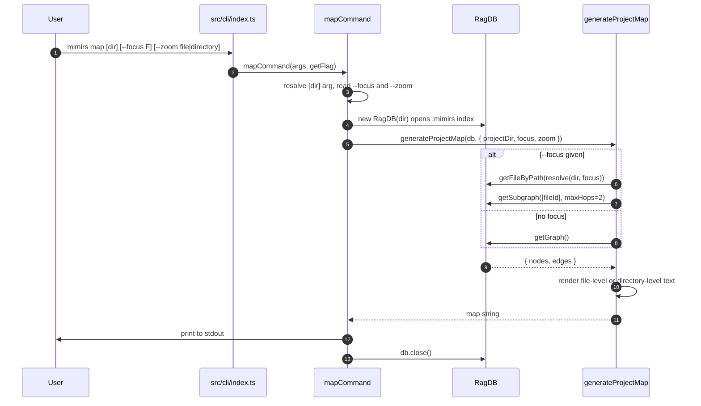

# CLI: map

`mimirs map` prints the project's import/export dependency graph as plain,
information-dense text. It reads the graph that indexing already stored in the
local database and renders it — it does not parse source or recompute anything.
Reach for it when you want a quick, whole-project (or one-file-neighborhood)
picture of what depends on what, without opening import statements across many
files.

The command is registered in the CLI dispatcher and forwards straight to its
handler `src/cli/index.ts:141-142`. The handler opens the database, calls the
shared graph renderer `generateProjectMap`, prints the result, and closes the
database `src/cli/commands/map.ts:7-25`.

## What it produces

The renderer emits an indented text report, not Mermaid. The header line states
the level and a count, for example `## Project Map (file-level, 142 files)`,
followed by per-node blocks listing each file's exports, what it depends on, and
what depends on it `src/graph/resolver.ts:456-497`. The doc comment on
`generateProjectMap` records that this format replaced an older Mermaid output
`src/graph/resolver.ts:365-368` — worth knowing if you grep for "Mermaid"
expecting this command to emit it. It does not; it emits indented text.

## How the flow runs



1. The user runs `mimirs map`, optionally with a directory, `--focus`, and
   `--zoom`. The first positional word after `map` is the directory; flags can
   appear in any order.
2. The dispatcher matches the `map` command and calls the handler with the raw
   argument list and a `getFlag` lookup `src/cli/index.ts:141-142`.
3. The handler resolves the target directory: it uses `args[1]` only when that
   word exists and does not start with `-`, otherwise it defaults to the
   current directory `.` `src/cli/commands/map.ts:8`. It then reads `--focus`
   and `--zoom`, defaulting zoom to `"file"` `src/cli/commands/map.ts:9-10`.
4. It validates `--zoom`: any value other than `file` or `directory` throws a
   `CliFlagError`, which the dispatcher turns into a clean non-zero exit
   `src/cli/commands/map.ts:11-13`, `src/cli/index.ts:105-108`.
5. It opens the database for that directory by constructing `RagDB(dir)`
   `src/cli/commands/map.ts:15`. This is the same on-disk index that `mimirs
   index` populates.
6. It calls `generateProjectMap` with the resolved directory, the focus value
   (or `undefined`), and the zoom level `src/cli/commands/map.ts:17-21`.
7. Inside the renderer, the presence of `--focus` selects which graph to load.
   With a focus file, it looks the file up by absolute path and pulls a
   bounded neighborhood; without one, it loads the entire graph
   `src/graph/resolver.ts:384-393`.
8. The database returns plain node and edge arrays. Nodes carry each file's id,
   path, and its exported symbols; edges carry resolved import relationships
   `src/db/graph.ts:1002-1053`.
9. The renderer turns that graph into text — file-level by default, or
   directory-level when `--zoom directory` was given
   `src/graph/resolver.ts:409-413`.
10. The handler prints the returned string to stdout via the CLI logger and
    closes the database `src/cli/commands/map.ts:23-24`.

## Inputs

| name | type | required | description |
| --- | --- | --- | --- |
| `[dir]` | positional string | no | Project directory whose index to read. Taken from the first non-flag word after `map`; defaults to the current working directory when absent `src/cli/commands/map.ts:8`. |
| `--focus F` | string | no | A file path (relative to `dir`) to center the graph on. When set, only that file's neighborhood within two import hops is shown `src/cli/commands/map.ts:9`, `src/graph/resolver.ts:384-393`. |
| `--zoom file\|directory` | string | no | Rendering granularity. `file` (default) lists individual files; `directory` collapses files into folders and shows folder-to-folder edge counts. Any other value is rejected with a flag error `src/cli/commands/map.ts:10-14`, `src/graph/resolver.ts:409-413`. |

## Outputs

| output | where it lands / shape / description |
| --- | --- |
| Dependency map text | Printed to stdout. A header line with the level and a count, then indented per-node (or per-directory) blocks. Nothing is written to disk and no database state changes `src/cli/commands/map.ts:23`, `src/graph/resolver.ts:456-497`. |

The command is read-only. It opens the index, queries it, prints, and closes —
no rows are inserted or updated, so there is no state-change section for this
flow.

## File-level output (default)

When zoom is `file`, the renderer builds two adjacency maps from the edges —
what each node depends on, and what depends on each node — keyed by file id and
stored as project-relative paths `src/graph/resolver.ts:422-440`. It then
splits nodes into two groups: files that nothing else in the index imports, and
everything else `src/graph/resolver.ts:444-453`.

The "no importers" group is printed first under a `### Files With No Importers`
heading, then the rest under `### Files` `src/graph/resolver.ts:482-495`. For
each file the renderer prints, in order, its relative path, up to eight exports
as `name (type)` with a `, +N more` suffix when there are more, its
`depends_on` list, and its `dependents` list — each list omitted when empty
`src/graph/resolver.ts:458-480`. The comment in source is explicit that "no
importers" is structural fan-in inside the indexed set, not a guarantee that
the file is a real application entry point `src/graph/resolver.ts:442-443`.

## Directory-level output (`--zoom directory`)

When zoom is `directory`, the renderer groups every node by the directory of
its relative path (falling back to `.` for root files) and records the file's
basename under that directory `src/graph/resolver.ts:508-514`. Edges are
collapsed to directory-to-directory pairs, skipping edges that stay inside one
directory, and counted `src/graph/resolver.ts:517-525`.

The output lists each directory with its file count and the files it contains,
then a `### Dependencies` section with one line per cross-directory pair and its
import count, pluralized as `import`/`imports`
`src/graph/resolver.ts:528-541`.

## `--focus` neighborhood

A focus value scopes the graph to one file plus its near neighbors instead of
the whole project. The renderer resolves the focus path against the project
directory and looks the file up in the index by its absolute path
`src/graph/resolver.ts:385`. If found, it asks the database for a subgraph
seeded by that file id, expanded by the default two hops
`src/graph/resolver.ts:387`.

The subgraph walk is a breadth-first expansion run directly in SQL. It starts
from the focus file and, per hop, pulls every import edge where the focus side
appears as either importer or importee, then folds the newly seen files into
the next frontier until two hops are done `src/db/graph.ts:1066-1094`. After the
walk it loads nodes and edges only for the visited file ids, batching queries to
stay under SQLite's 999-parameter limit (each batch caps at 499 ids)
`src/db/graph.ts:1062`, `src/db/graph.ts:1096-1153`. A prior version
batched both edge endpoints with the same slice and silently dropped edges whose
ends fell in different batches; the current code batches by `file_id` alone and
filters the other end in JS against the visited set
`src/db/graph.ts:1130-1156`. The resulting neighborhood is then rendered with the
same file-level or directory-level formatter as a full graph.

## Branches and failure cases

| condition | behavior |
| --- | --- |
| No `[dir]` arg | Defaults to the current working directory `src/cli/commands/map.ts:8`. |
| Invalid `--zoom` value | Anything other than `file` or `directory` throws `CliFlagError`; the dispatcher prints the message and exits non-zero `src/cli/commands/map.ts:11-13`, `src/cli/index.ts:105-108`. |
| `--focus` set, file found | Renders the two-hop neighborhood of that file `src/graph/resolver.ts:385-387`. |
| `--focus` set, file not in index | The lookup returns nothing, the graph is set to empty, and the command prints `No files indexed or no dependencies found.` `src/graph/resolver.ts:388-399`. |
| No `--focus` | Loads and renders the whole stored graph `src/graph/resolver.ts:391-393`. |
| Empty index / no resolved edges | Same empty message as above; the graph has zero nodes so the renderer returns the message before any formatting `src/graph/resolver.ts:395-400`. |
| `--zoom directory` | Renders the directory-level report `src/graph/resolver.ts:409-410`. |
| `--zoom file` (default) | Renders the file-level report `src/graph/resolver.ts:413`. |

Two further points matter when reading the output:

- The graph only reflects imports that indexing managed to resolve to another
  indexed file. Edges come exclusively from `file_imports` rows whose
  `resolved_file_id` is set `src/db/graph.ts:1042`. Bare/external packages
  and imports to files outside the index never appear as edges, so a file can
  show an empty `depends_on` even though its source imports third-party
  modules.
- "Files With No Importers" counts only importers inside the index. A file
  imported solely by something that was excluded from indexing (tests,
  benchmarks, or a path outside the patterns) will appear here even though it
  is used.

## Example

```bash
# Whole project, file level (default)
mimirs map

# A different project directory
mimirs map ./packages/core

# One file's two-hop neighborhood
mimirs map --focus src/server.ts

# Collapse to folder-to-folder dependencies
mimirs map --zoom directory
```

Illustrative file-level output (paths and counts are synthetic):

```
## Project Map (file-level, 3 files)

### Files With No Importers
  src/main.ts
    depends_on: src/cli/index.ts

### Files
  src/cli/index.ts
    exports: main (function)
    depends_on: src/cli/commands/map.ts
    dependents: src/main.ts
  src/cli/commands/map.ts
    exports: mapCommand (function)
    dependents: src/cli/index.ts
```

## Related

The `project_map` MCP tool is the in-server counterpart to this command. It
calls the same `generateProjectMap` renderer with the same `focus`/`zoom`
options, and additionally exposes a `hops` argument and a `format` argument that
can return the graph as JSON `src/tools/graph-tools.ts:56-84`. The CLI command
never passes `format` or `hops`, so it always uses the default text rendering and
two-hop neighborhood. See [project_map](../tools/project-map.md).

## Key source files

| path | role |
| --- | --- |
| `src/cli/index.ts` | Registers the `map` command and dispatches to the handler `src/cli/index.ts:141-142`. |
| `src/cli/commands/map.ts` | Handler: resolves args, validates `--zoom`, opens the index, calls the renderer, prints, closes `src/cli/commands/map.ts:7-25`. |
| `src/graph/resolver.ts` | Hosts `generateProjectMap` and the file-level and directory-level text formatters `src/graph/resolver.ts:370-545`. |
| `src/db/graph.ts` | Backs the renderer with `getGraph` (full graph) and `getSubgraph` (focused neighborhood) `src/db/graph.ts:1002-1156`. |
