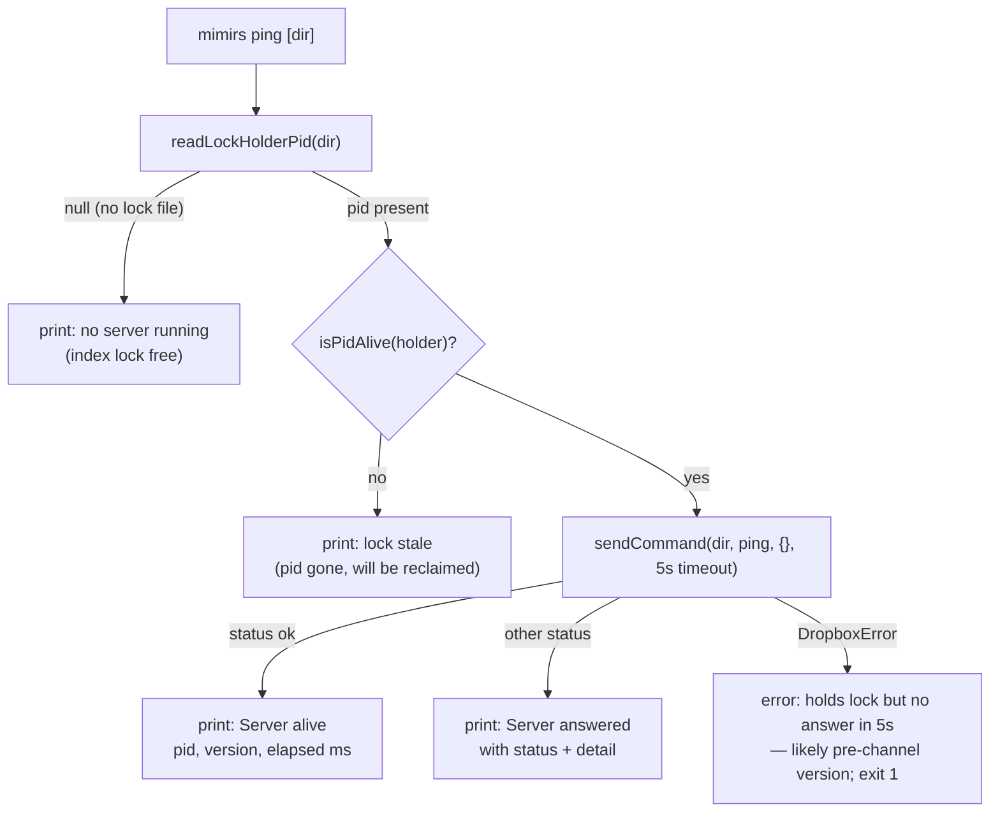

# CLI: ping

`mimirs ping [dir]` is a connectivity check. It answers one question: is a live
mimirs server actually reachable for this project, and can it talk over the
drop-box command channel? mimirs runs one indexing server per project (the one
holding the index lock), and several CLI commands delegate work to that server
by dropping request files for it to pick up. When that delegation misbehaves —
an index command hangs, or an IDE's MCP server is wedged — `ping` isolates the
problem: it proves end-to-end that a request can be written, consumed by the
holder, and answered, or it tells you exactly which link is broken.

The command does no indexing and changes no state. It reads the project's index
lock, and if a live holder exists, sends a single `ping` request over the
[drop-box command channel](../mechanisms/control-channel.md) with a tight
5-second timeout (`src/cli/commands/ping.ts:12-42`).



1. **Resolve the directory.** The optional positional argument defaults to `.`,
   resolved to an absolute path (`src/cli/commands/ping.ts:13`). This is the
   project whose lock and command folder are probed.
2. **Read the lock holder.** `readLockHolderPid` reads the PID from
   `.mimirs/index.lock`. When the file is absent it returns `null`, and `ping`
   reports that no server is running here and stops — nothing holds the lock, so
   there is nothing to ping (`src/cli/commands/ping.ts:15-19`).
3. **Check liveness.** A lock file can outlive the process that wrote it. If the
   recorded PID is no longer alive (`isPidAlive`), the lock is stale; `ping`
   says so and notes that the next server or indexing CLI run will reclaim it,
   then stops (`src/cli/commands/ping.ts:20-23`).
4. **Send the ping.** With a live holder confirmed, `ping` calls `sendCommand`
   with the `ping` command, empty args, and a 5-second timeout. This drops a
   request file the holder consumes and waits for the result
   (`src/cli/commands/ping.ts:25-27`).
5. **Report the answer.** A result with `status: "ok"` prints the holder's PID
   and version (echoed back by the server's ping executor) and the round-trip
   time. Any other status is printed verbatim with its detail
   (`src/cli/commands/ping.ts:28-32`).
6. **Handle no answer.** If the wait throws a `DropboxError` (in practice a
   timeout, since liveness was just verified), `ping` reports that the holder
   holds the lock but did not answer within 5 seconds — almost always a server
   from a mimirs build that predates the command channel — and exits non-zero
   (`src/cli/commands/ping.ts:33-42`).

## Inputs

| name | type | required | description |
| --- | --- | --- | --- |
| `dir` | positional path | no | Project directory to probe; defaults to the current directory. Resolved to an absolute path before reading its `.mimirs/index.lock` and command folder (`src/cli/commands/ping.ts:13`). |

## Outputs

| output | where it lands / shape / description |
| --- | --- |
| Status line | Printed to the log. One of: no server running; stale lock; `Server alive: pid <n>, version <n> (<ms>ms)`; `Server answered with <status>`; or an error about no answer in 5s. The success line carries the holder's `pid` and `version` from the result's `stats` (`src/cli/commands/ping.ts:28-32`). |
| Exit code | `0` for every reachable or no-server case; `1` only when a live holder fails to answer the ping within 5s (`src/cli/commands/ping.ts:39`). |

## Branches and failure cases

| Condition | Behavior | Exit |
| --- | --- | --- |
| No lock file | Prints "no mimirs server is running here (index lock free)" and returns | 0 |
| Lock present but PID dead | Prints stale-lock message; notes it will be reclaimed | 0 |
| Ping result `ok` | Prints server pid, version, round-trip ms | 0 |
| Ping result non-`ok` (e.g. `error`, `unsupported`) | Prints the status and any detail | 0 |
| `DropboxError` (timeout / no answer) | Prints the pre-channel-version hint, exits 1 | 1 |
| Non-`DropboxError` thrown | Re-thrown to the top-level handler | — |

The 5-second timeout is what makes this useful as a probe rather than a hang: a
healthy server answers a `ping` in milliseconds, so a 5-second silence is a
strong signal that the holder cannot speak the channel protocol. The deeper
mechanics of how the request file is written, consumed, and answered — and how a
holder that dies mid-request is distinguished from one that is merely slow — live
in the [drop-box command channel](../mechanisms/control-channel.md) page; `ping`
is the smallest possible exerciser of that machinery.

## Example

```console
$ mimirs ping
Server alive: pid 48213, version 1 (3ms)
```

```console
$ mimirs ping
No mimirs server is running here (index lock free).
```

## Key source files

- `src/cli/commands/ping.ts` — the whole flow: read lock holder, liveness check,
  send the ping, interpret the result.
- `src/cli/index.ts:145-146` — the `ping` case in the CLI dispatch switch.
- `src/control/producer.ts` — `readLockHolderPid` and `sendCommand`, the channel
  primitives this command exercises (see the mechanism page).
