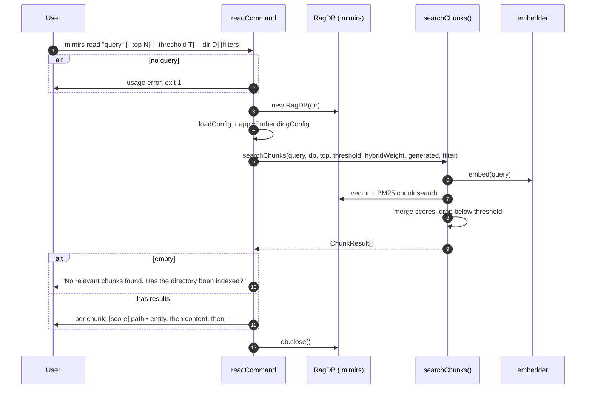

# CLI: read

`mimirs read` answers "show me the code that is relevant to this topic." Unlike
[search](search.md), which lists matching *files*, `read` returns the actual
*content* of the best-matching chunks — individual functions, classes, and
documentation sections — ranked by relevance. It is the command-line
counterpart of the `read_relevant` MCP tool.

Use it when you want to read the relevant code directly in the terminal rather
than open files one by one. When you only need to know which files are
involved, use [search](search.md) instead.

The command entry point is `readCommand` in
`src/cli/commands/search-cmd.ts:61`. The chunk search runs in
`searchChunks` (`src/search/hybrid.ts:470`).

## What the command does

`readCommand` validates the query, opens the database, runs the chunk-level
hybrid search, and prints each matching chunk's score, path, optional entity
name, and full content (`src/cli/commands/search-cmd.ts:61-88`).



1. The user runs the command with a query and optional flags; the query is the
   first positional argument (`src/cli/commands/search-cmd.ts:62`).
2. If the query is missing, the command prints a usage line and exits with
   status 1 (`src/cli/commands/search-cmd.ts:63-66`).
3. It resolves the target directory (`--dir` or the current directory), opens
   the database, and loads/applies config (`src/cli/commands/search-cmd.ts:68-71`).
4. It reads `--top` (default `8`) and `--threshold` (default `0.3`), and builds
   an optional path filter from `--ext`/`--in`/`--exclude`
   (`src/cli/commands/search-cmd.ts:72-74`).
5. It calls `searchChunks`, which embeds the query, runs a vector and a BM25
   chunk search, merges scores, drops chunks below the threshold, and applies
   path-based score adjustments (`src/cli/commands/search-cmd.ts:76`,
   `src/search/hybrid.ts:470-498`).
6. If nothing matched, it prints "No relevant chunks found. Has the directory
   been indexed?" (`src/cli/commands/search-cmd.ts:78-79`).
7. Otherwise, for each chunk it prints a header line `[score] path • entity`,
   then the chunk content, then a `---` separator
   (`src/cli/commands/search-cmd.ts:81-86`).
8. It closes the database (`src/cli/commands/search-cmd.ts:88`).

## Inputs

| name | type | required | description |
|------|------|----------|-------------|
| query | positional arg | yes | The natural-language query (`args[1]`). Missing it triggers a usage error and exit 1 (`src/cli/commands/search-cmd.ts:62-66`). |
| `--top` | flag with value | no | Maximum number of chunks to return. Defaults to `8`, parsed with `parseInt` (`src/cli/commands/search-cmd.ts:72`). |
| `--threshold` | flag with value | no | Minimum relevance score (0–1) a chunk must meet to be returned. Defaults to `0.3`, parsed with `parseFloat` (`src/cli/commands/search-cmd.ts:73`). |
| `--dir` | flag with value | no | Project directory to search. Resolved against the current directory; defaults to `.` (`src/cli/commands/search-cmd.ts:68`). |
| `--ext` / `--extensions` | flag with value | no | Comma-separated extensions to restrict results to (`src/cli/commands/search-cmd.ts:21`). |
| `--in` / `--dirs` | flag with value | no | Comma-separated directories to restrict results to (`src/cli/commands/search-cmd.ts:22`). |
| `--exclude` / `--exclude-dirs` | flag with value | no | Comma-separated directories to exclude (`src/cli/commands/search-cmd.ts:23`). |

The filter flags are merged into a single path filter only when at least one is
present (`src/cli/commands/search-cmd.ts:17-30`).

## Outputs

| output | where it lands / shape / description |
|--------|--------------------------------------|
| Chunk results | Printed to stdout, one block per `ChunkResult` (`src/search/hybrid.ts:45-55`). |
| Header line | `[score] path • entity` — `r.score.toFixed(2)` and `r.path`, with `  •  entityName` appended only when the chunk has an entity name (`src/cli/commands/search-cmd.ts:82-83`). |
| Chunk content | The full chunk text printed verbatim on the following lines (`src/cli/commands/search-cmd.ts:84`). |
| Separator | A `---` line between chunks (`src/cli/commands/search-cmd.ts:85`). |
| Empty-result message | "No relevant chunks found. Has the directory been indexed?" when zero chunks meet the threshold (`src/cli/commands/search-cmd.ts:79`). |

`ChunkResult` carries `startLine`, `endLine`, `chunkType`, and `parentId`
alongside the printed fields (`src/search/hybrid.ts:45-55`), but this command
prints only the score, path, entity name, and content — it does not render line
ranges, and it does not attach any inline annotation blocks. Those are produced
by the `read_relevant` MCP tool, not by this command
(`src/cli/commands/search-cmd.ts:81-86`).

This command reads the index and prints results; it does not write or change
any stored state.

## search vs read

Both commands live in `src/cli/commands/search-cmd.ts` and share the same
flag and filter parsing, but they differ in result granularity and defaults.

| | `mimirs read` | `mimirs search` |
|--|---------------|-----------------|
| Underlying function | `searchChunks` (`src/search/hybrid.ts:470`) | `search` (`src/search/hybrid.ts:313`) |
| Result granularity | individual chunks (functions, classes, sections) | one entry per file, deduplicated by path |
| Default `--top` | `8` (`src/cli/commands/search-cmd.ts:72`) | `config.searchTopK` (`src/cli/commands/search-cmd.ts:43`) |
| `--threshold` | `0.3` default, settable (`src/cli/commands/search-cmd.ts:73`) | always `0` |
| Output per item | score + path + entity name + full content | score + path + truncated snippet |

Use `read` to get the *content* of matching chunks; use `search` to locate the
*files* a topic lives in.

## Branches and failure cases

- **Missing query.** Prints the usage string and exits with code 1
  (`src/cli/commands/search-cmd.ts:63-66`).
- **No matches above threshold.** Prints the "No relevant chunks found" hint and
  closes (`src/cli/commands/search-cmd.ts:78-79`). Raising `--threshold` makes
  this more likely; lowering it returns more, lower-confidence chunks.
- **Entity name absent.** When a chunk has no entity name (for example a plain
  text block), the `  •  entity` suffix is omitted from the header line
  (`src/cli/commands/search-cmd.ts:82`).
- **No filter flags.** When none of `--ext`/`--in`/`--exclude` is present,
  `buildCliFilter` returns `undefined` and the search runs unscoped
  (`src/cli/commands/search-cmd.ts:24`).
- **FTS failure falls back.** Inside `searchChunks`, if the BM25 chunk query
  throws, it is caught and the search proceeds vector-only
  (`src/search/hybrid.ts:485-489`).

## Example

```bash
# Read the chunks most relevant to "how scores are merged".
mimirs read "how scores are merged"

# Top 5 chunks at a stricter threshold, TypeScript only.
mimirs read "embedding model loading" --top 5 --threshold 0.45 --ext .ts

# Read from a different project directory.
mimirs read "config defaults" --dir ../other-project
```

Illustrative output:

```
[0.81] src/search/hybrid.ts  •  mergeHybridScores
export function mergeHybridScores(vectorResults, textResults, hybridWeight) {
  // ...merge and normalize vector + BM25 scores...
}

---

[0.74] src/db/search.ts  •  textSearchChunks
textSearchChunks(query, limit, filter) {
  // ...BM25 FTS query over chunks...
}

---
```

## Key source files

- `src/cli/commands/search-cmd.ts` — `readCommand` entry point and the shared
  flag/filter parsing (`parseListFlag`, `buildCliFilter`).
- `src/search/hybrid.ts` — `searchChunks`, the chunk-level hybrid query, and the
  `ChunkResult` shape.
- `src/db/index.ts` — `RagDB`, providing the chunk-level vector and text search
  primitives.

## Related pages

- [search](search.md) — file-level sibling command from the same source file.
- [read_relevant](../tools/read-relevant.md) — the MCP tool that exposes
  chunk-level results (with line ranges and inline notes) to an agent.
