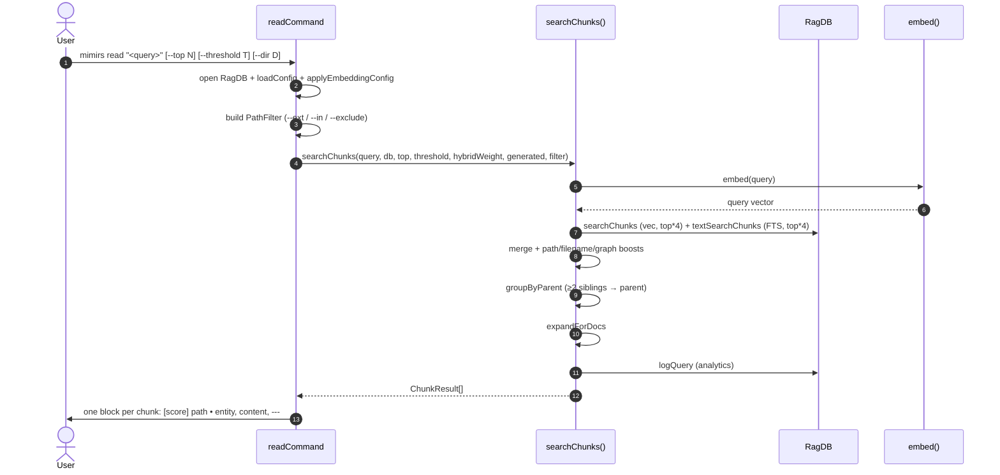

# CLI: read

`mimirs read` is the chunk-level sibling of [`mimirs search`](search.md). It prints the actual content of the most relevant semantic chunks (functions, classes, markdown sections), each with a score, file path, and optional entity name.

Use it when you need the code itself in the terminal — for example piping into `less`, grepping further, or pasting into another tool. For machine-readable chunk results with inline annotation rendering, use the `read_relevant` MCP tool instead; this CLI surface does not inject annotation blocks (it just prints chunk content as stored).

## Flow



1. The CLI requires a query positional. Without it, it prints usage and exits with code 1 (`src/cli/commands/search-cmd.ts:62-66`).
2. The DB is opened for the directory in `--dir` (default `.`). `applyEmbeddingConfig` makes sure the runtime embedding model matches the indexed one.
3. `buildCliFilter` collects scope flags into a `PathFilter`; passing none means the full index is searched (`src/cli/commands/search-cmd.ts:17-30`).
4. `--top` defaults to `8`; `--threshold` defaults to `0.3`. Both are passed straight into `searchChunks` (`src/cli/commands/search-cmd.ts:72-73`).
5. `searchChunks` embeds the query, runs vector + FTS chunk searches (each with `top * 4` candidates), merges them under `hybridWeight`, and drops anything below the threshold (`src/search/hybrid.ts:470-493`).
6. Each surviving chunk is rescored: test paths multiplied by `0.85`, source paths by `1.1`, boilerplate basenames by `0.8`, generated paths by the configured demotion, plus filename and path-segment affinity bonuses, plus a logarithmic graph boost from `db.getImportersOf(file.id).length` (`src/search/hybrid.ts:494-534`).
7. `groupByParent` promotes the parent chunk when two or more child chunks from the same parent appear, so sibling methods don't crowd the result list (`src/search/hybrid.ts:404-464`, `src/search/hybrid.ts:537-538`).
8. `expandForDocs` appends documentation chunks as bonus results without displacing code chunks. The query is logged to the analytics table (`src/search/hybrid.ts:540-551`).
9. The CLI prints each result as `[score] path  •  entityName` followed by the raw chunk content and a `---` separator (`src/cli/commands/search-cmd.ts:81-86`).

## Inputs

| Input | Source | Notes |
| --- | --- | --- |
| `query` | first positional arg | Required. |
| `--top` | flag | Max chunks to return. Default `8` (`src/cli/commands/search-cmd.ts:72`). |
| `--threshold` | flag | Minimum hybrid score before the chunk is considered. Default `0.3` (`src/cli/commands/search-cmd.ts:73`). |
| `--dir` | flag | Project directory. Default `.`. |
| `--ext` / `--extensions` | flag | Comma-separated extensions. |
| `--in` / `--dirs` | flag | Comma-separated directory roots, resolved against the project dir. |
| `--exclude` / `--exclude-dirs` | flag | Comma-separated directories to omit. |

## Outputs

| Output | Where | Notes |
| --- | --- | --- |
| Ranked chunk blocks | stdout | `[0.82] path  •  entityName`, then the chunk content, then `---`. `entityName` is omitted when the chunk has none (e.g. top-level prose). |
| Empty-result hint | stdout | `"No relevant chunks found. Has the directory been indexed?"`. |
| Analytics row | `query_log` table | Same `logQuery` write as `mimirs search`. |

`ChunkResult` carries `startLine` and `endLine` (`src/search/hybrid.ts:45-55`) and the underlying tool surface uses them to render `path:startLine-endLine` citations. The CLI does not currently print those numbers — it only emits the path and entity name in the header. Open question: should the CLI render the line range as well? Today, agents that need exact line ranges should call the `read_relevant` MCP tool, which formats them.

## Branches and failure cases

- **No query.** Exits 1 with usage.
- **Threshold too high.** All chunks filtered out → empty-result message.
- **FTS failure.** `db.textSearchChunks` is wrapped in `try/catch`; vector-only fallback at debug log (`src/search/hybrid.ts:484-489`).
- **Parent grouping.** Two child chunks may be collapsed into the parent chunk, which can change the path you see versus the chunks that originally scored highest. The promoted parent inherits the best child score (`src/search/hybrid.ts:438-451`).
- **Doc expansion.** Documentation chunks (markdown, etc.) are appended as bonuses; they do not push code results out of the top N.

## Example

```bash
mimirs read "how does the index lock work"
mimirs read "checkpoint" --top 4 --threshold 0.45
mimirs read "embed" --dir ../other-project --ext .ts --in src/embeddings
```

Sample output:

```
[0.84] src/indexing/indexer.ts  •  indexDirectory
export async function indexDirectory(
  directory: string,
  db: RagDB,
  config: RagConfig,
  ...

---

[0.71] src/utils/index-lock.ts  •  tryAcquireIndexLock
export function tryAcquireIndexLock(directory: string): IndexLock | null {
  ...

---
```

## Read vs search

See the comparison table in [CLI: search](search.md#search-vs-read). The same hybrid scorer feeds both; `read` calls `searchChunks` (chunk granularity, with parent grouping and doc expansion) while `search` calls `search` (file granularity, deduped).

## Key source files

- `src/cli/commands/search-cmd.ts` — `readCommand`, flag parsing, output formatting.
- `src/search/hybrid.ts` — `searchChunks`, parent grouping, doc expansion.
- `src/db/index.ts` — `RagDB.searchChunks`, `RagDB.textSearchChunks`, `RagDB.getChunkById`.

## Related flows

- [CLI: search](search.md) — file-level sibling.
- [tools/read-relevant](../tools/read-relevant.md) — chunk-level read over MCP, with inline `[NOTE]` annotation rendering.
