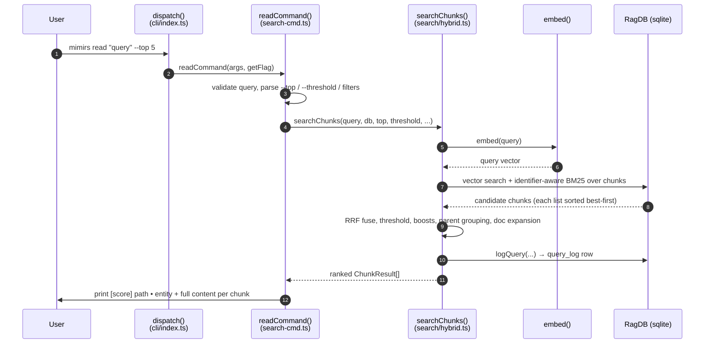

# CLI: read

`mimirs read <query>` answers the question "show me the actual code that is relevant to this topic" from the terminal. Where `mimirs search` returns a ranked list of *files* with short previews, `read` returns the *content* of the most relevant semantic chunks — individual functions, classes, or markdown sections — printed in full to stdout, each tagged with its score, file path, and the name of the symbol it belongs to. It is the command-line twin of the `read_relevant` MCP tool: both call the same chunk-search routine, so the ranking and content you see on the terminal match what an agent receives.

Use it when you want to read code by meaning instead of by file name — for example to dump the body of the function that handles a feature without first having to find which file it lives in.

The command is wired into the CLI dispatcher under the `read` case, which forwards the raw arguments and a flag-lookup helper to the handler `readCommand` `src/cli/index.ts:125-126`. That handler lives next to the file-level `search` handler in the same module `src/cli/commands/search-cmd.ts:63-91`.

## What it does, step by step



1. The user runs `mimirs read <query>` with optional flags. The dispatcher matches the `read` command and calls `readCommand` `src/cli/index.ts:125-126`.
2. `readCommand` reads the query from `args[1]`. If it is missing, the command prints a usage line to stderr and exits with code 1 `src/cli/commands/search-cmd.ts:64-68`.
3. The handler resolves the target directory (`--dir`, default `.`), parses the numeric flags first, then opens the index database, loads the project config, and builds the path filter `src/cli/commands/search-cmd.ts:70-76`.
4. It calls `searchChunks` with the parsed query, the database handle, `top`, `threshold`, the configured hybrid weight, the configured generated-file globs, the path filter, and the parent-grouping count `src/cli/commands/search-cmd.ts:78`.
5. `searchChunks` embeds the query text into a vector via `embed` `src/search/hybrid.ts:503`.
6. It runs a vector (nearest-neighbour) search and an identifier-aware BM25 full-text search over the chunk index, each over-fetching `topK * 4` candidates `src/search/hybrid.ts:505-512`.
7. It fuses the two result lists by reciprocal-rank fusion, drops anything below the threshold, applies path and filename boosts, demotes boilerplate/generated files, adds a dependency-graph boost, sorts, then consolidates sibling chunks into their parent and expands for docs `src/search/hybrid.ts:515-564`.
8. Before returning, it writes one row into the `query_log` table for analytics `src/search/hybrid.ts:571-577`.
9. Back in the handler, the ranked chunks are printed: a header line `[score] path • entity` followed by the full chunk content and a `---` separator `src/cli/commands/search-cmd.ts:83-88`. If nothing cleared the threshold, it prints a hint that the directory may not be indexed `src/cli/commands/search-cmd.ts:80-81`. Either way the database is closed `src/cli/commands/search-cmd.ts:90`.

## Inputs

| Name | Type | Required | Description |
| --- | --- | --- | --- |
| `<query>` | positional string | yes | The natural-language or symbol query. Read from `args[1]`; if absent the command prints usage and exits 1 `src/cli/commands/search-cmd.ts:64-68`. |
| `--top N` | integer | no | Number of chunks to return. Parsed with a strict integer parser, minimum 1; **defaults to 8** (a literal, not the config `searchTopK`) `src/cli/commands/search-cmd.ts:72`. |
| `--threshold T` | float 0–1 | no | Minimum fused score a chunk must reach to be kept. Defaults to `0.3` `src/cli/commands/search-cmd.ts:73`. |
| `--dir D` | path | no | Project directory whose index to query. Resolved to an absolute path; defaults to the current directory `src/cli/commands/search-cmd.ts:70`. |
| `--ext` / `--extensions` | comma list | no | Restrict to these file extensions, e.g. `.ts,.tsx` `src/cli/commands/search-cmd.ts:22`. |
| `--in` / `--dirs` | comma list | no | Restrict to these directories (resolved to absolute paths against the project root) `src/cli/commands/search-cmd.ts:23,28`. |
| `--exclude` / `--exclude-dirs` | comma list | no | Exclude these directories `src/cli/commands/search-cmd.ts:24,29`. |

`--ext`, `--in`, and `--exclude` are collected by `buildCliFilter`. Each accepts a comma-separated value, split and trimmed by `parseListFlag`; empty segments are dropped. When none of the three flags is present, `buildCliFilter` returns `undefined` and the search runs unscoped `src/cli/commands/search-cmd.ts:18-31`. The dir-prefix and extension matches reach SQL `LIKE` with an explicit `ESCAPE '\'` clause, so a `%` or `_` in a directory or extension name is matched literally rather than as a wildcard `src/db/search.ts:46-71`.

The hybrid weight (the bias between the vector and keyword rank lists), the list of generated-file globs, and the parent-grouping count are not flags — they come from the loaded project config (`config.hybridWeight`, `config.generated`, `config.parentGroupingMinCount`) and default to `0.5`, empty, and `2` respectively `src/config/index.ts:124,121,128`.

## Outputs

| Output | Where it lands / shape / description |
| --- | --- |
| Ranked chunk content | stdout. For each result: a header line `[<score, 2dp>] <path>` with `  •  <entityName>` appended when the chunk has a symbol name, then the full chunk content, then a line containing `---` `src/cli/commands/search-cmd.ts:83-88`. |
| Empty-state message | stdout. When zero chunks clear the threshold: `No relevant chunks found. Has the directory been indexed?` `src/cli/commands/search-cmd.ts:80-81`. |
| `query_log` row | One row inserted into the SQLite `query_log` table, side-effect of every chunk search `src/search/hybrid.ts:571-577`. |

Each chunk in the ranked list comes from the `ChunkResult` shape — `path`, `score`, `content`, `chunkIndex`, `entityName`, `chunkType`, `startLine`, `endLine`, `parentId` `src/search/hybrid.ts:47-57`. The terminal output only prints the score, path, entity name, and content; the line-range fields are carried internally and surfaced by the `read_relevant` tool rather than this command.

## How the chunk search ranks results

`searchChunks` is the heart of the command, and it is the same routine the `read_relevant` MCP tool runs. Understanding it explains every number you see on screen `src/search/hybrid.ts:492-580`.

- **Two retrievers, one fused rank.** The query is embedded once, then run through a vector nearest-neighbour search (`db.searchChunks`) and a BM25 keyword search (`db.textSearchChunks`), each fetching four times `topK` to give the re-ranker room `src/search/hybrid.ts:503-512`. The keyword search is wrapped in a try/catch: if the full-text query fails it logs a debug line and continues vector-only rather than erroring out `src/search/hybrid.ts:507-512`.
- **Identifier-aware keyword search.** The BM25 side matches the `fts_chunks` FTS5 index, which spans two columns: the raw `snippet` and a companion `parts` column holding the split word-pieces of every compound identifier (camelCase, snake_case, kebab, dotted). That is why a query for `depends` can match `getDependsOn` even though FTS5's default tokenizer treats the whole identifier as one opaque token `src/db/search.ts:212-259`, `src/db/index.ts:281-297`, `src/indexing/identifiers.ts:27-41`. The query string itself is first run through `sanitizeFTS`, which double-quotes each token and joins them with `OR` so multi-word and natural-language queries rank by how many terms they hit instead of collapsing to vector-only `src/db/search.ts:246`, `src/search/usages.ts`.
- **Reciprocal-rank fusion (not a linear blend).** Vector scores and BM25-derived `1/(1+rank)` scores live on different, non-comparable scales, so a raw weighted sum would be dominated by whichever has the larger magnitude. Instead `mergeHybridScores` calls `rrfFuse`, which scores each chunk by its *position* in each list: a chunk at rank `i` contributes `RRF_K / (RRF_K + i)` (with `RRF_K = 60`), and the two contributions are blended as `weight * primaryRank + (1 - weight) * secondaryRank`. The vector list is primary. With the default weight of `0.5`, the two signals get equal say `src/search/hybrid.ts:77-115`.
- **Threshold filter.** Fused chunks scoring below the `--threshold` value are dropped immediately, before any boosting `src/search/hybrid.ts:515-516`.
- **Path and name adjustments.** Surviving chunks are multiplied by heuristics: test files are demoted to `0.85`, source files (`src`, `lib`, `app`, …) boosted to `1.1`, boilerplate basenames demoted to `0.8`, generated files demoted by a `GENERATED_DEMOTION` factor (`0.75`), and chunks whose file name or path segments share words with the query are boosted further `src/search/hybrid.ts:517-546`.
- **Dependency-graph boost.** A chunk in a file that many others import gets a small additive logarithmic bonus (`0.05 * log2(importerCount + 1)`), so widely-used code surfaces higher `src/search/hybrid.ts:548-556`.
- **Parent grouping.** When `parentGroupingMinCount` or more sibling chunks share the same parent, they are replaced by the single parent chunk (keeping the best score) so a class does not flood the list with its individual methods `src/search/hybrid.ts:426-486`, `src/search/hybrid.ts:561`. This is why a result may have `chunkIndex` `-1` and represent a whole parent rather than one method `src/search/hybrid.ts:467`.
- **Doc expansion.** If markdown results are displacing code within the top `topK`, the list is extended slightly so docs are treated as bonus results instead of crowding out code `src/search/hybrid.ts:304-315`, `src/search/hybrid.ts:564`.

## State changes

### `query_log` row written per search

| Before | After |
| --- | --- |
| No row for this invocation | One new `query_log` row recording the query text, result count, top vector score, top path, and duration |

Every call to `searchChunks` ends by calling `db.logQuery(...)` with the query string, the number of results, the score and path of the top result, and the elapsed milliseconds measured from a `performance.now()` timer started at the top of the function `src/search/hybrid.ts:571-577`. One detail matters for analytics: the score logged is *not* the displayed fused score but the top vector hit converted back to true cosine via `vectorScoreToCosine(vectorResults[0]?.score)`. Because the fused score is a positional rank value (close to `1` at the top regardless of true relevance) and the raw stored vector score is L2-based (bottoming out near `0.33`), the cosine value is logged instead so that "average top score" and the low-relevance (`< 0.3`) heuristic stay meaningful `src/search/hybrid.ts:566-577`, `src/db/search.ts:19-25`. The path is the top *result's* path, or `null` when the result set is empty.

`db.logQuery` delegates to the analytics layer, which runs a single `INSERT INTO query_log (...)` with the current ISO timestamp `src/db/analytics.ts:3-8`. The table is created at database open time with columns `query`, `result_count`, `top_score`, `top_path`, `duration_ms`, and `created_at` `src/db/index.ts:434-442`.

This matters because it is the data source for `mimirs analytics`: zero-result and low-score rows are exactly how the project finds documentation and indexing gaps. The write happens unconditionally — even an empty result set logs a row with `result_count = 0` and a `null` score, which is what makes "queries that found nothing" reportable later. See [analytics](analytics.md).

## Branches and failure cases

| Branch | Behavior |
| --- | --- |
| Missing query | Prints `Usage: mimirs read <query> ...` to stderr and exits with code 1 `src/cli/commands/search-cmd.ts:64-68`. |
| Bad numeric flag | `--top` / `--threshold` parsing throws `CliFlagError` (e.g. `--top abc`, or `--threshold 2` exceeding the 0–1 range). Flags are validated before `RagDB` is constructed, so the flag error is not masked by a later DB error; the dispatcher catches it, prints the message, and exits 1 — it does not crash `src/cli/flags.ts:40-71`, `src/cli/index.ts:96-106`, `src/cli/commands/search-cmd.ts:71-73`. |
| No filters supplied | `buildCliFilter` returns `undefined` and the search runs across the whole index `src/cli/commands/search-cmd.ts:25`. |
| Empty filter values | `parseListFlag` trims and drops empty segments, so `--ext " "` contributes nothing and is treated as absent `src/cli/commands/search-cmd.ts:8-16`. |
| Zero results / unindexed dir | Prints `No relevant chunks found. Has the directory been indexed?`; still logs a `query_log` row and closes the DB `src/cli/commands/search-cmd.ts:80-81`, `src/cli/commands/search-cmd.ts:90`. |
| Full-text search failure | Falls back to vector-only results after a debug log; the command still returns whatever the vector search found `src/search/hybrid.ts:507-512`. |
| Chunk with no entity name | The `  •  <entity>` suffix is omitted; only `[score] path` is printed `src/cli/commands/search-cmd.ts:84-85`. |

## Example

```bash
# Dump the most relevant chunks about query logging, top 5, into the current index
mimirs read "where is the search query logged for analytics" --top 5

# Scope to TypeScript source only, raise the relevance bar
mimirs read "hybrid score merge" --ext .ts --in src --threshold 0.5
```

Illustrative output shape (values synthetic):

```
[0.81] src/example.ts  •  searchChunks
export async function searchChunks(query, db, topK = 8, ...) {
  ...
}

---

[0.74] src/example.ts  •  logQuery
export function logQuery(db, query, resultCount, ...) {
  ...
}

---
```

## How it differs from `search`

| | `mimirs read` | `mimirs search` |
| --- | --- | --- |
| Engine | `searchChunks` (chunk-level) `src/cli/commands/search-cmd.ts:78` | `search` (file-level) `src/cli/commands/search-cmd.ts:48` |
| Output | Full chunk content + entity name | File path + 120-char snippet preview `src/cli/commands/search-cmd.ts:53-56` |
| File dedup | None — multiple chunks per file allowed `src/search/hybrid.ts:488-491` | Deduplicated to best chunk per file `src/search/hybrid.ts:355-376` |
| Symbol expansion | No extra symbol merge step | Adds exact symbol-name hits into the candidate pool `src/search/hybrid.ts:379-391` |
| Default `--top` | 8 `src/cli/commands/search-cmd.ts:72` | `config.searchTopK` (10) `src/cli/commands/search-cmd.ts:44` |
| Default threshold | 0.3 `src/cli/commands/search-cmd.ts:73` | 0 (no floor) `src/cli/commands/search-cmd.ts:48` |

Both handlers live in the same file and share the filter-building and flag-parsing helpers, and both fuse vector and BM25 results through `rrfFuse`. The practical rule: reach for [search](search.md) to find *where* something is, and `read` to get the code itself. See also the [read_relevant](../tools/read-relevant.md) tool, which exposes the same chunk search to MCP clients.

## Key source files

- `src/cli/index.ts` — CLI dispatcher; routes the `read` command to `readCommand` and catches flag errors `src/cli/index.ts:125-126`.
- `src/cli/commands/search-cmd.ts` — `readCommand` handler plus shared filter/flag helpers (`buildCliFilter`, `parseListFlag`).
- `src/search/hybrid.ts` — `searchChunks` retrieval, `rrfFuse`/`mergeHybridScores` rank fusion, parent grouping, doc expansion, and the per-search `query_log` write.
- `src/db/search.ts` — `textSearchChunks` (BM25 over `fts_chunks`) and `vectorSearchChunks`, plus `buildPathFilter` (escaped `LIKE`) and `vectorScoreToCosine`.
- `src/indexing/identifiers.ts` — `identifierParts` / `splitIdentifier` that fill the FTS `parts` column.
- `src/search/usages.ts` — `sanitizeFTS`, which quotes and OR-joins query tokens for FTS5, and `escapeLike` for the path filters.
- `src/cli/flags.ts` — strict numeric flag parsing (`intFlag`, `floatFlag`, `CliFlagError`).
- `src/db/analytics.ts` — `logQuery` insert into `query_log`.
- `src/db/index.ts` — `RagDB` wrappers (`searchChunks`, `textSearchChunks`, `logQuery`), the `fts_chunks` schema with the `parts` column, and the `query_log` schema.
