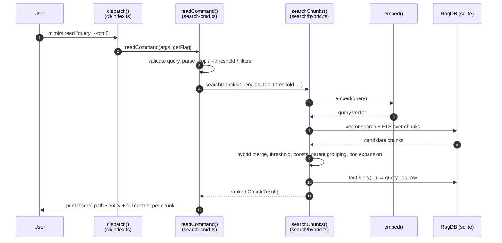

# CLI: read

`mimirs read <query>` answers the question "show me the actual code that is relevant to this topic" from the terminal. Where `mimirs search` returns a ranked list of *files* with short previews, `read` returns the *content* of the most relevant semantic chunks — individual functions, classes, or markdown sections — printed in full to stdout, each tagged with its score, file path, and the name of the symbol it belongs to. It is the command-line twin of the `read_relevant` MCP tool: both call the same chunk-search routine, so the ranking and content you see on the terminal match what an agent receives `src/tools/search.ts:143`.

Use it when you want to read code by meaning instead of by file name — for example to dump the body of the function that handles a feature without first having to find which file it lives in.

The command is wired into the CLI dispatcher under the `read` case, which forwards the raw arguments and a flag-lookup helper to the handler `readCommand` `src/cli/index.ts:125-126`. That handler lives next to the `search` handler in the same module `src/cli/commands/search-cmd.ts:61-88`.

## What it does, step by step



1. The user runs `mimirs read <query>` with optional flags. The dispatcher matches the `read` command and calls `readCommand` `src/cli/index.ts:125-126`.
2. `readCommand` reads the query from `args[1]`. If it is missing, the command prints a usage line to stderr and exits with code 1 `src/cli/commands/search-cmd.ts:62-66`.
3. The handler resolves the target directory (`--dir`, default `.`), opens the index database, loads the project config, and parses the numeric flags and path filters `src/cli/commands/search-cmd.ts:68-73`.
4. It calls `searchChunks` with the parsed query, the database handle, `top`, `threshold`, the configured hybrid weight, the configured generated-file globs, the path filter, and the parent-grouping count `src/cli/commands/search-cmd.ts:75`.
5. `searchChunks` embeds the query text into a vector via `embed` `src/search/hybrid.ts:475`.
6. It runs a vector (nearest-neighbour) search and a BM25 full-text search over the chunk index, each over-fetching `topK * 4` candidates `src/search/hybrid.ts:477-484`.
7. It merges the two result sets with hybrid scoring, drops anything below the threshold, applies path and filename boosts, demotes generated/boilerplate files, adds a dependency-graph boost, sorts, then consolidates sibling chunks into their parent and expands for docs `src/search/hybrid.ts:487-536`.
8. Before returning, it writes one row into the `query_log` table for analytics `src/search/hybrid.ts:538-546`.
9. Back in the handler, the ranked chunks are printed: a header line `[score] path • entity` followed by the full chunk content and a `---` separator `src/cli/commands/search-cmd.ts:80-85`. If nothing cleared the threshold, it prints a hint that the directory may not be indexed `src/cli/commands/search-cmd.ts:77-78`. Either way the database is closed `src/cli/commands/search-cmd.ts:87`.

## Inputs

| Name | Type | Required | Description |
| --- | --- | --- | --- |
| `<query>` | positional string | yes | The natural-language or symbol query. Read from `args[1]`; if absent the command prints usage and exits 1 `src/cli/commands/search-cmd.ts:62-66`. |
| `--top N` | integer | no | Number of chunks to return. Parsed with a strict integer parser, minimum 1; **defaults to 8** (not the config `searchTopK`) `src/cli/commands/search-cmd.ts:71`. |
| `--threshold T` | float 0–1 | no | Minimum hybrid score a chunk must reach to be kept. Defaults to `0.3` `src/cli/commands/search-cmd.ts:72`. |
| `--dir D` | path | no | Project directory whose index to query. Resolved to an absolute path; defaults to the current directory `src/cli/commands/search-cmd.ts:68`. |
| `--ext` / `--extensions` | comma list | no | Restrict to these file extensions, e.g. `.ts,.tsx` `src/cli/commands/search-cmd.ts:22`. |
| `--in` / `--dirs` | comma list | no | Restrict to these directories (resolved relative to the project root) `src/cli/commands/search-cmd.ts:23,28`. |
| `--exclude` / `--exclude-dirs` | comma list | no | Exclude these directories `src/cli/commands/search-cmd.ts:24,29`. |

`--ext`, `--in`, and `--exclude` are collected by `buildCliFilter`. Each accepts a comma-separated value, split and trimmed by `parseListFlag`; empty segments are dropped. When none of the three flags is present, `buildCliFilter` returns `undefined` and the search runs unscoped `src/cli/commands/search-cmd.ts:18-31`.

The hybrid weight (vector vs. keyword balance), the list of generated-file globs, and the parent-grouping count are not flags — they come from the loaded project config (`config.hybridWeight`, `config.generated`, `config.parentGroupingMinCount`) and default to `0.7`, empty, and `2` respectively `src/config/index.ts:113,116,120`.

## Outputs

| Output | Where it lands / shape / description |
| --- | --- |
| Ranked chunk content | stdout. For each result: a header line `[<score, 2dp>] <path>` with `  •  <entityName>` appended when the chunk has a symbol name, then the full chunk content, then a line containing `---` `src/cli/commands/search-cmd.ts:80-85`. |
| Empty-state message | stdout. When zero chunks clear the threshold: `No relevant chunks found. Has the directory been indexed?` `src/cli/commands/search-cmd.ts:77-78`. |
| `query_log` row | One row inserted into the SQLite `query_log` table, side-effect of every chunk search `src/search/hybrid.ts:540-546`. |

Each chunk in the ranked list comes from the `ChunkResult` shape — `path`, `score`, `content`, `chunkIndex`, `entityName`, `chunkType`, `startLine`, `endLine`, `parentId` `src/search/hybrid.ts:46-56`. The terminal output only prints the score, path, entity name, and content; the line-range fields are carried internally and surfaced by the `read_relevant` tool rather than this command.

## How the chunk search ranks results

`searchChunks` is the heart of the command, and it is the same routine the `read_relevant` MCP tool runs `src/tools/search.ts:143`. Understanding it explains every number you see on screen.

- **Two retrievers, one score.** The query is embedded once, then run through a vector nearest-neighbour search (`db.searchChunks`) and a BM25 keyword search (`db.textSearchChunks`), each fetching four times `topK` to give the re-ranker room `src/search/hybrid.ts:475-484`. The keyword search is wrapped in a try/catch: if the full-text query fails (for example on special characters), it logs a debug line and continues vector-only rather than erroring out `src/search/hybrid.ts:480-484`.
- **Hybrid merge.** `mergeHybridScores` keys results by `path:chunkIndex`, then computes `hybridWeight * vectorScore + (1 - hybridWeight) * textScore`. With the default weight of `0.7`, that is 70% vector similarity and 30% keyword match `src/search/hybrid.ts:66-92`.
- **Threshold filter.** Merged chunks scoring below the `--threshold` value are dropped immediately, before any boosting `src/search/hybrid.ts:488`.
- **Path and name adjustments.** Surviving chunks are multiplied by heuristics: test files are demoted to `0.85`, source files (`src`, `lib`, `app`, …) boosted to `1.1`, boilerplate basenames demoted to `0.8`, generated files demoted by a `GENERATED_DEMOTION` factor, and chunks whose file name or path segments share words with the query are boosted further `src/search/hybrid.ts:491-518`.
- **Dependency-graph boost.** A chunk in a file that many others import gets a small logarithmic bonus (`0.05 * log2(importerCount + 1)`), so widely-used code surfaces higher `src/search/hybrid.ts:520-528`.
- **Parent grouping.** When `parentGroupingMinCount` or more sibling chunks share the same parent, they are replaced by the single parent chunk (keeping the best score) so a class does not flood the list with its individual methods `src/search/hybrid.ts:398-458,533`. This is why a result may have `chunkIndex` `-1` and represent a whole parent rather than one method `src/search/hybrid.ts:439`.
- **Doc expansion.** If markdown results are displacing code within the top `topK`, the list is extended slightly so docs are treated as bonus results instead of crowding out code `src/search/hybrid.ts:281-292`.

## State changes

### `query_log` row written per search

| Before | After |
| --- | --- |
| No row for this invocation | One new `query_log` row recording the query text, result count, top score, top path, and duration |

Every call to `searchChunks` ends by calling `db.logQuery(...)` with the query string, the number of results, the top result's score and path (or `null` when empty), and the elapsed milliseconds measured from a `performance.now()` timer started at the top of the function `src/search/hybrid.ts:539-546`. `db.logQuery` delegates to the analytics layer, which runs a single `INSERT INTO query_log (...)` with the current ISO timestamp `src/db/index.ts:889-893`, `src/db/analytics.ts:3-8`. The table is created at database open time `src/db/index.ts:340-348`.

This matters because it is the data source for `mimirs analytics`: zero-result and low-score rows are exactly how the project finds documentation and indexing gaps. The write happens unconditionally — even an empty result set logs a row with `result_count = 0` and a `null` score, which is what makes "queries that found nothing" reportable later. See [analytics](analytics.md).

## Branches and failure cases

| Branch | Behavior |
| --- | --- |
| Missing query | Prints `Usage: mimirs read <query> ...` to stderr and exits with code 1 `src/cli/commands/search-cmd.ts:62-66`. |
| Bad numeric flag | `--top` / `--threshold` parsing throws `CliFlagError` (e.g. `--top abc`, or `--threshold 2` exceeding the 0–1 range). The dispatcher catches it, prints the message, and exits 1 — it does not crash `src/cli/flags.ts:40-71`, `src/cli/index.ts:96-106`. |
| No filters supplied | `buildCliFilter` returns `undefined` and the search runs across the whole index `src/cli/commands/search-cmd.ts:25`. |
| Empty filter values | `parseListFlag` trims and drops empty segments, so `--ext " "` contributes nothing and is treated as absent `src/cli/commands/search-cmd.ts:8-16`. |
| Zero results / unindexed dir | Prints `No relevant chunks found. Has the directory been indexed?`; still logs a `query_log` row and closes the DB `src/cli/commands/search-cmd.ts:77-78,87`. |
| Full-text search failure | Falls back to vector-only results after a debug log; the command still returns whatever the vector search found `src/search/hybrid.ts:480-484`. |
| Chunk with no entity name | The `  •  <entity>` suffix is omitted; only `[score] path` is printed `src/cli/commands/search-cmd.ts:81-82`. |

## Example

```bash
# Dump the most relevant chunks about query logging, top 5, into the current index
mimirs read "where is the search query logged for analytics" --top 5

# Scope to TypeScript source only, raise the relevance bar
mimirs read "hybrid score merge" --ext .ts --in src --threshold 0.5
```

Illustrative output shape (values synthetic):

```
[0.81] src/example.ts  •  searchChunks
export async function searchChunks(query, db, topK = 8, ...) {
  ...
}

---

[0.74] src/example.ts  •  logQuery
export function logQuery(db, query, resultCount, ...) {
  ...
}

---
```

## How it differs from `search`

| | `mimirs read` | `mimirs search` |
| --- | --- | --- |
| Engine | `searchChunks` (chunk-level) `src/cli/commands/search-cmd.ts:75` | `search` (file-level) `src/cli/commands/search-cmd.ts:46` |
| Output | Full chunk content + entity name | File path + 120-char snippet preview `src/cli/commands/search-cmd.ts:51-55` |
| File dedup | None — multiple chunks per file allowed `src/search/hybrid.ts:461-462` | Deduplicated to best chunk per file `src/search/hybrid.ts:333-353` |
| Default `--top` | 8 `src/cli/commands/search-cmd.ts:71` | `config.searchTopK` (10) `src/cli/commands/search-cmd.ts:43` |
| Default threshold | 0.3 `src/cli/commands/search-cmd.ts:72` | 0 (no floor) `src/cli/commands/search-cmd.ts:46` |

Both handlers live in the same file and share the filter-building and flag-parsing helpers. The practical rule: reach for [search](search.md) to find *where* something is, and `read` to get the code itself. See also the [read_relevant](../tools/read-relevant.md) tool, which exposes the same chunk search to MCP clients.

## Key source files

- `src/cli/index.ts` — CLI dispatcher; routes the `read` command to `readCommand` and catches flag errors `src/cli/index.ts:125-126`.
- `src/cli/commands/search-cmd.ts` — `readCommand` handler plus shared filter/flag helpers (`buildCliFilter`, `parseListFlag`).
- `src/search/hybrid.ts` — `searchChunks` retrieval and ranking routine, and the per-search `query_log` write.
- `src/cli/flags.ts` — strict numeric flag parsing (`intFlag`, `floatFlag`, `CliFlagError`).
- `src/db/analytics.ts` — `logQuery` insert into `query_log`.
- `src/db/index.ts` — `RagDB` wrappers (`searchChunks`, `logQuery`) and the `query_log` schema.
