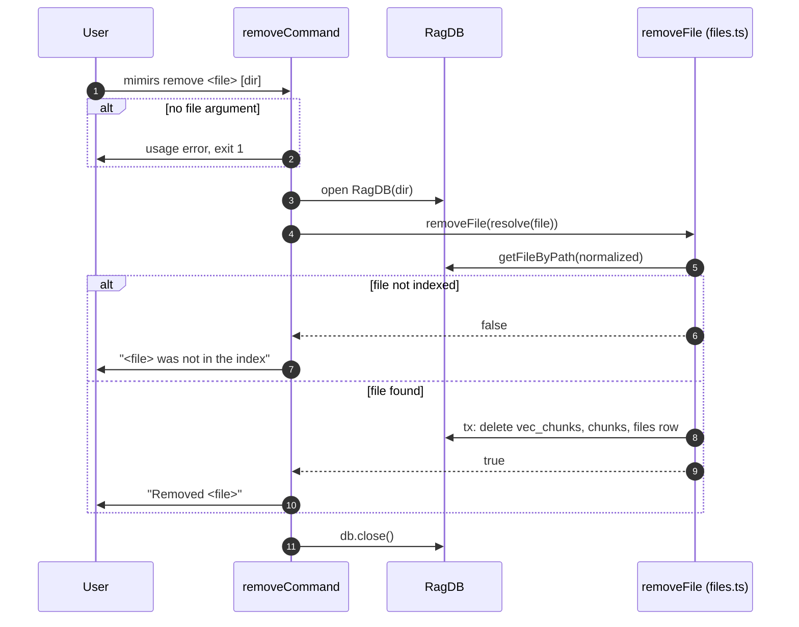

# CLI: remove

`mimirs remove <file>` deletes a single file from the index. It is the targeted alternative to re-indexing the whole project: when one file has been deleted from disk, renamed, or should no longer be searchable, this command drops just that file's rows so its content stops appearing in search results.

## When to use it instead of a full re-index

A full re-index walks every file, re-chunks changed ones, and prunes deleted ones — correct but slow on a large repo. `remove` touches one file's rows and returns immediately, so it is the right tool when you know exactly which single file to drop and do not want to pay for a whole pass. The trade-off is that it deletes less thoroughly than a re-index (see State changes): the import-graph rows for the file are not cleaned up, so for keeping the dependency graph accurate, a re-index is still the safer choice.

## How it works



1. The first argument is the file to remove. If it is missing, the command prints a usage message and exits with code `1` (`src/cli/commands/remove.ts:6-10`).
2. The optional second argument is the project directory; if absent or a flag, it defaults to `.` and is resolved to an absolute path (`src/cli/commands/remove.ts:11`).
3. The database for that directory is opened (`src/cli/commands/remove.ts:12`).
4. `db.removeFile` is called with the absolute file path (`src/cli/commands/remove.ts:13`).
5. `removeFile` looks up the file by its normalized path. If no such file is indexed, it returns `false` without changing anything (`src/db/files.ts:255-256`).
6. If the file exists, a single transaction deletes its vector embeddings, then its chunks, then the file row itself (`src/db/files.ts:258-269`).
7. The command prints `Removed <file>` on success or `<file> was not in the index` when nothing was removed, then closes the database (`src/cli/commands/remove.ts:14-15`).

## Inputs

| name | type | required | description |
| --- | --- | --- | --- |
| file | positional string | yes | Path to the file to remove. Resolved to an absolute path, then normalized for lookup. Missing this argument is a usage error (`src/cli/commands/remove.ts:6-13`). |
| directory | positional string | no | Project directory whose index to edit. Used when present and not starting with `--`; otherwise the current directory `.`. Resolved to absolute (`src/cli/commands/remove.ts:11`). |

## Outputs

| output | where it lands / shape / description |
| --- | --- |
| Success message | `Removed <file>` printed to stdout when the file's rows were deleted (`src/cli/commands/remove.ts:14`). |
| Not-found message | `<file> was not in the index` printed when no matching file row existed (`src/cli/commands/remove.ts:14`). |
| Usage error | `Usage: mimirs remove <file> [dir]` to stderr, exit code `1`, when no file argument is given (`src/cli/commands/remove.ts:8-9`). |
| Deleted index rows | The file's vector, chunk, and file rows removed from the database. See State changes. |

## State changes

### File, chunk, and vector rows deleted

- **Before:** the index holds a `files` row for the path, its `chunks` rows, and the matching `vec_chunks` embedding rows.
- **After:** all three are gone, so the file no longer contributes to search.
- The deletion runs in one transaction: it first collects the chunk ids for the file, deletes each chunk's row in the `vec_chunks` vector table, then deletes the `chunks` rows, then the `files` row (`src/db/files.ts:258-269`). Wrapping these in a transaction means a failure mid-way rolls back rather than leaving half the file deleted.

### Graph rows are left orphaned

The vector table is cleaned up explicitly because there is no automatic cascade. Under `bun:sqlite` the `PRAGMA foreign_keys` setting defaults to OFF, so the schema's `ON DELETE CASCADE` / `ON DELETE SET NULL` clauses never fire (`src/db/graph.ts:728-733`). `removeFile` only deletes `vec_chunks`, `chunks`, and `files` — it does not touch the import-graph tables (`file_imports`, `file_exports`) or `symbol_refs` that reference the deleted file by id (`src/db/files.ts:262-266`). Those rows remain, now pointing at a file id that no longer exists. A subsequent re-index of the affected files rebuilds and re-resolves the graph, but until then the dependency graph can carry stale entries for the removed file. This is the practical reason to prefer a re-index when graph accuracy matters.

## Branches and failure cases

- **No file argument:** prints the usage string to stderr and exits `1` before opening the database (`src/cli/commands/remove.ts:7-10`).
- **No directory argument or a leading flag in that slot:** defaults to `.` (`src/cli/commands/remove.ts:11`).
- **File not indexed:** `removeFile` returns `false` after the lookup miss; the command reports it was not in the index and changes nothing (`src/db/files.ts:255-256`, `src/cli/commands/remove.ts:14`).
- **Path normalization:** the lookup normalizes the path, so separators differing from how the file was indexed (for example on Windows) still match (`src/db/files.ts:255`).
- **File found:** the transaction deletes its rows and `removeFile` returns `true`, yielding the success message (`src/db/files.ts:258-270`).

## Example

```bash
# Remove a file from the current project's index
mimirs remove src/legacy/old-helper.ts

# Remove from a specific project directory
mimirs remove src/legacy/old-helper.ts /path/to/project
```

Expected output:

```
Removed src/legacy/old-helper.ts
```

Or, if it was never indexed:

```
src/legacy/old-helper.ts was not in the index
```

## Related

- [tools/remove-file](../tools/remove-file.md) — the MCP tool that removes a file from the index via the same `removeFile` path.

## Key source files

- `src/cli/commands/remove.ts` — the command: argument parsing, the call to `removeFile`, and the result message.
- `src/db/files.ts` — `removeFile`, which performs the transactional deletion of vector, chunk, and file rows.
- `src/db/graph.ts` — documents why foreign keys are not enforced, explaining why graph rows are not cascaded.
- `src/db/index.ts` — `RagDB`, the database wrapper exposing `removeFile`.
