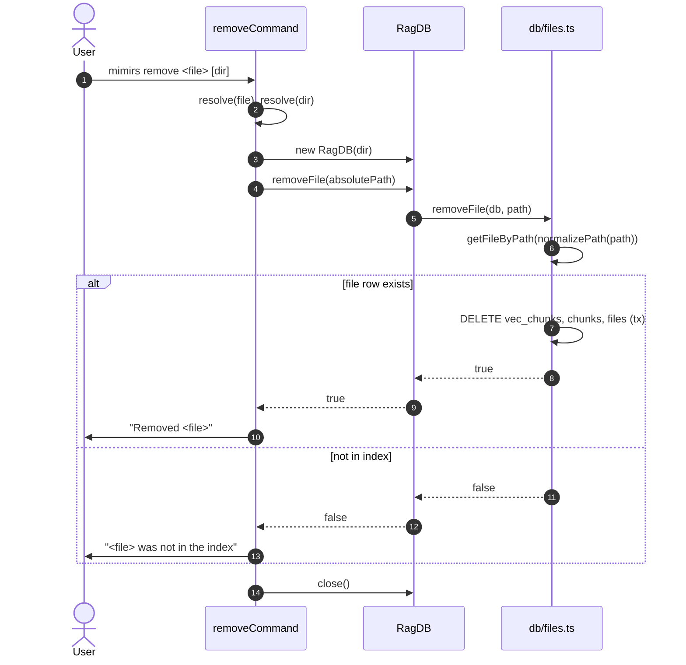

# CLI: remove

`mimirs remove <file> [dir]` deletes a single file from the index without
forcing a full re-index of the project. Reach for this when a file was
renamed, deleted on disk, or accidentally indexed (a generated artifact, a
secret) and you want it gone immediately. A regular `mimirs index` would
eventually prune it during a project scan, but `remove` is the fast,
targeted path.

The command is a thin wrapper: it opens the DB, calls `RagDB.removeFile`,
prints a one-line confirmation, and closes the DB.

## Flow



1. The user invokes the command. The first positional argument is the
   target file. An optional second positional argument selects the
   project directory; otherwise the current working directory is used.
2. Both paths are resolved to absolute paths via `path.resolve`, so the
   file argument can be relative to the shell's CWD
   (`src/cli/commands/remove.ts:13`).
3. `RagDB` is opened for the project. This loads the SQLite database
   that lives under the project directory.
4. The CLI calls `db.removeFile(resolve(file))` — the input path is
   resolved before being handed to the DB layer.
5. Inside the DB layer, `files.removeFile` looks up the file row by its
   normalized path. If no row matches, the function returns `false`
   without touching anything (`src/db/files.ts:254-271`).
6. When a row is found, a transaction deletes the rows from
   `vec_chunks` (for every chunk id), then `chunks`, then `files`.
   Removing in this order keeps foreign keys consistent.
7. The CLI prints either `Removed <file>` or `<file> was not in the
   index` depending on the boolean result, then closes the DB.

## Inputs

| Input | Source | Notes |
| --- | --- | --- |
| `file` | first positional arg | Required. Path to remove. Resolved against the shell CWD, not against `dir`. If missing, the command prints usage and exits with code 1 (`src/cli/commands/remove.ts:6-10`). |
| `directory` | second positional arg | Optional. Defaults to `.` (the shell CWD). Selects which project's DB to open. |

## Outputs

| Output | What happens |
| --- | --- |
| Confirmation message | One line on stdout: `Removed <file>` on success, or `<file> was not in the index` when nothing matched. |
| Deleted rows | The file's row in `files`, all its chunk rows in `chunks`, and the matching vector rows in `vec_chunks` are deleted in a single transaction. |

## State changes

### `files`, `chunks`, and `vec_chunks` rows for the target path

- Before: the file has one row in `files` and N rows in `chunks` (plus
  matching vector rows in `vec_chunks`).
- After: all three sets of rows for that file are gone.
- Trigger: `mimirs remove <file>`.
- Why it matters: the file disappears from `search`, `read_relevant`,
  `search_symbols`, and graph queries immediately. Any chunk-level
  references such as `find_usages` will no longer return hits for code
  that lived in this file.
- Code: the deletion runs as a single `db.transaction(() => { ... })`
  in `src/db/files.ts:259-267`.

## Branches and failure cases

- **Missing file argument**: the command prints
  `Usage: mimirs remove <file> [dir]` to stderr and exits with code 1
  (`src/cli/commands/remove.ts:7-10`).
- **Path not in the index**: `db.removeFile` returns `false` and the
  CLI prints `<file> was not in the index`. The command still exits
  with code 0 — being absent is not an error.
- **Path normalization**: `removeFile` normalizes the stored path
  before matching. On Windows this means backslashes are converted
  before lookup, so passing a forward-slash path still works
  (`src/db/files.ts:255`).
- The CLI does **not** delete the file from disk. Only the index rows
  are removed.

## When to prefer over a full re-index

- `mimirs index` walks every tracked file, recomputes content hashes,
  and prunes anything that no longer exists. That is the right tool
  when many files changed or you suspect drift.
- `mimirs remove` is the right tool when you know exactly one path is
  wrong and you don't want to wait for a full re-scan. It is also the
  right tool for files that still exist on disk but should not be
  indexed (for example a generated file you forgot to exclude). A
  re-index of the project would normally re-add them.

## Example

```
mimirs remove src/example.ts
# → Removed src/example.ts

mimirs remove src/example.ts
# → src/example.ts was not in the index
```

## Key source files

- `src/cli/commands/remove.ts` — the CLI entrypoint (`removeCommand`).
- `src/db/index.ts` — `RagDB.removeFile` forwards to the files module.
- `src/db/files.ts` — the actual `removeFile` implementation that
  deletes from `vec_chunks`, `chunks`, and `files` in one transaction.

## Related flows

- [tools/remove-file](../tools/remove-file.md) — the MCP tool version
  of the same operation, exposed to agents.
