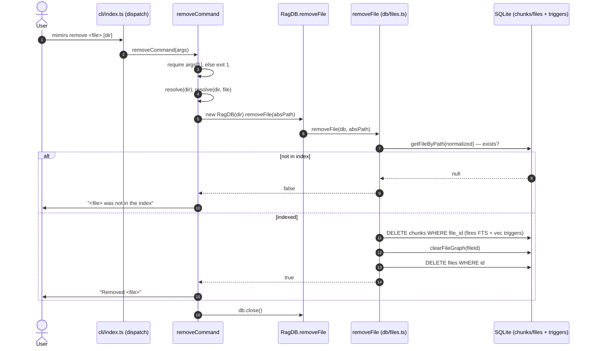

# CLI: remove

`mimirs remove <file> [dir]` takes a single file out of the index. Use it when one file should stop appearing in search, read, and graph results but you do not want to re-index the whole project — for example after deleting a file, renaming it, or moving it out of the indexed tree. The command deletes the file's bookkeeping row and everything derived from it: its chunks, the vector embeddings for those chunks, the full-text search entries, and the dependency-graph rows that mention the file.

The work is small but it touches several tables that are kept in sync through a mix of SQLite triggers and explicit deletes, so the interesting part is *which* cleanup happens automatically and which the code has to do by hand.

## How a run flows



1. The CLI entrypoint reads the raw process arguments once at module load — `args` is `process.argv.slice(2)` and the first element becomes `command` (`src/cli/index.ts:26-27`). When `command` is `remove`, the dispatcher awaits `removeCommand(args)` (`src/cli/index.ts:135-136`).
2. The handler treats `args[1]` as the file to remove. If it is missing, the handler prints a usage line and exits with status `1` (`src/cli/commands/remove.ts:7-11`). This is the only argument it validates.
3. The handler resolves the project directory and the target file to absolute paths. `args[2]` is treated as the optional directory only when it exists and does not start with `-`; otherwise the directory defaults to `.` (the current working directory). The directory is run through Node's `resolve()`, and the file is resolved *relative to that directory* with `resolve(dir, file)` (`src/cli/commands/remove.ts:12`, `src/cli/commands/remove.ts:16`).
4. The handler opens the index for that directory by constructing a `RagDB` and calls its `removeFile` method with the resolved absolute file path (`src/cli/commands/remove.ts:13`, `src/cli/commands/remove.ts:16`). `RagDB.removeFile` is a thin pass-through to the file-operations module (`src/db/index.ts:913-915`).
5. The store-level `removeFile` first looks the file up by path. It normalizes the path to forward slashes and queries the `files` table; if no row matches, it returns `false` immediately and nothing is deleted (`src/db/files.ts:302-303`).
6. When the row exists, all deletes run inside one transaction. Deleting the file's `chunks` rows fires two SQLite triggers that remove the matching full-text and vector entries; `clearFileGraph` removes the dependency-graph rows; and finally the `files` row itself is deleted (`src/db/files.ts:305-313`).
7. The handler turns the boolean result into a one-line message: `Removed <file>` when a row was deleted, or `<file> was not in the index` when nothing matched (`src/cli/commands/remove.ts:17`). The original (unresolved) argument string is echoed back, not the absolute path.
8. The handler closes the database handle before returning (`src/cli/commands/remove.ts:18`). There is no explicit success exit code, so a normal run exits `0`.

The `remove` dispatch case forwards the full argument array to the handler (`src/cli/index.ts:135-136`).

## Looking the file up by path

The index stores every file under a canonical, forward-slash path. Before deciding whether there is anything to delete, `removeFile` calls `getFileByPath`, which runs `path` through `normalizePath` (turning `\` into `/`) and selects the matching row from `files` (`src/db/files.ts:9-15`, `src/utils/path.ts:12`). This normalization is why the command works the same on Windows even though `resolve()` there produces `\`-separated paths.

The lookup returns a `StoredFile` (its `id`, `path`, `hash`, and `indexedAt`) or `null` (`src/db/types.ts:13`). Only the `id` is used afterward — every cascade delete keys off `file_id`, not the path (`src/db/files.ts:308-310`).

A consequence worth knowing: the path you pass must resolve to the *exact* absolute path that was indexed. Because the file is resolved with `resolve(dir, file)`, a relative `<file>` is interpreted relative to `[dir]`, not the shell's working directory. The inline comment spells out why: the index stores absolute paths rooted at `dir`, so resolving against cwd would miss whenever `dir` differs from where you run the command (`src/cli/commands/remove.ts:14-16`). An *absolute* `<file>` is used as-is, since `resolve` ignores the base when the second argument is already absolute. If the resolved path still does not match a stored row, the lookup misses and you get the "not in the index" message even though the file is indexed under some other absolute path.

## What gets deleted, and how

Foreign keys are declared in the schema (for example `file_imports.file_id ... REFERENCES files(id) ON DELETE CASCADE`), but the database only ever sets `PRAGMA journal_mode=WAL` and `PRAGMA busy_timeout` and never turns foreign keys on, so in `bun:sqlite` (where the pragma defaults off) those `ON DELETE CASCADE` and `ON DELETE SET NULL` clauses never fire (`src/db/index.ts:148-149`, `src/db/index.ts:351-357`). Deleting the `files` row alone would therefore leave orphaned chunks, vectors, FTS entries, and graph rows behind. `removeFile` compensates by deleting from `chunks` and the graph tables explicitly, in a deliberate order, all wrapped in a single `db.transaction(...)` so a failure mid-way rolls the whole thing back (`src/db/files.ts:305-313`).

Three layers of derived data are removed:

| Layer | Table(s) | How it is cleared |
| --- | --- | --- |
| Semantic chunks | `chunks` | Explicit `DELETE FROM chunks WHERE file_id = ?` (`src/db/files.ts:308`) |
| Full-text search | `fts_chunks` | The `chunks_ad` AFTER-DELETE trigger pushes a `'delete'` into the FTS5 contentless index for each removed chunk (`src/db/index.ts:334-336`) |
| Vector embeddings | `vec_chunks` | The `chunks_vec_ad` AFTER-DELETE trigger deletes the row whose `chunk_id` matches each removed chunk (`src/db/index.ts:347-349`) |
| Dependency graph | `symbol_refs`, `file_exports`, `file_imports` | `clearFileGraph(db, fileId)` (`src/db/files.ts:309`, `src/db/graph.ts:963-981`) |

The two FTS/vector triggers matter because `fts_chunks` is a contentless FTS5 table and `vec_chunks` is a `vec0` virtual table — neither can be an FK child, so a cascade could never reach them even if foreign keys were on. The triggers fire on *any* delete from `chunks`, which is exactly why `removeFile` only has to delete the chunk rows and the search and embedding rows follow automatically (`src/db/index.ts:334-349`).

`clearFileGraph` does more than delete the file's own graph rows. The dependency graph also stores cross-file pointers in *other* files — `symbol_refs.resolved_export_id` pointing at this file's exports, and `file_imports.resolved_file_id` pointing at this file. Because foreign keys are off, the schema's `ON DELETE SET NULL` on those pointers never fires either. So `clearFileGraph` first nulls those inbound pointers in other files (`src/db/graph.ts:964-976`), and only then deletes this file's `symbol_refs`, `file_exports`, and `file_imports` rows (`src/db/graph.ts:977-980`). Skipping this would corrupt [depends_on](../tools/depends-on.md), [dependents](../tools/dependents.md), and [usages](../tools/usages.md) results for files that referenced the removed file (`src/db/graph.ts:954-957`).

## State changes

| Name | Before | After | Why it matters |
| --- | --- | --- | --- |
| File row | One row in `files` with this path | Row deleted | The file no longer counts toward the index and can be cleanly re-added later (`src/db/files.ts:310`) |
| Chunks | N rows in `chunks` for the file | All deleted | The file's content stops being searchable and disappears from read results (`src/db/files.ts:308`) |
| FTS entries | Matching rows in `fts_chunks` | Removed via `chunks_ad` trigger | Keyword search stops returning the file (`src/db/index.ts:334-336`) |
| Vector entries | Matching rows in `vec_chunks` | Removed via `chunks_vec_ad` trigger | Semantic search stops returning the file (`src/db/index.ts:347-349`) |
| Graph rows | The file's `symbol_refs` / `file_exports` / `file_imports`, plus inbound pointers in other files | Own rows deleted; inbound pointers nulled | Keeps dependency and usage queries from pointing at a file that no longer exists (`src/db/graph.ts:963-981`) |

All of these happen inside one transaction, so the file is either fully removed across every table or not touched at all (`src/db/files.ts:305-313`).

## Branches and failure cases

- **Missing file argument.** If `args[1]` is absent, the handler prints `Usage: mimirs remove <file> [dir]` and exits with code `1` before opening any database (`src/cli/commands/remove.ts:8-11`).
- **File not in the index.** `getFileByPath` returns `null`, `removeFile` returns `false` without running the transaction, and the handler prints `<file> was not in the index` (`src/db/files.ts:302-303`, `src/cli/commands/remove.ts:17`). This is not an error: the process still exits `0`.
- **File present.** The transaction runs and `removeFile` returns `true`, producing `Removed <file>` (`src/db/files.ts:314`, `src/cli/commands/remove.ts:17`).
- **Optional directory parsing.** A second positional argument is used as the project directory only when it is present and not a flag (anything starting with `-` is treated as a flag, never a path); otherwise the directory falls back to `.` (`src/cli/commands/remove.ts:12`, `src/cli/flags.ts:63-66`). The command does not parse any flags of its own.
- **No flag errors.** Unlike commands that read numeric flags, `remove` does not call the flag parser, so it never throws the `CliFlagError` handled in `main` (`src/cli/index.ts:105-108`).
- **Transaction safety.** All deletes are wrapped in `db.transaction(...)`; if any statement throws, SQLite rolls back and no partial deletion is committed (`src/db/files.ts:305-313`).

## Inputs

| name | type | required | description |
| --- | --- | --- | --- |
| `<file>` | string (path) | yes | The file to remove. Resolved to an absolute path via `resolve(dir, file)` — relative to `[dir]`, not the shell's working directory — then normalized to forward slashes for the lookup. Must match the path the file was indexed under (`src/cli/commands/remove.ts:7`, `src/cli/commands/remove.ts:16`). |
| `[dir]` | string (path) | no | The project directory whose index to open, and the base used to resolve `<file>`. Used only when present and not starting with `-`; otherwise defaults to `.` (`src/cli/commands/remove.ts:12`). |

## Outputs

| output | where it lands / shape / description |
| --- | --- |
| Result message | A single line printed to stdout: `Removed <file>` on success, `<file> was not in the index` when no row matched (`src/cli/commands/remove.ts:17`). |
| Deleted file + cascaded rows | The `files` row plus its `chunks`, `vec_chunks`, `fts_chunks`, and graph rows (`symbol_refs` / `file_exports` / `file_imports`) are removed from the on-disk index at `.mimirs/index.db` (`src/db/files.ts:305-313`, `src/db/index.ts:147`). |
| Exit code | `1` when the file argument is missing; otherwise `0` (`src/cli/commands/remove.ts:10`). |

## Example

```sh
# Remove a file from the index for the current directory
mimirs remove src/legacy/old-helper.ts

# Remove a file from another project's index
# <file> is resolved relative to the [dir] argument
mimirs remove src/legacy/old-helper.ts /abs/path/to/project
```

Sample output:

```
Removed src/legacy/old-helper.ts
```

If the path does not match an indexed file:

```
src/legacy/old-helper.ts was not in the index
```

## Relationship to the MCP tool

The [remove_file](../tools/remove-file.md) MCP tool exposes the same operation to agents. It also calls `RagDB.removeFile`, so the deletion behavior described above is identical; the difference is in argument handling and wording at the boundary. Both paths converge on the single store method.

## Key source files

- `src/cli/index.ts` — argument parsing and the `remove` dispatch case (`src/cli/index.ts:26-27`, `src/cli/index.ts:135-136`).
- `src/cli/commands/remove.ts` — the command handler: validate, resolve, call `removeFile`, print, close.
- `src/db/index.ts` — `RagDB.removeFile` wrapper, the schema, and the FTS/vector triggers that keep derived tables in sync.
- `src/db/files.ts` — the store-level `removeFile`: lookup, transactional deletes, return value.
- `src/db/graph.ts` — `clearFileGraph`, which removes the file's graph rows and nulls inbound pointers from other files.
- `src/utils/path.ts` — `normalizePath`, applied during the path lookup.
