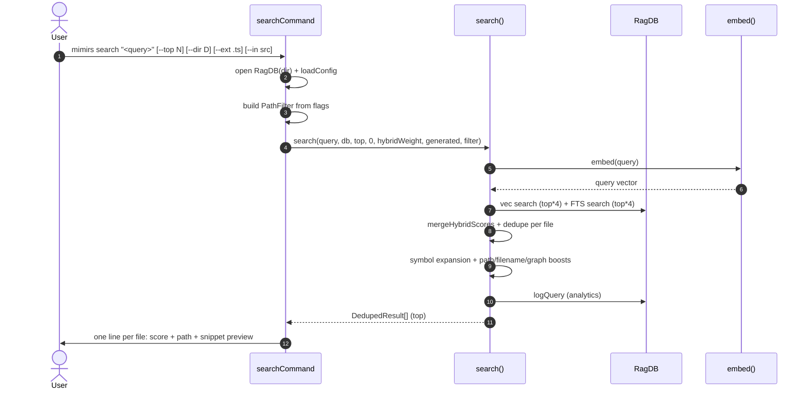

# CLI: search

`mimirs search` runs a hybrid vector + BM25 query against the index and prints one line per ranked file with a short snippet. Use it from a terminal to find which files are about a topic, without opening an editor or an MCP client.

The output is file-level: at most one row per file path. For chunk-level content with line ranges, use [CLI: read](read.md) instead.

## Flow



1. The CLI requires a query as `args[1]`; without it, it prints usage and exits with code 1 (`src/cli/commands/search-cmd.ts:33-37`).
2. The DB is opened for the directory in `--dir` (default `.`). `applyEmbeddingConfig` makes sure the embedding model matches what was used during indexing.
3. `buildCliFilter` collects `--ext`/`--extensions`, `--in`/`--dirs`, and `--exclude`/`--exclude-dirs` flags into a `PathFilter` (or `undefined` when none are set). Directory entries are resolved against the project dir so users can pass relative paths (`src/cli/commands/search-cmd.ts:17-30`).
4. `top` defaults to `config.searchTopK` and can be overridden with `--top` (`src/cli/commands/search-cmd.ts:43`).
5. `search` embeds the query, runs vector and FTS searches against the DB with `top * 4` candidates each, then merges them with the configured `hybridWeight` (default 70% vector / 30% BM25). It deduplicates by file path, keeping the best chunk score (`src/search/hybrid.ts:313-358`).
6. Extra signals are applied before sorting: identifier-based symbol expansion (`db.searchSymbols`), test-path demotion, source-path boost, filename affinity, generated-code demotion, and a logarithmic dependency-graph boost based on importer count (`src/search/hybrid.ts:362-381`, `src/search/hybrid.ts:301-310`).
7. The query and the top result are written to the analytics table via `db.logQuery` (`src/search/hybrid.ts:386-394`). This is what the [analytics](analytics.md) command reads from.
8. The CLI iterates the results, printing `score(4dp)  path` and a 120-character preview of the first snippet (`src/cli/commands/search-cmd.ts:51-56`).

## Inputs

| Input | Source | Notes |
| --- | --- | --- |
| `query` | first positional arg | Required. Anything that parses as a single shell arg works. |
| `--top` | flag | Number of file results to print. Defaults to `config.searchTopK` (`src/cli/commands/search-cmd.ts:43`). |
| `--dir` | flag | Project directory to query. Defaults to `.`. |
| `--ext` / `--extensions` | flag | Comma-separated extensions, e.g. `.ts,.tsx`. Filters at the SQL level. |
| `--in` / `--dirs` | flag | Comma-separated directory roots. Resolved against the project dir. |
| `--exclude` / `--exclude-dirs` | flag | Comma-separated directories to omit. |

The threshold for `search` is hard-coded to `0` here — every merged candidate above zero score is eligible (`src/cli/commands/search-cmd.ts:46`). Use [CLI: read](read.md) when you need a chunk score threshold.

## Outputs

| Output | Where | Notes |
| --- | --- | --- |
| Ranked file rows | stdout | One per file: `0.7321  path/to/file.ts` followed by an indented 120-char preview of the highest-scoring snippet. |
| Empty-result hint | stdout | `"No results found. Has the directory been indexed?"` when no rows survive. |
| Analytics row | `query_log` table | `logQuery(query, count, topScore, topPath, durationMs)` — readable via `mimirs analytics`. |

## Branches and failure cases

- **No query.** Exits 1 with a usage line.
- **No filter flags.** `buildCliFilter` returns `undefined`, the search runs over the whole index.
- **FTS failure.** `db.textSearch` is wrapped in `try/catch`; on failure the search falls back to vector-only and logs at debug (`src/search/hybrid.ts:329-334`). The user sees results but with weaker keyword matching.
- **Empty index / no matches.** The result array is empty and the empty-result hint is printed. An analytics row is still written so you can spot zero-result queries with `mimirs analytics`.

## Example

```bash
mimirs search "how does indexing work"
mimirs search "checkpoint" --top 5 --ext .ts --in src
mimirs search "embed" --exclude tests,benchmarks
```

Sample output:

```
0.8421  src/indexing/indexer.ts
         export async function indexDirectory( directory: string, db: RagDB, config: RagConfig, onProgress?...

0.7012  src/indexing/chunker.ts
         Splits a file into semantic chunks based on the language's AST...
```

## Search vs read

| | `mimirs search` | `mimirs read` |
| --- | --- | --- |
| Granularity | One row per file | One row per chunk |
| Output | path + short snippet preview | full chunk content with entity name and line range available |
| Score floor | `0` | `--threshold`, default `0.3` |
| Default `--top` | `config.searchTopK` | `8` |
| Use when | discovering *where* something is | reading actual code for the task |

Both commands hit the same hybrid scorer; `search` calls `search()` and dedupes by file, `read` calls `searchChunks()` and keeps chunks independent (`src/cli/commands/search-cmd.ts:46`, `src/cli/commands/search-cmd.ts:76`).

## Key source files

- `src/cli/commands/search-cmd.ts` — `searchCommand`, flag parsing, output formatting.
- `src/search/hybrid.ts` — `search()`, `mergeHybridScores`, path/filename/graph boosts, symbol expansion.
- `src/db/index.ts` — `RagDB.search`, `RagDB.textSearch`, `RagDB.logQuery`.

## Related flows

- [CLI: read](read.md) — chunk-level variant of this same scorer.
- [tools/search](../tools/search.md) — same scorer over MCP.
