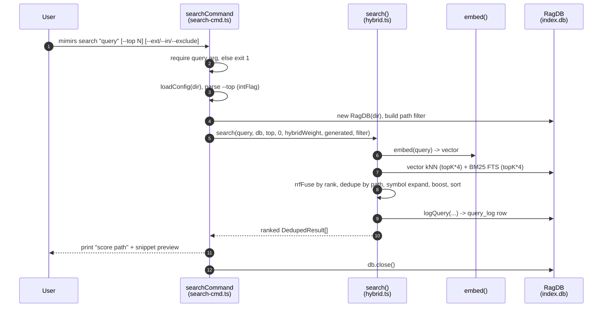

# CLI: search

`mimirs search <query>` is the command-line front door to the index. You give it a natural-language phrase or a symbol name, and it prints a ranked list of files that best match, each with a short snippet preview. Reach for it when you want to know *where* something lives in a codebase without opening files one by one. Its sibling command [`mimirs read`](read.md) is the one to use when you want the actual chunk *content* instead of just file paths.

Under the hood this command runs a **hybrid search**: it retrieves candidates two independent ways — semantic vector similarity (does the meaning match?) and BM25 keyword ranking (do the exact words appear?) — then fuses the two lists by *reciprocal-rank fusion* rather than blending the raw scores, applies a series of relevance adjustments, and collapses everything down to file-level results. Every run also records one row in an analytics log so usage can be reviewed later with [`mimirs analytics`](analytics.md).

## How a search runs

The CLI dispatcher reads the first process argument as the command name and routes `search` to `searchCommand` in a `switch` block `src/cli/index.ts:126-128`. The handler itself lives in `src/cli/commands/search-cmd.ts:33`. From there the real ranking work happens in the shared `search()` function `src/search/hybrid.ts:342`, which is the same engine the [`search` MCP tool](../tools/search.md) uses.



1. The user runs `mimirs search` with a query and optional flags. The query is read from `args[1]` `src/cli/commands/search-cmd.ts:35`.
2. If the query is empty or itself looks like a flag, the handler throws a `CliFlagError` carrying a usage line; the dispatcher prints it to stderr and exits with code 1 `src/cli/commands/search-cmd.ts:35`, `src/cli/flags.ts:73-78`. This is the only hard-stop branch in the command.
3. The handler resolves the project directory (`--dir`, default `.`) and loads the merged config `src/cli/commands/search-cmd.ts:37-38`.
4. `--top` is parsed into an integer (default `config.searchTopK`, which is `8`) *before* the index is opened, so a bad flag reports its own error rather than letting a later DB/embedding error mask it `src/cli/commands/search-cmd.ts:41`.
5. The on-disk index is opened by constructing a `RagDB`, then the three path filters are folded into a single filter object `src/cli/commands/search-cmd.ts:42-43`.
6. `search()` is called with a fixed threshold of `0`, the configured hybrid weight, the configured generated-file patterns, and the optional filter `src/cli/commands/search-cmd.ts:45`.
7. Inside `search()`, the query string is turned into an embedding vector via `embed()` `src/search/hybrid.ts:352`.
8. The index is queried twice: a vector (L2-distance) kNN search and a BM25 full-text search, each over-fetching `topK * 4` candidates so deduplication and boosting have a deep enough pool `src/search/hybrid.ts:355-363`.
9. The two result sets are fused by *rank* into hybrid scores, collapsed to one entry per file path, optionally augmented with exact symbol-name hits, re-ranked by several boosts, sorted, and lightly expanded for docs `src/search/hybrid.ts:365-413`.
10. One row is written to the `query_log` table for analytics `src/search/hybrid.ts:421-428`.
11. The ranked list returns to the handler, which prints each result as a score, a path, and a one-line snippet preview — or a "no results" message if the list is empty `src/cli/commands/search-cmd.ts:47-56`.
12. The database handle is closed `src/cli/commands/search-cmd.ts:57`.

## Inputs

| Name | Type | Required | Description |
|------|------|----------|-------------|
| `<query>` | string | yes | The search phrase. Read as the second CLI argument; an empty or flag-shaped value throws a usage error and exits 1 `src/cli/commands/search-cmd.ts:35`, `src/cli/flags.ts:73-78`. Plain English works; identifier-looking words also trigger an exact symbol-name lookup (see below). |
| `--top N` | integer | no | Maximum number of file results. Defaults to the config value `config.searchTopK` (`8`). Rejected with a clear error if not a positive integer `src/cli/commands/search-cmd.ts:41`, `src/cli/flags.ts:40-53`. |
| `--ext` | comma list | no | Restrict to files whose path ends with one of these extensions, e.g. `--ext .ts,.tsx`. A missing leading dot is tolerated. Alias: `--extensions` `src/cli/commands/search-cmd.ts:22`. |
| `--in` | comma list | no | Restrict to files under one of these directories, e.g. `--in src,packages/core`. Each value is resolved to an absolute path before matching. Alias: `--dirs` `src/cli/commands/search-cmd.ts:23,28`. |
| `--exclude` | comma list | no | Drop files under one of these directories, e.g. `--exclude tests`. Each value is resolved to an absolute path. Alias: `--exclude-dirs` `src/cli/commands/search-cmd.ts:24,29`. |
| `--dir` | path | no | Project directory whose index to search. Defaults to the current directory `src/cli/commands/search-cmd.ts:37`. |

The three list flags are parsed by `parseListFlag`, which splits on commas, trims whitespace, and drops empty segments `src/cli/commands/search-cmd.ts:8-16`. If none of `--ext`/`--in`/`--exclude` is present, `buildCliFilter` returns `undefined` and the search runs unscoped `src/cli/commands/search-cmd.ts:18-31`.

## Outputs

| Output | Where it lands / shape / description |
|--------|--------------------------------------|
| Ranked file lines | Printed to stdout. For each result, one line `<score>  <path>` (score formatted to 4 decimals) followed by an indented preview line of the first snippet, truncated to 120 characters with newlines flattened to spaces and a trailing `...`, then a blank line `src/cli/commands/search-cmd.ts:50-55`. |
| Empty-result message | When nothing matches, the single line `No results found. Has the directory been indexed?` is printed instead of any result lines `src/cli/commands/search-cmd.ts:47-48`. |
| `query_log` row | Persisted to the index database on every run (even zero-result runs). Stores the query text, result count, the top vector cosine score, the top result path, and elapsed milliseconds `src/search/hybrid.ts:421-428`, `src/db/analytics.ts:3-8`. |

A result is a `DedupedResult`: a `path`, a numeric `score`, and an array of `snippets` `src/search/hybrid.ts:41-45`. The CLI only prints the score, the path, and the first snippet — any extra snippets are accumulated but not shown here.

## Hybrid search over the index

The ranking engine retrieves candidates two independent ways. First, `embed()` converts the query into a dense vector and `db.search(...)` (which delegates to `vectorSearch`) finds the nearest chunk vectors by L2 (Euclidean) distance — embeddings are unit-normalized so this is monotonic with cosine — converting distance to a `0..1` score with `1 / (1 + distance)` `src/db/search.ts:143`. Second, `db.textSearch(...)` runs an FTS5 BM25 query over the same chunks, converting the FTS `rank` to a score with `1 / (1 + abs(rank))` `src/db/search.ts:188`. Both queries fetch `topK * 4` candidates so the later dedup and boost steps have a deep enough pool `src/search/hybrid.ts:355,360`.

The two lists are not blended by their raw scores. Vector scores and BM25-derived scores live on different, non-comparable scales, so a raw linear blend would be dominated by whichever side has the larger magnitude — the weight would be nearly inert. Instead the lists are fused by **reciprocal-rank fusion** in `rrfFuse`: each list is treated as an ordered ranking, and a chunk at position `i` contributes `K / (K + i)` from that list, with `K = 60` `src/search/hybrid.ts:83-88`. The final score per chunk is `weight * primaryRank + (1 - weight) * secondaryRank`, where the *primary* list is the vector results and the *secondary* list is the BM25 results `src/search/hybrid.ts:99-102`. A chunk that appears in only one of the two lists still scores, just with a zero contribution from the side that missed it.

The fusion is keyed per chunk by `path:chunkIndex`, wired up in `mergeHybridScores` `src/search/hybrid.ts:109-115`. The weight defaults to `0.5` — equal trust in the semantic and lexical rankings `src/search/hybrid.ts:63`, `src/config/index.ts:141`. A sweep over keyword and semantic query sets put the optimum at equal weight: keyword queries hold full recall while semantic recall collapses once the vector signal is starved much below `~0.3`, so `0.5` is the balance point rather than a lean toward either side `src/search/hybrid.ts:59-62`.

Because the fused scores are positional (close to `1` at the very top and compressed below), the later multiplicative boosts can still reorder results meaningfully instead of being swamped by raw magnitude differences.

Because two chunks can come from the same file, results are then deduplicated by path, keeping the highest-scoring chunk per file and accumulating each distinct snippet `src/search/hybrid.ts:368-388`. This is what makes `search` a *file-level* view, in contrast to [`mimirs read`](read.md), which keeps individual chunks separate and never deduplicates by file.

### Identifier-aware keyword matching

The BM25 half is not a plain word search. FTS5's default tokenizer splits on punctuation and whitespace but not on case boundaries, so an identifier like `getDependsOn` would be one opaque token that a search for `depends` could never match. To fix this, each chunk is indexed in `fts_chunks` over two columns — `snippet` (the raw code) and `parts` — and the `parts` column holds the split word-pieces of every *compound* identifier in the chunk `src/db/index.ts:324-329`. `identifierParts` produces that column by splitting camelCase, PascalCase, snake_case, kebab, and dotted names into lowercase pieces of two or more characters; single plain words are skipped because they already live in the snippet `src/indexing/identifiers.ts:27`. The `parts` column is kept in sync with the `chunks` table by FTS triggers `src/db/index.ts:331-340`. The upshot: a keyword query for `depends` matches a chunk that only ever spells it `getDependsOn`.

After deduplication, several score adjustments run in sequence on the per-file candidates:

- **Symbol expansion.** Identifier-looking words in the query (camelCase, PascalCase, snake_case, dotted names, 3+ chars, not stop words) trigger an exact symbol-name lookup via `db.searchSymbols(id, true, undefined, 5)`. A file already in the pool that also matches by symbol name has its score boosted; a brand-new symbol-only hit is added with a high base score `src/search/hybrid.ts:390-403`, `src/search/hybrid.ts:278`.
- **Source vs. test boost.** Paths under `src`/`lib`/`app`/etc. are multiplied by `1.1`; test paths are multiplied by `0.85` `src/search/hybrid.ts:123-132`.
- **Filename and path affinity.** When query words appear in the filename stem (+`0.1` each) or directory segments (+`0.05` each), the score is nudged up; boilerplate basenames (`types.ts`, `index.d.ts`, …) are demoted to `0.8x` and configured generated files to `0.75x` `src/search/hybrid.ts:204`.
- **Dependency-graph boost.** A file imported by many others gets a modest logarithmic bump (`0.05 * log2(importerCount + 1)`) added to its score, on the theory that widely-used files are more central `src/search/hybrid.ts:329-340`.

The boosted list is sorted by score descending, then run through `expandForDocs`, which lets Markdown results ride along as bonus entries so they do not push code files out of the top slots `src/search/hybrid.ts:413`, `src/search/hybrid.ts:304-315`.

A note for maintainers: the file-level filename-affinity boost has a known scoring bug. `applyFilenameBoost` splits a filename stem on `_`/`-` without a length guard, so a name like `__init__` yields an empty-string piece that matches *every* query word and explodes the multiplier on long queries; it also does not deduplicate query words, inflating the boost by term frequency. The equivalent inline logic in the chunk path (used by [`read`](read.md)) was fixed; this file-level path was left as-is pending re-verification against the recall benchmark `src/search/hybrid.ts:204`.

## Path filters (`--ext` / `--in` / `--exclude`)

Filtering happens in two places. Inside the SQL queries, `buildPathFilter` turns the filter into parametrized `LIKE` / `NOT LIKE` clauses: extensions become `f.path LIKE '%<ext>'`, included dirs become `f.path LIKE '<dir>/%'`, and excluded dirs become `f.path NOT LIKE '<dir>/%'` `src/db/search.ts:37`. Each clause carries an explicit `ESCAPE '\'` and every user-supplied value is escaped first, so a literal `%` or `_` in a directory or extension name (for example a dir called `my_module`) is matched literally instead of acting as a SQL wildcard and silently over-matching `src/db/search.ts:49,59,69`. When any filter is active the inner vector/FTS query over-fetches by a factor of five (`FILTER_OVERFETCH`) so enough rows survive the filter `src/db/search.ts:78,95`. Because the dir clauses are prefix matches against the stored absolute paths, the CLI resolves `--in` / `--exclude` values to absolute paths before passing them down `src/cli/commands/search-cmd.ts:28-29`.

There is also a second, in-memory filter. Symbol-expansion hits bypass the SQL layer (they come from the symbol index, not the chunk search), so each is re-checked with `matchesFilter` before it can join the result set `src/search/hybrid.ts:397`, `src/search/hybrid.ts:12`. This mirrors the SQL rules so a `--ext`/`--in`/`--exclude` constraint applies uniformly no matter which retrieval path produced a hit.

## Ranked file output with snippet preview

The print loop is deliberately compact. For each ranked result it emits the score to four decimal places and the path on one line, then an indented preview line built from the first snippet, then a blank separator line `src/cli/commands/search-cmd.ts:50-55`. The preview is the snippet sliced to its first 120 characters, with every newline replaced by a space so it stays on a single visual line, and a literal `...` appended to signal truncation. Only the first snippet is shown even when a file matched through several chunks.

Because scores are reciprocal-rank-fusion values that have then been multiplied and added to by the boosts, the printed number is a relative ranking signal, not a similarity percentage — a top result typically lands somewhere under `1.0` and the gaps between results matter more than the absolute values.

Example invocation and output (paths and scores are illustrative):

```
$ mimirs search "hybrid search scoring" --top 3 --ext .ts --in src
0.8421  src/search/hybrid.ts
         export function mergeHybridScores<T extends { score: number; path: string; chunkIndex: number }>( vectorRes...

0.7510  src/db/search.ts
         export function vectorSearch( db: Database, queryEmbedding: Float32Array, topK: number = 5, filter?: PathFil...

0.6033  src/cli/commands/search-cmd.ts
         export async function searchCommand(args: string[], getFlag: (flag: string) => string | undefined) { const ...
```

## State changes

### `query_log` row written per search

Before returning, `search()` records the run for analytics. It measures wall-clock duration with `performance.now()`, then calls `db.logQuery(...)` with the query text, the result count, the top result's path (or `null` when there are no results), the rounded duration in milliseconds, and — as the relevance signal — the top vector hit's score converted back to true cosine via `vectorScoreToCosine(vectorResults[0]?.score)` `src/search/hybrid.ts:421-428`. The fused result scores are positional rank-fusion values (always near `1` at the top), so they are useless as a quality gauge. The raw stored vector score is L2-based (`1/(1+distance)`) and bottoms out near `0.33`, which would make a `< 0.3` heuristic dead; `vectorScoreToCosine` undoes the L2 transform so the "average top score" and the low-relevance (`< 0.3`) heuristic in [`mimirs analytics`](analytics.md) stay meaningful on a real cosine scale `src/db/search.ts:20-26`.

| State | Before | After |
|-------|--------|-------|
| `query_log` table | no row for this run | one new row: `(query, result_count, top_score, top_path, duration_ms, created_at)` |

The write is a plain `INSERT` into the `query_log` table — columns `(query, result_count, top_score, top_path, duration_ms, created_at)` — with `created_at` set to the current ISO timestamp `src/db/analytics.ts:3-8`, `src/db/index.ts:482-490`. This is why even a misspelled or zero-result query leaves a trace — those rows are exactly what [`mimirs analytics`](analytics.md) later surfaces as zero-result and low-score queries to reveal documentation or indexing gaps. The row is written on every successful return, including the empty-result case, because the log call sits after the boost/sort steps and just before the function returns.

## Branches and failure cases

- **Missing query.** No query argument (or a flag where the query should be) throws a `CliFlagError` carrying the usage string; the dispatcher prints it to stderr and exits with code 1 `src/cli/commands/search-cmd.ts:35`, `src/cli/flags.ts:73-78`, `src/cli/index.ts:100-110`.
- **No results.** When the ranked list is empty, the command prints `No results found. Has the directory been indexed?` and writes a `query_log` row with `result_count = 0` and a null top path `src/cli/commands/search-cmd.ts:47-48`, `src/search/hybrid.ts:421-428`. The top score logged is the cosine of whatever the top vector hit scored, or `null` if there were no vector hits at all.
- **Bad `--top` value.** A non-integer value throws a `CliFlagError` via strict `Number` parsing — unlike `parseInt`, `"12abc"` is rejected rather than silently truncated, and values below `1` fail the `min` check. The top-level dispatcher catches it, prints the message, and exits 1 rather than crashing with a stack trace `src/cli/flags.ts:40-53`, `src/cli/index.ts:100-110`. The flag is validated before `RagDB` is constructed so the flag error is not masked by a later DB/embedding error `src/cli/commands/search-cmd.ts:39-42`.
- **FTS query failure.** If the BM25 query throws (for example on a query string the FTS tokenizer rejects), the error is caught, logged at debug level, and the search proceeds vector-only `src/search/hybrid.ts:358-363`. The command still returns ranked results; only the keyword half of the fusion is lost for that run.
- **No filter flags.** When none of `--ext`/`--in`/`--exclude` is given, `buildCliFilter` returns `undefined` and the search is unscoped, so the inner queries fetch only `topK * 4` rows without the 5x over-fetch `src/cli/commands/search-cmd.ts:25`, `src/db/search.ts:95`.
- **Unindexed or missing index.** Constructing `RagDB` creates the `.mimirs` directory and schema if absent, so a never-indexed project simply yields zero results and the "Has the directory been indexed?" hint rather than an error `src/db/index.ts:121-156`. A read-only or permission-denied directory (`EROFS`/`EACCES`) instead raises a clear, actionable error pointing at `RAG_DB_DIR` `src/db/index.ts:125-133`.
- **Symbol expansion skipped.** If the query contains no identifier-looking words, the symbol-lookup block is skipped entirely and ranking relies on the hybrid + boost path alone `src/search/hybrid.ts:391-392`.

## Key source files

- `src/cli/index.ts` — CLI dispatcher; routes the `search` subcommand to the handler and catches flag errors `src/cli/index.ts:126-128`, `src/cli/index.ts:100-110`.
- `src/cli/commands/search-cmd.ts` — `searchCommand` handler: argument and flag parsing, filter building, result printing.
- `src/cli/flags.ts` — strict numeric flag parsing (`intFlag`) and the `queryArg` guard that rejects garbage `--top` values and flag-shaped queries at the boundary.
- `src/search/hybrid.ts` — the shared `search()` engine: embedding, reciprocal-rank fusion (`rrfFuse`), dedup, symbol expansion, boosts, doc expansion, and the analytics log call.
- `src/db/search.ts` — `vectorSearch` / `textSearch`, `buildPathFilter`, and `vectorScoreToCosine`: the SQL that backs both retrieval halves, the escaped `LIKE` path filtering, and the cosine conversion used when logging.
- `src/indexing/identifiers.ts` — `identifierParts` / `splitIdentifier`: the camelCase/snake_case splitting that populates the FTS `parts` column.
- `src/db/index.ts` — schema for `fts_chunks` (the `snippet`/`parts` columns and their triggers) and `query_log`, plus the `RagDB` constructor.
- `src/db/analytics.ts` — `logQuery`, which inserts the per-search `query_log` row.
- `src/config/index.ts` — defaults for `searchTopK` (8), `hybridWeight` (0.5), and `generated` ([]).
