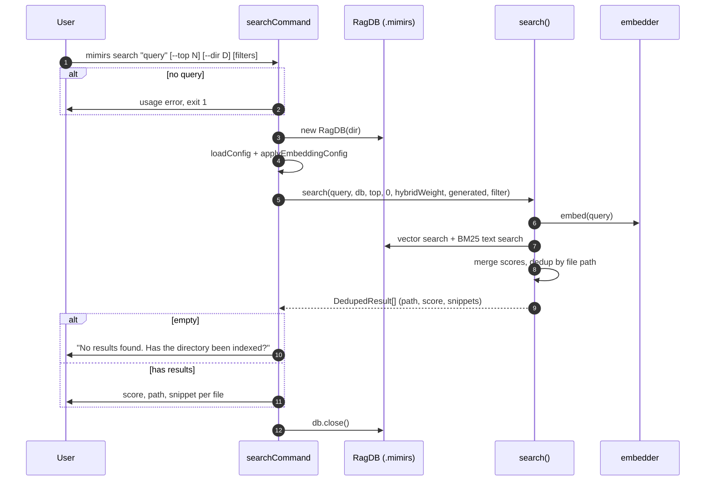

# CLI: search

`mimirs search` answers "which files are relevant to this topic?" from the
shell. You give it a natural-language query; it runs a hybrid search over the
indexed code and prints the best-matching files, each with a relevance score
and a short snippet preview. It is the command-line counterpart of the `search`
MCP tool.

Use it for quick discovery — finding where a concept lives without opening an
editor or an agent. When you want the actual code text of the matching
functions and sections instead of a list of files, use [read](read.md), which
returns chunk-level content.

The command entry point is `searchCommand` in
`src/cli/commands/search-cmd.ts:32`. The search itself runs in
`src/search/hybrid.ts`.

## What the command does

`searchCommand` validates the query, opens the project database, runs the
hybrid `search` function, and prints one block per matching file
(`src/cli/commands/search-cmd.ts:32-58`).



1. The user runs the command with a query and optional flags. The query is the
   first positional argument (`src/cli/commands/search-cmd.ts:33`).
2. If no query is given, the command prints a usage line and exits with status 1
   (`src/cli/commands/search-cmd.ts:34-37`).
3. It resolves the target directory (`--dir` or the current directory), opens
   the database, and loads/applies config (`src/cli/commands/search-cmd.ts:39-42`).
4. It computes how many results to return (`--top`, defaulting to
   `config.searchTopK`) and builds an optional path filter from `--ext`/`--in`/
   `--exclude` (`src/cli/commands/search-cmd.ts:43-44`).
5. It calls `search`, which embeds the query, runs a vector search and a BM25
   text search, merges the two score sets, and deduplicates to one entry per
   file keeping the best score (`src/cli/commands/search-cmd.ts:46`,
   `src/search/hybrid.ts:313-352`).
6. If nothing matched, it prints "No results found. Has the directory been
   indexed?" (`src/cli/commands/search-cmd.ts:48-49`).
7. Otherwise it prints, per file, the score and path on one line and a truncated
   single-line snippet on the next (`src/cli/commands/search-cmd.ts:51-56`).
8. It closes the database (`src/cli/commands/search-cmd.ts:58`).

## Inputs

| name | type | required | description |
|------|------|----------|-------------|
| query | positional arg | yes | The natural-language search query (`args[1]`). Missing it triggers a usage error and exit 1 (`src/cli/commands/search-cmd.ts:33-37`). |
| `--top` | flag with value | no | Maximum number of file matches to return. Defaults to `config.searchTopK` (`src/cli/commands/search-cmd.ts:43`). |
| `--dir` | flag with value | no | Project directory to search. Resolved against the current directory; defaults to `.` (`src/cli/commands/search-cmd.ts:39`). |
| `--ext` / `--extensions` | flag with value | no | Comma-separated extensions to restrict results to, e.g. `.ts,.tsx` (`src/cli/commands/search-cmd.ts:21`). |
| `--in` / `--dirs` | flag with value | no | Comma-separated directories to restrict results to; each is resolved against the project dir (`src/cli/commands/search-cmd.ts:22`,`:27`). |
| `--exclude` / `--exclude-dirs` | flag with value | no | Comma-separated directories to exclude (`src/cli/commands/search-cmd.ts:23`,`:28`). |

The three filter flags are combined into a single path filter only when at
least one is present; otherwise no filter is passed
(`src/cli/commands/search-cmd.ts:17-30`).

## Outputs

| output | where it lands / shape / description |
|--------|--------------------------------------|
| File matches | Printed to stdout. For each `DedupedResult`, a line `score  path` followed by an indented snippet line. `DedupedResult` has `path`, `score`, and `snippets` (`src/search/hybrid.ts:39-43`). |
| Score | `r.score.toFixed(4)` — the merged hybrid score, four decimals (`src/cli/commands/search-cmd.ts:52`). |
| Snippet preview | The first snippet, truncated to 120 characters with newlines flattened to spaces, suffixed with `...` (`src/cli/commands/search-cmd.ts:53-54`). |
| Empty-result message | "No results found. Has the directory been indexed?" when there are zero matches (`src/cli/commands/search-cmd.ts:49`). |

This command does not write or change any stored state; it only reads the
index and prints results.

## search vs read

Both commands live in `src/cli/commands/search-cmd.ts` and share the same flag
parsing, but they return different granularity.

| | `mimirs search` | `mimirs read` |
|--|-----------------|---------------|
| Underlying function | `search` (`src/search/hybrid.ts:313`) | `searchChunks` (`src/search/hybrid.ts:469`) |
| Result granularity | one entry per file, deduplicated by path (`src/search/hybrid.ts:338-352`) | individual chunks (functions, classes, sections) |
| Default `--top` | `config.searchTopK` (`src/cli/commands/search-cmd.ts:43`) | `8` (`src/cli/commands/search-cmd.ts:72`) |
| `--threshold` | always `0` (not configurable here) (`src/cli/commands/search-cmd.ts:46`) | `0.3` default, settable (`src/cli/commands/search-cmd.ts:73`) |
| Output per item | score + path + truncated snippet | score + path + entity name + full chunk content |

Use `search` to locate *where* something is; use `read` to get the *content*
of the matching chunks.

## Branches and failure cases

- **Missing query.** Prints the usage string and exits with code 1
  (`src/cli/commands/search-cmd.ts:34-37`).
- **No matches.** Prints the "No results found" hint and closes — common when
  the directory has not been indexed yet (`src/cli/commands/search-cmd.ts:48-49`).
- **No filter flags.** When none of `--ext`/`--in`/`--exclude` is present,
  `buildCliFilter` returns `undefined` and the search runs unscoped
  (`src/cli/commands/search-cmd.ts:24`).
- **FTS failure falls back.** Inside `search`, if the BM25 text query throws,
  it is caught and the search proceeds vector-only
  (`src/search/hybrid.ts:330-334`).
- **`--top` with config default.** When `--top` is omitted, the count comes from
  `config.searchTopK`; the value is parsed with `parseInt`
  (`src/cli/commands/search-cmd.ts:43`).

## Example

```bash
# Find files relevant to "hybrid search scoring".
mimirs search "hybrid search scoring"

# Top 3 TypeScript matches under src/, excluding tests.
mimirs search "embedding model loading" --top 3 --ext .ts --in src --exclude tests

# Search a different project directory.
mimirs search "config defaults" --dir ../other-project
```

Illustrative output:

```
0.8123  src/search/hybrid.ts
         export function mergeHybridScores(vectorResults, textResults, hybridWeight) { ...

0.7440  src/db/search.ts
         textSearch(query, limit, filter) runs the BM25 FTS query over chunks ...
```

## Key source files

- `src/cli/commands/search-cmd.ts` — `searchCommand` entry point and the shared
  flag/filter parsing (`parseListFlag`, `buildCliFilter`).
- `src/search/hybrid.ts` — `search`, the hybrid vector + BM25 query that merges
  scores and deduplicates to file level.
- `src/db/index.ts` — `RagDB`, providing the vector and text search primitives
  the hybrid layer calls.

## Related pages

- [read](read.md) — chunk-level sibling command from the same source file.
- [search](../tools/search.md) — the MCP tool that exposes the same hybrid
  search to an agent.
