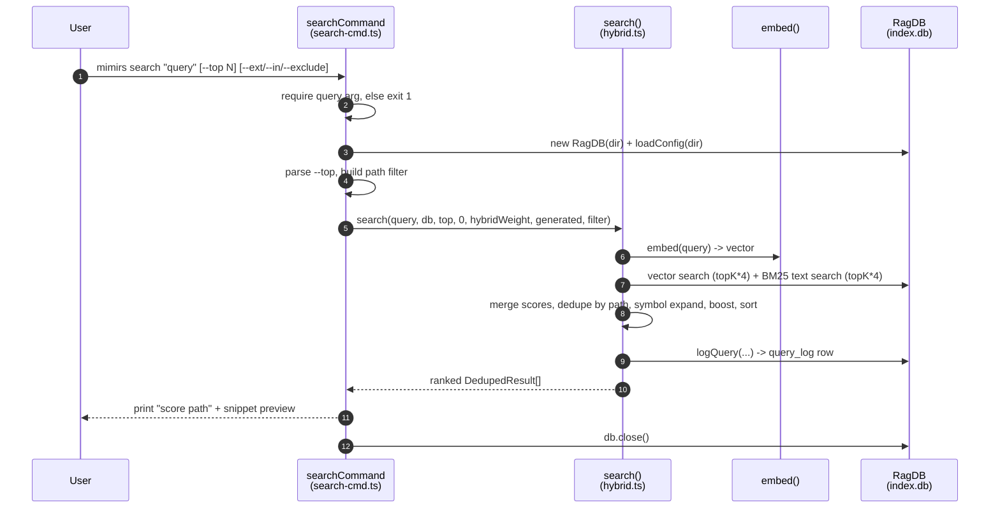

# CLI: search

`mimirs search <query>` is the command-line front door to the index. You give it a natural-language phrase or a symbol name, and it prints a ranked list of files that best match, each with a short snippet preview. Reach for it when you want to know *where* something lives in a codebase without opening files one by one. Its sibling command [`mimirs read`](read.md) is the one to use when you want the actual chunk *content* instead of just file paths.

Under the hood this command runs a **hybrid search**: it blends semantic vector similarity (does the meaning match?) with BM25 keyword ranking (do the exact words appear?), then applies a series of relevance adjustments before collapsing everything down to file-level results. Every run also records one row in an analytics log so usage can be reviewed later with [`mimirs analytics`](analytics.md).

## How a search runs

The CLI dispatcher reads the first process argument as the command name and routes `search` to `searchCommand` `src/cli/index.ts:118-119`. The handler itself lives in `src/cli/commands/search-cmd.ts:33`. From there the real ranking work happens in the shared `search()` function `src/search/hybrid.ts:313`, which is the same engine the [`search` MCP tool](../tools/search.md) uses.



1. The user runs `mimirs search` with a query and optional flags. The query is read from `args[1]` `src/cli/commands/search-cmd.ts:34`.
2. If the query is empty, the handler prints a usage line to stderr and exits with code 1 `src/cli/commands/search-cmd.ts:35-38`. This is the only hard-stop branch in the command.
3. The handler resolves the project directory (`--dir`, default `.`), opens the on-disk index by constructing a `RagDB`, and loads the merged config `src/cli/commands/search-cmd.ts:40-42`.
4. `--top` is parsed into an integer (default `searchTopK`, which is `10`), and the three path filters are folded into a single filter object `src/cli/commands/search-cmd.ts:43-44`.
5. `search()` is called with a fixed threshold of `0`, the configured hybrid weight, the configured generated-file patterns, and the optional filter `src/cli/commands/search-cmd.ts:46`.
6. Inside `search()`, the query string is turned into an embedding vector via `embed()` `src/search/hybrid.ts:323`.
7. The index is queried twice: a vector (cosine-distance) search and a BM25 full-text search, each over-fetching `topK * 4` candidates so deduplication and boosting have a deep enough pool `src/search/hybrid.ts:326-334`.
8. The two result sets are merged into hybrid scores, collapsed to one entry per file path, optionally augmented with exact symbol-name hits, re-ranked by several boosts, sorted, and lightly expanded for docs `src/search/hybrid.ts:336-384`.
9. One row is written to the `query_log` table for analytics `src/search/hybrid.ts:386-394`.
10. The ranked list returns to the handler, which prints each result as a score, a path, and a one-line snippet preview — or a "no results" message if the list is empty `src/cli/commands/search-cmd.ts:48-57`.
11. The database handle is closed `src/cli/commands/search-cmd.ts:58`.

## Inputs

| Name | Type | Required | Description |
|------|------|----------|-------------|
| `<query>` | string | yes | The search phrase. Read as the second CLI argument; an empty value prints usage and exits 1 `src/cli/commands/search-cmd.ts:34-38`. Plain English works; identifier-looking words also trigger an exact symbol-name lookup (see below). |
| `--top N` | integer | no | Maximum number of file results. Defaults to the config value `searchTopK` (`10`). Rejected with a clear error if not a positive integer `src/cli/commands/search-cmd.ts:43`, `src/cli/flags.ts:40-53`. |
| `--ext` | comma list | no | Restrict to files whose path ends with one of these extensions, e.g. `--ext .ts,.tsx`. A missing leading dot is tolerated. Alias: `--extensions` `src/cli/commands/search-cmd.ts:22`. |
| `--in` | comma list | no | Restrict to files under one of these directories, e.g. `--in src,packages/core`. Each value is resolved to an absolute path before matching. Alias: `--dirs` `src/cli/commands/search-cmd.ts:23,28`. |
| `--exclude` | comma list | no | Drop files under one of these directories, e.g. `--exclude tests`. Each value is resolved to an absolute path. Alias: `--exclude-dirs` `src/cli/commands/search-cmd.ts:24,29`. |
| `--dir` | path | no | Project directory whose index to search. Defaults to the current directory `src/cli/commands/search-cmd.ts:40`. |

The three list flags are parsed by `parseListFlag`, which splits on commas, trims whitespace, and drops empty segments `src/cli/commands/search-cmd.ts:8-16`. If none of `--ext`/`--in`/`--exclude` is present, no filter object is built at all and the search runs unscoped `src/cli/commands/search-cmd.ts:25`.

## Outputs

| Output | Where it lands / shape / description |
|--------|--------------------------------------|
| Ranked file lines | Printed to stdout. For each result, one line `<score>  <path>` (score formatted to 4 decimals) followed by an indented preview line of the first snippet, truncated to 120 characters with newlines flattened to spaces and a trailing `...`, then a blank line `src/cli/commands/search-cmd.ts:51-56`. |
| Empty-result message | When nothing matches, the single line `No results found. Has the directory been indexed?` is printed instead of any result lines `src/cli/commands/search-cmd.ts:48-49`. |
| `query_log` row | Persisted to the index database on every run (even zero-result runs). Stores the query text, result count, top score, top path, and elapsed milliseconds `src/search/hybrid.ts:388-394`, `src/db/analytics.ts:3-8`. |

A result is a `DedupedResult`: a `path`, a numeric `score`, and an array of `snippets` `src/search/hybrid.ts:39-43`. The CLI only prints the score, the path, and the first snippet — any extra snippets are accumulated but not shown here.

## Hybrid search over the index

The ranking engine blends two independent retrieval methods. First, `embed()` converts the query into a dense vector and `db.search(...)` (which delegates to `vectorSearch`) finds the nearest chunk vectors by distance, converting distance to a `0..1` score with `1 / (1 + distance)` `src/db/search.ts:88-95`. Second, `db.textSearch(...)` runs an FTS5 BM25 query over the same chunks, converting the FTS `rank` to a score with `1 / (1 + abs(rank))` `src/db/search.ts:130-137`. Both queries fetch `topK * 4` candidates so the later dedup and boost steps have a deep enough pool `src/search/hybrid.ts:326,331`.

The two lists are combined in `mergeHybridScores`, keyed by `path:chunkIndex`. Each chunk's final score is `hybridWeight * vectorScore + (1 - hybridWeight) * textScore` `src/search/hybrid.ts:87-90`. With the default `hybridWeight` of `0.7` that is 70% semantic, 30% keyword `src/config/index.ts:113-117`. A chunk that appears in only one of the two lists still scores, just with a zero contribution from the side that missed it.

Because two chunks can come from the same file, results are then deduplicated by path, keeping the highest-scoring chunk per file and accumulating each distinct snippet `src/search/hybrid.ts:341-359`. This is what makes `search` a *file-level* view, in contrast to [`mimirs read`](read.md), which keeps individual chunks separate and never deduplicates by file.

After deduplication, several score adjustments run in sequence on the per-file candidates:

- **Symbol expansion.** Identifier-looking words in the query (camelCase, snake_case, dotted names, 3+ chars, not stop words) trigger an exact symbol-name lookup via `db.searchSymbols(id, true, ...)`. A file already in the pool that also matches by symbol name has its score boosted by `1.3x`; a brand-new symbol-only hit is added with a high base score of `0.75` `src/search/hybrid.ts:362-374`, `src/search/hybrid.ts:261-279`.
- **Source vs. test boost.** Paths under `src`/`lib`/`app`/etc. are multiplied by `1.1`; test paths are multiplied by `0.85` `src/search/hybrid.ts:106-115`.
- **Filename and path affinity.** When query words appear in the filename stem (+`0.1` each) or directory segments (+`0.05` each), the score is nudged up; boilerplate basenames (`types.ts`, `index.d.ts`, …) are demoted to `0.8x` and configured generated files to `0.75x` `src/search/hybrid.ts:187-235`.
- **Dependency-graph boost.** A file imported by many others gets a modest logarithmic bump (`0.05 * log2(importerCount + 1)`), on the theory that widely-used files are more central `src/search/hybrid.ts:301-311`.

The boosted list is sorted by score descending, then run through `expandForDocs`, which lets Markdown results ride along as bonus entries so they do not push code files out of the top slots `src/search/hybrid.ts:378-384`, `src/search/hybrid.ts:287-298`.

## Path filters (`--ext` / `--in` / `--exclude`)

Filtering happens in two places. Inside the SQL queries, `buildPathFilter` turns the filter into parametrized `LIKE` / `NOT LIKE` clauses: extensions become `f.path LIKE '%<ext>'`, included dirs become `f.path LIKE '<dir>/%'`, and excluded dirs become `f.path NOT LIKE '<dir>/%'` `src/db/search.ts:16-51`. When any filter is active the inner vector/FTS query over-fetches by a factor of five (`FILTER_OVERFETCH`) so enough rows survive the filter `src/db/search.ts:53-64`. Because the dir clauses are prefix matches against the stored absolute paths, the CLI resolves `--in` / `--exclude` values to absolute paths before passing them down `src/cli/commands/search-cmd.ts:28-29`.

There is also a second, in-memory filter. Symbol-expansion hits bypass the SQL layer (they come from the symbol index, not the chunk search), so each is re-checked with `matchesFilter` before it can join the result set `src/search/hybrid.ts:368`, `src/search/hybrid.ts:10-37`. This mirrors the SQL rules so a `--ext`/`--in`/`--exclude` constraint applies uniformly no matter which retrieval path produced a hit.

## Ranked file output with snippet preview

The print loop is deliberately compact. For each ranked result it emits the score to four decimal places and the path on one line, then an indented preview line built from the first snippet, then a blank separator line `src/cli/commands/search-cmd.ts:51-56`. The preview is the snippet sliced to its first 120 characters, with every newline replaced by a space so it stays on a single visual line, and a literal `...` appended to signal truncation. Only the first snippet is shown even when a file matched through several chunks.

Example invocation and output (paths and scores are illustrative):

```
$ mimirs search "hybrid search scoring" --top 3 --ext .ts --in src
0.8421  src/search/hybrid.ts
         export function mergeHybridScores<T extends { score: number; path: string; chunkIndex: number }>( vectorRes...

0.7510  src/db/search.ts
         export function vectorSearch( db: Database, queryEmbedding: Float32Array, topK: number = 5, filter?: PathFil...

0.6033  src/cli/commands/search-cmd.ts
         export async function searchCommand(args: string[], getFlag: (flag: string) => string | undefined) { const ...
```

## State changes

### `query_log` row written per search

Before returning, `search()` records the run for analytics. It measures wall-clock duration with `performance.now()`, then calls `db.logQuery(...)` with the query text, the result count, the top result's score and path (or `null` when there are no results), and the rounded duration in milliseconds `src/search/hybrid.ts:387-394`.

| State | Before | After |
|-------|--------|-------|
| `query_log` table | no row for this run | one new row: `(query, result_count, top_score, top_path, duration_ms, created_at)` |

The write is a plain `INSERT` into the `query_log` table, with `created_at` set to the current ISO timestamp `src/db/analytics.ts:3-8`. This is why even a misspelled or zero-result query leaves a trace — those rows are exactly what [`mimirs analytics`](analytics.md) later surfaces as zero-result and low-score queries to reveal documentation or indexing gaps. The row is written on every successful return, including the empty-result case, because the log call sits after the boost/sort steps and just before the function returns.

## Branches and failure cases

- **Missing query.** No query argument prints the usage string to stderr and exits with code 1 `src/cli/commands/search-cmd.ts:35-38`.
- **No results.** When the ranked list is empty, the command prints `No results found. Has the directory been indexed?` and writes a `query_log` row with `result_count = 0` and null top score/path `src/cli/commands/search-cmd.ts:48-49`, `src/search/hybrid.ts:391-392`.
- **Bad `--top` value.** A non-integer (or out-of-range) value throws a `CliFlagError` via strict `Number` parsing — unlike `parseInt`, `"12abc"` is rejected rather than silently truncated. The top-level dispatcher catches it, prints the message, and exits 1 rather than crashing with a stack trace `src/cli/flags.ts:40-53`, `src/cli/index.ts:97-100`.
- **FTS query failure.** If the BM25 query throws (for example on a query string the FTS tokenizer rejects despite `sanitizeFTS`), the error is caught, logged at debug level, and the search proceeds vector-only `src/search/hybrid.ts:330-334`. The command still returns ranked results; only the keyword half of the blend is lost for that run.
- **No filter flags.** When none of `--ext`/`--in`/`--exclude` is given, no filter object is constructed and the search is unscoped, so the inner queries fetch only `topK * 4` rows without the 5x over-fetch `src/cli/commands/search-cmd.ts:25`, `src/db/search.ts:64`.
- **Unindexed or missing index.** Constructing `RagDB` creates the `.mimirs` directory and schema if absent, so a never-indexed project simply yields zero results and the "Has the directory been indexed?" hint rather than an error `src/db/index.ts:108-139`. A read-only or permission-denied directory (`EROFS`/`EACCES`) instead raises a clear, actionable error pointing at `RAG_DB_DIR` `src/db/index.ts:112-120`.
- **Symbol expansion skipped.** If the query contains no identifier-looking words, the symbol-lookup block is skipped entirely and ranking relies on the hybrid + boost path alone `src/search/hybrid.ts:362-363`.

## Key source files

- `src/cli/index.ts` — CLI dispatcher; routes the `search` subcommand to the handler and catches flag errors `src/cli/index.ts:118-119`.
- `src/cli/commands/search-cmd.ts` — `searchCommand` handler: argument and flag parsing, filter building, result printing.
- `src/cli/flags.ts` — strict numeric flag parsing (`intFlag`) that rejects garbage `--top` values at the boundary.
- `src/search/hybrid.ts` — the shared `search()` engine: embedding, hybrid merge, dedup, symbol expansion, boosts, doc expansion, and the analytics log call.
- `src/db/search.ts` — `vectorSearch` / `textSearch` and `buildPathFilter`: the SQL that backs both retrieval halves and the path filtering.
- `src/db/analytics.ts` — `logQuery`, which inserts the per-search `query_log` row.
- `src/config/index.ts` — defaults for `searchTopK` (10), `hybridWeight` (0.7), and `generated` ([]).
