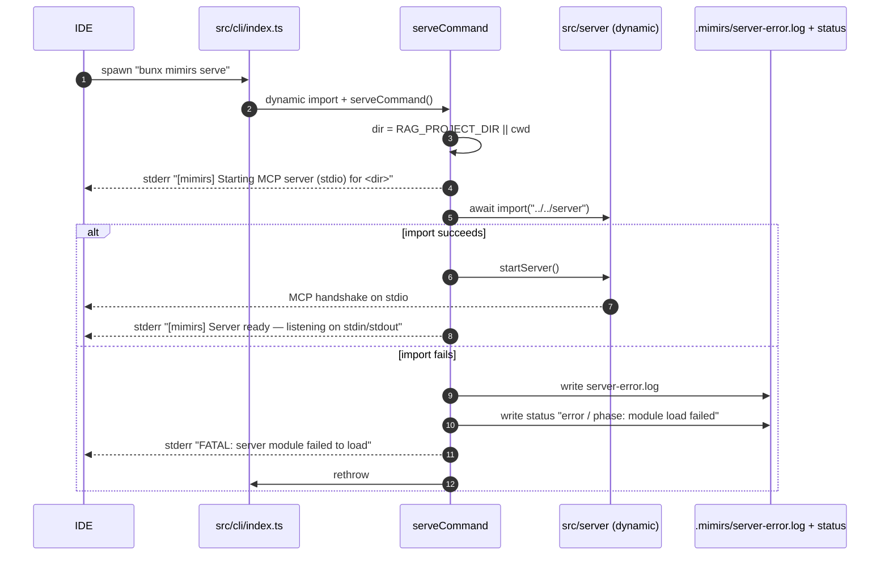

# CLI: serve

`mimirs serve` is what IDEs (Claude Code, Cursor, Windsurf, JetBrains plugins) launch as the MCP server. It is a thin bootstrapper: it dynamically imports the real server module, calls `startServer`, and turns any import failure into a diagnostic file the user can find later.

End users almost never run this themselves — the MCP config written by [`mimirs init`](init.md) invokes `bunx mimirs@latest serve` on their behalf, with `RAG_PROJECT_DIR` pointing at the project root.

## Flow



1. The dispatcher in `src/cli/index.ts:92-96` is the *only* place `./commands/serve` is imported, and it is dynamic. Every other command (including `doctor`) is statically imported. This means `mimirs doctor` keeps working even when `bun:sqlite` or `sqlite-vec` fails to load on this machine — the load failure happens inside the dynamic import inside `serve`, never on a `doctor` boot path (`src/cli/index.ts:16-18`).
2. `serveCommand` resolves the project directory: `RAG_PROJECT_DIR` env if set, otherwise the current working directory. The MCP config written by `init` always sets this env var (`src/cli/setup.ts:228-234`).
3. Inside `serveCommand`, a second dynamic import wraps `await import("../../server")`. If the server module's top-level await or native deps throw, control falls into the `catch` block instead of crashing before any logging happens (`src/cli/commands/serve.ts:12-18`).
4. On import failure, the command writes two files under `.mimirs/`:
   - `server-error.log` — error message, stack, timestamp, and the hint `"To diagnose: bunx mimirs doctor"`.
   - `status` — a four-line block starting with `error`, `phase: module load failed`, the timestamp, and the error message.
   Both writes are wrapped in `try { ... } catch {}` so the diagnostic effort never throws (`src/cli/commands/serve.ts:21-47`).
5. The error is then rethrown so the IDE sees the process die.
6. On successful import, `serveCommand` calls `startServer()` which registers MCP tools, connects the `StdioServerTransport`, opens the DB, and kicks off background indexing and conversation tailing (`src/server/index.ts:88-387`). See [`flow-server-start`] in `src/server/index.ts` for the full lifecycle.
7. After `startServer` returns, the process is kept alive by the open stdio transport and the registered signal/stdin handlers. `startServer` itself installs SIGINT/SIGTERM/SIGHUP, `stdin` `end`/`error`, `uncaughtException`, and `unhandledRejection` handlers — any of these calls `cleanup()` which closes the watcher, releases the index lock, closes all open DBs, and exits cleanly (`src/server/index.ts:140-173`).

## Inputs

| Input | Source | Notes |
| --- | --- | --- |
| `RAG_PROJECT_DIR` | env | Absolute path to the project the server should index and serve. Defaults to `process.cwd()` when missing (`src/cli/commands/serve.ts:5`). |
| stdin/stdout | IDE pipe | The MCP transport. The IDE writes JSON-RPC requests on stdin and reads responses from stdout. |
| signals | OS | `SIGINT`, `SIGTERM`, `SIGHUP` trigger graceful shutdown via the handlers in `startServer`. |

## Outputs

| Output | Where | Notes |
| --- | --- | --- |
| Running MCP stdio server | stdin/stdout | Registered tools listed in `src/tools/index.ts:39+` via `registerAllTools`. |
| Startup status updates | `.mimirs/status` | `startServer` writes `starting → phase: ... → done` (or `error`) as it progresses (`src/server/index.ts:100-110`). |
| Crash diagnostics | `.mimirs/server-error.log` | Written from both `serveCommand` (module load failure) and `startServer` (startup failure) so the IDE/user always has something to read (`src/cli/commands/serve.ts:21-47`, `src/server/index.ts:62-86`). |
| Stderr banner | IDE log | `"[mimirs] Starting MCP server (stdio) for <dir>"` at launch, `"[mimirs] Server ready — listening on stdin/stdout"` after `startServer` resolves. |

## Server lifecycle

`startServer` runs in distinct phases, each reflected in `.mimirs/status`:

1. **`starting / phase: creating server`** — instantiate `McpServer`, call `registerAllTools` (`src/server/index.ts:181-190`).
2. **`starting / phase: tools registered`** — tools are ready to answer.
3. **`starting / phase: connecting transport`** then **`transport connected`** — `StdioServerTransport` is wired up early, before any slow work, so the client's `initialize` handshake doesn't time out (`src/server/index.ts:199-212`).
4. **Preflight DB open.** `getDB(startupDir)` is called; on macOS without Homebrew SQLite this throws and `permanentError` is cached so subsequent tool calls return the same error (`src/server/index.ts:215-256`).
5. **`ensureGitignore`** — adds `.mimirs/` to `.gitignore` if missing.
6. **Acquire index lock.** If another mimirs process owns the lock, the server logs `mode: query-only (another mimirs process owns indexing)` to status and skips both background indexing and the watcher (`src/server/index.ts:269-277`).
7. **Background indexing.** `indexDirectory` runs as a then-able; status is updated per file, and on success a file watcher is started for incremental updates (`src/server/index.ts:285-351`).
8. **Conversation tailing.** Past sessions are indexed and the current session's JSONL is tailed (`src/server/index.ts:355-385`).

## Branches and failure cases

- **Native module load failure.** `bun:sqlite` or `sqlite-vec` missing, or top-level await rejecting. Caught by `serveCommand`; produces `.mimirs/server-error.log` and a `status` file with `phase: module load failed`. The IDE typically shows "Connection closed" with no detail — the log is the only diagnostic surface (`src/cli/commands/serve.ts:12-49`).
- **Home-dir trap.** `checkIndexDir` flags home/root directories. `startServer` still runs (so the IDE can connect), but skips background indexing and the watcher to avoid scanning `~` (`src/server/index.ts:91-93`, `src/server/index.ts:175-177`).
- **Transient DB lock.** SQLITE_BUSY at startup is not cached; the next tool call retries `getDB` (`src/server/index.ts:227-235`).
- **Stdin closes.** Treated as "IDE window closed" — `cleanup("stdin closed")` runs the same shutdown path as SIGTERM (`src/server/index.ts:154-157`).
- **Uncaught exception / unhandled rejection.** Recorded in the `interrupted` status line and the process exits cleanly (`src/server/index.ts:164-173`).

## Example

The user does not run this directly. The MCP entry that `mimirs init` writes looks like:

```json
{
  "mcpServers": {
    "mimirs": {
      "command": "bunx",
      "args": ["mimirs@latest", "serve"],
      "env": { "RAG_PROJECT_DIR": "/absolute/path/to/project" }
    }
  }
}
```

To debug a serve failure manually:

```bash
RAG_PROJECT_DIR="$(pwd)" bunx mimirs serve   # see stderr in real time
cat .mimirs/server-error.log                 # post-mortem
mimirs doctor                                # run the checks
```

## Key source files

- `src/cli/commands/serve.ts` — bootstrap wrapper, dynamic import, crash file writer.
- `src/cli/index.ts` — dispatcher with the dynamic-import comment explaining why `serve` is special (`src/cli/index.ts:16-18`).
- `src/server/index.ts` — `startServer`, signal handlers, phased status writes, background indexing wiring.
- `src/tools/index.ts` — `registerAllTools`, called during phase "creating server".

## Related flows

- [CLI: doctor](doctor.md) — the recovery path when `serve` fails.
- [CLI: init](init.md) — what registers the `bunx mimirs serve` invocation with each IDE.
