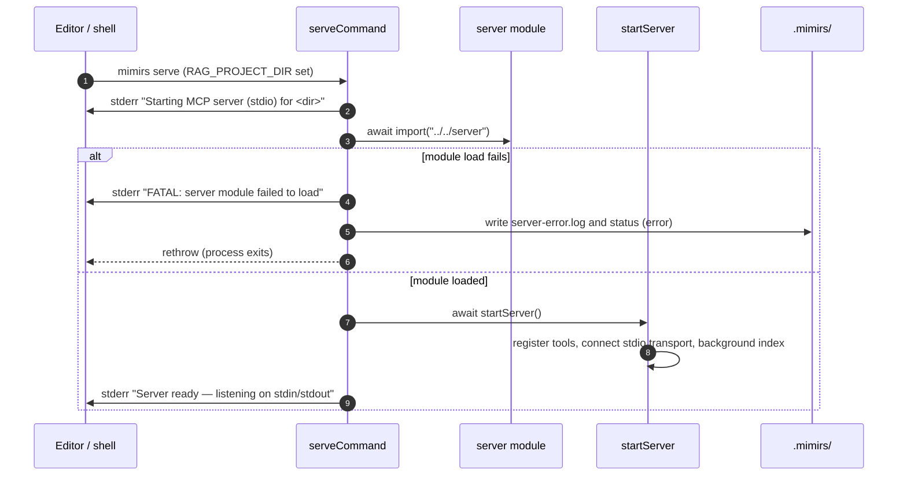

# CLI: serve

`mimirs serve` starts the long-running MCP server that exposes mimirs as tools
to an AI agent. It speaks the Model Context Protocol over standard input and
output, so an editor (Claude Code, Cursor, Windsurf, Junie, etc.) launches it as
a child process and talks to it through the pipes. This is the command the
`mcpServers.mimirs` registration written by [init](init.md) points at.

You rarely run it by hand — the editor starts it automatically. You would run it
manually mostly to reproduce a startup problem in a terminal where you can see
the diagnostics.

The command is intentionally tiny. `serveCommand` in
`src/cli/commands/serve.ts:4` is only a bootstrap: it loads the real server
module and hands off to `startServer` (`src/server/index.ts:88`). The full
server lifecycle — tool registration, transport, background indexing, and
shutdown — is documented on the [server start](../server/start.md) page.

## What the command does

`serveCommand` figures out the project directory, dynamically imports the
server module, and calls `startServer`. The dynamic import is the load-bearing
detail: it lets the command write useful diagnostics if the server module fails
to load (`src/cli/commands/serve.ts:4-52`).



1. The editor or shell runs `mimirs serve`. The command picks the project
   directory from `RAG_PROJECT_DIR`, falling back to the current working
   directory (`src/cli/commands/serve.ts:5`).
2. It writes a startup line to stderr so the launching process has a visible
   sign of life (`src/cli/commands/serve.ts:6`).
3. It dynamically imports the server module rather than importing it at the top
   of the file (`src/cli/commands/serve.ts:14`). The server module uses
   top-level `await` and native dependencies (`bun:sqlite`, `sqlite-vec`); a
   static import would crash the whole CLI at module-load time, before any
   handler could record what happened (`src/cli/commands/serve.ts:8-11`).
4. If the import throws, the command prints a fatal line to stderr and writes
   two diagnostic files under `.mimirs/`, then rethrows
   (`src/cli/commands/serve.ts:15-48`).
5. On success it awaits `startServer`, which registers the tools, connects the
   stdio transport, opens the database, and kicks off background indexing
   (`src/cli/commands/serve.ts:51`, `src/server/index.ts:88`).
6. Once `startServer` resolves, the command writes "Server ready" to stderr and
   stays alive, serving tool calls until shutdown
   (`src/cli/commands/serve.ts:52`).

## Inputs

| name | type | required | description |
|------|------|----------|-------------|
| `RAG_PROJECT_DIR` | environment variable | no | Absolute path of the project to serve. When unset, the command uses the current working directory (`src/cli/commands/serve.ts:5`). The MCP registrations written by `init` set this explicitly (`src/cli/setup.ts:228-234`). |
| stdin / stdout | process streams | yes (in practice) | The MCP transport. The agent sends JSON-RPC requests on stdin and reads responses on stdout; the server treats stdin closing as a shutdown signal (`src/server/index.ts:154-157`). |

## Outputs

| output | where it lands / shape / description |
|--------|--------------------------------------|
| Running MCP server | A live process speaking MCP over stdio, with all mimirs tools registered, started by `startServer` (`src/cli/commands/serve.ts:51`, `src/server/index.ts:88`). |
| stderr status lines | Human-readable "Starting MCP server …" and "Server ready …" messages on stderr (`src/cli/commands/serve.ts:6`,`:52`). |
| `.mimirs/server-error.log` | A timestamped error report written only when the server module fails to load, including the error message, stack, and a pointer to `bunx mimirs doctor` (`src/cli/commands/serve.ts:24-35`). |
| `.mimirs/status` (error) | On module-load failure, a status file recording `error`, `phase: module load failed`, the failure timestamp, and the message (`src/cli/commands/serve.ts:36-44`). During normal operation the running server keeps this file updated with its own phases (`src/server/index.ts:100-110`). |

## State changes

This command itself only writes diagnostic files, and only on the module-load
failure path. The substantive state changes — status-file phases, the index
lock, background indexing, and shutdown status — all happen inside
`startServer`; see the [server start](../server/start.md) page.

- **On module-load failure**, `.mimirs/server-error.log` and `.mimirs/status`
  go from absent (or stale) to an error report, so the editor and `doctor` can
  explain why the server never came up (`src/cli/commands/serve.ts:21-44`). The
  writes are wrapped in their own try/catch and are best-effort
  (`src/cli/commands/serve.ts:45-47`).

## Branches and failure cases

- **`RAG_PROJECT_DIR` unset.** The directory defaults to the current working
  directory (`src/cli/commands/serve.ts:5`).
- **Server module fails to load.** The dynamic import is wrapped in try/catch.
  On failure the command writes the diagnostic files and rethrows so the process
  exits with the error rather than hanging (`src/cli/commands/serve.ts:13-49`).
  This is why the import is dynamic: a top-level import of native modules that
  fail to load would take down the CLI — including `mimirs doctor` — before any
  diagnostics could be written (`src/cli/commands/serve.ts:8-11`).
- **Diagnostic writes fail.** Writing `server-error.log` / `status` is itself
  wrapped in try/catch; a failure there is swallowed so the original error is
  still rethrown (`src/cli/commands/serve.ts:45-47`).
- **Normal startup then shutdown.** After `startServer` resolves, the process
  keeps running. It shuts down when stdin closes (the editor window is closed)
  or on `SIGINT`/`SIGTERM`/`SIGHUP`, writing an "interrupted" status on the way
  out (`src/server/index.ts:154-163`). These handlers live in `startServer`.
- **Query-only mode.** If another mimirs process already holds the project's
  index lock, the new server still serves tool calls but skips indexing and
  watching (`src/server/index.ts:269-277`). This branch is part of the server
  lifecycle, not this bootstrap.

## Example

```bash
# Started by an editor via the MCP registration; equivalent manual run:
RAG_PROJECT_DIR=/Users/example/my-app mimirs serve
```

Expected stderr on a healthy start:

```
[mimirs] Starting MCP server (stdio) for /Users/example/my-app
[mimirs] Server ready — listening on stdin/stdout
```

If the server module cannot load, stderr shows a fatal line and `.mimirs/`
gains a `server-error.log`:

```
[mimirs] FATAL: server module failed to load: <reason>
```

## Key source files

- `src/cli/commands/serve.ts` — the bootstrap: directory resolution, dynamic
  import, module-load diagnostics, and the `startServer` handoff.
- `src/server/index.ts` — `startServer`, which registers tools, connects the
  stdio transport, opens the database, runs background indexing, and handles
  shutdown.
- `src/tools/index.ts` — `registerAllTools`, which wires every mimirs MCP tool
  onto the server (`src/server/index.ts:189`).

## Related pages

- [server start](../server/start.md) — the full server lifecycle this command
  hands off to.
- [init](init.md) — writes the MCP registration that launches this command.
