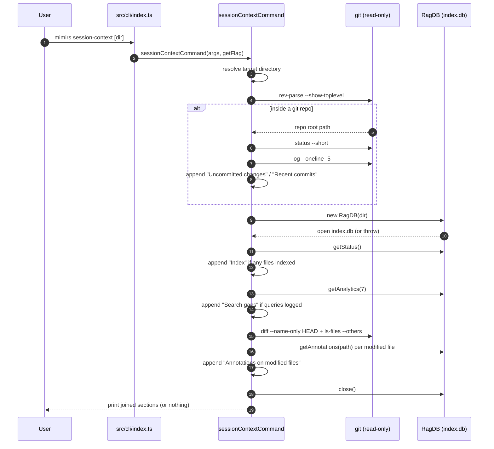

# CLI: session-context

`mimirs session-context` prints a short orientation summary meant to be read once at the start of a working session. Instead of making you run several commands by hand to learn "what was I doing here," it gathers the most useful facts about a project — what is currently uncommitted, the last few commits, how big the search index is, which recent searches found nothing useful, and any notes left on files you are actively editing — and prints them as one block of Markdown.

The whole command is a read-only aggregator. It never writes to the index, never re-indexes, and never mutates git state. It only runs `git` in read mode and runs a handful of `SELECT` queries against the local index database. If anything is missing — no git repository, no index, no search history — that section is simply skipped, and in the extreme case (nothing at all to report) the command prints nothing and exits cleanly.

## When to use it

Run it when you (or an agent) open a project and want a fast picture of its current state before deciding what to do next. It is the CLI counterpart of the orientation a fresh session needs: recent activity plus index health plus any warnings worth knowing. Because it touches several subsystems but only reads from them, it is safe to run as often as you like.

## How it works

The dispatcher in `src/cli/index.ts` maps the `session-context` subcommand to `sessionContextCommand`, passing the raw argument list and a `getFlag` helper that looks up a named flag's value (`src/cli/index.ts:157-158`). The handler then resolves the target directory and builds up an array of Markdown sections, one per data source, before joining and printing them at the end (`src/cli/commands/session-context.ts:16-100`).



1. The user runs `mimirs session-context`, optionally with a directory argument or `--dir`. The dispatcher routes it to the handler.
2. The handler resolves which directory to inspect. If the first positional argument after the subcommand exists and does not start with `--`, it is used; otherwise the `--dir` flag is consulted; otherwise the current directory `.` is used. The result is passed through `resolve()` to an absolute path (`src/cli/commands/session-context.ts:17`).
3. It asks git for the repository root with `git rev-parse --show-toplevel`. Every git call goes through a small wrapper that spawns the process, captures stdout, and returns the trimmed text only on a zero exit code — otherwise `null` (`src/cli/commands/session-context.ts:5-14`).
4. If a root was found, it runs `git status --short` and, when that produces output, appends an "Uncommitted changes" section verbatim (`src/cli/commands/session-context.ts:22-26`).
5. It also runs `git log --oneline -5` and, when non-empty, appends a "Recent commits" section showing the last five commits (`src/cli/commands/session-context.ts:28-31`).
6. It opens the index database by constructing a `RagDB` rooted at the resolved directory. This is wrapped in a `try` so that a missing or unreadable index does not crash the command (`src/cli/commands/session-context.ts:36-37`).
7. It calls `getStatus()` and, only if at least one file is indexed, appends an "Index" line with the file count, chunk count, and last-indexed timestamp (`src/cli/commands/session-context.ts:38-43`).
8. It calls `getAnalytics(7)` to look at the last seven days of logged searches, and builds a "Search gaps" section from zero-result and low-relevance queries when any searches were recorded (`src/cli/commands/session-context.ts:45-63`).
9. Back inside the git branch, it lists files changed versus `HEAD` (`git diff --name-only HEAD`) plus untracked-but-not-ignored files (`git ls-files --others --exclude-standard`), de-duplicates them into a set, and looks up annotations for each. Any notes found become an "Annotations on modified files" section (`src/cli/commands/session-context.ts:66-90`).
10. The database is closed in a `finally` block so the SQLite handle is released even if a query throws (`src/cli/commands/session-context.ts:94-96`).
11. If any sections were collected, they are joined with blank lines and printed to stdout; if the array is empty, nothing is printed (`src/cli/commands/session-context.ts:98-100`).

## Inputs

| name | type | required | description |
| --- | --- | --- | --- |
| `[dir]` | positional string | no | Project directory to inspect. Used only when present and not starting with `--`. Resolved to an absolute path. Defaults to `.` (the current directory). |
| `--dir D` | flag string | no | Alternative way to set the target directory. Consulted only when no usable positional `dir` was given. |

Both inputs feed the same `dir` variable. The positional argument wins when it looks like a real path; otherwise `--dir` is used; otherwise the current directory. The same directory is handed both to the git calls (as the starting point for `rev-parse`) and to the `RagDB` constructor (as the project root under which it expects `.mimirs/index.db`), so a mismatched directory simply yields empty git and index sections rather than an error.

## Outputs

| output | where it lands / shape / description |
| --- | --- |
| Session orientation summary | Markdown text on stdout via `cli.log`, which is a thin wrapper over `console.log` (`src/utils/log.ts:49-53`). Composed of up to four `##` sections — "Uncommitted changes", "Recent commits", "Index", "Search gaps", "Annotations on modified files" — separated by blank lines. No section is printed if its source is empty, and the whole output is empty when nothing is available. |

The command produces no other side effects: no files are written, the index is opened read-only and then closed, and nothing is logged back into the query log.

### What each section contains

| Section | Source | Contents |
| --- | --- | --- |
| Uncommitted changes | `git status --short` | The short-format working-tree status, printed as-is. |
| Recent commits | `git log --oneline -5` | The five most recent commits, one per line. |
| Index | `getStatus()` | `<N> files, <M> chunks (last indexed: <timestamp>)`. Shows `unknown` if no timestamp is stored. |
| Search gaps | `getAnalytics(7)` | Up to five most frequent zero-result queries (with counts) and up to five lowest-scoring low-relevance queries (with their top score, two decimals). |
| Annotations on modified files | `getAnnotations(path)` per changed/untracked file | One `[NOTE]` line per annotation: the file path (and symbol name when the note is symbol-scoped) followed by the note text. |

## State changes

This command makes no persistent state changes. It is purely a reader.

The one transient piece of state is the SQLite connection. The handler opens a `RagDB` (which opens `index.db` in WAL mode) and is responsible for closing it. It does so in a `finally` block via `db?.close()`, so the handle is released on every path — success, a thrown query, or the early skip when the index does not exist (`src/cli/commands/session-context.ts:94-96`). The optional-chaining `?.` matters here: if the `RagDB` constructor itself threw, `db` is still `null` and `close()` is never called on an undefined value.

## Branches and failure cases

The handler is built almost entirely out of "show this section only if there is something to show" guards, so most of its behavior is in the branches.

- **Not a git repository.** When `git rev-parse --show-toplevel` returns `null` (non-zero exit, or `git` not on PATH), the entire git portion — uncommitted changes, recent commits, and the annotations-on-modified-files block — is skipped, because both blocks are nested under `if (gitRoot)` (`src/cli/commands/session-context.ts:22`, `src/cli/commands/session-context.ts:66`). The index and search-gaps sections can still appear.
- **`git` command fails or is absent.** The `runGit` wrapper swallows spawn errors in a `try/catch` and returns `null` on any non-zero exit, so a broken or missing `git` degrades to empty sections rather than a crash (`src/cli/commands/session-context.ts:6-13`).
- **Clean working tree.** `git status --short` produces empty output, so the "Uncommitted changes" section is omitted (`src/cli/commands/session-context.ts:24`).
- **No commit history.** `git log --oneline -5` returns empty in a repository with no commits, so "Recent commits" is omitted (`src/cli/commands/session-context.ts:29`).
- **No index present.** Constructing `RagDB` (or any later query) throwing is caught by the surrounding `try/catch`; the comment marks this as the "no RAG index — skip DB sections" path, so the index, search-gaps, and annotation sections are all skipped silently (`src/cli/commands/session-context.ts:92-93`).
- **Empty index.** Even with a database present, the "Index" section only appears when `totalFiles > 0`, so a freshly created but unindexed project shows no index line (`src/cli/commands/session-context.ts:39`).
- **No search history.** The search-gaps section is gated on `totalQueries > 0` for the seven-day window; with no logged searches it is skipped (`src/cli/commands/session-context.ts:46`).
- **Searches exist but no gaps.** Even when there are queries, the section is only emitted if there is at least one zero-result query or one low-relevance query to list; a project whose searches all succeeded shows nothing here (`src/cli/commands/session-context.ts:60-62`).
- **Top-N truncation.** Zero-result and low-relevance lists are each capped at five entries via `.slice(0, 5)`, even though the underlying queries return up to ten (`src/cli/commands/session-context.ts:50`, `src/cli/commands/session-context.ts:56`).
- **No modified files.** When neither `git diff --name-only HEAD` nor `git ls-files --others --exclude-standard` returns anything, the modified-files set is empty and the annotation loop is skipped (`src/cli/commands/session-context.ts:78`).
- **Modified files with no notes.** When changed files exist but none carry annotations, the inner loop produces no lines and the "Annotations on modified files" section is omitted (`src/cli/commands/session-context.ts:87`).
- **Nothing to report.** If every section is skipped, `sections` is empty and the final `if (sections.length > 0)` guard means the command prints nothing at all and exits normally (`src/cli/commands/session-context.ts:98`).

## Where each section's data comes from

The git sections are produced directly from `git` output and are not interpreted further. The three index-backed sections each call a method on `RagDB`, which delegates to a focused module:

- **Index stats** come from `getStatus`, which runs three counting queries: `COUNT(*)` over `files`, `COUNT(*)` over `chunks`, and the newest `indexed_at` timestamp from `files`. It returns `{ totalFiles, totalChunks, lastIndexed }`, with `lastIndexed` falling back to `null` when no rows exist (`src/db/files.ts:354-372`). The handler renders `lastIndexed || "unknown"` so a `null` shows as `unknown`.
- **Search gaps** come from `getAnalytics`, called with `days = 7`. It computes a cutoff timestamp seven days back, then queries the `query_log` table. Zero-result queries are the rows with `result_count = 0`, grouped by query text and ordered by descending count. Low-relevance queries are rows whose recorded `top_score` is below `0.3`, ordered by ascending score — the worst matches first (`src/db/analytics.ts:33-44`). The handler shows the count for zero-result queries and the top score (two decimals) for low-relevance ones.
- **Annotations** come from `getAnnotations(path)`, which selects all annotation rows for a given file path ordered by most recently updated. Each row carries an optional `symbolName`; when present, the handler renders the target as `path • symbolName`, otherwise just the path (`src/db/annotations.ts:101-135`, `src/cli/commands/session-context.ts:83`). These are the same notes that surface as `[NOTE]` blocks elsewhere, so the prefix here matches that convention.

## Example

```sh
# Inspect the current directory
mimirs session-context

# Inspect another project explicitly
mimirs session-context ~/repos/other-project
# or
mimirs session-context --dir ~/repos/other-project
```

A representative (synthetic) summary:

```
## Uncommitted changes
 M src/cli/commands/session-context.ts
?? notes.txt

## Recent commits
<sha1> feat: flow based wiki
<sha2> docs: fixed links after new wiki
<sha3> fix: normalize path separators on Windows

## Index
421 files, 3180 chunks (last indexed: 2026-05-31T09:14:00.000Z)

## Search gaps
Zero-result queries (last 7 days):
  3× "how does rate limiting work"
  1× "websocket reconnect"
Low-relevance queries:
  "deploy pipeline" (score: 0.21)

## Annotations on modified files
  [NOTE] src/cli/commands/session-context.ts • runGit: returns null on non-zero exit, callers must guard
```

The exact counts, hashes, timestamps, and note text vary per project; sections you have no data for will not appear.

## Related pages

- [status](status.md) — the dedicated index-stats command; session-context reuses the same `getStatus()` summary as its "Index" line.
- [analytics](analytics.md) — the full search-analytics report; session-context surfaces a trimmed seven-day view of the same `query_log` data.
- [annotations](annotations.md) — listing and managing the per-file notes that session-context echoes for modified files.
- [git-context](../tools/git-context.md) — the MCP-side orientation tool covering the same uncommitted-changes-and-commits ground for agents.

## Key source files

| File | Role |
| --- | --- |
| `src/cli/index.ts` | CLI entrypoint; dispatches `session-context` to the handler and provides `getFlag`. |
| `src/cli/commands/session-context.ts` | The whole command: git wrapper, directory resolution, section assembly, and printing. |
| `src/db/files.ts` | `getStatus` — file/chunk counts and last-indexed timestamp. |
| `src/db/analytics.ts` | `getAnalytics` — zero-result and low-relevance query lookups over `query_log`. |
| `src/db/annotations.ts` | `getAnnotations` — per-file notes used for the modified-files section. |
| `src/db/index.ts` | `RagDB` — opens `index.db` and exposes the thin method wrappers the handler calls. |
| `src/utils/log.ts` | `cli.log` — stdout output channel for the final summary. |
