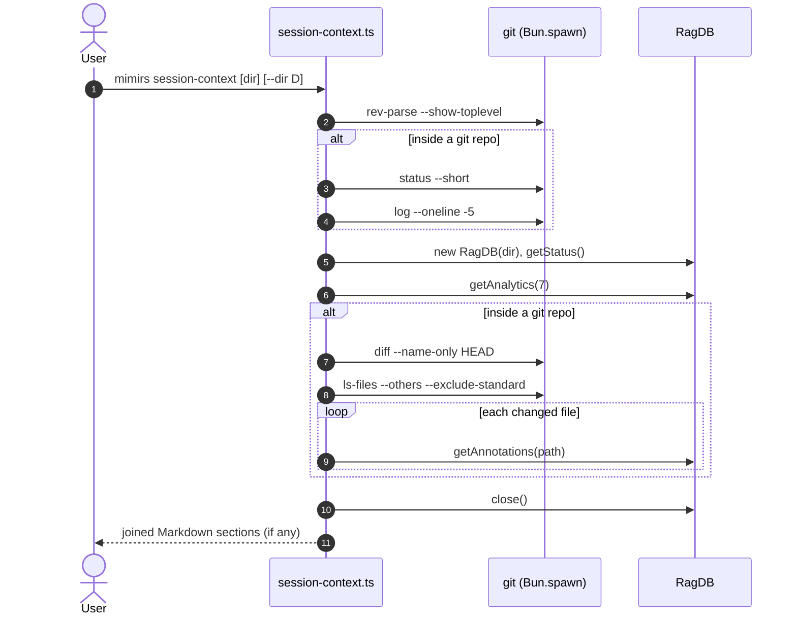

# CLI: session-context

`mimirs session-context` prints a short Markdown briefing meant to be read at the
start of a new working session. Instead of having an agent or developer
re-discover the state of the project, it assembles a few high-signal facts into
one block: what is uncommitted, what was committed recently, how big and how fresh
the index is, where recent searches came up empty, and which notes apply to the
files currently being worked on. It is read-only and writes nothing back
(`src/cli/commands/session-context.ts:16-101`).

## When to use it

Run it as the first thing in a session. It answers "what was I (or someone) doing
here, and what should I be careful of?" by combining four independent sources.
There is no learning curve: there are no subcommands and the only meaningful input
is which directory to inspect.

## What the briefing contains

The output is built as an array of Markdown sections that are joined with blank
lines at the end. Each section is appended only if it has content, so an empty
project can print nothing at all (`src/cli/commands/session-context.ts:18`,
`98-100`). The sections, in order:

| section | source | content |
|---------|--------|---------|
| Uncommitted changes | `git status --short` | The short-form working tree status, when non-empty (`src/cli/commands/session-context.ts:23-26`). |
| Recent commits | `git log --oneline -5` | The last five commits, one line each (`src/cli/commands/session-context.ts:28-31`). |
| Index | `db.getStatus()` | File count, chunk count, and last-indexed timestamp, only when at least one file is indexed (`src/cli/commands/session-context.ts:38-43`). |
| Search gaps | `db.getAnalytics(7)` | Up to 5 zero-result queries and up to 5 low-relevance queries from the last 7 days (`src/cli/commands/session-context.ts:45-63`). |
| Annotations on modified files | `db.getAnnotations(path)` per changed file | `[NOTE]` lines for any annotations attached to files changed or added since `HEAD` (`src/cli/commands/session-context.ts:66-90`). |

This briefing is composed from git, the index, search analytics, and annotations.
It does not read saved checkpoints — those are surfaced by the
[list_checkpoints](../tools/list-checkpoints.md) /
[search_checkpoints](../tools/search-checkpoints.md) tools, not by this command.

## Flow



1. The user runs the command with an optional directory and/or `--dir`
   (`src/cli/commands/session-context.ts:16-17`).
2. It finds the git root via `git rev-parse --show-toplevel`; a `null` result
   means the directory is not a git repo and all git sections are skipped
   (`src/cli/commands/session-context.ts:21-22`).
3. Inside a repo, it adds the working-tree status and the last five commits, each
   only when non-empty (`src/cli/commands/session-context.ts:23-31`).
4. It opens a `RagDB` and reads index status; the Index section appears only when
   files are indexed (`src/cli/commands/session-context.ts:37-43`).
5. It reads 7-day search analytics and, if any queries were logged, lists recent
   zero-result and low-relevance queries
   (`src/cli/commands/session-context.ts:45-63`).
6. Back inside the repo, it collects files changed since `HEAD` plus untracked
   files, then looks up annotations for each and prints them as `[NOTE]` lines
   (`src/cli/commands/session-context.ts:66-90`).
7. The database is closed and the non-empty sections are printed joined by blank
   lines (`src/cli/commands/session-context.ts:94-100`).

## Inputs

| name | type | required | description |
|------|------|----------|-------------|
| directory | path (positional) | no | `args[1]`, used as the working directory when present and not starting with `--`. Falls back to `--dir`, then `.` (`src/cli/commands/session-context.ts:17`). |
| `--dir` | path | no | Directory to inspect when no positional argument is given (`src/cli/commands/session-context.ts:17`). |

The directory feeds both the git commands (run from the discovered git root) and
the `RagDB` constructor.

## Outputs

| output | where it lands / shape / description |
|--------|--------------------------------------|
| session summary | stdout only. A single Markdown block of the non-empty sections joined by blank lines. If every section is empty, nothing is printed (`src/cli/commands/session-context.ts:98-100`). |

## How git is invoked

A small helper, `runGit`, spawns `git` with `Bun.spawn`, captures stdout, and
returns the trimmed output only when the process exits with code `0`; any thrown
error or non-zero exit yields `null` (`src/cli/commands/session-context.ts:5-14`).
This makes each git section self-guarding: outside a repo, or when a command
fails, that section is simply absent rather than an error. The status, log,
diff, and ls-files commands all run from the resolved git root, not the raw input
directory (`src/cli/commands/session-context.ts:21-32`, `66-68`).

## How annotations are matched to changed files

The set of "files I'm working on" is the union of two git queries:
`git diff --name-only HEAD` (tracked files changed since the last commit) and
`git ls-files --others --exclude-standard` (untracked, non-ignored files). Their
output lines are split, filtered for blanks, and collected into a set
(`src/cli/commands/session-context.ts:67-77`). For each such path,
`getAnnotations(relPath)` is called and every returned note becomes a `[NOTE]`
line; if the note targets a symbol, the header shows `path • symbol`
(`src/cli/commands/session-context.ts:80-85`). Because annotation paths are
matched by exact string, only notes stored under the same relative path git
reports will show up here.

## Branches and failure cases

| branch | behavior |
|--------|----------|
| no positional directory | Uses `--dir`, then `.` (`src/cli/commands/session-context.ts:17`). |
| not a git repo | `rev-parse` returns `null`; status, commits, and the annotations-on-changed-files section are all skipped (`src/cli/commands/session-context.ts:21-22`, `66`). |
| clean working tree | `git status --short` is empty, so the Uncommitted changes section is omitted (`src/cli/commands/session-context.ts:24`). |
| no commits | `git log` returns nothing usable; the Recent commits section is omitted (`src/cli/commands/session-context.ts:29`). |
| no index / DB error | Opening `RagDB`, reading status, or analytics is wrapped in `try/catch`; on failure all index/analytics/annotation sections are skipped (`src/cli/commands/session-context.ts:36`, `92-93`). |
| empty index | `getStatus().totalFiles === 0`, so the Index section is omitted (`src/cli/commands/session-context.ts:39`). |
| no logged queries | `getAnalytics(7).totalQueries === 0`, so the Search gaps section is omitted (`src/cli/commands/session-context.ts:46`). |
| queries but no gaps | If both zero-result and low-relevance lists are empty, the Search gaps section is omitted (`src/cli/commands/session-context.ts:60-62`). |
| no changed files with notes | If no changed file has annotations, the Annotations section is omitted (`src/cli/commands/session-context.ts:87-89`). |
| everything empty | Nothing is printed at all (`src/cli/commands/session-context.ts:98`). |
| DB always closed | `db?.close()` runs in `finally`, so the handle is released even on error (`src/cli/commands/session-context.ts:94-96`). |

## Example

```bash
# Brief the current project
bun run mimirs session-context

# Brief a specific project directory
bun run mimirs session-context /path/to/project
```

Illustrative output:

```
## Uncommitted changes
 M src/db/conversation.ts
?? src/db/new-helper.ts

## Recent commits
1a2b3c4 fix: handle empty JSONL
5d6e7f8 feat: tail conversation transcripts

## Index
312 files, 4821 chunks (last indexed: 2026-05-28T09:14:02.000Z)

## Search gaps
Zero-result queries (last 7 days):
  3× "webhook retry policy"
Low-relevance queries:
  "vector dimension mismatch" (score: 0.21)

## Annotations on modified files
  [NOTE] src/db/conversation.ts • insertTurn: INSERT OR IGNORE; returns 0 on duplicate.
```

## Key source files

- `src/cli/commands/session-context.ts` — directory resolution, the `runGit`
  helper, section assembly, and final output.
- `src/db/files.ts` — `getStatus`, the file/chunk/last-indexed summary.
- `src/db/analytics.ts` — `getAnalytics`, source of the search-gap lists.
- `src/db/annotations.ts` — `getAnnotations`, looked up per changed file.
