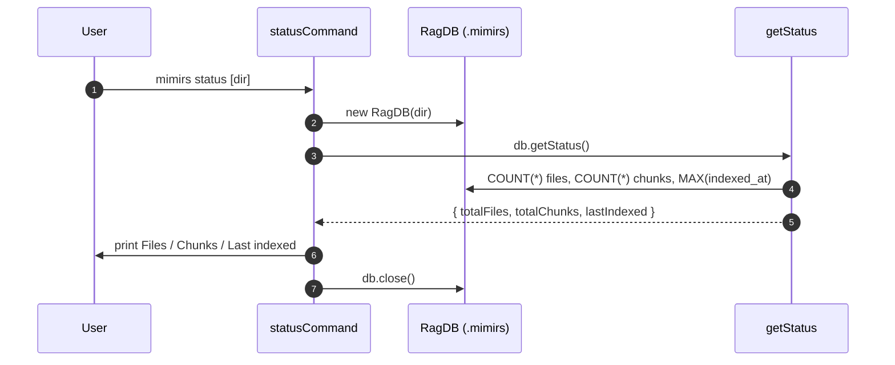

# CLI: status

`mimirs status` gives a quick, offline answer to "is this project indexed, and
how much?" It opens the project's local database, reads three numbers — how many
files and chunks are stored and when the most recent file was indexed — and
prints them. It does not contact a running server and does not change anything.

Reach for it when you want to confirm an index exists and is not empty, for
example right after running [index](index.md) or when debugging why
[search](search.md) returns nothing. It reads straight from the database on
disk, so it works whether or not the MCP server is running.

The whole command is `statusCommand` in `src/cli/commands/status.ts:5`. The
numbers come from `getStatus` in `src/db/files.ts:363`.

## What the command does

`statusCommand` resolves the target directory, opens the database, calls
`getStatus`, prints a four-line summary, and closes the database
(`src/cli/commands/status.ts:5-13`).



1. The user runs the command, optionally naming a directory. The first
   positional argument is the directory; if it is missing or starts with `--`,
   the current directory is used. The path is resolved to absolute
   (`src/cli/commands/status.ts:6`).
2. The command opens the project database with `new RagDB(dir)`
   (`src/cli/commands/status.ts:7`).
3. It calls `db.getStatus()`, which runs three SQL queries: a `COUNT(*)` over
   the `files` table, a `COUNT(*)` over the `chunks` table, and a query for the
   most recent `indexed_at` value (`src/cli/commands/status.ts:8`,
   `src/db/files.ts:363-380`).
4. It prints a header naming the directory, then the file count, chunk count,
   and last-indexed timestamp (`src/cli/commands/status.ts:9-12`).
5. It closes the database (`src/cli/commands/status.ts:13`).

## Inputs

| name | type | required | description |
|------|------|----------|-------------|
| directory | positional arg | no | Project directory to inspect. Taken from `args[1]` only when present and not a flag; otherwise defaults to `.` and is resolved to an absolute path (`src/cli/commands/status.ts:6`). |

The data it reports comes entirely from the `.mimirs` database for that
directory; there are no other inputs and no flags.

## Outputs

| output | where it lands / shape / description |
|--------|--------------------------------------|
| Header | `Index status for <dir>:` printed to stdout (`src/cli/commands/status.ts:9`). |
| `Files` | `status.totalFiles` — the row count of the `files` table (`src/cli/commands/status.ts:10`, `src/db/files.ts:364-367`). |
| `Chunks` | `status.totalChunks` — the row count of the `chunks` table (`src/cli/commands/status.ts:11`, `src/db/files.ts:368-370`). |
| `Last indexed` | `status.lastIndexed`, or the literal `never` when it is null — the newest `indexed_at` timestamp across all files (`src/cli/commands/status.ts:12`, `src/db/files.ts:371-379`). |

This command is read-only: it writes nothing to disk and changes no stored
state.

## When to use status vs the MCP tools

All three surfaces report on the index, but they differ in scope and in whether
a server must be running.

| | `mimirs status` (CLI) | `index_status` (MCP tool) | `server_info` (MCP tool) |
|--|------------------------|----------------------------|---------------------------|
| How it runs | standalone CLI, reads the DB directly | a tool call to a running server | a tool call to a running server |
| Server required | no | yes | yes |
| Reports | files, chunks, last-indexed for one directory | index counts and indexing progress as seen by the server | which projects/databases the server has connected |

Prefer `mimirs status` for a fast, offline sanity check from the shell. Use
[index_status](../tools/index-status.md) or [server_info](../tools/server-info.md)
when an agent needs the live view from inside a running server session.

## Branches and failure cases

- **Default directory.** With no positional argument, or an argument that starts
  with `--`, the target is the current directory
  (`src/cli/commands/status.ts:6`).
- **Never indexed.** When the `files` table has no rows, the most-recent
  `indexed_at` query returns nothing, `lastIndexed` is null, and the command
  prints `Last indexed: never`; `Files` and `Chunks` show `0`
  (`src/cli/commands/status.ts:12`, `src/db/files.ts:371-379`).
- **Fresh, empty database.** Opening a directory that has never been indexed
  still creates/opens the database via `new RagDB(dir)` and reports zero counts
  rather than erroring (`src/cli/commands/status.ts:7-12`).

## Example

```bash
# Status for the current project.
mimirs status

# Status for a specific directory.
mimirs status ./packages/api
```

Illustrative output:

```
Index status for /Users/example/my-app:
  Files:        124
  Chunks:       1893
  Last indexed: 2026-05-28T11:42:07.512Z
```

For a directory that has never been indexed:

```
Index status for /Users/example/empty:
  Files:        0
  Chunks:       0
  Last indexed: never
```

## Key source files

- `src/cli/commands/status.ts` — the command: directory resolution, the
  `getStatus` call, and the printed summary.
- `src/db/files.ts` — `getStatus`, the three queries that produce the file
  count, chunk count, and last-indexed timestamp.
- `src/db/index.ts` — `RagDB`, which exposes `getStatus` on the opened database.

## Related pages

- [index](index.md) — builds or refreshes the index whose totals this command
  reports.
- [index_status](../tools/index-status.md) — the server-side equivalent for an
  agent.
- [server_info](../tools/server-info.md) — reports which projects a running
  server has connected.
