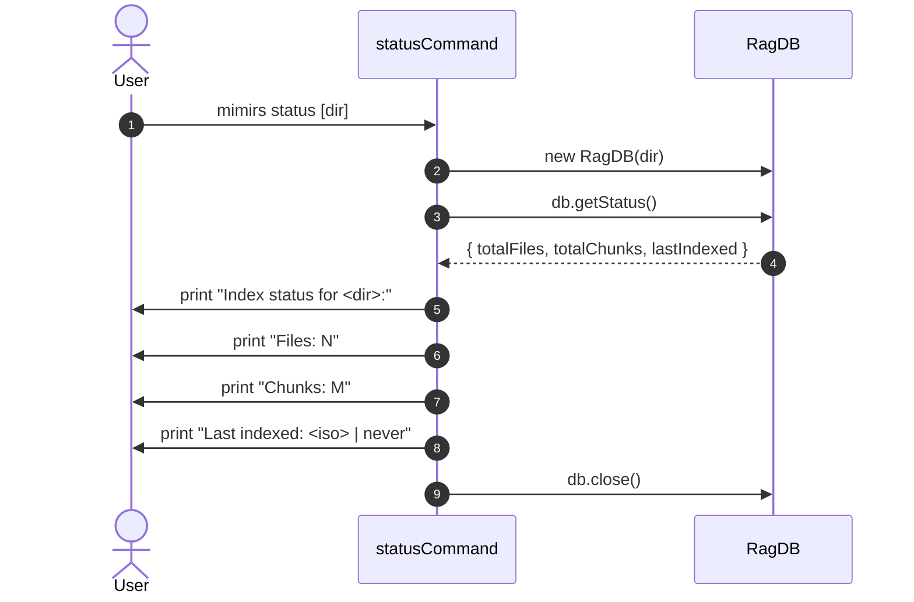

# CLI: status

`mimirs status` reads three counters out of the local index database and prints them. It is the simplest health check for "is this project indexed at all, and when did the last index run finish".

It does not contact a running server, does not look at `.mimirs/status` (which is the server's progress file), and does not read any config beyond what's needed to open the DB.

## Flow



1. The CLI resolves the directory argument (defaulting to `.` when missing or when the first arg begins with `--`) (`src/cli/commands/status.ts:6`).
2. `new RagDB(dir)` opens (and creates if needed) `.mimirs/rag.db` and runs migrations. This is the same call that every other command uses, so the existence of the DB file is itself part of what "status" tells you.
3. `db.getStatus()` returns `totalFiles`, `totalChunks`, and `lastIndexed`. `lastIndexed` is a string timestamp or `null` (printed as `never`).
4. Three lines are printed verbatim, then the DB is closed (`src/cli/commands/status.ts:9-13`).

## Inputs

| Input | Source | Notes |
| --- | --- | --- |
| `directory` | first positional arg | Defaults to `.`. Args starting with `--` are skipped so flag-only invocations still default to cwd (`src/cli/commands/status.ts:6`). |

## Outputs

| Output | Where | Notes |
| --- | --- | --- |
| `Index status for <dir>:` header | stdout | Uses the resolved absolute path. |
| `Files: N` | stdout | Total rows in the `files` table. |
| `Chunks: M` | stdout | Total rows in the `chunks` table. |
| `Last indexed: <ts>` | stdout | Most recent indexed timestamp on `files`, or the literal `never` when nothing is indexed yet. |

## Branches and failure cases

- **Empty index.** All three values come back as 0 / `never` and the command exits cleanly. There is no "warn the user" branch — interpreting the output is left to the reader.
- **Missing DB file.** `new RagDB(dir)` creates the DB on first open, so calling status in a fresh directory will print zeros instead of erroring. To check that the IDE-launched server is healthy, look at `.mimirs/status` (see [serve](serve.md)) or run [doctor](doctor.md).
- **Unsafe directory.** The `RagDB` constructor goes through the dir-guard for unsafe paths; if the resolved directory is the user's home or a system root, opening the DB throws and the CLI exits with the thrown message. This is intentional — the same guard protects every entry point.

## Example

```bash
mimirs status
# Index status for /Users/me/repos/foo:
#   Files:        312
#   Chunks:       4287
#   Last indexed: 2026-05-27T14:33:12.420Z

mimirs status ../other-project
# Index status for /Users/me/repos/other-project:
#   Files:        0
#   Chunks:       0
#   Last indexed: never
```

## When to use this vs other status surfaces

| Surface | Reads | Use when |
| --- | --- | --- |
| `mimirs status` | DB counters | Quick CLI check of "is anything indexed yet". |
| `.mimirs/status` (file) | server-written status | Watching live indexing progress (`starting / N/M files / done`). Written by `serve`, see [serve](serve.md). |
| `index_status` MCP tool | DB counters | Same numbers as `mimirs status`, but addressable from inside an MCP client. |
| `server_info` MCP tool | live server state | Connected DBs, version, uptime — only meaningful from inside the running server. |

`mimirs status` is the smallest of the four. Reach for it when you want to confirm that the index database itself has rows; reach for `.mimirs/status` when you want to know whether the server is currently scanning or finished; reach for the MCP tools when you are already in an agent session.

## Key source files

- `src/cli/commands/status.ts` — full command (14 lines).
- `src/db/index.ts` — `RagDB` constructor and `getStatus()`.

## Related flows

- [tools/index-status](../tools/index-status.md) — same counters over MCP.
- [tools/server-info](../tools/server-info.md) — live server state, complementary view.
