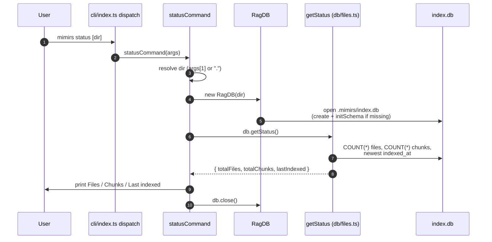

# CLI: status

`mimirs status [dir]` is a fast, read-only health check for a project's search index. It answers three questions without re-indexing anything: how many files are tracked, how many searchable chunks exist, and when the index was last updated. Reach for it when you want to confirm a directory has actually been indexed, gauge how stale the index is before trusting a search, or sanity-check that an indexing run produced the file and chunk counts you expected.

The command does almost no work of its own. It opens the project database, runs three small counting queries, prints the numbers, and closes the connection. There is no embedding, no file-system scan, and no writing to existing rows — running `status` twice in a row produces identical output and leaves the index untouched.

## How it runs

The CLI entry point reads the process arguments and dispatches on the first word. When that word is `status`, it awaits the status handler with the full argument list `src/cli/index.ts:128-129`. The handler resolves the target directory, opens the index, reads the stats, prints them, and closes the connection `src/cli/commands/status.ts:5-14`.



1. The user runs `mimirs status` with an optional directory. The shell hands the arguments to the CLI, which slices off the program name and treats the remaining words as `args`, dispatching on `args[0]` `src/cli/index.ts:26-27`.
2. The `status` branch of the dispatcher awaits `statusCommand(args)`, passing the whole argument array so the handler can read the optional directory itself `src/cli/index.ts:128-129`.
3. The handler resolves the target directory. It uses `args[1]` only when that argument exists and does not start with `--`; otherwise it falls back to the current directory `"."`. The chosen value is run through `resolve(...)` so the printed path and the database location are absolute `src/cli/commands/status.ts:6`.
4. The handler constructs a `RagDB` for that directory. The constructor locates the index folder (`.mimirs` under the project, or an override), ensures it exists, opens `index.db`, and creates the schema if it is not already present `src/db/index.ts:94-140`.
5. The handler calls `db.getStatus()`, which delegates to the `getStatus` helper in the files module `src/db/index.ts:646-648`.
6. `getStatus` issues three SQL queries against `index.db`: a `COUNT(*)` on `files`, a `COUNT(*)` on `chunks`, and a single-row lookup of the most recent `indexed_at` timestamp `src/db/files.ts:354-372`.
7. The numbers come back as `{ totalFiles, totalChunks, lastIndexed }`. The handler prints a header with the resolved directory, then one line each for files, chunks, and the last-indexed time, substituting the literal `never` when no file has ever been indexed `src/cli/commands/status.ts:9-12`.
8. The handler closes the database connection so the process can exit cleanly `src/cli/commands/status.ts:13`.

## Inputs

| name | type | required | description |
| --- | --- | --- | --- |
| `dir` (positional) | string | no | Project directory to inspect, read from `args[1]`. Accepted only if present and not starting with `--`; otherwise the current working directory is used. Resolved to an absolute path before opening the index `src/cli/commands/status.ts:6`. |

There are no flags for this command. Any leading `--` argument in the slot where a directory would go is ignored, and the resolver falls back to `"."`.

## Outputs

| output | where it lands / shape / description |
| --- | --- |
| Status header | Stdout line `Index status for <absolute dir>:` echoing the resolved directory `src/cli/commands/status.ts:9`. |
| `Files` | Stdout line with the total number of tracked files — the row count of the `files` table `src/cli/commands/status.ts:10`. |
| `Chunks` | Stdout line with the total number of searchable chunks — the row count of the `chunks` table `src/cli/commands/status.ts:11`. |
| `Last indexed` | Stdout line with the newest `indexed_at` timestamp (ISO 8601 string), or the word `never` when the `files` table is empty `src/cli/commands/status.ts:12`. |

All four lines go to stdout through the CLI logger, which is a thin wrapper over `console.log` with no prefix `src/utils/log.ts:49-53`. The command does not set its own process exit code; it returns normally after closing the database.

## Where the numbers come from

`getStatus` reads three pieces of state straight from `index.db` `src/db/files.ts:354-372`:

- `totalFiles` is `SELECT COUNT(*) FROM files`. Each row in `files` is one indexed file, with a unique `path`, a content `hash`, and an `indexed_at` timestamp `src/db/index.ts:172-177`.
- `totalChunks` is `SELECT COUNT(*) FROM chunks`. Each chunk is a semantic unit (a function, class, or section) belonging to a file via `file_id`, and is what search actually ranks `src/db/index.ts:179-189`.
- `lastIndexed` is the single newest `indexed_at`, found by `ORDER BY indexed_at DESC LIMIT 1`. The value is an ISO 8601 string written with `new Date().toISOString()` whenever a file is inserted or re-indexed `src/db/files.ts:51-61`. Because indexing updates a file's `indexed_at` in place on every run, this reflects the most recent indexing activity, not the first.

The same `getStatus` method backs other surfaces, so the numbers here match what those report. The MCP `index_status` tool reads the same fields and prints a near-identical `Files` / `Chunks` / `Last indexed` block `src/tools/index-tools.ts:105-111`, the post-index summary calls it to show the resulting counts `src/tools/index-tools.ts:56-60`, and the session-context summary reuses it too `src/cli/commands/session-context.ts:38-41`. See [index_status](../tools/index-status.md) for the agent-facing equivalent of this command.

## Branches and failure cases

- **No directory argument**: when `args[1]` is missing, the handler resolves `"."` — the current working directory `src/cli/commands/status.ts:6`.
- **A flag where the directory would be**: if `args[1]` starts with `--`, it is not treated as a directory; the resolver falls back to `"."`. `status` defines no flags, so this only matters if someone passes a stray flag.
- **Empty or fresh index**: a brand-new `RagDB` creates the schema, so the `files` and `chunks` tables exist but are empty. `COUNT(*)` returns `0` for both, and the newest-`indexed_at` lookup returns no row, so `lastIndexed` is `null` and the output prints `never` `src/db/files.ts:361-370`, `src/cli/commands/status.ts:12`.
- **Directory never indexed**: pointing `status` at a directory with no prior index still creates an empty `.mimirs/index.db` as a side effect of opening it, then reports zero files, zero chunks, and `never`. Running `status` is therefore not entirely free of file-system effects — it may create the index folder and an empty database `src/db/index.ts:109-139`.
- **Unwritable index location**: if the `.mimirs` directory (or the configured `RAG_DB_DIR`) cannot be created because the path is read-only or permission-denied (`EROFS`/`EACCES`), the `RagDB` constructor throws a descriptive error pointing at the offending path and suggesting a writable `RAG_DB_DIR` `src/db/index.ts:110-122`. The error propagates out of the handler to the CLI's top-level error handling.
- **Embedding-dimension mismatch**: if an existing index was built with a different embedding dimension than the currently configured model produces, the constructor fails loudly before `getStatus` ever runs, telling you to restore the previous embedding config or rebuild the index `src/db/index.ts:149-168`.

## State changes

`status` is fundamentally a read. The only state it can change is incidental to opening the index: if the target directory has no `.mimirs/index.db` yet, the `RagDB` constructor creates the directory, opens a new SQLite database, and runs `initSchema` to create the empty tables `src/db/index.ts:109-139`. After that, every `status` invocation is purely a read — the three queries in `getStatus` only `SELECT`, never write `src/db/files.ts:354-372`.

| state | before | after | why it matters |
| --- | --- | --- | --- |
| `.mimirs/index.db` | absent for a never-indexed directory | present but empty (schema only) | A first `status` on a fresh directory leaves behind an empty index. The reported counts are all zero and `Last indexed` is `never`, but the file now exists on disk `src/db/index.ts:134-139`. |
| `files` / `chunks` rows | unchanged | unchanged | The counting queries do not mutate the index, so `status` is safe to run repeatedly and concurrently with searches `src/db/files.ts:354-372`. |

## Example

Inspect the current directory:

```
$ mimirs status
Index status for /Users/example/projects/my-app:
  Files:        128
  Chunks:       1342
  Last indexed: 2026-05-31T14:02:11.084Z
```

Inspect a specific project directory that has never been indexed:

```
$ mimirs status ~/repos/other-app
Index status for /Users/example/repos/other-app:
  Files:        0
  Chunks:       0
  Last indexed: never
```

The second example shows a directory with no prior index: zero files, zero chunks, and `never` for the timestamp.

## Key source files

- `src/cli/index.ts` — CLI entry point; slices process args and dispatches `status` to the handler `src/cli/index.ts:128-129`.
- `src/cli/commands/status.ts` — the handler; resolves the directory, opens the DB, reads stats, prints four lines, closes the DB.
- `src/db/index.ts` — the `RagDB` class; the constructor opens or creates `index.db` and `getStatus` delegates to the files module.
- `src/db/files.ts` — `getStatus` runs the three counting queries that produce `totalFiles`, `totalChunks`, and `lastIndexed`.
- `src/utils/log.ts` — `cli.log`, the prefix-free stdout wrapper used for all four output lines.

## Related commands

- [index_status](../tools/index-status.md) — the MCP tool that exposes the same index stats to agents, backed by the same `getStatus` method.
- [index](index.md) — the CLI dispatcher and command list this handler is wired into.
