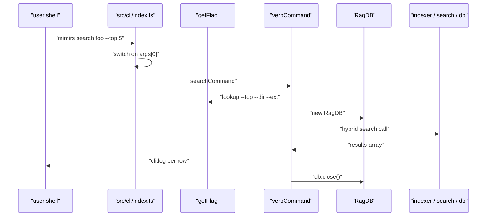
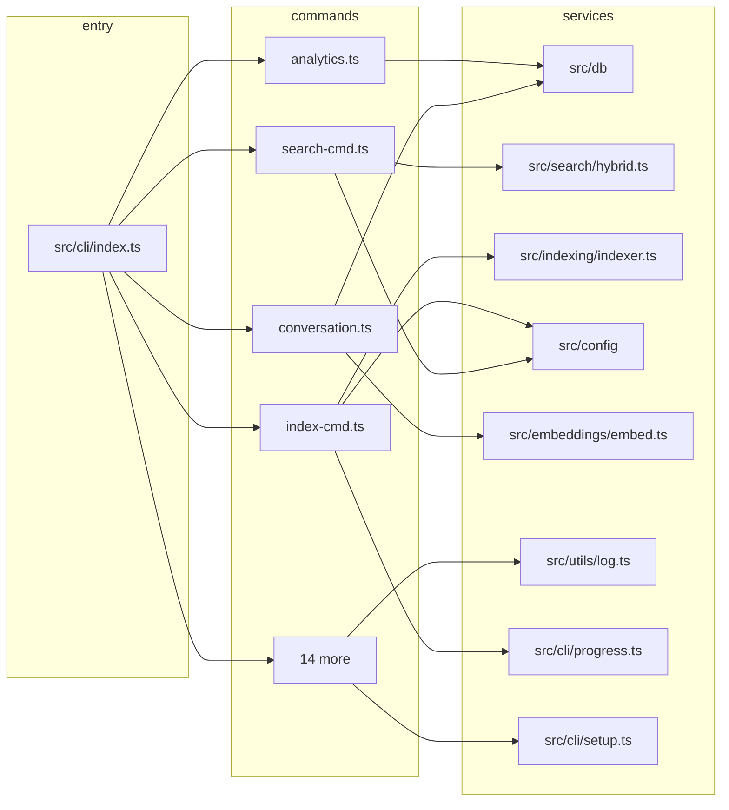

# CLI Commands

> [Architecture](../architecture.md)
>
> Generated from `b47d98e` · 2026-04-26

This community holds the 19 subcommand handlers that sit behind `mimirs <subcommand>`. Each handler is a short async function that owns one verb of the public CLI surface — `index`, `search`, `serve`, `doctor`, `cleanup`, and the rest. The handlers are deliberately thin: they parse their own flags, open a `RagDB`, call into the indexing, search, conversation, git, or wiki layers, print to `cli`, and close the DB. This page is the reference for adding a new command or tracing what happens when a user runs the binary.

## Per-file breakdown

The handlers split into a few rough roles. The reference handlers (`indexCommand`, `searchCommand`, `analyticsCommand`, `statusCommand`) wrap the database directly. The lifecycle handlers (`initCommand`, `cleanupCommand`, `doctorCommand`, `serveCommand`, `demoCommand`) wrap install, removal, and runtime concerns. The corpus handlers (`conversationCommand`, `checkpointCommand`, `annotationsCommand`, `historyCommand`) layer on the conversation, checkpoint, annotation, and git-commit indexes. The evaluation handlers (`benchmarkCommand`, `benchmarkModelsCommand`, `evalCommand`) drive the search-quality harness. Three utility handlers (`mapCommand`, `removeCommand`, `sessionContextCommand`) round out the surface.

### `src/cli/commands/analytics.ts`

The top-PageRank member of the community and the cleanest illustration of the handler contract. `analyticsCommand` resolves `dir` from positional arg or `--dir`, parses `--days` (default `30`), constructs a `RagDB`, and prints two things: the rolled-up `getAnalytics(days)` summary and a `getAnalyticsTrend(days)` comparison against the prior period of the same length. The trend block is conditional — it is suppressed unless either the current or the prior window has any queries — so a brand-new project doesn't show a meaningless trend section. The handler computes its own zero-result rate (`zeroCount / totalQueries * 100`) rather than asking the DB; the DB returns the raw counts and lists. Output is printed line-by-line via `cli.log`; there is no JSON mode.

### `src/cli/commands/index-cmd.ts`

`indexCommand` is the canonical wrapper around `indexDirectory`. It loads `RagConfig` via `loadConfig(dir)`, calls `applyEmbeddingConfig(config)` so the global embedder picks up project-overridden model/dim before any chunk is embedded, and applies `--patterns` as a comma-split override of `config.include`. The interesting bit is the progress strategy: when `--verbose` is off the handler builds a `quietProgress` lazily on the `Found N files to index` line, then forwards every subsequent message to that quiet progress; when verbose, it pipes straight to `cliProgress`. The final `Done: indexed/skipped/pruned` line is unconditional; errors are printed but do not change the exit code.

### `src/cli/commands/search-cmd.ts`

`searchCommand` and `readCommand` (re-exported from the same file) wrap `search()` and `searchChunks()` from `src/search/hybrid.ts`. The novel piece is `buildCliFilter`, which translates `--ext`/`--extensions`, `--in`/`--dirs`, and `--exclude`/`--exclude-dirs` into a `PathFilter`. The dir filters are resolved against `projectDir` (so `--in src` becomes an absolute path before reaching the DB); extensions stay as-is. `parseListFlag` accepts the first non-empty alias when both forms are passed. When no filter flags are present `buildCliFilter` returns `undefined` and the search falls back to the unfiltered code path.

### `src/cli/commands/init.ts`

`initCommand` is two phases: `runSetup(dir, ides)` (from `src/cli/setup.ts`) writes the IDE-side MCP config and the project-side `.mimirs/config.json`; if the user accepts the `Index project now? [Y/n]` prompt it then runs `indexDirectory`. The handler also writes a `.mimirs/status` file during indexing so an external process (an IDE-spawned background indexer, for example) can poll progress out-of-band. `--yes`/`-y` skips the confirm. Unknown IDEs surface a printed MCP snippet (`mcpConfigSnippet(dir)`) so the user can paste it into a config the setup helper doesn't know about.

### `src/cli/commands/serve.ts`

`serveCommand` is unique: it does not take `args` or `getFlag` and is dynamically imported by the dispatcher. The `import("../../server")` is wrapped in a try/catch because the server module has top-level await and pulls in `bun:sqlite` and `sqlite-vec`; a static import would crash the CLI before any error handler runs, blocking even `mimirs doctor`. On module-load failure the handler writes `.mimirs/server-error.log` (with stack and a hint to run `bunx mimirs doctor`) and `.mimirs/status` with phase `module load failed` before re-throwing. On success it logs to stderr (`process.stderr.write`) so stdout stays clean for MCP framing.

### `src/cli/commands/status.ts`

The thinnest handler. `statusCommand` opens the DB, calls `db.getStatus()`, and prints `totalFiles`, `totalChunks`, and `lastIndexed` (or `never`). No flags beyond the optional positional `dir`.

### `src/cli/commands/remove.ts`

`removeCommand` resolves a file path, calls `db.removeFile(resolve(file))`, and prints `Removed <file>` or `<file> was not in the index` based on the boolean return. The double `resolve` matters — the first turns the dir arg into an absolute project root, the second resolves the file relative to the user's CWD before passing to the DB.

### `src/cli/commands/map.ts`

`mapCommand` opens the DB and calls `generateProjectMap(db, { projectDir, focus, zoom })` from `src/graph/resolver.ts`. `--focus` narrows the graph to a file's neighborhood; `--zoom` toggles between `"file"` and `"directory"` granularity, defaulting to `"file"`. The result is a Mermaid string written straight to `cli.log`.

### `src/cli/commands/benchmark.ts` and `src/cli/commands/benchmark-models.ts`

`benchmarkCommand` runs `loadBenchmarkQueries` + `runBenchmark` against the existing index and prints a formatted report. The non-obvious behavior is the exit code: if `summary.recallAtK < config.benchmarkMinRecall || summary.mrr < config.benchmarkMinMrr` the process exits with `1`, so the command can gate CI. `benchmarkModelsCommand` is the multi-model variant: it ships a hardcoded `KNOWN_MODELS` table (`Xenova/all-MiniLM-L6-v2` 384d, `Xenova/bge-small-en-v1.5` 384d, `Xenova/jina-embeddings-v2-small-en` 512d, `jinaai/jina-embeddings-v2-base-code` 768d), accepts unknown models in `model-id:dim` form via `parseModelArg`, and indexes the project once per model into a temp dir before benchmarking — so re-indexing cost is paid per model, not per query.

### `src/cli/commands/eval.ts`

`evalCommand` mirrors the benchmark wrapper but calls into `loadEvalTasks`, `runEval`, and `formatEvalReport` from `src/search/eval.ts`. It additionally honors `--out F`, in which case `saveEvalTraces(summary.traces, resolve(outPath))` writes the per-task traces as JSON for offline inspection.

### `src/cli/commands/conversation.ts`

`conversationCommand` dispatches a `search`, `sessions`, or `index` subcommand. The `search` path is the interesting one: before searching it walks `discoverSessions(dir)` and re-indexes any session whose `mtime` is newer than the stored row, so a long-running shell always searches a fresh corpus. It then runs a hybrid merge by hand — vector results from `db.searchConversation`, BM25 from `db.textSearchConversation` (wrapped in try/catch because FTS can fail on special chars), and a `Map<turnId>`-keyed merge weighted by `config.hybridWeight`. This duplicates the hybrid logic in `src/search/hybrid.ts` because conversation rows live in a different table.

### `src/cli/commands/checkpoint.ts`

`checkpointCommand` dispatches `create` / `list` / `search`. `create` is the load-bearing path: it embeds `${title}. ${summary}` (so checkpoint search hits on either field), pulls `sessionId` from the first session returned by `discoverSessions(dir)` (falling back to `"unknown"`), and pins `turnIndex = max(0, getTurnCount(sessionId) - 1)` so the checkpoint anchors to the latest turn. Comma-split `--files` and `--tags` flags become arrays.

### `src/cli/commands/annotations.ts`

`annotationsCommand` is read-only: list all annotations or filter by `--path P`. Annotation creation/edit/delete lives on the MCP tool surface, not the CLI. Output prints `#id  path • symbolName [author]` then the note body and `updatedAt`.

### `src/cli/commands/history.ts`

`historyCommand` dispatches `index` / `search` / `status`. `historyIndexCommand` calls `indexGitHistory(dir, db, { since, threads, onProgress })`. The non-obvious bit is the quiet progress: in non-verbose mode, `transient` messages are dropped, and only summary-prefixed messages (starting with `Scanning`, `Found`, `Indexing`, `No `, `All `, `Warning`) survive. `--since REF` constrains how far back to walk.

### `src/cli/commands/session-context.ts`

`sessionContextCommand` is the "what should I look at to start this session" report. It runs four passes: `git status --short` and `git log --oneline -5` (printed only when present), `db.getStatus()` (printed only when files > 0), `db.getAnalytics(7)` (zero-result and low-relevance queries from the last week), and finally `db.getAnnotations(relPath)` for every modified or untracked file. Sections only appear when they have content, so a clean repo with no annotations yields a short report. Git failures degrade silently: `runGit` returns `null` on non-zero exit and the corresponding section is dropped.

### `src/cli/commands/doctor.ts`

`doctorCommand` walks a list of `Check` objects (`name` + `run() => string | null`), each returning `null` for pass or an error string. The most involved check rebuilds the SQLite extension load that `RagDB` does — on macOS it locates `/opt/homebrew/opt/sqlite/lib/libsqlite3.dylib` (or the `/usr/local` variant), calls `Database.setCustomSQLite(found)`, opens an in-memory DB, calls `sqliteVec.load(testDb)`, and queries `vec_version()`. If anything fails the user gets the exact `brew install sqlite` hint.

### `src/cli/commands/cleanup.ts`

`cleanupCommand` is the inverse of `init`. `removeInstructionsBlock` strips the `<!-- mimirs -->` marker block (or, lacking the marker, the `## Using mimirs tools` heading) from a markdown file; if the file is empty after stripping it deletes the file. `removeMcpEntry` removes the `mimirs` key from a JSON MCP config and deletes the file when no servers remain. The `-y` flag skips per-file confirmation.

### `src/cli/commands/demo.ts`

`demoCommand` is a guided walkthrough — index, search, read — wrapped in ANSI-colored section headers (`CYAN`, `GREEN`, `YELLOW`, `MAGENTA`, `DIM`, `BOLD`) and short `pause(ms)` waits between blocks. `renderBlock` truncates each chunk preview to `maxLines` and wraps lines at `wrap` columns with an ellipsis suffix.

## How it works

`main()` in `src/cli/index.ts` slices `process.argv.slice(2)` into `args`, picks `command = args[0]`, and dispatches through a single `switch`. `getFlag(flag)` is closed over `args` and looks up the value as `args[args.indexOf(flag) + 1]` — there is no `=`-form support and no boolean flag parsing beyond `args.includes("-v")`. The `serve` case is the only one that does a dynamic `import` of its handler; every other handler is statically imported at the top of the file. Each handler then opens its own `RagDB`, performs its work, and closes it; there is no shared DB lifecycle across commands.

## Dependencies and consumers

The community has exactly one external consumer (`src/cli/index.ts`) — handlers are not reused outside the dispatcher. Inside, every handler imports `RagDB` from `src/db`, every interactive handler imports `cli` from `src/utils/log`, and the search/index/eval/benchmark group share `loadConfig` (and `applyEmbeddingConfig` where embeddings are about to run) from `src/config`. `src/cli/progress.ts` is the second-most-shared dep — `cliProgress` and `createQuietProgress` appear in `src/cli/commands/index-cmd.ts`, `src/cli/commands/init.ts`, `src/cli/commands/demo.ts`, and `src/cli/commands/history.ts`. `src/cli/setup.ts` is exclusive to `init` and `cleanup`.

## Internals

Every handler that takes flags has the same signature: `(args: string[], getFlag: (flag: string) => string | undefined)`. The zero-flag handlers (`removeCommand`, `demoCommand`, `cleanupCommand`, `doctorCommand`, `statusCommand`) take only `args`; `serveCommand` takes nothing. The dispatcher uses `args.includes("--yes")` / `args.includes("-v")` for boolean flags rather than passing them through `getFlag`, which is why both forms appear inside handlers (e.g. `args.includes("--verbose") || args.includes("-v")` inside `indexCommand` and `historyIndexCommand`).

The positional-vs-flag dance for `dir` is repeated across handlers: `args[1] && !args[1].startsWith("--") ? args[1] : getFlag("--dir") || "."`. This lets `mimirs status .`, `mimirs status --dir .`, and `mimirs status` all resolve to the same path. `searchCommand` is the exception — it takes the query as `args[1]` and only honors `--dir`.

Comma-split list parsing has two flavors. The simple form (`--files`, `--tags`, `--patterns`, `--models`) is `getFlag("--x")?.split(",").map(s => s.trim())`. The aliased form (`--ext`/`--extensions`, `--in`/`--dirs`, `--exclude`/`--exclude-dirs`) lives in `parseListFlag` inside `src/cli/commands/search-cmd.ts`, which iterates aliases and returns the first non-empty list.

DB lifecycle is per-handler: every handler that opens `new RagDB(dir)` calls `db.close()` before returning, and every error path that exits via `process.exit(1)` does so before the open. The exception is `sessionContextCommand`, which uses a `try/finally` (`db?.close()`) because it tolerates a missing index. There is no shared DB pool across commands.

`cli` (from `src/utils/log`) is the universal output sink — never `console.log`. `serveCommand` is the lone exception: it writes diagnostics to `process.stderr.write` directly so MCP framing on stdout is undisturbed.

## Why it's built this way

Each command is a single file with a single exported async function for one reason: the dispatcher in `src/cli/index.ts` should fit on a screen. A class hierarchy or a yargs-style declarative tree was rejected because the handlers don't share enough logic to justify the indirection — the shared bits (`RagDB` lifecycle, flag parsing) are short enough that copy-paste plus a lint check is cheaper than abstracting them.

`serve` is dynamically imported because the alternative — a static import at the top of `src/cli/index.ts` — would pull `bun:sqlite`, `sqlite-vec`, and the server's top-level awaits into the module-load graph of every `mimirs --help` invocation. A user with a missing or broken `sqlite-vec` would not be able to run `mimirs doctor` to diagnose the problem.

Per-handler DB construction was chosen over a CLI-wide singleton because each subcommand is its own short-lived process; there is nothing to amortize. Holding a DB open across commands would require lifecycle code in `src/cli/index.ts` that handlers like `serve` (which never closes) and `cleanup` (which deletes the DB) would need to opt out of.

## Trade-offs

The flag parser is a thin loop, not a library. The gain is that every flag — its name, its default, its parser — is visible in the handler that uses it; the cost is that flags that should behave consistently (like the `--dir`/positional `dir` dance) are reimplemented per-file with subtle drift. `--ext` / `--extensions` aliases live in `src/cli/commands/search-cmd.ts` only; `--days` lives in `src/cli/commands/analytics.ts` only; there is no shared schema and no `--help` per command.

The hybrid-search merge is duplicated between `searchCommand` (which calls `search()` from `src/search/hybrid.ts`) and `conversationCommand` (which merges by hand in the handler). The cost is one duplicate weighted-merge body; the gain is that `conversation` doesn't need the `hybrid.ts` machinery to learn about conversation rows.

`process.exit(1)` is sprinkled liberally for usage errors. The cost is that handlers can't be composed (every error kills the process); the gain is that error reporting stays at the surface where the flag was parsed, with the exact `Usage:` string adjacent to the parser.

## Common gotchas

`getFlag("--top")` returns the *next* argv entry — `mimirs search foo --top` (with no value) reads whatever follows `foo` as the top, including another flag. There is no validation pass; `parseInt(undefined)` papers over the missing value via the default fallback, but typoed flag names produce silent fallbacks, not errors.

`mimirs serve` writes its startup banner (`[mimirs] Starting MCP server (stdio)`) to *stderr*, not stdout. Tail `.mimirs/server-error.log` and `.mimirs/status`, not the stdout stream of the spawned process — stdout carries MCP framing.

`indexCommand` and `historyCommand` both call `applyEmbeddingConfig(config)` before any embedding runs; `searchCommand` does too. If you add a new handler that embeds, copy that line — the global embedder defaults to a fixed model, and silent dimension mismatches surface as zero-relevance results, not as errors.

`conversationCommand` `search` re-indexes any session whose JSONL `mtime` is newer than the stored row, so the first call after a long shell session can be slow. The cost is hidden inside the search call, not shown as a progress message.

`checkpointCommand` `create` falls back to `sessionId = "unknown"` if `discoverSessions(dir)` returns nothing. Checkpoints created outside an active session are still recorded but won't link to a real conversation row, so checkpoint-vs-turn joins return null for those entries.

`benchmarkCommand` exits with `1` when `recallAtK` or `mrr` falls below `config.benchmarkMinRecall` / `config.benchmarkMinMrr`. CI pipelines that ignore the exit code will silently miss regressions.

## See also

- [Architecture](../architecture.md)
- [CLI Entry & Core Utilities](cli-entry-core.md)
- [Config & Embeddings](config-embeddings.md)
- [Data flows](../data-flows.md)
- [Database Layer](db-layer.md)
- [Getting started](../getting-started.md)
