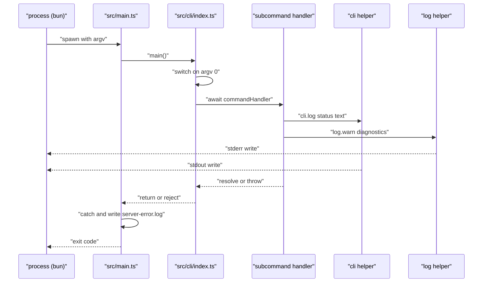
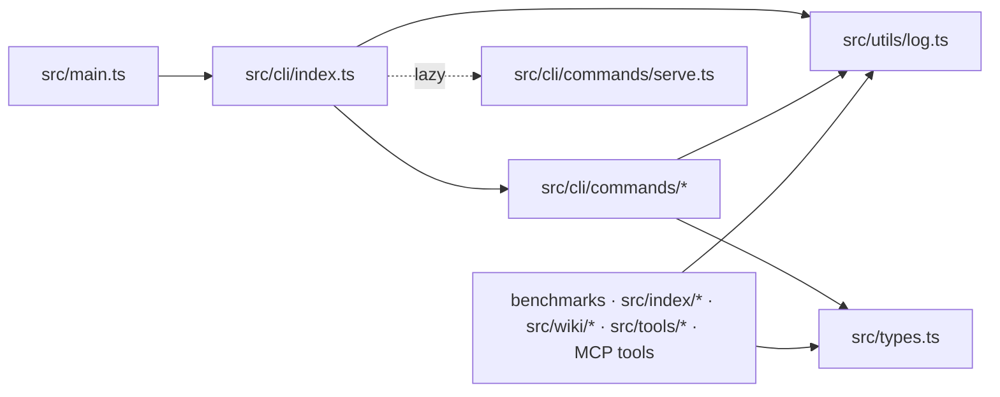

# CLI Entry & Core Utilities

> [Architecture](../architecture.md)
>
> Generated from `b47d98e` · 2026-04-26

The CLI entry-and-core community is the boot floor of mimirs: the shebang script `src/main.ts`, the dispatch table in `src/cli/index.ts`, the cross-cutting `EmbeddedChunk` type in `src/types.ts`, and the dual `log` / `cli` output helpers in `src/utils/log.ts`. Everything else in the codebase — every command, every MCP tool, every benchmark — depends on at least one of these four files. The community is small (only four files) but very widely consumed (28 external consumers).

## How it works



`src/main.ts` is the shebang entry (`#!/usr/bin/env bun`). It does almost nothing in the happy path: it imports `main` from `./cli` and awaits it, letting any subcommand drive the process to natural exit. The interesting code is the `.catch(...)` at the top level: when an exception escapes `main()`, mimirs writes a `server-error.log` file into `<projectDir>/.mimirs/` (resolved via `RAG_PROJECT_DIR` or `process.cwd()`) before printing `[mimirs] FATAL: <msg>` to stderr and exiting with code 1. The on-disk log exists because stderr is often invisible when mimirs runs as an MCP child process — without it, a crash on boot would be silently unobservable from the host editor. The log includes a hint to run `bunx mimirs doctor` for diagnosis.

`src/cli/index.ts` is the dispatch table. It synchronously imports every subcommand handler at module load — `initCommand`, `indexCommand`, `searchCommand`, `readCommand`, `statusCommand`, `removeCommand`, `analyticsCommand`, `mapCommand`, `benchmarkCommand`, `benchmarkModelsCommand`, `evalCommand`, `conversationCommand`, `checkpointCommand`, `historyCommand`, `annotationsCommand`, `sessionContextCommand`, `demoCommand`, `doctorCommand`, `cleanupCommand` — except for `serveCommand`, which is loaded lazily via `await import("./commands/serve")` inside the `serve` switch arm. The comment at lines 16–18 spells out why: the serve transitive deps include native modules (`bun:sqlite`, `sqlite-vec`) and top-level awaits, and a failure during their initialisation would crash the entire CLI before even `mimirs doctor` could run. Lazy import quarantines that risk to the `serve` subcommand alone.

The dispatch itself is a plain `switch (command)` over `process.argv.slice(2)[0]`. Each branch awaits the command handler with `(args, getFlag)`. `getFlag(name)` is a tiny helper that returns the argv value following `name`, or `undefined`. There is no flag library — the cost is per-command flag parsing, the gain is zero startup overhead and zero added dependency surface.

## Dependencies and consumers



`src/main.ts` depends only on `src/cli/index.ts`. `src/cli/index.ts` reaches every command file under `src/cli/commands/` and uses `cli` from `src/utils/log.ts` for usage output. `src/utils/log.ts` and `src/types.ts` have no project dependencies — they are pure leaves. On the consumer side, `src/utils/log.ts` is imported by 27+ files including every command and most indexing/wiki modules; `src/types.ts` is imported wherever an `EmbeddedChunk` is built or persisted (the indexer, the chunker, every embedder, every DB writer that handles chunks).

## Tuning

The `LOG_LEVEL` environment variable is the one runtime knob the community exposes. `src/utils/log.ts` reads it lower-cased on every `write(...)` call (no caching) and resolves it against the internal numeric ladder where `debug` is 0, `warn` is 1, `error` is 2, and `silent` is 3. The default when the env var is missing or unrecognised is `warn` — `log.debug(...)` calls are silent unless `debug` is set in the environment. Setting it to `silent` suppresses everything, including `log.error(...)`, which is appropriate when running mimirs under a parent process that would otherwise log MCP diagnostics twice.

The `RAG_PROJECT_DIR` environment variable is the second knob and lives in `src/main.ts`'s catch handler: when set, it overrides `process.cwd()` for the path where `server-error.log` is written. CLI commands respect the same variable through `resolveProject` in `src/tools/index.ts` (outside this community), but the crash-handler reads it directly so it can write a log even when the rest of the system has not initialised.

## Entry points

`main` (in `src/cli/index.ts`) is the public async entry awaited from `src/main.ts`. Calling it with no `process.argv` subcommand or with `--help` / `-h` prints the multi-line usage block and exits 0. Calling it with an unknown command prints `Unknown command: <name>` to `cli.error` followed by usage and exits 1. Every recognised command resolves to one of two shapes: synchronous handlers compiled into the binary (the default) and the `serve` subcommand that dynamically imports `./commands/serve` to defer native-module loading.

The `cli` and `log` exports from `src/utils/log.ts` are the canonical IO helpers for the rest of the codebase. `cli.log(msg = "")` writes to stdout (no prefix), `cli.error(msg)` to stderr (no prefix); these are the user-facing channels. `log.debug` / `log.warn` / `log.error` go to stderr with a `[mimirs]` prefix and an optional `(<context>)` suffix — these are the MCP diagnostic channel, gated by `LOG_LEVEL`. The split exists so MCP transport (which uses stdout for JSON-RPC frames) is never accidentally polluted by diagnostics: anything that might be diagnostic flows through `log`, anything user-facing through `cli`, and the rule "MCP server commands only use `log`" is checked by the absence of `cli.*` calls in `src/cli/commands/serve.ts`.

`EmbeddedChunk` (in `src/types.ts`) is the inter-module contract for an embedded chunk in flight: a snippet ready for the DB plus its computed embedding plus optional metadata. It is the data shape that connects the chunker, the embedder, and `RagDB.upsertFile`/`insertChunkBatch` — every other community in the project handles this type at some boundary.

## Data shapes

```ts
export interface EmbeddedChunk {
  snippet: string;
  embedding: Float32Array;
  entityName?: string | null;
  chunkType?: string | null;
  startLine?: number | null;
  endLine?: number | null;
  contentHash?: string | null;
  parentId?: number | null;
}
```

`snippet` is the indexable text, `embedding` the vector aligned to whatever embedder is configured (`Float32Array` because that is what `sqlite-vec` consumes via `new Uint8Array(buffer)`), and the optional fields carry symbol identity (`entityName`, `chunkType`), source-line position (`startLine`, `endLine`), a content-hash key for incremental re-indexing (`contentHash`), and a parent-chunk pointer that lets the search-time path query stitch a small chunk back into a bigger surrounding scope (`parentId`). Every field except `snippet` and `embedding` is optional because earlier versions of the chunker did not produce them and the type is shared with code that reads chunks back from the DB where these may legitimately be NULL.

`log` and `cli` themselves are also data shapes — they are exported as plain object literals with method-only members so callers can destructure `const { log } = await import(...)` or use them as namespace handles. There is no class or builder; the literal is the API.

The internal `Level` type (`"debug" | "warn" | "error" | "silent"`) and the `LEVELS` map are not exported. They are the implementation detail of `currentLevel()`, which reads `process.env.LOG_LEVEL` on each call. There is also a `process.stderr.on("error", () => {})` line near the top of `src/utils/log.ts` whose sole purpose is to swallow `EPIPE` errors when an MCP parent disconnects; without it, a closed stderr pipe would crash the process during a routine log write.

## See also

- [Architecture](../architecture.md)
- [CLI Commands](cli-commands.md)
- [Data flows](../data-flows.md)
- [Getting started](../getting-started.md)
- [Git History Indexer & CLI Progress](git-indexer-progress.md)
- [Indexing runtime](indexing-runtime.md)
