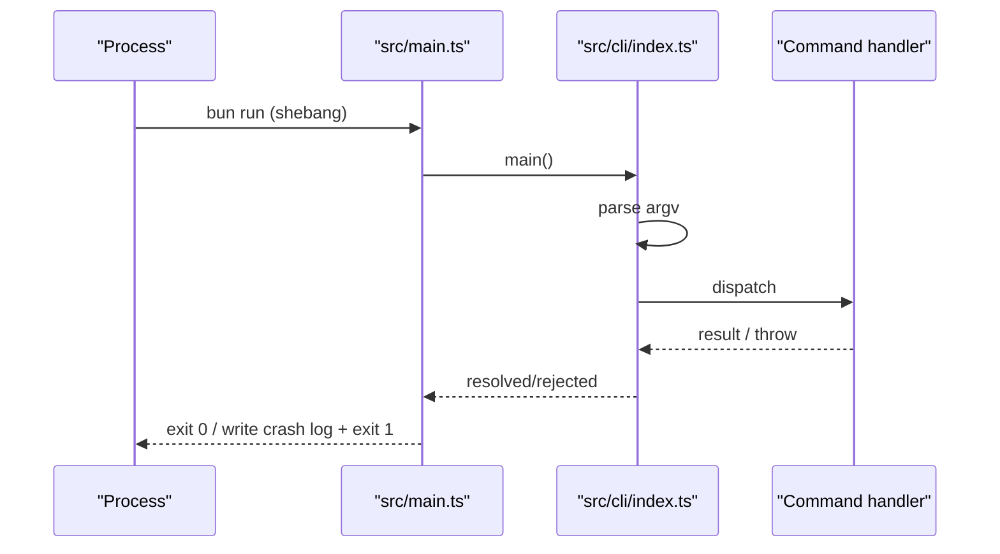
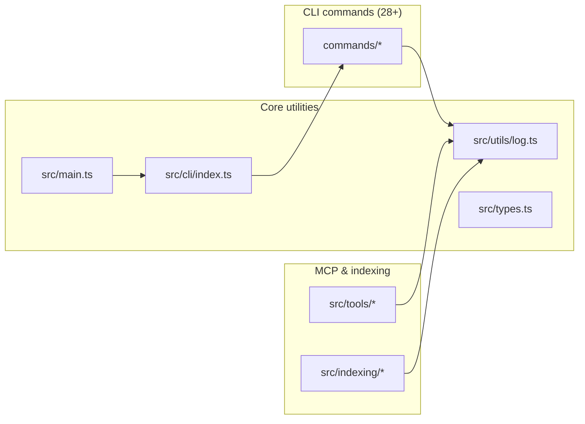

# CLI Entry & Core Utilities

> [Architecture](../architecture.md)
>
> Generated from `79e963f` · 2026-04-26

The CLI entry and core utilities community is the thinnest layer in mimirs: four files that handle process start, command dispatch, cross-cutting type definitions, and the single logging abstraction every other module imports. Understanding these four files is the prerequisite for understanding how any command actually reaches its implementation.

## How it works

`src/main.ts` is the process entry point — a ten-line shebang script that calls `main()` from `src/cli/index.ts` and wraps the entire invocation in an error handler. If `main()` rejects, the handler writes a timestamped crash report to `.mimirs/server-error.log` (under `RAG_PROJECT_DIR` or `cwd()`) before exiting with code 1. This out-of-band crash log is intentional: MCP clients often hide stderr, so a file-backed error trail is the only reliable post-mortem surface.



Inside `src/cli/index.ts`, the exported `main()` function reads `process.argv.slice(2)`, peeks at `args[0]` for the command name, and dispatches through a `switch` statement. The `serve` command is imported dynamically (`await import("./commands/serve")`) to avoid loading native SQLite and `sqlite-vec` modules at startup — those modules cause bun to crash at module-load time if the native binaries are missing. Every other command is statically imported and called directly. `getFlag` is a small helper that scans `args` by name (`idx + 1`) and is passed as a dependency to each command handler rather than reading `process.argv` again internally.

The logging utilities in `src/utils/log.ts` expose two completely separate output channels: `log` for MCP diagnostics and `cli` for user-facing CLI output. They are intentionally kept apart so that diagnostic noise never pollutes the command output that tools parse.

## Dependencies and consumers



`src/utils/log.ts` is the community's highest-PageRank member because it is imported by every command handler, every tool, and most of the indexing pipeline. `src/types.ts` (which exports only `EmbeddedChunk`) is imported by the indexing and embedding layers. `src/main.ts` has exactly one consumer: itself as the bun entry point. `src/cli/index.ts` is imported only by `src/main.ts`.

## Tuning

The `log` channel's verbosity is controlled by the LOG_LEVEL environment variable. Valid values are `debug`, `warn`, `error`, and `silent`. The default is `warn`. Setting LOG_LEVEL=debug emits every diagnostic line, including per-chunk embedding progress, which can be verbose during large indexing runs. LOG_LEVEL=silent suppresses all stderr output.

No configuration file keys map to this community — verbosity is purely environment-variable driven, and the CLI dispatch logic has no tunables of its own.

## Entry points

`src/main.ts` is the bun entry point (declared in the project's `bin` field). `main()` exported from `src/cli/index.ts` is the only function a test or embedding harness would call directly — the CLI commands themselves are not individually exported outside their own files.

The `usage()` function inside `src/cli/index.ts` prints the full command reference to stdout and is called on `--help` / `-h` / no arguments. It is not exported.

## Data shapes

`EmbeddedChunk` from `src/types.ts` is the single cross-cutting type this community owns. It is the contract between the chunker, embedder, and database inserter:

```ts
export interface EmbeddedChunk {
  snippet: string;
  embedding: Float32Array;
  entityName?: string | null;
  chunkType?: string | null;
  startLine?: number | null;
  endLine?: number | null;
  contentHash?: string | null;
  parentId?: number | null;
}
```

`snippet` is the raw text stored in the DB; `embedding` is the computed float vector; `startLine`/`endLine` are the source line range used for line-range-drift lint; `contentHash` enables incremental indexing (skip re-embedding unchanged chunks); `parentId` links a method chunk to its parent class chunk.

The two logging objects are also effectively part of the public API since every module imports them:

`log` (MCP diagnostic channel — stderr, `[mimirs]`-prefixed, level-gated by the LOG_LEVEL env var):
- `log.debug(msg, context?)` — emits only at debug level
- `log.warn(msg, context?)` — default floor; skipped at error or silent level
- `log.error(msg, context?)` — skipped only at silent level

`cli` (user-facing CLI output — no prefix, not level-gated):
- `cli.log(msg?)` — writes to stdout via `console.log`; no args prints a blank line
- `cli.error(msg)` — writes to stderr via `console.error`

The key design difference: `log` is gated by the LOG_LEVEL env var; `cli` always emits. Command handlers use `cli` for output the user reads; internal modules use `log` for diagnostics the operator inspects.

## See also

- [Architecture](../architecture.md)
- [CLI Commands](cli-commands.md)
- [Data flows](../data-flows.md)
- [Getting started](../getting-started.md)
- [Git History Indexer & CLI Progress](git-indexer-progress.md)
- [Indexing Pipeline](indexing-pipeline.md)
