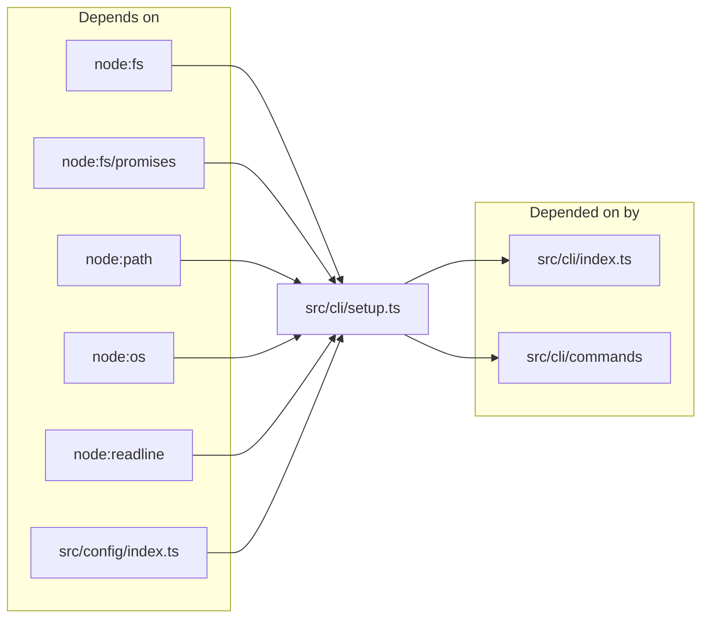
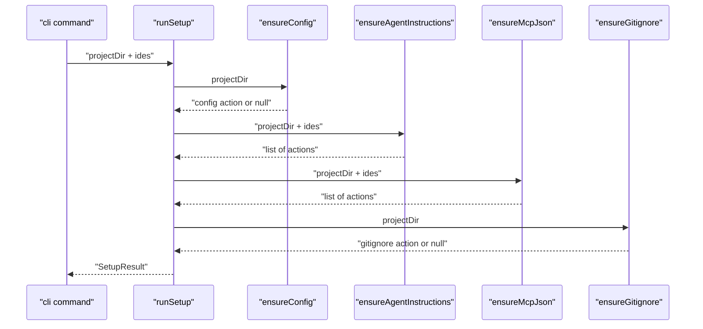

# CLI Setup & IDE Integration

> [Architecture](../architecture.md)
>
> Generated from `b47d98e` · 2026-04-26

The CLI Setup module is one file (`src/cli/setup.ts`) that handles first-run integration: writing `.mimirs/config.json` if absent, patching `.gitignore`, dropping per-IDE rule files (CLAUDE.md, Cursor `.mdc`, Windsurf trigger rule, Junie guideline, Copilot instructions), and upserting MCP server entries into the JSON config files those IDEs read. It is the touchpoint between mimirs and the agent harness.

## Dependencies and consumers

The module reads and writes through the standard Node `fs` / `fs/promises` / `path` / `os` / `readline` surfaces and pulls `loadConfig` from `src/config/index.ts` for the auto-create behaviour. Downstream, the CLI entry (`src/cli/index.ts`) and command handlers under `src/cli/commands` import `runSetup`, `parseIdeFlag`, and `mcpConfigSnippet`.

## Tuning

| Knob | Value | Effect |
|------|-------|--------|
| `KNOWN_IDES` | `["claude", "cursor", "windsurf", "copilot", "jetbrains"]` | The closed set of IDE targets. `parseIdeFlag("all")` expands to this list verbatim; any value not in this set is reported via `unknownIdes` so the CLI can warn. |

The `MARKER` constant `<!-- mimirs -->` is the idempotency token written into every injected markdown rule file; subsequent runs that find the marker (or the literal `## Using mimirs tools` heading) skip the file. There are no other tunables — the path layout for each IDE is hardcoded inside `ensureAgentInstructions` and `ensureMcpJson`.

## Entry points

`runSetup(projectDir, ides?)` is the top-level orchestrator. It chains `ensureConfig`, `ensureAgentInstructions`, `ensureMcpJson`, and `ensureGitignore` in that order, accumulates the action strings each helper returns, and returns a `SetupResult { actions, unknownIdes }`. The `actions` list is what the CLI prints to stdout so the user sees exactly what changed.

`ensureConfig(projectDir)` returns `"Created .mimirs/config.json"` on first run (delegating to `loadConfig`, which writes the defaults) or `null` if the file already exists. `ensureGitignore(projectDir)` writes a fresh `.gitignore` with `# mimirs index\n.mimirs/\n` when none exists; otherwise it appends only if no line trims to `.mimirs/` or `.mimirs`.

`ensureAgentInstructions(projectDir, ides?)` is the rule-file writer. It always touches `CLAUDE.md` (Claude Code is the primary target), conditionally writes the Cursor `.mdc`, the Windsurf `.md` trigger rule, the Junie guideline, and the Copilot instructions file. Each helper short-circuits when the marker is already present.

`ensureMcpJson(projectDir, ides?)` upserts the `mimirs` entry inside `mcpServers` for every IDE config it finds (or that's forced via `ides`). The entry is `{ command: "bunx", args: ["mimirs@latest", "serve"], env: { RAG_PROJECT_DIR: <abs> } }`. `mcpConfigSnippet(projectDir)` returns the same shape as a JSON string for users who want to paste it manually.

`detectAgentHints(projectDir)` returns one help line per IDE config it sees on disk (`.mcp.json`, `.cursor/`, `.junie/`, `.windsurf/`); when nothing is detected it returns the generic `"Add to your agent's MCP config under mcpServers:"` line.

`parseIdeFlag(value)` accepts `"all"` (which expands to `KNOWN_IDES`) or a comma-separated list of names; lowercases each token. `confirm(question)` is a thin readline wrapper that resolves true unless the user types `n` or `N`.

## How it works

1. `ensureConfig` checks `.mimirs/config.json`. If absent, it calls `loadConfig(projectDir)` which writes the defaults; the action `"Created .mimirs/config.json"` is recorded. If present, returns `null`.
2. `ensureAgentInstructions` injects the `INSTRUCTIONS_BLOCK` (a long markdown block listing every mimirs MCP tool with usage guidance) into each IDE's rule file. The Claude Code path (`CLAUDE.md` at project root) is unconditional; the others are gated on either an existing IDE directory (`.cursor/`, `.windsurf/`, `.junie/`, `.github/`) or the IDE being explicitly forced via the `ides` flag, in which case the directory is created first. Cursor uses `MDC_BLOCK` (frontmatter `description: mimirs tool usage instructions` and `alwaysApply: true`); Windsurf uses `WINDSURF_BLOCK` (frontmatter `trigger: always_on`); the rest use plain markdown via `MARKDOWN_BLOCK`.
3. `ensureMcpJson` upserts `mcpServers.mimirs` into `.mcp.json` (always), `.cursor/mcp.json`, `.junie/mcp.json`, and Windsurf's two global configs at `~/.codeium/windsurf/mcp_config.json` (standalone) and `~/.codeium/mcp_config.json` (JetBrains plugin). `upsertMcpJson` parses the existing JSON, returns `null` if `mcpServers.mimirs` is already set, otherwise writes the merged config back.
4. `ensureGitignore` patches `.gitignore` last so failures upstream don't leave `.mimirs/` un-ignored.
5. The accumulated `actions` array plus any unknown IDE names returned by `unknownIdes(ides)` are wrapped into `SetupResult` and returned.

The order matters: config first (so the directory exists and downstream code can read settings), then rule files (cheap, idempotent), then MCP JSON (which may need a created directory from the rule-file step for forced IDEs), and finally gitignore.

## Failure modes

**Existing rule file with no marker.** `injectMarkdown` and `injectMdc` check both for the literal `<!-- mimirs -->` marker and (for markdown) the `## Using mimirs tools` heading. If neither is present, the block is appended after a trimmed double-newline. If the user has manually written a `## Using mimirs tools` section without the marker, the helper still skips them — preserving user content.

**Invalid JSON in an MCP config.** `upsertMcpJson` wraps `JSON.parse` in a try/catch. On parse failure it returns `"Skipped <path> (invalid JSON — fix it manually or delete it)"` rather than overwriting. The user keeps their broken file and the action list shows the skip.

**Missing IDE directory without an `--ide` flag.** The Cursor, Windsurf, Junie, and Copilot paths are all guarded by `existsSync(...)`. Users who don't have those IDEs installed see no surprise files; users who do want a target without the directory pass the IDE name through `parseIdeFlag` and the helper creates the directory first.

**Unknown IDE names.** `parseIdeFlag` accepts arbitrary strings and lowercases them; `unknownIdes` returns the subset that is not in `KNOWN_IDES`. The CLI prints these so the user knows about the typo. Note that unknown names do not abort setup — the known ones still run.

**Concurrent runs.** No locking. The helpers each read-then-write JSON files, so two simultaneous `runSetup` invocations could lose changes. In practice the CLI is one-shot and this hasn't been a problem.

**Path resolution.** `mcpServerEntry` calls `resolve(projectDir)` to embed an absolute path in the MCP env, so a relative `projectDir` is resolved against `cwd()`. Symlinks are not normalised — if `projectDir` is itself a symlink, the symlink path is what gets written into `RAG_PROJECT_DIR`.

**`ensureGitignore` doesn't dedupe broadly.** The check is `content.split("\n").some(line => line.trim() === ".mimirs/" || line.trim() === ".mimirs")`. A pattern like `*.mimirs` or `**/.mimirs/` won't match, so a hand-edited gitignore with a slightly different pattern still gets a second `.mimirs/` entry appended.

**Windsurf has two MCP configs.** Standalone Windsurf reads `~/.codeium/windsurf/mcp_config.json`; the JetBrains plugin reads `~/.codeium/mcp_config.json`. `ensureMcpJson` writes to both, so a user who runs only one of them sees a redundant write — there's no detection of which is in use, by design (the writes are idempotent and harmless).

## See also

- [Architecture](../architecture.md)
- [CLI Commands](cli-commands.md)
- [Config & Embeddings](config-embeddings.md)
- [Conversation Indexer & MCP Server](conversation-server.md)
- [Data flows](../data-flows.md)
- [Getting started](../getting-started.md)
