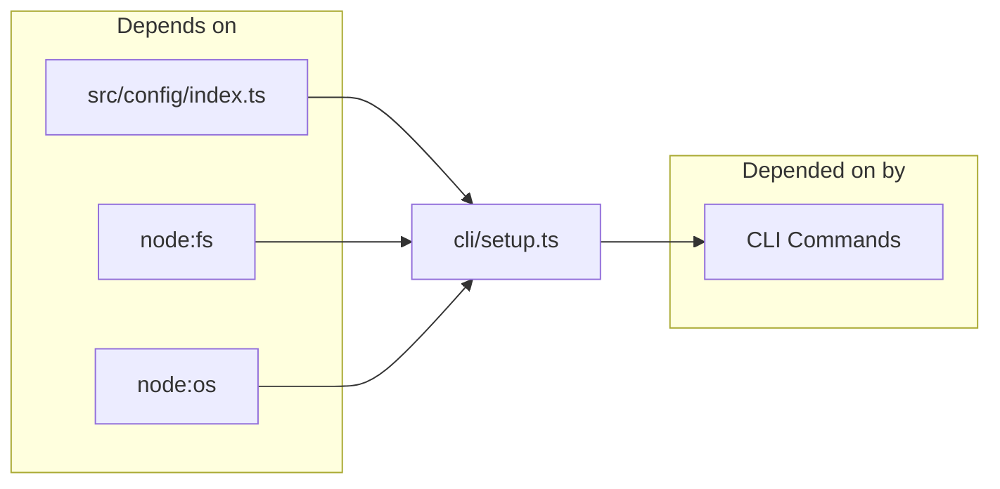
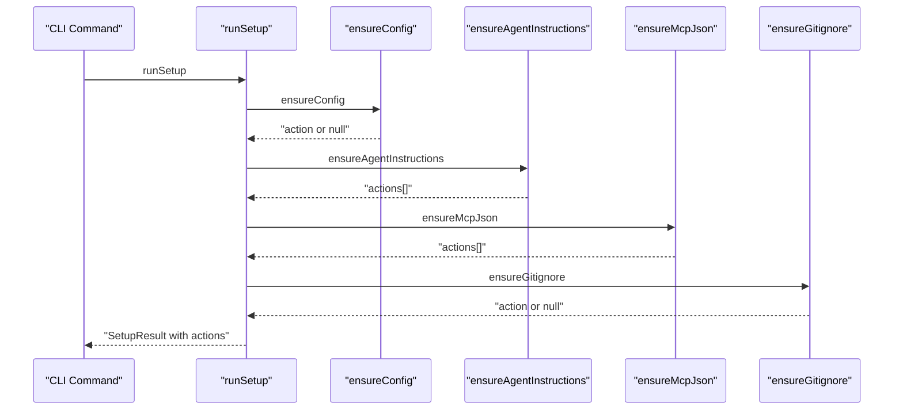

# CLI Setup & IDE Integration

> [Architecture](../architecture.md)
>
> Generated from `79e963f` · 2026-04-26

`src/cli/setup.ts` is the first-run initialization module for mimirs. It writes MCP configuration JSON to the right location for each supported IDE, injects tool-usage instructions into agent instruction files (CLAUDE.md, Cursor rules, Windsurf rules, JetBrains guidelines, GitHub Copilot instructions), patches `.gitignore` to exclude the `.mimirs/` index directory, and ensures a valid config file exists. The reference for adding a new IDE target or debugging init failures.

## Dependencies and consumers



Depends on: `src/config/index.ts` (the `loadConfig` function, which auto-creates `.mimirs/config.json` when absent), `node:fs` and `node:fs/promises` for file existence checks and writes, `node:os` for `homedir()` (Windsurf writes to `~/.codeium/`), and `node:readline` for the interactive `confirm` prompt.

Depended on by: CLI command files that invoke `runSetup` or individual ensure-* functions directly.

## Tuning

The set of supported IDEs is controlled by a single exported constant:

```
KNOWN_IDES: KnownIDE[] = ["claude", "cursor", "windsurf", "copilot", "jetbrains"]
```

Adding a new IDE means: (1) extending the `KnownIDE` union type, (2) adding the new string to `KNOWN_IDES`, (3) adding the corresponding write logic inside `ensureAgentInstructions` and `ensureMcpJson`. All validation in `parseIdeFlag` and `unknownIdes` derives from `KNOWN_IDES` automatically — no additional changes needed there.

The `MARKER = "<!-- mimirs -->"` constant is used to detect whether a file already has mimirs content before writing. Changing this string would cause setup to re-inject instructions into files that already have them under the old marker.

The MCP server entry written to all JSON config files uses `bunx mimirs@latest serve` with `RAG_PROJECT_DIR` set to the absolute project path. The `mcpConfigSnippet(projectDir)` function returns this snippet as a formatted JSON string for display in CLI output.

## Entry points

- `runSetup(projectDir, ides?)` — the top-level orchestrator. Calls `ensureConfig`, `ensureAgentInstructions`, `ensureMcpJson`, and `ensureGitignore` in sequence and returns `SetupResult { actions: string[], unknownIdes: string[] }`. Actions is the list of files created or modified; unknownIdes is the list of IDE names passed by the user that weren't in `KNOWN_IDES`.
- `ensureMcpJson(projectDir, ides?)` — writes the `bunx mimirs@latest serve` MCP server entry to IDE-specific JSON config files. Always writes Claude Code's `.mcp.json`; conditionally writes Cursor's `.cursor/mcp.json` and JetBrains' `.junie/mcp.json` based on directory existence or explicit `ides` flag. Windsurf writes to `~/.codeium/windsurf/mcp_config.json` and `~/.codeium/mcp_config.json` (global, not project-local).
- `ensureAgentInstructions(projectDir, ides?)` — injects the `INSTRUCTIONS_BLOCK` into agent instruction files. Always writes `CLAUDE.md`. Cursor gets a `.mdc` file with frontmatter (`alwaysApply: true`); Windsurf gets a `.md` file with `trigger: always_on` frontmatter; JetBrains gets a plain markdown file in `.junie/guidelines/`; GitHub Copilot gets `.github/copilot-instructions.md`.
- `ensureConfig(projectDir)` — calls `loadConfig(projectDir)`, which auto-creates `.mimirs/config.json` if it doesn't exist. Returns a human-readable action string if a file was created, `null` if it already existed.
- `ensureGitignore(projectDir)` — creates `.gitignore` with `.mimirs/` if it doesn't exist, or appends `.mimirs/` if the file exists but doesn't already contain it.
- `detectAgentHints(projectDir)` — probes for IDE configuration directories (`.mcp.json`, `.cursor/`, `.junie/`, `.windsurf/`) and returns human-readable instructions for how to add mimirs to each detected IDE's MCP config.
- `parseIdeFlag(value)` — parses a comma-separated IDE flag string into a list of IDE names. The special value `"all"` expands to all entries in `KNOWN_IDES`.
- `confirm(question)` — interactive yes/no prompt over stdin. Returns `true` for any answer that isn't `"n"` (note: the default is yes).

## How it works



Each step is idempotent. `ensureConfig` returns `null` if `.mimirs/config.json` already exists. `injectMarkdown` checks for `MARKER` or the `"## Using mimirs tools"` heading before writing, so re-running setup on an already-initialized project produces no actions. `upsertMcpJson` checks for `raw.mcpServers?.["mimirs"]` before modifying a JSON file.

The `ides` parameter controls which optional IDE targets are written. When a directory for an IDE doesn't exist and the IDE isn't in the `ides` set, that IDE is skipped entirely. This means running `mimirs init` in a Cursor project (with `.cursor/` present) automatically includes Cursor without requiring `--ide cursor`.

Windsurf is the only IDE that writes to global config (`~/.codeium/`) rather than the project directory. This is intentional — Windsurf's MCP config is user-scoped, not project-scoped.

## Failure modes

- **Corrupt `.cursor/mcp.json` or `.junie/mcp.json`.** `upsertMcpJson` wraps the JSON parse in a try/catch. If parsing fails, it returns a message like `"Skipped [path] (invalid JSON — fix it manually or delete it)"` rather than overwriting the file. This prevents silently clobbering a corrupt config.
- **`ensureGitignore` on a path without write permission.** `writeFile` throws an OS error. Setup does not catch this — the command-level error handler is expected to surface it to the user.
- **`detectAgentHints` finds no IDE markers.** Returns a single fallback entry: `"Add to your agent's MCP config under mcpServers:"`. This is informational, not an error — the function always returns at least one string.
- **`confirm` called non-interactively (e.g. in CI).** readline reads from stdin; if stdin is closed or returns EOF, the promise may never resolve. Callers should avoid `confirm` in non-interactive contexts or pipe `"y\n"` to stdin.
- **Unknown IDE names.** `parseIdeFlag` passes unknown names through; `unknownIdes` filters them and returns them in `SetupResult.unknownIdes`. The CLI command surfaces these as warnings. Unknown names are silently skipped in `ensureAgentInstructions` and `ensureMcpJson`.

## See also

- [Architecture](../architecture.md)
- [CLI Commands](cli-commands.md)
- [Config & Embeddings](config-embeddings.md)
- [Conversation Indexer & MCP Server](conversation-server.md)
- [Data flows](../data-flows.md)
- [Getting started](../getting-started.md)
