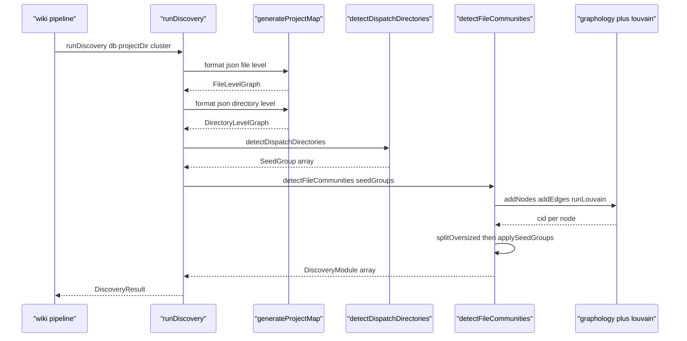
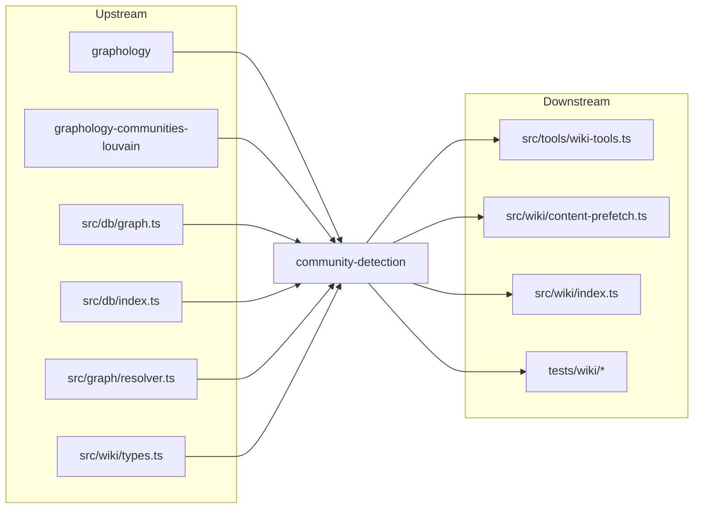

# Community Detection & Discovery

> [Architecture](../architecture.md)
>
> Generated from `b47d98e` · 2026-04-26

Two files own the wiki's "what are this codebase's modules?" question. `src/wiki/community-detection.ts` is a graphology + Louvain wrapper that runs both file-level and symbol-level clustering with project-specific guardrails. `src/wiki/discovery.ts` is the orchestrator that pulls the file graph from the DB, picks a clustering strategy, applies fallbacks, and packages everything into a `DiscoveryResult` for the rest of the wiki pipeline. The output of these two files is what every later phase (categorization, synthesis, page writing) reads.

## Entry points

- **`runDiscovery(db, projectDir, cluster?)`** in `src/wiki/discovery.ts` — Phase 1 of the wiki pipeline. Returns a `DiscoveryResult` with `modules`, `graphData.fileLevel`, `graphData.directoryLevel`, `fileCount`, `chunkCount`, and `warnings`. `cluster` is `"files"` (default) or `"symbols"`.
- **`detectFileCommunities(fileGraph, options?)`** in `src/wiki/community-detection.ts` — runs Louvain on the file-level import graph. Returns `DiscoveryModule[]`, or `[]` when the graph is too sparse.
- **`detectSymbolCommunities(data, fileGraph, projectDir)`** — runs Louvain on a symbol-level call graph and projects communities back to files by majority vote.
- **`detectDispatchDirectories(fileGraph)`** — pre-pass that finds the dispatch/plugin pattern (a directory of siblings that don't import each other but share a parent importer) and returns `SeedGroup[]` to feed into `detectFileCommunities`.
- **`isTestOrBench(path)`** — predicate that excludes test and benchmark trees from clustering.
- **`ClusterMode`** — `"files" | "symbols"`.
- **`SeedGroup`** / **`DetectFileCommunitiesOptions`** — types for forced co-clustering.

## How it works



1. `runDiscovery` (`src/wiki/discovery.ts:33-178`) opens with a sanity check on `db.getStatus()` — if `totalFiles === 0` it returns an empty `DiscoveryResult` with the warning `Index is empty — no files indexed`.
2. It calls `generateProjectMap(db, { projectDir, format: "json" })` for the file-level graph and again with `{ zoom: "directory", format: "json" }` for the directory-level view.
3. When `cluster === "symbols"`, the symbol graph is loaded from `src/db/graph.ts` (`SymbolGraphData`) and `detectSymbolCommunities` runs first; on sparse symbol graphs it returns `[]` and the orchestrator falls back to file-mode clustering.
4. When `cluster === "files"`, `detectDispatchDirectories(fileGraph)` runs first to find sibling directories that should stay together (the dispatch/plugin pattern), and the resulting `SeedGroup[]` is passed into `detectFileCommunities`.
5. Inside `detectFileCommunities`, `productFiles` is the set of nodes that pass `isClusterable` (not a test, not a graph isolate). If `productFiles.size < MIN_NODES_FOR_LOUVAIN` (`10`) or `fileGraph.edges.length < MIN_EDGES_FOR_LOUVAIN` (`5`), the function returns `[]` and the orchestrator switches to a directory-based heuristic.
6. A `Graph` (graphology, undirected, non-multi) is built from sorted nodes and sorted edges (sort first — Louvain's output depends on insertion order). Parallel edges become one edge with summed `weight`.
7. `runLouvain(g)` calls `louvain(g, { getEdgeWeight: "weight", resolution: 1.0, randomWalk: false, rng: seededRng(LOUVAIN_SEED) })`. `LOUVAIN_SEED = 0x9e3779b9` and the Mulberry32 `seededRng` make every run reproducible.
8. `splitOversized` runs a second Louvain pass on any community larger than `max(MIN_SPLIT_SIZE, floor(graph.order * MAX_SIZE_FRACTION))` (`MIN_SPLIT_SIZE = 8`, `MAX_SIZE_FRACTION = 0.18`). The first sub-community keeps the parent's `cid`; the rest get fresh ids.
9. `applySeedGroups` pulls every file in any `SeedGroup` out of whichever Louvain community held it and collapses them into one community keyed by the seed label. The label is stashed in `seedLabelByCid` so `buildModuleFromCluster` can read it later without plumbing.
10. Isolates (`g.degree(n) === 0`) and unmapped files are reattached in `buildModulesFromClusters` to the community that owns the most files in the orphan's directory; if no directory match exists, they go to the largest community.
11. `buildModuleFromCluster` computes `path` (longest common directory prefix; falls back to `pluralityDir` when prefix depth `≤ 1`), picks `entryFile` (`ENTRY_FILE_PATTERN = /^(index|main|mod|lib|__init__)\./` first, else highest-degree node), aggregates `fanIn`/`fanOut` (subtracting internal edges), counts `internalEdges`, and computes `cohesion = internalEdges / (n * (n-1) / 2)`.
12. Modules are sorted size-desc with a lex tiebreak on the joined sorted member list — downstream cache keys depend on this order.

## Dependencies and consumers



Depends on: `graphology` (`Graph`), `graphology-communities-louvain` (`louvain`), `src/db/graph.ts` (`SymbolGraphData`), `src/db/index.ts` (`RagDB`), `src/graph/resolver.ts` (`generateProjectMap`), `src/wiki/types.ts` (`DiscoveryResult`, `DiscoveryModule`, `FileLevelGraph`, `FileLevelNode`, `FileLevelEdge`, `DirectoryLevelGraph`).

Depended on by: `src/tools/wiki-tools.ts`, `src/wiki/content-prefetch.ts`, `src/wiki/index.ts`, the test files in `tests/wiki/`. The two members also import each other — `src/wiki/discovery.ts` consumes everything `src/wiki/community-detection.ts` exports, and the test suites cover both. See [Wiki orchestration](wiki-orchestration.md) for how the result is consumed and [Wiki Pipeline — Types & Internals](wiki-pipeline-internals.md) for the shapes.

## Internals

- **Determinism is a hard requirement.** `LOUVAIN_SEED = 0x9e3779b9` (the golden-ratio constant), `seededRng` is Mulberry32, sorted node insertion (`[...productFiles].sort()`), sorted edge insertion, and `randomWalk: false`. Together these make `detectFileCommunities` produce identical output across runs given identical input, which is what every downstream cache and `_meta` artifact depends on.
- **`MAX_SIZE_FRACTION = 0.18` and `MIN_SPLIT_SIZE = 8`** were tightened from `0.25 → 0.18` and `10 → 8` after a v3 review found high-fan-in hubs (e.g. `embed.ts` with PageRank 0.114) being absorbed into a larger neighbour community, denying them a standalone landing page. The pair sits at the size where a single hub plus its closest callers forms a coherent ~8-node community.
- **`MIN_NODES_FOR_LOUVAIN = 10` and `MIN_EDGES_FOR_LOUVAIN = 5`** are the "graph too sparse" floor. Below these thresholds Louvain output is degenerate (one giant community or one-per-file); the caller is expected to switch to a directory heuristic — `runDiscovery` does so by returning the `DiscoveryResult` with whatever fallback the orchestrator implements.
- **`isTestOrBench` excludes by segment, not by prefix alone.** It checks for `tests/`, `test/`, `__tests__/`, `benchmarks/`, `bench/` anywhere in the path (`hasSegment` matches at root, mid-path, or as the whole path) plus the filename suffixes `.test.<ext>`, `.spec.<ext>`, `.bench.<ext>` for `ts/tsx/js/jsx/mjs/cjs/py/go/rs`. The comment explicitly notes that absolute-path-only checks miss nested test fixtures.
- **`isGraphIsolate` is a separate filter from `isTestOrBench`.** A node is a graph isolate when `fanIn === 0 && fanOut === 0 && exports.length === 0` — the resolver couldn't parse it (markdown, shell, config, data). Including isolates skews `pluralityDir` toward whichever directory holds the most adjacent docs, so they're filtered out of clustering and reattached afterward in `buildModulesFromClusters`.
- **Seeded files don't double-attach.** When `seedGroups` is in play, `applySeedGroups` strips the seeded files out of every Louvain community before adding them to their seed cluster. The orchestrator further filters `isolateFiles` to drop seeded paths so they don't reappear during isolate reattachment — the comment notes that without this filter a file could land in two modules and `perCommunityPageRank` would double-count it.
- **`detectDispatchDirectories` runs purely on the graph, not on directory names.** Three local constants inside the function define the pattern: a minimum sibling count of `4`, a maximum internal-edge ratio of `0.1`, and a minimum shared-parent fraction of `0.5`. The directory must have at least 4 files; at least one outside-the-directory parent must import `≥ 0.5` of the siblings; and the siblings' inter-import edges must stay below 10% of their total edge endpoints. Anything matching all three is a dispatch directory.
- **Symbol-mode dispatch.** `detectSymbolCommunities` builds the symbol graph from `data.chunks` whose `chunkType` is in `CALLER_CHUNK_TYPES`, declared as:

  ```ts
  const CALLER_CHUNK_TYPES = new Set([
    "function",
    "method",
    "class",
    "interface",
    "type",
    "variable",
    "field",
    "export",
  ]);
  ```

  Edges come from named-import token matches (`TOKEN_RE = /[A-Za-z_$][A-Za-z0-9_$]*/g`) and namespace-import member matches (`MEMBER_RE = /([A-Za-z_$][A-Za-z0-9_$]*)\.([A-Za-z_$][A-Za-z0-9_$]*)/g`). Symbol communities are then projected to files by majority vote — the file goes wherever the most of its symbols went.
- **Files with no symbols in the symbol graph still get a community.** They land in `unmappedFiles` and `buildModulesFromClusters` reattaches them to the directory-best-match community, so symbol-mode never silently drops files.
- **`buildModuleFromCluster` corrects fanIn/fanOut.** It first sums per-node `fanIn`/`fanOut` across every file in the cluster, then walks every internal edge and decrements both — leaving the *external* fan counts. `Math.max(0, …)` clamps in case `pathToNode` lookups missed a file.
- **`pluralityDir` caps depth at 2 segments.** When a cluster spans multiple files under `src/cli/commands/`, `pluralityDir` returns `src/cli` (two segments) rather than the full directory, so the module path stays at a useful zoom level.
- **`seedLabelByCid` is module-level mutable state.** The comment explains the choice: `buildModuleFromCluster` is shared between file-mode and symbol-mode and plumbing a seed-label argument through every call site is more churn than the lookup. The map is set in `applySeedGroups` and read in `buildModuleFromCluster`.

## Invariants

- **The fileGraph passed in must use the same path format end-to-end.** `detectFileCommunities` keys on `fileGraph.nodes[].path` exactly as it appears in the edges. `runDiscovery` always feeds project-relative paths produced by `generateProjectMap(..., { format: "json" })`. `detectSymbolCommunities` is the exception: it accepts absolute paths from `SymbolGraphData` and converts them via `toRel(absPath, projectDir)` to match the file graph.
- **Test/bench files must be excluded before clustering.** Every clustering function applies `isClusterable`. Callers that bypass these helpers (and add tests directly into the graph) will produce blob communities that span unrelated subsystems.
- **Module member lists are sorted at call sites that need stability.** `buildModulesFromClusters` sorts modules by size-desc then lex on `[...files].sort().join("\n")`; `applySeedGroups` sorts seed files; sorted edges feed Louvain. Downstream cache keys depend on these orderings.
- **`SeedGroup.files` should be project-relative paths that exist in the fileGraph.** Files outside `clusterable` are silently skipped — `applySeedGroups` will not invent membership for filtered-out nodes (tests, isolates).
- **`runLouvain` is the only call site with the canonical Louvain options.** Any other invocation must pass `{ getEdgeWeight: "weight", resolution: 1.0, randomWalk: false, rng: seededRng(LOUVAIN_SEED) }` or determinism is broken. The two call sites today (the main pass and `splitOversized`) both go through `runLouvain`.
- **Empty results are valid output.** `detectFileCommunities` returns `[]` on sparse graphs; `detectSymbolCommunities` returns `[]` when `nodeMeta.size < MIN_NODES_FOR_LOUVAIN`. Callers must handle empty arrays as "fall back to a different strategy", not as "fail".

## See also

- [Architecture](../architecture.md)
- [Data flows](../data-flows.md)
- [Database Layer](db-layer.md)
- [Getting started](../getting-started.md)
- [Wiki orchestration](wiki-orchestration.md)
- [Wiki Pipeline — Types & Internals](wiki-pipeline-internals.md)
