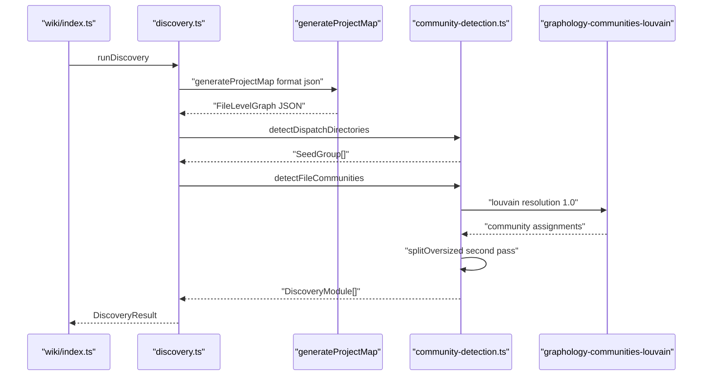
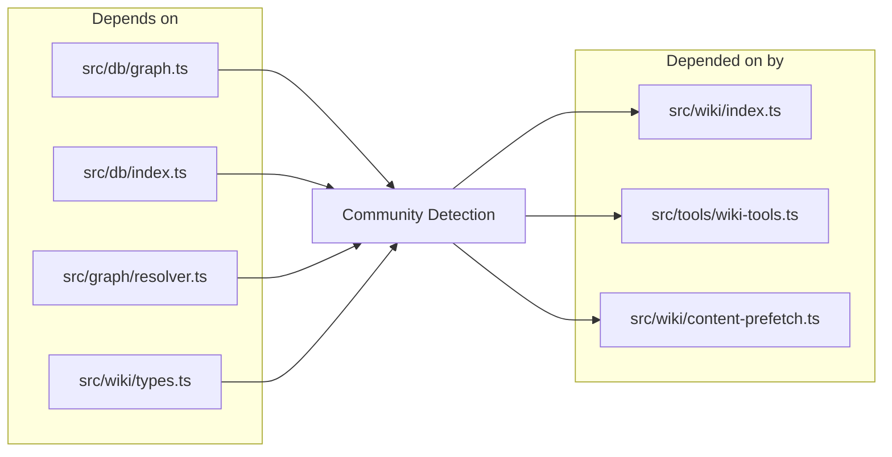

# Community Detection & Discovery

> [Architecture](../architecture.md)
>
> Generated from `79e963f` · 2026-04-26

This community owns the two files that translate a raw file-level import graph into a set of named `DiscoveryModule` clusters that all downstream wiki phases consume. `src/wiki/community-detection.ts` implements the Louvain clustering algorithms and dispatch-directory detection. `src/wiki/discovery.ts` orchestrates the full phase-1 discovery: it pulls the graph from the DB, calls the appropriate clustering function, attaches module metadata, and returns a `DiscoveryResult`. The output of this community is the foundational data structure every other wiki stage reads.

## How it works

1. `runDiscovery` calls `generateProjectMap` with `format: "json"` to get the file-level import graph as structured JSON. If the index is empty, it returns immediately with a warning rather than running clustering on zero data.
2. In `"files"` mode (the default), `runDiscovery` calls `detectDispatchDirectories` to identify sibling directories that belong together despite having no inter-sibling imports (the dispatch/plugin pattern). These become `SeedGroup` objects.
3. `detectFileCommunities` is called with the seed groups. It filters out test/bench files (via `isTestOrBench`) and graph isolates (files with no imports, exports, or fan connections) before building the Louvain graph, then runs Louvain with a fixed seed and resolution of `1.0`.
4. Any community larger than `max(MIN_SPLIT_SIZE, floor(n * MAX_SIZE_FRACTION))` — where `MIN_SPLIT_SIZE = 8` and `MAX_SIZE_FRACTION = 0.18` — is passed to a second Louvain pass on its induced subgraph. If the subgraph resolves to only one community, the oversized cluster is kept intact.
5. Seed groups override whatever community Louvain assigned their files to: seeded files are extracted and placed into a dedicated community keyed by the seed label.
6. Files Louvain dropped as graph isolates are reattached to the community that owns the most files in the same directory, falling back to the largest community.
7. In `"symbols"` mode, `detectSymbolCommunities` builds a Louvain graph at the chunk level (caller function × imported symbol), runs clustering, and projects results back to files by majority vote. Files with no symbol representation are attached by directory fallback.

## Dependencies and consumers

Depends on: `src/db/graph.ts` (symbol graph data for `detectSymbolCommunities`), `src/db/index.ts` (DB access in `runDiscovery`), `src/graph/resolver.ts` (file-level graph generation), `src/wiki/types.ts` (shared types like `DiscoveryModule`, `FileLevelGraph`, `DiscoveryResult`).

Depended on by: `src/wiki/index.ts` (the primary caller via `runDiscovery`), `src/tools/wiki-tools.ts` (imports `ClusterMode` for the tool schema), and `src/wiki/content-prefetch.ts` (reads community assignments for bundle scoping).

## Internals

**Louvain resolution parameter.** Louvain is run with `resolution: 1.0` and `randomWalk: false`. Resolution controls granularity: values above 1.0 produce more, smaller communities; values below 1.0 produce fewer, larger communities. At `1.0` the algorithm optimizes standard modularity. `randomWalk: false` disables the random-walk initialization step that makes results non-deterministic — stability is handled instead by `seededRng`.

**Deterministic PRNG.** The Mulberry32 PRNG (`seededRng`) is seeded with `LOUVAIN_SEED = 0x9e3779b9` (the golden-ratio constant) on every run. This makes community assignments reproducible across runs and machines, which is essential because downstream caches key on community IDs. Without a fixed seed, a rerun on an unchanged codebase would produce different page assignments.

**Dispatch-directory detection.** `detectDispatchDirectories` identifies directories where at least one external parent imports at least half (0.5 fraction) of the siblings, and where sibling-to-sibling imports account for at most 10% of total edge endpoints. The minimum directory size is 4 files. This covers tool-handler directories, router layers, and plugin registries — patterns where Louvain would split siblings into separate communities because they don't call each other directly.

**`isTestOrBench` exclusion.** Files are excluded from clustering if their path contains a segment matching `tests`, `test`, `__tests__`, `benchmarks`, or `bench`, or if the filename matches `*.test.*`, `*.spec.*`, or `*.bench.*`. These checks operate on both absolute and relative paths using `hasSegment`, which checks prefix, suffix, and interior segment matches — a plain substring check would miss cases like `src/tests/` being a proper directory segment.

**Graph isolates.** Files with `fanIn === 0 && fanOut === 0 && exports.length === 0` are considered graph isolates. This covers markdown files, shell scripts, JSON configs, and any source file the graph resolver couldn't parse. They're excluded before Louvain runs because including them drags unrelated files into the nearest cluster via the orphan-reattachment pass.

**Symbol-mode majority vote.** In symbol mode, each symbol (chunk) is assigned a community by Louvain. A file's community is determined by a plurality vote over all its symbols' assignments. Files with no symbols in the graph are placed in a fallback bucket keyed by directory path, then attached by the same directory-match heuristic used for file-mode isolates.

**Module path selection.** The community path is the longest common directory prefix of all member files. When that prefix is shallow (depth ≤ 1, e.g. `src`), `pluralityDir` selects the two-segment prefix that holds the most member files instead. The module name is either the seed label (for dispatch directories) or `basename(path)`.

## Entry points

- `runDiscovery(db, projectDir, cluster?)` — the primary public API. Accepts a DB instance, the project root, and an optional cluster mode (`"files"` | `"symbols"`, default `"files"`). Returns `DiscoveryResult` with the module list, graph data, file/chunk counts, and any warnings.
- `detectFileCommunities(fileGraph, options?)` — runs Louvain on the file-level graph and returns `DiscoveryModule[]`. Returns `[]` when the graph is too sparse (fewer than 10 nodes or 5 edges).
- `detectSymbolCommunities(data, fileGraph, projectDir)` — runs Louvain at the symbol level and projects back to files. Returns `[]` when fewer than 10 symbol nodes exist.
- `detectDispatchDirectories(fileGraph)` — inspects the graph for the dispatch/plugin pattern and returns `SeedGroup[]` for use with `detectFileCommunities`.
- `isTestOrBench(path)` — exported for use by content-prefetch and other callers that need to apply the same exclusion filter without running full clustering.

## Invariants

- Every file in `DiscoveryResult.modules` appears in exactly one `DiscoveryModule`. The seed-group logic explicitly filters seeded files out of the isolate list so they cannot be reattached to a second community.
- `detectFileCommunities` returns an empty array (not a fallback) when the graph is below the Louvain threshold. The caller (`runDiscovery`) handles the empty case by falling back to directory-based detection.
- Community assignments are deterministic for a fixed source tree and seed. Adding or removing a file changes the graph topology, which may shift assignments across the whole project — downstream caches should invalidate on source changes, not only on direct community-file membership changes.
- Module order in the returned array is size-descending with a lexicographic tiebreak on the sorted member file list. This stable ordering is required because downstream caches key community IDs on position.

## See also

- [Architecture](../architecture.md)
- [Data flows](../data-flows.md)
- [Database Layer](db-layer.md)
- [Getting started](../getting-started.md)
- [Wiki Orchestrator & MCP Tools](wiki-orchestrator.md)
- [Wiki Pipeline — Types & Internals](wiki-pipeline-internals.md)
