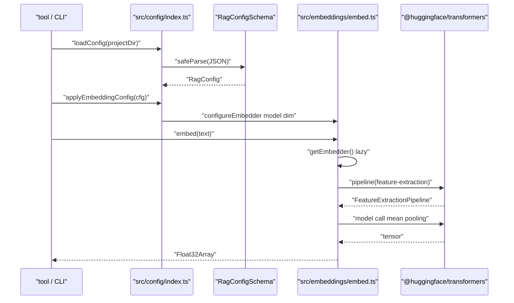
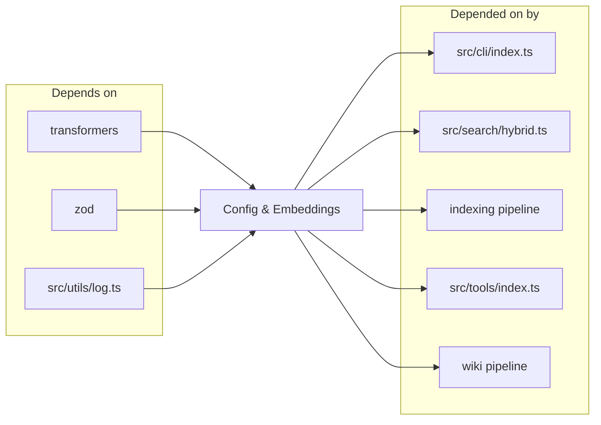

# Config & Embeddings

> [Architecture](../architecture.md)
>
> Generated from `b47d98e` · 2026-04-26

The Config & Embeddings community owns two tightly coupled concerns: loading and validating the project configuration from disk, and running the local transformer model that produces embedding vectors. Nearly every other mimirs community depends on at least one of these files — anything that calls `embed()`, `getEmbedder()`, or `loadConfig()` ultimately lands here.

## How it works

`loadConfig(projectDir)` reads `.mimirs/config.json` and parses it through `RagConfigSchema`. On first run the file doesn't exist yet, so the loader writes `DEFAULT_CONFIG` to disk and returns it — there is no implicit merge of partial configs against defaults, so the file on disk is exactly what runs. Invalid JSON or schema-validation failures log a warning through `log.warn(..., "config")` and fall back to a fresh copy of the defaults rather than throwing.

`applyEmbeddingConfig(config)` is called after `loadConfig` whenever embeddings will run. It reads the optional `embeddingModel` and `embeddingDim` overrides (falling back to `DEFAULT_MODEL_ID` and `DEFAULT_EMBEDDING_DIM`) and calls `configureEmbedder(model, dim)`. `configureEmbedder` is a no-op when the requested model and dimension match what's already loaded; otherwise it nulls the singletons (`extractor`, `tokenizer`) and sets `currentModelId` / `currentDim`, which forces the next `getEmbedder()` call to re-instantiate the pipeline.

`getEmbedder(threads, onProgress)` is the lazy singleton. The first call instantiates a `pipeline("feature-extraction", currentModelId, ...)` with `dtype: "q8"` and `intraOpNumThreads` / `interOpNumThreads` set to the caller's `threads` argument or `defaultThreadCount() = max(2, floor(cpus().length / 3))`. Subsequent calls return the cached `extractor`. `embed(text)` runs the model with `pooling: "mean"` and `normalize: true`, returning a `Float32Array` view over the tensor data. `embedBatch(texts)` does the same in one model call and slices the flat output buffer at `currentDim` strides so each text gets its own vector.

`embedBatchMerged` handles oversized inputs. It tokenises every text once (via the lazy `getTokenizer()` singleton), classifies each as either short (≤ `MODEL_MAX_TOKENS = 256` tokens) or oversized, splits oversized texts into windows of 256 tokens with 32-token overlap (`MERGE_WINDOW_OVERLAP = 32`), runs a single `embedBatch` over the flattened list, and reassembles results — short texts pass through, oversized texts are mean-pooled and re-normalised through `mergeEmbeddings`.

## Dependencies and consumers

Upstream the community depends on `@huggingface/transformers` (the `pipeline`, `AutoTokenizer`, `env`, and feature-extraction types), `zod` (for `RagConfigSchema`), and the `src/utils/log.ts` logger. Downstream, nearly every runtime consumer of mimirs reaches through one of these two files: the CLI, the search runtime, the indexing pipeline, the MCP tool layer, and the wiki pipeline all call `loadConfig` and either `embed`, `embedBatch`, or `embedBatchMerged`.

## Tuning

| Knob | Default | Effect |
|------|---------|--------|
| `embeddingModel` | unset → `DEFAULT_MODEL_ID = "Xenova/all-MiniLM-L6-v2"` | Override the embedding model used by `getEmbedder()`. Must be a HuggingFace `feature-extraction` model. |
| `embeddingDim` | unset → `DEFAULT_EMBEDDING_DIM = 384` | Vector dimension; must match the model. `EMBEDDING_DIM = DEFAULT_EMBEDDING_DIM` is exported as a backwards-compatible re-export of the default. |
| `embeddingMerge` | `true` | When false, indexers should call `embedBatch` directly and skip the windowed merging path. |
| `chunkSize` | `512` | Hard cap on chunk byte size before AST-aware splitting. |
| `chunkOverlap` | `50` | Byte overlap between adjacent chunks. |
| `hybridWeight` | `0.7` | Lexical/semantic blend in hybrid search. |
| `searchTopK` | `10` | Default top-K for search results. |
| `indexBatchSize` | `50` (default const) / `undefined` (schema) | Batch size handed to `embedBatch` during indexing. |
| `indexThreads` | unset | Override for `intraOpNumThreads` / `interOpNumThreads`. Falls through to `defaultThreadCount()`. |
| `incrementalChunks` | `false` | Re-chunk only changed regions; off by default to favour deterministic re-indexing. |
| `parentGroupingMinCount` | `2` | Minimum sibling chunks for a parent fold-up. |
| `benchmarkTopK` | `5` | K used by benchmark suites. |
| `benchmarkMinRecall` | `0.8` | Recall threshold below which benchmarks fail. |
| `benchmarkMinMrr` | `0.6` | MRR threshold below which benchmarks fail. |

The cache directory is fixed at `~/.cache/mimirs/models` and assigned to `env.cacheDir` at module import time so cached models survive `bunx` temp-dir cleanup. There is no env-var override.

## Entry points

`loadConfig(projectDir): Promise<RagConfig>` is the single doorway into the config layer. Every consumer either calls it directly or receives a `RagConfig` from `resolveProject`. `applyEmbeddingConfig(config): void` is the bridge from config to the embedding singleton — call it once after `loadConfig` if you intend to embed.

`embed`, `embedBatch`, and `embedBatchMerged` are the three text-to-vector entry points. `embed` is for one-off single-string embeddings; `embedBatch` is the hot path used by indexing and search; `embedBatchMerged` is the only path that handles inputs longer than `MODEL_MAX_TOKENS = 256` tokens. `getEmbedder` is exported but most callers go through the higher-level `embed*` functions; direct `getEmbedder` access is reserved for callers that need the raw pipeline (the tokenizer is exposed separately via `getTokenizer`).

`getModelId()` and `getEmbeddingDim()` return the live values, not the defaults — useful for assertion logs or for wiring DB schemas that store the dimension. `resetEmbedder()` is documented as test-only; it nulls both singletons without touching `currentModelId` / `currentDim`.

## Internals

**Lazy singleton with corruption recovery.** `getEmbedder` initialises the `extractor` only on first call. If the cached `.onnx` model file is corrupt, the HuggingFace pipeline throws with a message containing either `"Protobuf parsing failed"` or `"Load model"`. The catch block matches those substrings, deletes the model directory under `CACHE_DIR` via `rmSync(modelDir, { recursive: true, force: true })`, calls `onProgress?.("Retrying model load (cache was corrupted)...")`, and re-runs the pipeline once. Any other error rethrows.

**`configureEmbedder` is the only override window.** Once `getEmbedder` has run, calling `configureEmbedder` with the same model + dim is a no-op; with different values it nulls both singletons so the next `getEmbedder` call starts from scratch. Code that needs to switch models mid-run must call `configureEmbedder` *before* the next `embed*` call, not after.

**`mergeEmbeddings` is mean-pool + L2-normalise.** It averages each component across the input vectors, then divides by the L2 norm. Skips the divide when the norm is exactly zero. The output is a single `Float32Array` of the same dimension as the inputs — the canonical way oversized chunks get folded back into a single search-comparable vector.

**`embedBatch` slices a flat tensor.** The HuggingFace pipeline returns a flat `Float32Array` of length `texts.length * currentDim`; the loop reconstructs per-text vectors with `flat.slice(i * currentDim, (i + 1) * currentDim)`. Changing `currentDim` mid-run via `configureEmbedder` between an `embed` and an `embedBatch` call would slice incorrectly — the singleton-reset is what prevents that.

**`resetEmbedder` doesn't reset config.** It nulls `extractor` and `tokenizer` but leaves `currentModelId` / `currentDim` intact. Tests that need a clean slate must either call `configureEmbedder(DEFAULT_MODEL_ID, DEFAULT_EMBEDDING_DIM)` first or accept that the next `getEmbedder` call reloads the same model.

**Default thread count is a third of cores, floored at 2.** `defaultThreadCount() = Math.max(2, Math.floor(cpus().length / 3))`. The third-of-cores ratio leaves headroom for chunk parsing, DB writes, and other concurrent work the indexer runs in parallel. A laptop with 8 cores defaults to 2 threads; a 24-core workstation defaults to 8.

**Window overlap is small relative to window size.** 32-token overlap on a 256-token window is ~12.5% — enough to prevent abrupt boundary artefacts in the mean-pooled vector without ballooning the number of windows. A 1024-token document gets four windows: `[0..256]`, `[224..480]`, `[448..704]`, `[672..928]`, then the tail `[896..1024]`.

## Failure modes

**Missing `.mimirs/config.json` is not an error.** `loadConfig` writes `DEFAULT_CONFIG` to disk and returns it on first run, creating `.mimirs/` if needed. Callers must not treat first-run as a failure.

**Invalid JSON falls back to defaults with a warning.** `loadConfig` catches `JSON.parse` errors via try/catch and calls `log.warn` with the path. The on-disk file is *not* overwritten — the user keeps their broken edit so they can fix it. The same pattern handles schema-validation failure: `safeParse` failures log every issue and return defaults.

**Model load failure on first run.** If the network is offline and the model isn't cached, `pipeline()` throws and the caller sees the raw HuggingFace error. The corruption-retry path only fires for `"Protobuf parsing failed"` or `"Load model"` substrings; network errors propagate. Callers should surface this clearly — the embedder is unusable until the model is downloaded.

**`embed*` after a config change.** Calling `applyEmbeddingConfig` after the singleton is initialised causes the next `embed` call to load a different model. If a caller has stored vectors from the old model and tries to compare them against newly-embedded ones, similarity is meaningless. The DB stores the active dimension at index time; mismatched dimensions surface as schema or length-mismatch errors downstream rather than silently bad results.

**Empty batches.** `embedBatch([])` and `embedBatchMerged([])` return `[]` immediately without loading the model. Callers that pre-filter their inputs to empty don't pay the model-load cost.

**Tokenizer load lag.** `getTokenizer()` is independent of `getEmbedder()` — calling `embedBatchMerged` for the first time triggers a tokenizer download separate from the model download. Both share the same `CACHE_DIR`.

## See also

- [Architecture](../architecture.md)
- [CLI Commands](cli-commands.md)
- [Data flows](../data-flows.md)
- [Getting started](../getting-started.md)
- [MCP Tool Handlers](mcp-tools.md)
- [Search Runtime](search-runtime.md)
