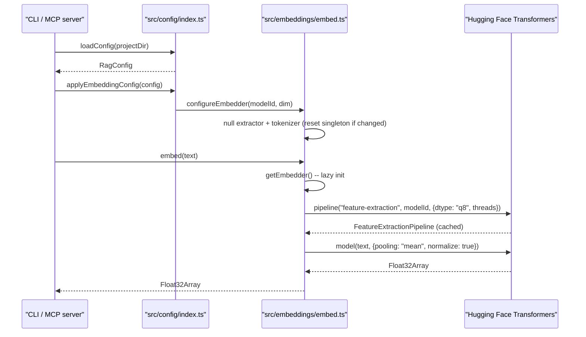
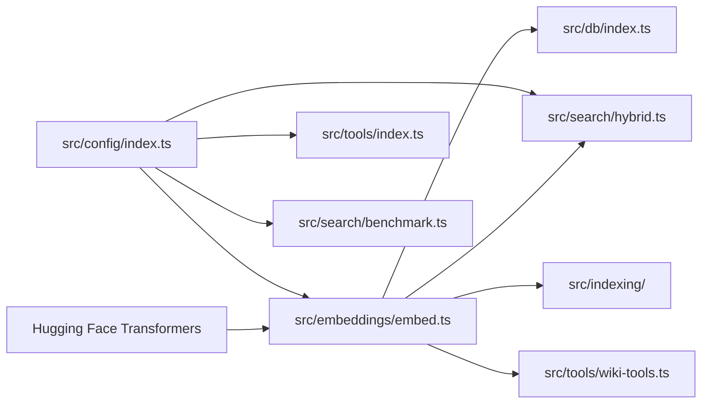

# Config & Embeddings

> [Architecture](../architecture.md)
>
> Generated from `79e963f` · 2026-04-26

The Config & Embeddings community owns two tightly coupled concerns: loading and validating the project configuration from disk, and running the local transformer model that produces embedding vectors. Nearly every other mimirs community depends on at least one of these files. Understanding them is the prerequisite for changing model behavior, tuning index parameters, or debugging embedding errors.

## How it works

`loadConfig` reads `.mimirs/config.json`, validates it through `RagConfigSchema` (a zod schema), and returns a `RagConfig`. If the file does not exist, it writes the defaults to disk first, so the user can see and edit the full config. Invalid JSON or a schema validation failure both produce a warning and fall back to `DEFAULT_CONFIG` rather than throwing, so a bad config edit never prevents mimirs from running.

After loading config, callers that will run embeddings must call `applyEmbeddingConfig(config)` to push `embeddingModel` and `embeddingDim` from the config into the embedding singleton via `configureEmbedder`. If this step is skipped, embeddings run with `DEFAULT_MODEL_ID = "Xenova/all-MiniLM-L6-v2"` at `DEFAULT_EMBEDDING_DIM = 384` regardless of what the config says.

The embedding pipeline is loaded lazily on the first call to `getEmbedder()`. It runs the model quantized to 8-bit integers (`dtype: "q8"`) and sets both intra-op and inter-op thread counts via ONNX session options. Models are cached to `~/.cache/mimirs/models` to survive temp-directory cleanup between `bunx` invocations.

## Dependencies and consumers

`src/embeddings/embed.ts` is imported by 77 files across the codebase. `src/config/index.ts` is the second most widely imported file in the project. Nearly every subsystem needs config parameters, and nearly every subsystem that touches text needs embedding. These two files are cross-cutting in the truest sense — changes to their signatures require reviewing the full import list.

## Tuning

The following parameters in `.mimirs/config.json` change embedding and search behavior without code changes:

- `embeddingModel` (string, optional) — The Hugging Face model ID. Defaults to `DEFAULT_MODEL_ID = "Xenova/all-MiniLM-L6-v2"`. Must match the model used when the index was built; switching models requires clearing and rebuilding the index.
- `embeddingDim` (integer, optional) — The embedding vector dimension. Defaults to `DEFAULT_EMBEDDING_DIM = 384`. Must match `embeddingModel`'s actual output dimension; a mismatch causes `sqlite-vec` dimension errors.
- `hybridWeight` (number 0–1, default `0.7`) — The fraction of the final score drawn from the vector result. `1.0` is pure vector; `0.0` is pure BM25.
- `searchTopK` (integer, default `10`) — Default number of files returned by `search`.
- `chunkSize` (integer ≥ 64, default `512`) — Target chunk size in tokens.
- `chunkOverlap` (integer ≥ 0, default `50`) — Overlap between adjacent chunks in tokens.
- `indexBatchSize` (integer, optional, default `50`) — How many chunks are embedded per batch during indexing.
- `indexThreads` (integer, optional) — Thread count passed to ONNX. Defaults to `Math.max(2, Math.floor(cpus().length / 3))`.
- `embeddingMerge` (boolean, default `true`) — When true, chunks that exceed `MODEL_MAX_TOKENS = 256` are split into overlapping windows and their embeddings are mean-pooled via `embedBatchMerged`.
- `incrementalChunks` (boolean, default `false`) — When true, only chunks whose content hash changed are re-embedded during re-indexing.
- `parentGroupingMinCount` (integer ≥ 2, default `2`) — Minimum number of sibling sub-chunks before they are promoted to their parent chunk in `searchChunks` results.
- `benchmarkTopK` (integer, default `5`) — K used during benchmark runs.
- `benchmarkMinRecall` (number 0–1, default `0.8`) — Minimum acceptable recall for the benchmark pass/fail check.
- `benchmarkMinMrr` (number 0–1, default `0.6`) — Minimum acceptable MRR for the benchmark pass/fail check.
- `generated` (string[], default `[]`) — Glob patterns for generated files to demote in search results by `GENERATED_DEMOTION = 0.75`.

## Entry points

Callers interact with this community through two functions, in this order:

1. `loadConfig(projectDir: string): Promise<RagConfig>` — Load and validate config from `.mimirs/config.json`. Returns a plain object; does not mutate singleton state.
2. `applyEmbeddingConfig(config: RagConfig): void` — Push embedding model settings into the singleton. Must be called before any `embed*` calls when using a non-default model.

After those, embedding callers use:

- `embed(text, threads?, onProgress?): Promise<Float32Array>` — Embed a single string.
- `embedBatch(texts, threads?, onProgress?): Promise<Float32Array[]>` — Embed an array of strings in one model call.
- `embedBatchMerged(texts, threads?, onProgress?): Promise<Float32Array[]>` — Like `embedBatch` but handles texts longer than `MODEL_MAX_TOKENS = 256` by splitting into overlapping windows of size 256 with `MERGE_WINDOW_OVERLAP = 32` token overlap, embedding each window, and mean-pooling the results.
- `getTokenizer(): Promise<PreTrainedTokenizer>` — Retrieve the tokenizer singleton, used for token counting before deciding whether to split.
- `mergeEmbeddings(embeddings: Float32Array[]): Float32Array` — Mean-pool and L2-normalize a set of embeddings into one vector.
- `getEmbeddingDim(): number` — Returns `currentDim`; called during DB schema creation.
- `getModelId(): string` — Returns `currentModelId`; used for diagnostics.
- `resetEmbedder(): void` — Nulls the singleton; only for tests.
- `EMBEDDING_DIM`, `DEFAULT_MODEL_ID`, `DEFAULT_EMBEDDING_DIM` — Backwards-compatible constant exports. `EMBEDDING_DIM = DEFAULT_EMBEDDING_DIM = 384`.

## Internals

**The extractor and tokenizer share a singleton lifecycle.** Module-level variables `extractor` and `tokenizer` start as `null`. `configureEmbedder` resets both to `null` when the model or dimension changes, forcing `getEmbedder` and `getTokenizer` to reinitialize on their next call. If `configureEmbedder` is called concurrently with an in-flight `getEmbedder()` call, the pipeline reference is replaced while the old one may still be running — there is no mutex. In practice this is safe because `configureEmbedder` is only called at startup before any embedding work begins.

**Corrupt model cache triggers one automatic retry.** If `pipeline()` throws with a message containing `"Protobuf parsing failed"` or `"Load model"`, `getEmbedder` deletes the model directory from `CACHE_DIR = ~/.cache/mimirs/models` and retries the load once. This handles the common case of a half-written model cache from a killed download. If the retry also fails, the error propagates.

**Thread count defaults to a fraction of CPUs.** `defaultThreadCount()` returns `Math.max(2, Math.floor(cpus().length / 3))`. On an 8-core machine this is 2; on a 12-core machine it is 4. This conservative fraction avoids starving other processes when mimirs runs alongside a busy dev environment.

**`embedBatchMerged` makes one `embedBatch` call for all texts and all windows.** Short texts contribute one slot to the flat array; oversized texts contribute N slots (one per window). After `embedBatch` returns, the function reassembles results by index ranges recorded in a `mapping` array. This batching avoids the N model calls that a naive per-text splitting approach would require.

## Failure modes

**Missing Homebrew SQLite on macOS.** This is technically a DB-layer failure, but it manifests at config time when `RagDB` tries to load `sqlite-vec`. If `brew install sqlite` has not been run, the error is thrown before any config or embedding code runs.

**`embeddingModel` set to an unknown model ID.** `getEmbedder()` calls `pipeline()` with whatever `currentModelId` contains. If the model ID is not in Hugging Face's registry and not cached locally, the call throws a network or 404 error. There is no validation at `configureEmbedder` time — the error is deferred to first use.

**`embeddingDim` mismatches the model's actual output.** `configureEmbedder` sets `currentDim` without verifying against the model. `getEmbeddingDim()` returns `currentDim`, which the DB uses to size the `vec0` table. If the actual model outputs 768 dimensions but `currentDim` is 384, embeddings inserted into the DB will be truncated and searches will return wrong results silently. The only remedy is to clear the index and re-index with the correct dimension.

**Config JSON parse failure.** A bad JSON edit to `.mimirs/config.json` triggers a `log.warn` and falls back to `DEFAULT_CONFIG`. The warning goes to stderr; there is no structured error return, so automation that relies on the config value being applied will silently run with defaults.

## See also

- [Architecture](../architecture.md)
- [CLI Commands](cli-commands.md)
- [Data flows](../data-flows.md)
- [Getting started](../getting-started.md)
- [MCP Tool Handlers](mcp-tools.md)
- [Search Runtime](search-runtime.md)
