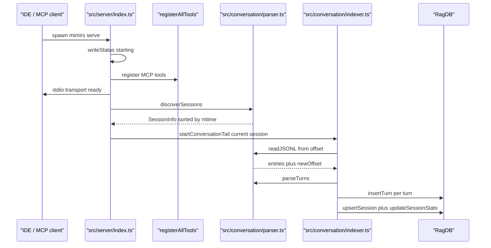
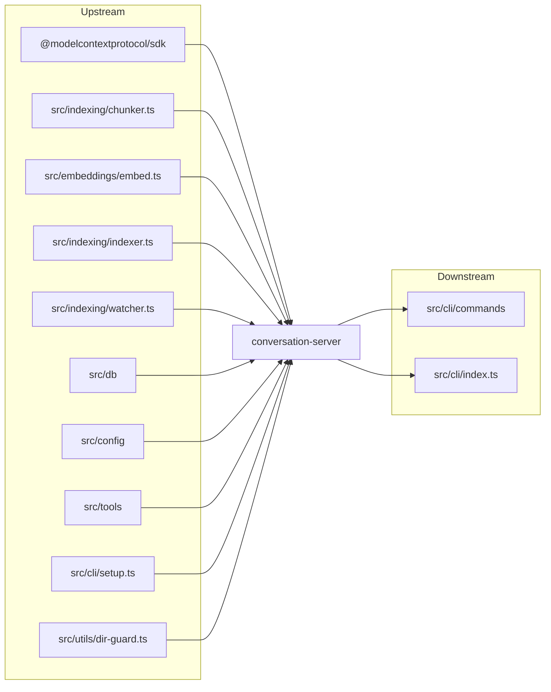

# Conversation Indexer & MCP Server

> [Architecture](../architecture.md)
>
> Generated from `b47d98e` · 2026-04-26

Three files cooperate to ingest Claude Code transcripts and to bootstrap the MCP server: `src/conversation/parser.ts` discovers and parses JSONL session files; `src/conversation/indexer.ts` chunks, embeds, and tails them into `RagDB`; `src/server/index.ts` is the stdio MCP entry point that wires every tool group together and runs background indexing.

## Per-file breakdown

### `src/conversation/parser.ts` — JSONL discovery and turn parsing

The top-PageRank member. `discoverSessions(projectDir)` translates a project path into Claude's transcript directory by replacing `/` with `-` and walking `~/.claude/projects/<encoded-path>/*.jsonl`; it returns `SessionInfo[]` sorted by `mtime` descending, so `sessions[0]` is the most recent. `readJSONL(filePath, fromOffset)` is a positional reader: it `openSync`s the file, reads `stat.size - fromOffset` bytes from `fromOffset`, splits on newlines, and returns parsed entries plus the new byte offset — the caller persists `newOffset` and uses it on the next call to read only what was appended. `parseTurns(entries, sessionId, startTurnIndex)` collapses a stream of `JournalEntry` rows into `ParsedTurn[]`: a turn starts when a user message contains text and accumulates assistant text, `tool_use`/`tool_result` pairs, token usage, and file references until the next text-bearing user message. Two constants gate tool-result indexing: `SKIP_CONTENT_TOOLS = new Set(["Read", "Glob", "Write", "Edit", "NotebookEdit"])` (their output is redundant with the code index) and `SHORT_RESULT_THRESHOLD = 500` (results at or below this size are kept regardless). `buildTurnText(turn)` joins user/assistant/tool prefixes with `\n\n` for embedding.

### `src/conversation/indexer.ts` — chunk, embed, tail

`indexConversation(jsonlPath, sessionId, db, fromOffset, startTurnIndex, onProgress?)` reads the JSONL tail, parses turns, and calls `indexTurn` per turn. `indexTurn` runs `chunkText(text, ".md", 512, 50)` — the markdown extension is hardcoded so the chunker uses paragraph-style splitting regardless of what the original tool output was — embeds the chunks in one `embedBatch`, and inserts via `db.insertTurn(...)`. `db.insertTurn` returns `0` on duplicate, which is how `indexTurn` reports "already indexed" upstream. After the loop, `upsertSession` and `updateSessionStats` persist the new offset, turn count, and total tokens. `startConversationTail(jsonlPath, sessionId, db, onEvent?)` opens an `fs.watch` on the JSONL, debounces events at `TAIL_DEBOUNCE_MS = 1500`, and re-runs `indexConversation` with the persisted `currentOffset`/`currentTurnIndex`; it does an initial index before returning the `Watcher`.

### `src/server/index.ts` — MCP stdio bootstrap

`startServer()` is the single entry point. It writes `.mimirs/status` early (`starting\nversion: …\nstarted: …`) and registers signal handlers (`SIGINT`, `SIGTERM`, `SIGHUP`, stdin `end`/`error`, `uncaughtException`, `unhandledRejection`) before any work, so even a startup crash leaves a meaningful `interrupted` status. It then constructs an `McpServer({ name: "mimirs", version })`, calls `registerAllTools(server, getDB, getConnectedDBs, writeStatus)`, and connects the `StdioServerTransport` *before* doing slow work — the comment explicitly notes that without an early `connect`, the client's `initialize` handshake times out and subsequent stderr writes hit `EPIPE`. After the transport is up, `getDB(startupDir)` runs (its failure is split into transient `database is locked`/`SQLITE_BUSY` retries vs. permanent errors stored in the module-level `permanentError`), `loadConfig` runs, and a background `indexDirectory(...)` writes per-file progress into `.mimirs/status` as `N/M files (P%)`. When the bulk index resolves, `startWatcher` takes over; in parallel, `discoverSessions(startupDir)` picks the most recent session for `startConversationTail` and lazily indexes older sessions whose `mtime` is newer than what's stored. `dbMap` (a `Map<string, DBEntry>`) is the per-project DB cache; cleanup closes every entry and clears the map on exit. `checkIndexDir` is consulted up front so the home-directory trap (`isHomeDirTrap`) skips both auto-index and the watcher while still serving tool calls.

## How it works

1. `startServer()` (`src/server/index.ts:87-368`) writes a `starting` status, registers signal/stdin handlers, and constructs the `McpServer`.
2. `registerAllTools(server, getDB, getConnectedDBs, writeStatus)` wires every tool group; the transport is connected immediately after, before any slow I/O.
3. `getDB(startupDir)` opens or reuses a `RagDB` from `dbMap`. Transient `SQLITE_BUSY` errors are not cached; permanent errors latch into `permanentError` so subsequent tool calls fail fast.
4. `indexDirectory(...)` runs in the background; per-file progress is reflected into `.mimirs/status` until `startWatcher` takes over.
5. `discoverSessions(startupDir)` reads `~/.claude/projects/<encoded>/*.jsonl`, sorts by `mtime`, and returns the list.
6. `startConversationTail(currentSession.jsonlPath, sessionId, db)` opens an `fs.watch`, debounces at `TAIL_DEBOUNCE_MS = 1500`, and runs an initial `indexConversation` before returning the `Watcher`.
7. `indexConversation` calls `readJSONL` (which seeks to `fromOffset`), `parseTurns` (which respects `startTurnIndex`), and per-turn `indexTurn` — chunk via `chunkText(text, ".md", 512, 50)`, embed, then `db.insertTurn`. Older sessions are indexed lazily in parallel.

## Dependencies and consumers

Depends on: `@modelcontextprotocol/sdk` (`McpServer`, `StdioServerTransport`), `src/indexing/chunker.ts` (`chunkText`), `src/embeddings/embed.ts` (`embedBatch`), `src/indexing/indexer.ts` (`indexDirectory`), `src/indexing/watcher.ts` (`startWatcher`, `Watcher`), `src/db` (`RagDB`), `src/config` (`loadConfig`), `src/tools` (`registerAllTools`), `src/cli/setup.ts` (`ensureGitignore`), `src/utils/dir-guard.ts` (`checkIndexDir`).

Depended on by: the CLI handlers in [CLI Commands](cli-commands.md) — `conversationCommand`, `checkpointCommand`, and `sessionContextCommand` all import `discoverSessions` from `src/conversation/parser.ts`; `conversationCommand` also imports `indexConversation` from `src/conversation/indexer.ts`. `serveCommand` dynamically imports `src/server/index.ts` at runtime.

## Data shapes

- **`JournalEntry`** (`src/conversation/parser.ts`) — one row of the JSONL transcript. `type` is `"user" | "assistant" | "queue-operation" | "file-history-snapshot"`. The parser keeps only `user`/`assistant` rows that have a `message`; `queue-operation` and `file-history-snapshot` are dropped at the filter step. `message.content` is `ContentBlock[]`; `toolUseResult` carries Claude Code's tool metadata (`filenames`, `durationMs`, `numFiles`, `truncated`).
- **`ContentBlock`** (`src/conversation/parser.ts`) — discriminated union: `{ type: "text"; text }`, `{ type: "thinking"; thinking }`, `{ type: "tool_use"; id; name; input }`, `{ type: "tool_result"; tool_use_id; content }`. `tool_result.content` can be a string or another `ContentBlock[]` — the parser handles both.
- **`ParsedTurn`** (`src/conversation/parser.ts`) — the indexer's working unit: `turnIndex`, `timestamp`, `sessionId`, `userText`, `assistantText`, `toolResults: ToolResultInfo[]`, `toolsUsed: string[]` (deduped), `filesReferenced: string[]` (deduped), `tokenCost`, and `summary` (first 200 chars of `assistantText`).
- **`ToolResultInfo`** (`src/conversation/parser.ts`) — `toolName`, `content`, optional `durationMs`, and a `filenames` array from `toolUseResult.filenames`. Skipped entirely when `SKIP_CONTENT_TOOLS.has(toolName) && resultText.length > SHORT_RESULT_THRESHOLD`.
- **`SessionInfo`** (`src/conversation/parser.ts`) — `sessionId`, `jsonlPath`, `mtime`, `size`. `mtime` drives the re-index check; `size` is informational. `discoverSessions` returns `SessionInfo[]` sorted by `mtime` descending.

## Failure modes

- **Malformed JSONL line** — `readJSONL` wraps `JSON.parse(trimmed)` in a try/catch and drops bad lines. The `newOffset` still advances to `stat.size` so the next read won't re-attempt them.
- **Missing Claude project dir** — `discoverSessions` swallows the outer try/catch and returns `[]`. Callers that depend on session discovery (`checkpointCommand`, `sessionContextCommand`) treat empty as "no sessions" — `checkpointCommand` falls back to `sessionId = "unknown"`.
- **Per-file `stat` failure** — `discoverSessions` skips the entry inside an inner try/catch; the rest of the directory is still walked.
- **Duplicate turn** — `db.insertTurn` returns `0` for an already-indexed turn; `indexTurn` returns `false` so the progress log is suppressed but the loop continues. The session offset still advances.
- **`indexConversation` exception** — `startConversationTail` wraps every `processNewData` call in a try/catch and emits `Conversation index error: <message>` via `onEvent`. The watcher remains active; the next file change triggers another attempt.
- **Stdio EPIPE / IDE close** — `process.stdin.on("end")` and `on("error")` both call `cleanup`, which closes both watchers, closes every DB in `dbMap`, and calls `process.exit(0)`. The status file is overwritten with `interrupted` only when it still carries this instance's `pid:NNN` marker, so a freshly-spawned server isn't clobbered.
- **Server-startup crash** — `writeStartupError` logs to `.mimirs/server-error.log` with the stack and the hint `To diagnose: bunx mimirs doctor`; the `phase: …` token in `.mimirs/status` records how far startup got (`creating server`, `tools registered`, `connecting transport`, `transport connected`).
- **Transient DB lock at startup** — `getDB` failures matching `database is locked` or `SQLITE_BUSY` are *not* cached; `permanentError` stays null, the next tool call retries `getDB`. Permanent failures (`brew install sqlite` hint, `EROFS`/`EACCES`) latch and every subsequent tool call throws the cached message with the fix appended.
- **Home-dir trap** — `checkIndexDir` flags `~`, `/`, `/home`, `/Users`, `/tmp`, `/var`. The server still starts (so tool calls can reach into a real project via `directory` parameters) but auto-index and the file watcher are skipped; the warning is logged once via `log.warn`.
- **Conversation tail debounce** — events arriving inside `TAIL_DEBOUNCE_MS = 1500` reset the timer rather than queuing. A long save burst leads to one re-index after the burst, not one per save.

## See also

- [Architecture](../architecture.md)
- [CLI Commands](cli-commands.md)
- [Config & Embeddings](config-embeddings.md)
- [Data flows](../data-flows.md)
- [Getting started](../getting-started.md)
- [Indexing runtime](indexing-runtime.md)
