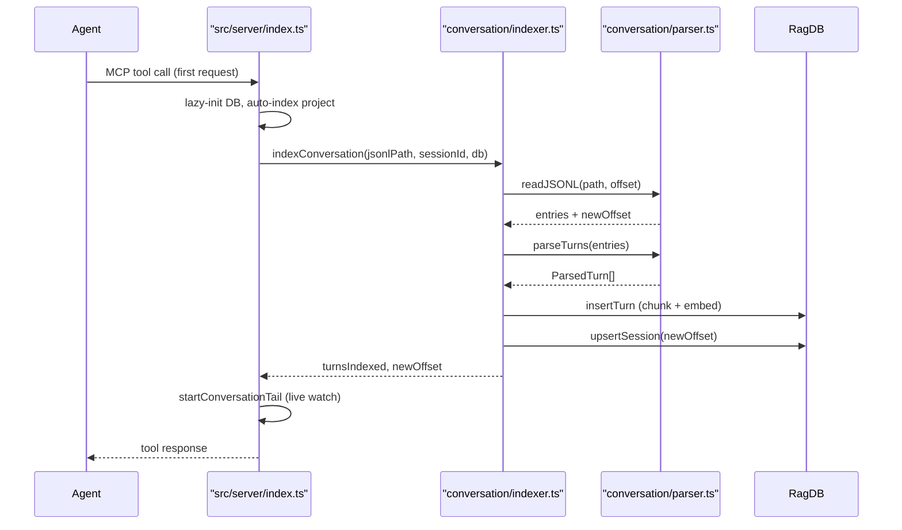
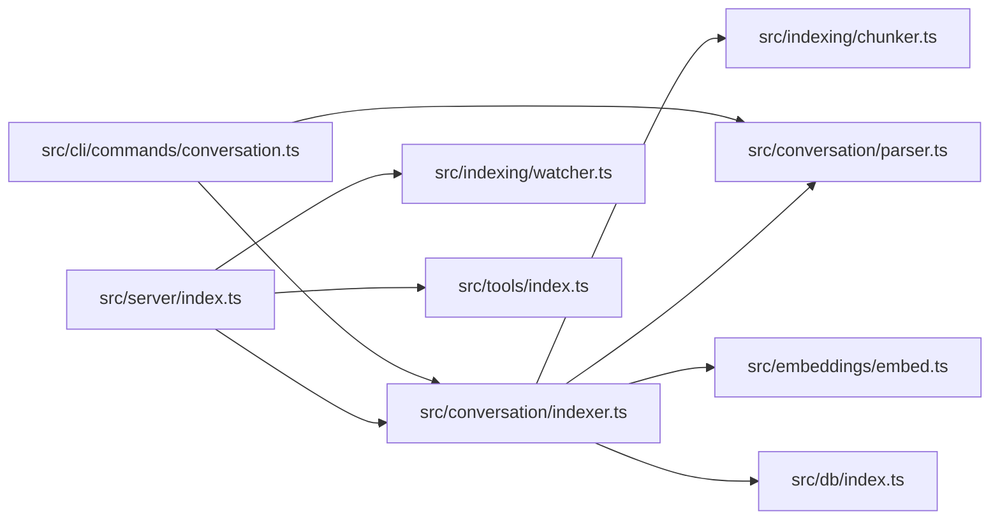

# Conversation Indexer & MCP Server

> [Architecture](../architecture.md)
>
> Generated from `79e963f` · 2026-04-26

This community covers two related concerns: the JSONL conversation parsing and indexing pipeline (`src/conversation/parser.ts` and `src/conversation/indexer.ts`) and the MCP server bootstrap that wires all tool groups together (`src/server/index.ts`). The conversation subsystem ingests Claude Code session transcripts so past decisions are searchable. The server layer connects the entire mimirs capability set to an AI agent via the Model Context Protocol.

## Per-file breakdown

### `src/conversation/parser.ts` — JSONL parsing

`parser.ts` is the read layer for Claude Code conversation transcripts. It owns four concerns: byte-level JSONL reading, turn boundary detection, content extraction, and session discovery on disk.

`readJSONL(filePath, fromOffset)` reads the file starting at a byte offset. It uses low-level `openSync`/`readSync`/`closeSync` rather than streaming so the offset-to-newOffset handshake can be atomic. Malformed JSON lines are silently skipped. The returned `newOffset` is the file's total byte size at read time, not the offset of the last successfully parsed line — this means a write that arrives during parsing is included in the offset even if its line was incomplete.

`parseTurns(entries, sessionId, startTurnIndex)` converts raw `JournalEntry` records into structured `ParsedTurn` objects. A turn starts when a user message with text (and no `tool_result`) is encountered. Everything until the next such user message — assistant text, tool invocations, tool results — is aggregated into the same turn. The function tracks a `toolUseNames` map keyed by `tool_use_id` so tool result blocks can be labelled with the originating tool name.

Two constants control tool result indexing: `SKIP_CONTENT_TOOLS = new Set(["Read", "Glob", "Write", "Edit", "NotebookEdit"])` and `SHORT_RESULT_THRESHOLD = 500`. Results from `SKIP_CONTENT_TOOLS` are only indexed when their content is shorter than 500 bytes — this prevents file content echoed by `Read` from dominating conversation search, while still capturing short confirmations.

`buildTurnText(turn)` serializes a `ParsedTurn` to a single indexable string: `"User: …\n\nAssistant: …\n\n[ToolName]: …"`. This is the text that gets chunked and embedded.

`discoverSessions(projectDir)` finds all JSONL files under `~/.claude/projects/<encoded-path>/` where `encoded-path` replaces `/` with `-`. Sessions are sorted by `mtime` descending.

### `src/conversation/indexer.ts` — turn indexing and live tail

`indexConversation` is the batch indexer. It reads new JSONL entries from `fromOffset`, parses them into turns, chunks each turn's text as markdown (fixed at 512 characters, 50 overlap), embeds all chunks in a single `embedBatch` call, and upserts into the DB via `db.insertTurn`. After processing it updates `db.upsertSession` and `db.updateSessionStats` so incremental reads start from the correct byte offset next time.

`startConversationTail(jsonlPath, sessionId, db, onEvent)` watches the JSONL file for changes and re-runs `indexConversation` on new content after a `TAIL_DEBOUNCE_MS = 1500` millisecond debounce. It loads the existing session state (byte offset, turn count) from the DB so restarts resume from the stored offset — turns already indexed are not re-processed. On first start it immediately indexes any existing content before waiting for changes.

### `src/server/index.ts` — MCP server bootstrap

`src/server/index.ts` is the process entry point for `mimirs serve`. It creates an `McpServer` instance, wires a lazy-init DB pool, auto-indexes the project on first start, starts the file watcher and conversation tail, registers all MCP tool groups via `registerAllTools`, and connects to stdio transport.

The DB pool (`dbMap`) holds one `RagDB` per resolved project directory. DBs are never closed during the process lifetime — background tasks (watcher, conversation tail) keep using them. Permanent init errors (filesystem permissions, missing native libraries) are cached in `permanentError` and re-thrown on every subsequent tool call. Transient errors (database locked) are not cached so the next call can retry.

Startup failures write a crash log to `.mimirs/server-error.log` with the full stack trace, keeping errors visible outside of stderr when the server runs as a background daemon.

## How it works

After startup, `startConversationTail` keeps the session index current: every JSONL write (each new agent turn) triggers a debounced re-index of the new bytes only, so `search_conversation` results are current within about 1.5 seconds of a turn completing.

## Dependencies and consumers

`src/conversation/parser.ts` has no dependencies on other mimirs modules — it is pure parsing logic. The indexer and CLI commands depend on it. The server is the sole entry point for the MCP protocol surface; it composes all subsystems.

## Data shapes

The parser and indexer exchange data through these core types:

**`JournalEntry`** — a raw line parsed from JSONL. The `type` field distinguishes `"user"`, `"assistant"`, `"queue-operation"`, and `"file-history-snapshot"`. Only user and assistant entries with a `message` field are processed by `parseTurns`.

**`ContentBlock`** — a discriminated union: `{ type: "text"; text }`, `{ type: "thinking"; thinking }`, `{ type: "tool_use"; id, name, input }`, or `{ type: "tool_result"; tool_use_id, content }`. A single message may contain multiple blocks.

**`ParsedTurn`** — the fully extracted turn: `turnIndex`, `timestamp`, `sessionId`, `userText`, `assistantText`, `toolResults: ToolResultInfo[]`, `toolsUsed: string[]`, `filesReferenced: string[]`, `tokenCost: number`, and `summary` (first 200 characters of assistant text).

**`ToolResultInfo`** — `{ toolName, content, durationMs?, filenames }`. Content is blank for `SKIP_CONTENT_TOOLS` results that exceed `SHORT_RESULT_THRESHOLD`.

**`SessionInfo`** — `{ sessionId, jsonlPath, mtime, size }`. Used by `discoverSessions` and by the CLI's conversation command to decide whether a session needs re-indexing.

## Failure modes

**Malformed JSONL lines.** `readJSONL` silently skips lines that fail `JSON.parse`. A partially written line (the writer crashed mid-write) will be skipped and never re-read because the byte offset advances past it. The next write to the same file will be readable.

**Missing Claude project directory.** `discoverSessions` wraps the directory scan in a try/catch. If `~/.claude/projects/<encoded>` does not exist (a new machine, or Claude Code not yet run), it returns an empty array. The conversation command and server handle this gracefully by skipping the session index step.

**Session state drift.** If the JSONL file is truncated or replaced (e.g. a session reset), the stored byte offset may be larger than the new file size. `readJSONL` checks `fromOffset >= stat.size` and returns early with no entries. The conversation index will not detect this truncation — stale turns remain in the DB until explicitly cleared.

**Server DB contention.** The lazy-init DB pool keeps all connections open. If multiple tool calls arrive concurrently for the same project, they share one `RagDB` instance. SQLite WAL mode handles concurrent reads safely, but concurrent writes (e.g. a tool call that writes a checkpoint while the conversation tail is upserting a turn) may block briefly.

## See also

- [Architecture](../architecture.md)
- [CLI Commands](cli-commands.md)
- [Config & Embeddings](config-embeddings.md)
- [Data flows](../data-flows.md)
- [Getting started](../getting-started.md)
- [Indexing Pipeline](indexing-pipeline.md)
