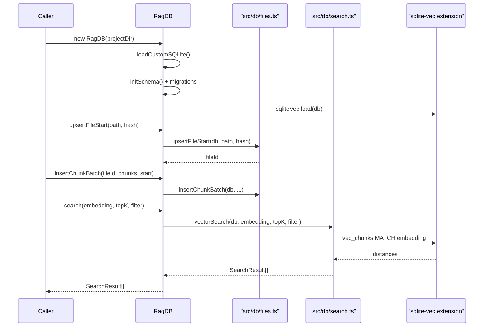
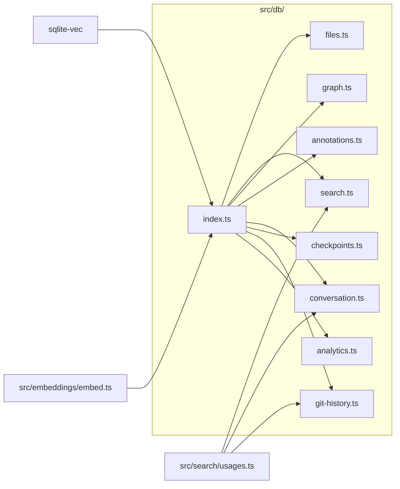

# Database Layer

> [Architecture](../architecture.md)
>
> Generated from `79e963f` · 2026-04-26

The Database Layer is the SQLite persistence core of mimirs. Every read and write — chunks, embeddings, annotations, conversation turns, checkpoints, git history, and the import graph — flows through this community. Understanding it is a prerequisite for touching indexing, search, or any feature that persists state.

## Per-file breakdown

### `src/db/index.ts` — The facade

`src/db/index.ts` exports the `RagDB` class, the single entry point all consumers use. It is a thin facade: every method on `RagDB` delegates immediately to one of the eight domain modules (`fileOps`, `searchOps`, `graphOps`, `conversationOps`, `checkpointOps`, `annotationOps`, `analyticsOps`, `gitHistoryOps`). The class owns the `Database` instance and is responsible for three startup tasks: loading a vanilla SQLite binary, running `initSchema()`, and running three additive migration functions (`migrateChunksEntityColumns`, `migrateParentChunkColumns`, `migrateGraphColumns`).

The macOS SQLite loading is non-trivial. Apple ships a system SQLite that does not support loadable extensions, so `loadCustomSQLite()` searches Homebrew paths (`/opt/homebrew/opt/sqlite/lib/libsqlite3.dylib` for Apple Silicon, `/usr/local/opt/sqlite/lib/libsqlite3.dylib` for Intel) and throws an actionable error if neither is found. On Linux the same probe happens more permissively: if all probe paths fail, bun's built-in SQLite is left in place and `sqlite-vec.load()` will throw its own error. WAL mode (`PRAGMA journal_mode=WAL`) and a 5-second busy timeout (`PRAGMA busy_timeout = 5000`) are set on every connection.

The `RagDB` constructor accepts an optional `customRagDir` and also respects the `RAG_DB_DIR` environment variable, making the DB location configurable without code changes — useful when the project directory is read-only.

### `src/db/files.ts` — File and chunk persistence

`src/db/files.ts` owns the `files` and `chunks` tables. The key behavioral pattern is a two-phase upsert: `upsertFileStart` creates or updates the file row and deletes all its existing chunks and vec entries (preserving the `files.id` to keep foreign keys intact), then the caller inserts new chunks with `insertChunkBatch`. This separation lets the indexing pipeline stream chunks in batches without holding a transaction open for the full file parse.

`getFilesByPaths` batches lookups in groups of 499 to stay under SQLite's 999-parameter limit — a constraint that recurs throughout this community. `deleteStaleChunks` is the incremental-indexing counterpart: it keeps chunks whose `content_hash` appears in the `keepHashes` set and removes the rest, allowing unchanged code regions to survive a re-index without losing their vector entries.

`getChunkById` is used at query time to fetch a parent chunk when `groupByParent` in `src/search/hybrid.ts` promotes sibling methods to their enclosing class or function.

### `src/db/search.ts` — Low-level query execution

`src/db/search.ts` provides the raw SQL for vector and FTS5 search. It exports four search functions — `vectorSearch`, `textSearch`, `vectorSearchChunks`, `textSearchChunks` — and two symbol-lookup functions: `searchSymbols` and `findUsages`.

The vector search converts L2 distance to a normalized score with `score = 1 / (1 + distance)`. FTS5 rank (a negative number) maps to `score = 1 / (1 + |rank|)`. Both normalizations put scores in (0, 1] so `src/search/hybrid.ts` can blend them with a single weight.

When a `PathFilter` is active, the queries over-fetch by a factor of `FILTER_OVERFETCH = 5` from the inner `vec_chunks` or `fts_chunks` scan, then apply the path filter in the outer JOIN, and finally `LIMIT` to `topK`. This is necessary because SQLite's vec0 virtual table does not accept WHERE clauses directly — the filter must be a post-JOIN predicate.

`searchSymbols` avoids the N+1 query pattern that plagued earlier versions. It fetches base export rows in one pass, then loads chunks, child counts, and reference counts in three batched IN-list queries (all chunked at 499), and joins everything in JavaScript. `findUsages` works at query time by FTS-searching for the symbol name, then excluding defining files via `file_exports`, and finally scanning matched chunk lines with a word-boundary regex to compute exact line numbers.

### `src/db/graph.ts` — Import graph

`src/db/graph.ts` manages the `file_imports` and `file_exports` tables. `upsertFileGraph` atomically replaces all imports and exports for a file inside a single transaction — a full delete-and-reinsert rather than a diff, which keeps the logic simple at the cost of always clearing FK-dependent rows. Import resolution (`resolveImport`) is a separate step: the indexing pipeline writes unresolved import rows first, then calls `getUnresolvedImports` and `resolveImport` to link each import to its target `files.id`.

`getDependsOnForFiles` and `getDependedOnByForFiles` are the batched variants used by the wiki bundler so a community with 50 member files needs one SQL call rather than 50. `getSymbolGraphData` returns a flat list of all symbols with their cross-file reference counts, used by the categorization phase of wiki generation.

### `src/db/annotations.ts` — Notes persistence

`src/db/annotations.ts` stores developer-written notes attached to a file path and optional symbol name. `upsertAnnotation` is a transactional upsert: if a note already exists for the same `(path, symbol_name)` pair, it replaces the FTS5 entry (delete + reinsert) and the `vec_annotations` embedding before updating the row. The FTS5 delete-before-reinsert pattern is required by SQLite's content-table FTS5 design — you cannot UPDATE an FTS row directly; you must emit a synthetic delete row first.

`getAnnotationsForPaths` is used by `read_relevant` to batch-fetch all annotations for result paths in a single IN-list query, avoiding N+1 round-trips in the hot path.

### `src/db/checkpoints.ts` — Session checkpoints

`src/db/checkpoints.ts` stores conversation milestones. `createCheckpoint` inserts the checkpoint row and its vector embedding in a single transaction. The `embedding` column on the `conversation_checkpoints` table is a BLOB placeholder from `initSchema`; the actual vector lives in `vec_checkpoints`. `listCheckpoints` supports filtering by `sessionId` and `type`; `searchCheckpoints` performs vector similarity search over `vec_checkpoints` and can additionally filter by type.

### `src/db/conversation.ts` — Conversation indexing

`src/db/conversation.ts` tracks conversation sessions and their turns. `upsertSession` uses `ON CONFLICT(session_id) DO UPDATE` for idempotent re-indexing. `insertTurn` is a three-table operation: it writes the turn row, inserts conversation chunks, and embeds them into `vec_conversation` and `fts_conversation`. The `read_offset` field on `conversation_sessions` supports incremental ingestion — the watcher re-reads the JSONL file from the last offset rather than from the beginning.

### `src/db/git-history.ts` — Git commit index

`src/db/git-history.ts` stores git commits with their diffs, per-file change stats, and vector embeddings. `insertCommitBatch` skips commits that already exist via `INSERT OR IGNORE`, checks `changes()` to confirm insertion, then writes per-file stats to `git_commit_files`. `searchGitCommits` and `textSearchGitCommits` mirror the hybrid search pattern in `src/db/search.ts` — they accept `author`, `since`, `until`, and `path` filters as additional SQL predicates.

### `src/db/analytics.ts` — Query logging

`src/db/analytics.ts` persists every search invocation to `query_log`. `logQuery` is a fire-and-forget INSERT called at the end of both `search` and `searchChunks` in `src/search/hybrid.ts`. `getAnalytics` returns aggregated query statistics over a rolling window (default 30 days): total queries, average result count, zero-result queries, low-score queries, top terms, and queries-per-day. `getAnalyticsTrend` returns a 7-day trending view, used by the `search_analytics` MCP tool.

## How it works

`RagDB` initializes once per process. The constructor runs `loadCustomSQLite()` before opening the database, then calls `initSchema()` which applies all `CREATE TABLE IF NOT EXISTS` and trigger statements. Three migration functions run unconditionally after schema init: they PRAGMA-inspect column lists and apply `ALTER TABLE ADD COLUMN` statements for columns added after the original schema shipped, making upgrades non-destructive without requiring explicit version numbers.

## Dependencies and consumers

The DB layer has no runtime dependencies on mimirs search or wiki logic — that coupling goes the other way. External consumers include `src/tools/` (all MCP tool handlers), `src/indexing/` (indexing pipeline), `src/wiki/` (bundle prefetch), and benchmarks. The only internal cross-dependency is `src/db/search.ts` and `src/db/conversation.ts` and `src/db/git-history.ts` importing `sanitizeFTS` and `escapeRegex` from `src/search/usages.ts`.

## Internals

**The FTS5 `content='table'` pattern requires explicit delete events.** SQLite's FTS5 content tables do not update automatically when the underlying table changes; instead, triggers must emit synthetic delete rows before updates. The schema in `initSchema()` defines `AFTER INSERT`, `AFTER DELETE`, and `AFTER UPDATE` triggers for each FTS table. Violating this contract leaves the FTS index stale — searches return rows pointing at deleted content.

**All paths stored in the DB are absolute.** `getFileByPath` and `buildPathFilter` in `src/db/search.ts` match on the literal path string. The caller must pass absolute paths or the queries return nothing silently. `src/tools/search.ts` resolves relative `dirs` to absolute using `resolve(projectDir, d)` before constructing a `PathFilter`.

**The `files.id` FK is never recycled.** `upsertFileStart` updates the existing file row rather than deleting and reinserting it precisely to keep `file_imports.resolved_file_id` FKs pointing at the right row. If you delete a file row and reinsert it, all resolved import edges pointing to it become NULL.

**The 499-batch cap appears in four places.** `getFilesByPaths` in `src/db/files.ts`, `getDependsOnForFiles` / `getDependedOnByForFiles` in `src/db/graph.ts`, and `batchIn` in `src/db/search.ts` all split large IN-lists at 499 to stay under SQLite's 999-bound-parameter limit.

**Vector dimension is baked at schema creation time.** `vec_chunks`, `vec_conversation`, `vec_checkpoints`, `vec_annotations`, and `vec_git_commits` are created with `embedding FLOAT[${getEmbeddingDim()}]`. If you change the embedding model after first run without clearing the index, `sqlite-vec` will reject inserts with a dimension mismatch.

## Why it's built this way

The facade pattern in `src/db/index.ts` keeps consumers insulated from the domain module structure. Before the split, a single large monolithic DB file made it impossible to tree-shake or test individual concerns. The split into eight focused modules allows each to be read independently: the graph module does not need to import chunk logic, and the analytics module has no dependency on the search module.

The decision to use raw SQL (via `bun:sqlite`) rather than an ORM was deliberate. The query patterns in this codebase — batched IN-lists, vec0 MATCH expressions, FTS5 content tables, conditional WHERE clauses built at runtime — are difficult or impossible to express through typical ORM abstractions. Direct SQL keeps the queries visible and auditable.

WAL mode was chosen because mimirs commonly runs with a long-lived MCP server process (holding the DB open) alongside short-lived CLI invocations. WAL allows concurrent readers without blocking the writer, which prevents "database is locked" errors during watch-mode indexing.

## Trade-offs

The two-phase upsert (`upsertFileStart` + `insertChunkBatch`) simplifies the indexer — it never needs to diff existing chunks against new ones at the file level. The cost is that re-indexing an unchanged file still deletes and reinserts all its chunks and vec entries. The `incrementalChunks` config flag mitigates this by routing through `getChunkHashes` + `deleteStaleChunks` + `updateChunkPositions` when enabled.

Storing absolute paths in the DB makes queries simple and index-friendly but couples the DB to the host filesystem layout. Moving a project directory invalidates all stored paths. There is no migration path for path changes; re-indexing from scratch is the only remedy.

The schema-in-code approach (no migration files, additive ALTER TABLE migrations) is pragmatic for a single-file embedded database but does not scale to multi-tenant or multi-version deployments. Each migration function is idempotent but runs unconditionally on every startup, adding a small PRAGMA round-trip to initialization.

## Common gotchas

**Forgetting to call `applyEmbeddingConfig` before opening the DB on a non-default model.** `getEmbeddingDim()` is called during `initSchema()` to size the `vec0` tables. If you call `configureEmbedder` after the DB is opened but before any inserts, the schema was already baked with the old dimension and vec inserts will fail silently or throw a dimension mismatch error.

**Passing relative paths to `getFileByPath`.** The files table stores absolute paths. Passing a bare relative path like `src/db/index.ts` instead of its absolute equivalent returns null silently. Use `resolve(projectDir, relativePath)` before querying.

**Reading `FTS5` matches as if they were exact.** The `sanitizeFTS` function in `src/search/usages.ts` wraps each token in double quotes to force literal matching, but FTS5 still does tokenized word-boundary matching — it does not do substring search. Symbol names with underscores are split by the FTS5 tokenizer unless quoted.

**Running `clearGitHistory` without rebuilding the index.** `clearGitHistory` deletes all rows from `git_commits`, `git_commit_files`, and `vec_git_commits` without any guard. Calling it accidentally on a large indexed repo requires a full re-index of git history.

## Invariants

- `files.id` is never reused after a path is upserted; callers may cache file IDs across calls within a session.
- All paths in `files.path` are absolute at write time; queries against them must use absolute paths.
- Every chunk in `chunks` has a corresponding row in `vec_chunks`; the two tables are always kept in sync by `insertChunkBatch` and `deleteStaleChunks`.
- FTS5 triggers keep `fts_chunks`, `fts_annotations`, `fts_conversation`, and `fts_git_commits` consistent with their content tables; no external synchronization is needed.
- The `embedding FLOAT[N]` dimension `N` is fixed at DB creation time and must match `getEmbeddingDim()` for the lifetime of the database.

## See also

- [Architecture](../architecture.md)
- [CLI Commands](cli-commands.md)
- [Data flows](../data-flows.md)
- [Getting started](../getting-started.md)
- [Search Runtime](search-runtime.md)
- [Wiki Pipeline — Types & Internals](wiki-pipeline-internals.md)
