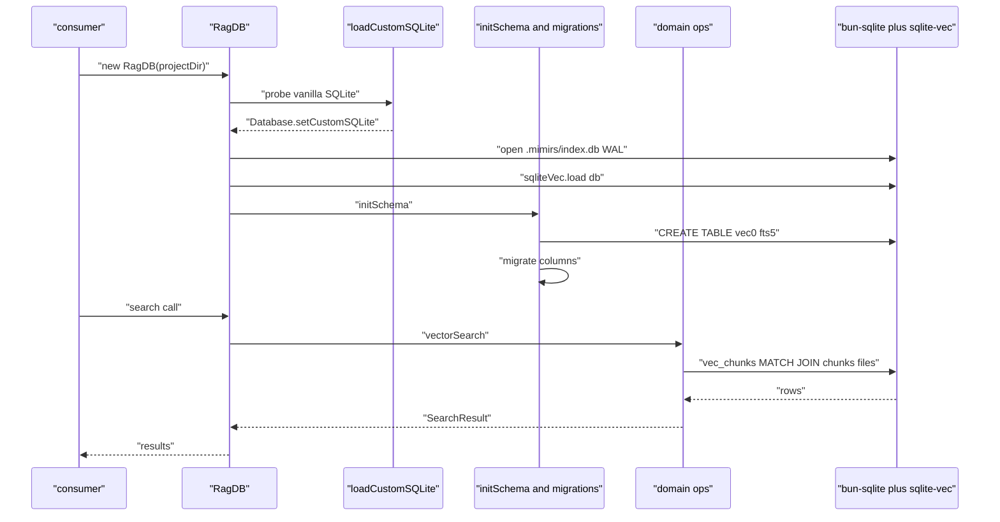
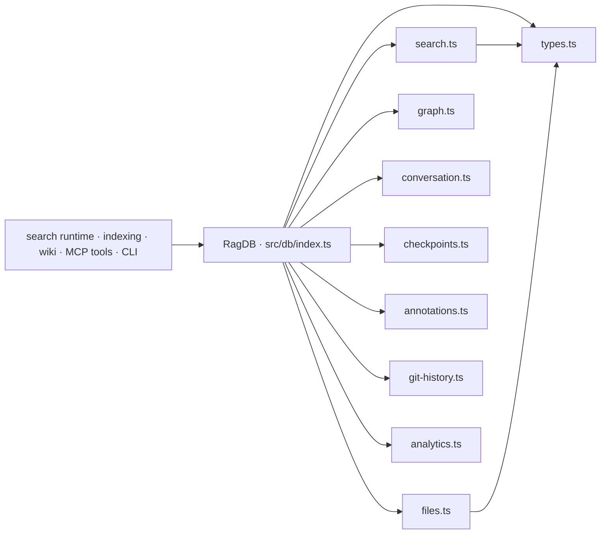

# Database Layer

> [Architecture](../architecture.md)
>
> Generated from `b47d98e` · 2026-04-26

The database layer is the persistence floor under every other subsystem in mimirs. It owns the SQLite schema, the `bun:sqlite` extension loader (sqlite-vec), and a per-domain set of read/write modules — chunks, files, the import graph, conversation history, checkpoints, annotations, query analytics, and git commit history. The single facade class `RagDB` in `src/db/index.ts` opens the database, runs schema bootstrap and migrations, and exposes thin methods that delegate to the per-file operation modules. Every other community in the codebase (search, indexing, wiki, MCP tools, CLI) reaches storage through that facade.

## Per-file breakdown

### `src/db/index.ts` — the `RagDB` facade

`RagDB` is the only class exported from this file. The constructor (lines 92–123) does four things in order: calls `loadCustomSQLite()` to point `bun:sqlite` at a vanilla extension-capable SQLite build, resolves a writable RAG directory (in priority order: an explicit `customRagDir` argument, the `RAG_DB_DIR` environment variable, then `<projectDir>/.mimirs`), opens `index.db` with `PRAGMA journal_mode=WAL` and `PRAGMA busy_timeout = 5000`, loads the `sqlite-vec` extension, and finally calls `initSchema()`.

`loadCustomSQLite()` is the platform-specific shim. On Darwin it probes `/opt/homebrew/opt/sqlite/lib/libsqlite3.dylib` (Apple Silicon) and `/usr/local/opt/sqlite/lib/libsqlite3.dylib` (Intel) and throws a Homebrew-flavoured error message if neither exists, because Apple's bundled SQLite has extension loading disabled. On Linux it tries Debian/Ubuntu, RHEL/Fedora, and Arch/Alpine paths but does not throw on miss — bun's built-in SQLite usually works there. Windows falls through to bun's bundled build untouched.

`initSchema()` (lines 125–358) is one large `db.exec(...)` of `CREATE TABLE IF NOT EXISTS` and `CREATE VIRTUAL TABLE IF NOT EXISTS` for every domain at once, followed by three migration helpers — `migrateChunksEntityColumns`, `migrateParentChunkColumns`, and `migrateGraphColumns`. The migrations diff `PRAGMA table_info(...)` against the expected column set and emit `ALTER TABLE` only for the missing columns, so an existing index.db can be opened with a newer mimirs without losing data. The chunks-side virtual tables (`vec_chunks` for embeddings, `fts_chunks` for FTS5) are wired up with `chunks_ai/ad/au` triggers that mirror inserts/deletes/updates into FTS5; the same pattern is repeated for `conversation_chunks` and `git_commits`.

The remainder of the class (lines 426–682) is wiring: each domain module is imported as a namespace (`* as fileOps`, `* as searchOps`, …) and the `RagDB` method body is one line that forwards to the corresponding module function with `this.db` prepended. Types are re-exported from `./types` so the rest of the codebase imports `StoredChunk`, `SearchResult`, etc. from `"../db"` rather than reaching into a sub-module.

### `src/db/search.ts` — vector, FTS, symbol, and usage queries

This is the highest-PageRank file in the community: every search-runtime path runs through it. It exports `vectorSearch`, `textSearch`, `vectorSearchChunks`, `textSearchChunks`, `searchSymbols`, and `findUsages`.

The four search functions share a common shape: parse a `PathFilter` into SQL fragments via the internal `buildPathFilter`, run an `ORDER BY` on either `vec_chunks` (vector) or `fts_chunks` (FTS5 BM25 rank), join `chunks` and `files` for path/snippet metadata, and return either a slim `SearchResult` (path-level) or a `ChunkSearchResult` (with `start_line`, `end_line`, `parent_id`). When a filter is active the inner LIMIT is multiplied by the `FILTER_OVERFETCH = 5` constant so the post-join filter still has enough candidates to reach `topK` — without that buffer, narrow filters routinely returned fewer rows than requested. Scores are normalised to `1 / (1 + distance)` for vector results and `1 / (1 + abs(rank))` for FTS to keep both on the same `0..1` axis for hybrid fusion downstream.

`searchSymbols` was rewritten to avoid a four-correlated-subquery shape that made symbol listings minutes-slow on medium projects (see comment at lines 248–252). The new shape is a five-step batch: (1) flat base query against `file_exports` joined to `files`, optionally filtered by name pattern and type, capped at `effectiveTopK` (`200` when listing, `20` when querying); (2) load all chunks for the matched file_ids in one IN-list pass and key them by `file_id|entity_name`; (3) count children of each candidate parent chunk in one batched query; (4a) load every export sharing a (case-insensitive) name with a base row to identify the set of files defining each symbol, then (4b) load resolved imports keyed by lowered name, intersecting with the defining file set to count true callers; (5) compose the final `SymbolResult[]` with `referenceCount`, `referenceModuleCount`, `referenceModules`, and `hasChildren`. The internal `batchIn<Row, Id>` helper splits IN-list queries into chunks of 499 (the constant lives inline in the helper) to stay under SQLite's 999-parameter ceiling.

`findUsages` runs an FTS5 phrase query (`"<symbol>"`) against `fts_chunks`, over-fetches by 5x, then refines with a JS regex (`\b<sym>` for prefix, `\b<sym>\b` for exact) to handle word boundaries FTS can't express. It excludes chunks in files that *define* the symbol — it answers "who calls this", not "where is this declared".

### `src/db/files.ts` — chunks and the files table

The file-level read path is `getFileByPath` and the batched `getFilesByPaths`, which slices into 499-sized IN lists exactly like `searchSymbols` does. The write path is dominated by `upsertFileStart`: when an existing path is re-indexed it `UPDATE`s the row instead of `DELETE+INSERT`, deliberately preserving `files.id` so that `file_imports.resolved_file_id` foreign keys do not get stranded (see the comment block at 41–43). Old chunks for that file are then dropped, including their entries in `vec_chunks`, before fresh chunks land via `insertChunkBatch` / `insertChunkReturningId`.

Other exports cover chunk-only flows: `getChunkById` for parent-chunk lookup at query time, `getChunkHashes` and `deleteStaleChunks` for content-hash-incremental re-indexing, `updateChunkPositions` for the position-only fast path when only line numbers shift, `pruneDeleted` for sweeping chunks whose paths no longer exist on disk, `removeFile` for explicit removal, `getAllFilePaths` for full project listings, and `getStatus` for the `mimirs status` summary.

### `src/db/graph.ts` — the import graph

`upsertFileGraph` rewrites a file's edges atomically — it deletes both `file_imports` and `file_exports` rows for the file, then inserts the new sets in a single transaction. `resolveImport` patches the `resolved_file_id` column once a path resolver knows the real target; `getUnresolvedImports` returns the pending set for the resolver to chew on.

Read-side, the module exposes `getGraph` (everything), `getSubgraph` (BFS-bounded by `maxHops`), `getImportsForFile` and `getImportersOf` for raw IDs, and four convenience wrappers — `getDependsOn`, `getDependedOnBy`, `getDependsOnForFiles`, `getDependedOnByForFiles` — that return paths instead of IDs. `getSymbolGraphData` and `getProjectConstants` are read APIs the wiki bundler uses to assemble per-community export tables and tunable lists.

### `src/db/conversation.ts` — Claude session indexing

`upsertSession` uses `ON CONFLICT(session_id) DO UPDATE` to keep `file_mtime`, `indexed_at`, and `read_offset` fresh while preserving `started_at`. `insertTurn` writes one row per Claude turn plus an N-chunk vec/fts split for retrieval. `searchConversation` runs vector search via `vec_conversation`; `textSearchConversation` runs FTS via `fts_conversation`. Both accept an optional `sessionId` to scope to a single session. `updateSessionStats` pushes `turn_count`, `total_tokens`, and the new `read_offset` after a re-scan. Internal calls go through `sanitizeFTS` (imported from `src/search/usages`) to defuse special FTS5 syntax.

### `src/db/checkpoints.ts` — durable session memory

`createCheckpoint` writes one row to `conversation_checkpoints` and one matching row to `vec_checkpoints` inside a transaction. `listCheckpoints` filters by optional `sessionId` and `type` with a default `limit = 20`. `searchCheckpoints` is vector-only — there is no FTS sibling here because checkpoint titles and summaries are short and embedding similarity is the desired signal. `getCheckpoint` fetches a single row by id.

### `src/db/annotations.ts` — pinned notes on files and symbols

`upsertAnnotation` is the one true write path. It looks up an existing annotation by `(path, symbol_name)` (treating a NULL `symbol_name` as the file-level slot) and either updates in place — refreshing the FTS5 row by deleting and re-inserting via the FTS5 `delete` magic, then replacing the vec row — or inserts fresh, capturing `last_insert_rowid()` for the FTS and vec inserts. The read path is `getAnnotations` (path/symbol filter), `getAnnotationsForPaths` (batched), `searchAnnotations` (vector only), and `deleteAnnotation` (returns a boolean indicating whether a row was actually removed).

### `src/db/git-history.ts` — indexed commit history

`GitCommitInsert` is the input record (hash, short hash, message, author, date, file changes, refs, diff summary, embedding). `insertCommitBatch` runs everything in one transaction: `INSERT OR IGNORE` into `git_commits`, then for every newly inserted row push the embedding into `vec_git_commits` and one row per touched path into `git_commit_files`. `getLastIndexedCommit` powers the indexer's `--since` skip; `hasCommit` is the per-commit existence probe. The search side splits cleanly into `searchGitCommits` (vector against `vec_git_commits`) and `textSearchGitCommits` (FTS5 against `fts_git_commits`, which indexes both `message` and `diff_summary`). Both accept author / since / until / path filters. `getFileHistory` and `getFileHistoryForPaths` join through `git_commit_files` to return commits that touched a given path. `getAllCommitHashes` and `purgeOrphanedCommits` exist so the indexer can prune commits the git history no longer reaches (force-push, branch delete). `clearGitHistory` and `getGitHistoryStatus` round out the admin surface.

### `src/db/analytics.ts` — query telemetry

`logQuery` writes one row per executed search to `query_log` with `result_count`, `top_score`, `top_path`, and `duration_ms`. `getAnalytics` rolls a 30-day window (default `days = 30`) into a structured summary: total queries, average result count and top score, the ten most-frequent zero-result queries, the ten lowest-scoring queries (under `top_score < 0.3`), the most-searched terms, and a per-day query count. `getAnalyticsTrend` returns the same metrics broken across two consecutive windows so callers can compute deltas. The MCP `search_analytics` tool reads this directly.

### `scripts/regen-meta.ts` — wiki `_meta` regeneration

A small Bun script (35 LOC) that wires up `RagDB` and `runWikiBundling` against the current working directory, then writes the discovery, classified, bundles, and isolate-docs JSON artifacts into `wiki/_meta/`. It is the one place outside the wiki community itself that touches `RagDB` for read-only graph data — used after structural pipeline changes to inspect bundle shape without triggering page rewrites.

## How it works

Every read or write goes through the `RagDB` instance returned from the constructor. Domain modules never receive a `projectDir` — they receive the open `Database` handle, which keeps schema knowledge and the migration runner in one place. The vec/FTS triggers established in `initSchema` mean writers only need to insert into the base table; FTS5 mirrors land for free, and the `vec_chunks` insert is the only domain-level call that has to think about embeddings.

## Dependencies and consumers

The community has 13 external dependencies (mostly cross-file imports inside this same directory) and 62 external consumers — every CLI command, every MCP tool, every benchmark, and every wiki bundler reaches `RagDB` through `src/db/index.ts`. Internally, the only inter-module dependency the facade does not own is `searchOps` and `conversationOps` both calling `sanitizeFTS` from `src/search/usages.ts`.

## Internals

The chunk virtual tables are kept in lockstep with `chunks` by three triggers — `chunks_ai`, `chunks_ad`, `chunks_au` — so a writer who only touches `chunks` still gets the FTS5 mirror. The `vec_chunks` mirror is *not* trigger-driven, because `vec0` virtual tables don't accept SQL triggers; it has to be inserted/deleted manually alongside any chunk write. The same pattern applies to `vec_conversation`, `vec_checkpoints`, `vec_annotations`, and `vec_git_commits`. Forgetting the manual vec insert is the most common reason a re-indexed file shows up in FTS but ranks at the bottom of vector search.

Path filters are stored verbatim — the `files.path` column carries whatever the indexer wrote, so `buildPathFilter` does no normalisation beyond ensuring extensions have a leading dot and trimming a trailing slash from `dirs`. Callers are expected to pass paths in the same format the indexer used (typically absolute project-relative).

`searchSymbols` and `findUsages` lower-case names everywhere they compare. The `LOWER(...)` calls in SQL are unindexable on the existing `idx_file_exports_name` index, which is the trade-off for case-insensitive symbol search; the JS-side `chunkByFileName` map keys also lower-case to match. If you add a symbol query, mirror that convention.

The vec/FTS pair around `annotations` uses the FTS5 `delete` magic incantation (`INSERT INTO fts_annotations(fts_annotations, rowid, note) VALUES ('delete', ?, ?)`) every time an annotation is updated. That is the only correct way to delete a row from a contentless FTS5 table; a plain `DELETE FROM fts_annotations` will throw.

`SELECT changes()` is checked after `INSERT OR IGNORE` in `insertCommitBatch` — when `changes() == 0` the commit was a duplicate and the loop skips the vec/file-stats inserts. Without that guard the downstream `vec_git_commits` insert would fail on the duplicate primary key.

## Why it's built this way

The split between `RagDB` (one class, one file) and per-domain operation modules is deliberate. Each domain file owns its SQL — there is no general-purpose query builder — which keeps queries grep-able by name, lets each domain choose its own batching strategy, and makes index/EXPLAIN inspection straightforward. The facade is then a thin forwarding layer so consumers import a single object and never think about which file `searchSymbols` lives in.

Schema and migrations live with the facade rather than each domain file because schema is cross-cutting (chunks have triggers feeding into FTS5; the graph tables reference `files(id)`). Putting the schema where the database is opened means there is exactly one place to look for "what does the DB look like".

`bun:sqlite` was chosen over `better-sqlite3`/`node-sqlite3` for two reasons: it is the native Bun dependency (so it ships without prebuilds) and it works cleanly with `sqlite-vec` once a vanilla SQLite library is loaded. The Homebrew probe in `loadCustomSQLite` is the cost of paying for `sqlite-vec` on macOS — Apple disabled extensions in the system SQLite build years ago.

The `searchSymbols` rewrite to a five-step batch was forced by performance: the prior shape had four correlated subqueries per row, each doing un-indexable `LOWER(...)` comparisons. Listings of ~1k symbols took minutes. The new shape pays for one extra round-trip per supporting set but completes the same listing in well under a second, which is what made the symbol-tier wiki and `search_symbols` tool tractable.

## Trade-offs

Single-process single-writer SQLite (with WAL) is simple and durable but not horizontally scalable. mimirs assumes one indexer per project — a second concurrent writer will see `SQLITE_BUSY` (mitigated by the 5-second `busy_timeout`, but not eliminated). The community deliberately does not expose a connection pool because none of the consumer code paths benefit from one.

Holding all FTS5 and vector data in the same database file keeps a single backup story but couples performance: a busy WAL from a re-index will slow concurrent searches. The position-only fast path in `files.ts` exists specifically to keep edits cheap so re-indexing a single file does not stall search.

Per-domain SQL means duplication: the path-filter SQL builder lives only in `src/db/search.ts`, even though `src/db/git-history.ts` also wants a path filter — that one is hand-written. A general-purpose builder could DRY this up but would obscure what each query touches and cost EXPLAIN clarity. The current code accepts the duplication.

`searchSymbols` allocates four large maps per call. For project sizes of tens of thousands of symbols that is fine; for very large monorepos this is the next bottleneck.

## Common gotchas

A path written to `files.path` has to match the format the search-side filter expects. The indexer writes absolute paths; passing a relative `dirs: ["src"]` filter to `vectorSearch` will silently match nothing because the SQL `LIKE 'src/%'` clause does not match an absolute project-prefixed path.

`upsertFileStart` updates the `files` row instead of replacing it. If you ever need to drop a file completely (e.g. orphaned by a rename), call `removeFile(path)` — a fresh `upsertFileStart` will reuse the existing row and keep the old `files.id`.

The vec virtual tables (`vec_chunks`, `vec_conversation`, `vec_checkpoints`, `vec_annotations`, `vec_git_commits`) require a `Float32Array` re-bound through `new Uint8Array(embedding.buffer)` on insert. Passing the `Float32Array` directly to `db.run` will store the bytes incorrectly and ranks will silently degrade to noise.

Every search that goes through `fts_chunks` (or any FTS5 mirror) must call `sanitizeFTS(query)` on the user input. Raw quotes, parentheses, or NEAR/AND tokens otherwise crash the FTS5 parser. The wrapper lives in `src/search/usages.ts`, not in this community — but every domain module here imports it where it is needed.

`PRAGMA busy_timeout = 5000` only applies to the connection that ran the pragma. If you ever open a second `Database` against the same file (rare, but it happens in tests) you must repeat the pragma or you'll trip `SQLITE_BUSY` immediately on contention.

## Invariants

`files.id` never changes for a path that has been indexed and is still on disk. `upsertFileStart` updates rather than replaces, and `removeFile` is the only path that drops the row. Code that holds a `file_id` across an indexing run can rely on it staying valid.

Every `chunks` insert eventually appears in `fts_chunks` (via trigger) and `vec_chunks` (via the domain module's manual insert). The two mirrors are kept consistent only because `insertChunkBatch` writes both inside one transaction; callers must never write to `chunks` directly, bypassing the domain module.

`file_imports.resolved_file_id` is either NULL or points at a real `files.id`. `upsertFileGraph` clears the column on every rewrite, so resolution is a separate later pass via `resolveImport`. Code reading the graph must tolerate NULL resolved IDs — they are the normal state for an as-yet-unresolved external import.

`conversation_sessions.session_id` is unique. `upsertSession` uses `ON CONFLICT(session_id) DO UPDATE` so callers can safely re-call it on every scan; this is the only reason the indexer can be restarted mid-run without producing duplicate sessions.

`git_commits.hash` is unique. `insertCommitBatch` relies on `INSERT OR IGNORE` for idempotency; downstream `vec_git_commits` and `git_commit_files` writes are guarded by `changes() != 0`. Callers can re-process the same commit list without producing duplicates.

The `RagDB` constructor is the only place that opens a `Database`. Domain modules receive the open handle and do not close it — `RagDB.close()` is the single shutdown path.

## See also

- [Architecture](../architecture.md)
- [CLI Commands](cli-commands.md)
- [Data flows](../data-flows.md)
- [Getting started](../getting-started.md)
- [Search Runtime](search-runtime.md)
- [Wiki Pipeline — Types & Internals](wiki-pipeline-internals.md)
