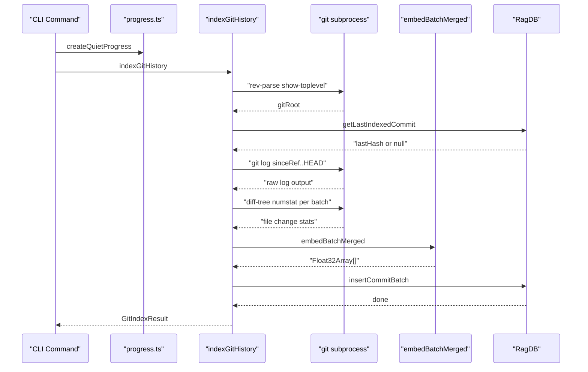
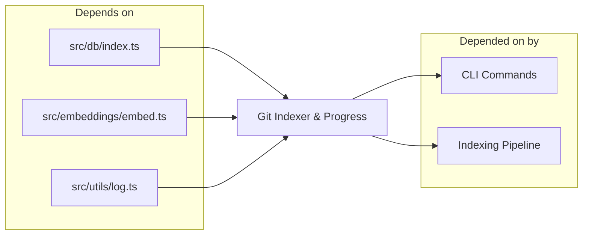

# Git History Indexer & CLI Progress

> [Architecture](../architecture.md)
>
> Generated from `79e963f` · 2026-04-26

Two small but load-bearing files support every long-running index operation in mimirs. `src/git/indexer.ts` ingests git commit history into the RAG database — parsing the log, fetching per-commit file stats, batch-embedding commit messages alongside their changed-file context, and handling force-push recovery. `src/cli/progress.ts` provides the two progress callback styles (verbose and quiet) that any command emitting `onProgress` messages can use. Every `mimirs index` run uses both.

## How it works

1. `indexGitHistory` resolves the git root via `git rev-parse --show-toplevel`. If the directory is not a git repository, it calls `onProgress` with an informational message and returns early with zero counts.
2. It reads `db.getLastIndexedCommit()` to find the last indexed hash. If that hash is still a valid ancestor (`git merge-base --is-ancestor`), it uses `sinceRef..HEAD` to fetch only new commits. If the hash is no longer reachable (force push), `handleForcePush` purges orphaned commits from the DB and recovers the latest surviving hash.
3. Git log is parsed using ASCII delimiters — `FIELD_SEP = "\x1f"` (unit separator) and `RECORD_SEP = "\x1e"` (record separator) — to avoid conflicts with commit message content.
4. File changes are fetched via `git diff-tree --no-commit-id -r --numstat` in batches of 50 commits at a time to stay within argument-list limits.
5. Each commit's embeddable text combines the commit message with a list of changed files and a set of top-level directory names (`modules affected`). This gives the vector search better recall for queries about which subsystem a commit touched.
6. `embedBatchMerged` batches the embeddings. Inserts are committed to the DB in batches of 100 rows. Progress is reported via `onProgress` as transient messages (overwrite-in-place) so the terminal doesn't scroll.

## Dependencies and consumers

Depends on: `src/db/index.ts` (commit insertion and retrieval), `src/embeddings/embed.ts` (batch embedding via `embedBatchMerged`), `src/utils/log.ts` (the `cli` logger in `progress.ts`).

Depended on by: CLI command files that call `indexGitHistory` with a progress callback, and the indexing pipeline's batch-indexing path that wires progress to the active display mode.

## Entry points

- `indexGitHistory(projectDir, db, options?)` — the primary entry point. Options: `since` (override the auto-detected start ref), `onProgress` (progress callback, matches the `cliProgress`/`createQuietProgress` signature), `threads` (forwarded to `embedBatchMerged`). Returns `GitIndexResult { indexed, skipped, total }`.
- `cliProgress(msg, opts?)` — verbose progress callback. Renders transient messages (batch progress, per-file names) as overwrite-in-place terminal lines. Persistent messages (summaries, errors) print on a new line. Silently drops `file:start` / `file:done` bookkeeping messages that the quiet mode handles internally.
- `createQuietProgress(totalFiles)` — factory that returns a progress callback for quiet mode. Tracks `processed` count, current file name, and per-file chunk embedding progress, rendering a single updating line: `Indexing: X/N files (pct%) | chunksProcessed/chunksTotal — currentFile`. Passes through `"Found ..."`, `"Pruned ..."`, and `"Resolved ..."` summary messages as persistent output; suppresses everything else.

## Internals

**Incremental commit detection.** The indexer checks `db.hasCommit(hash)` for each parsed commit before adding it to the new-commits list. This means a partial index run (interrupted mid-batch) is safe to resume: already-indexed commits are skipped at the per-hash level, not solely at the `sinceRef` level. `result.skipped` reflects how many commits were in the log range but already in the DB.

**Force-push recovery.** When `git merge-base --is-ancestor` returns non-null for the last indexed hash, it means the indexed hash exists in current history and the incremental path is safe. When it returns `null`, a force push is assumed: `handleForcePush` fetches all reachable hashes via `git log --format=%H --all`, calls `db.purgeOrphanedCommits(reachable)` to remove unreachable commits, and reads the new `db.getLastIndexedCommit()` as the recovery point. If no indexed commits survive, `db.clearGitHistory()` triggers a full re-index.

**Quiet-vs-verbose selection.** The caller decides which progress mode to use. `cliProgress` is appropriate when the command is already verbose (e.g. the user passed `--verbose`). `createQuietProgress(totalFiles)` is appropriate for normal-mode index commands where a single progress line is less noisy. The `totalFiles` parameter must be known in advance; for git history indexing (where total is determined after parsing the log), the count is reported via `onProgress("Found N commits to index")` but the quiet-progress `render()` uses an internal counter.

**Transient vs. persistent output.** The `opts?.transient` flag on `onProgress` calls determines whether a message overwrites the current terminal line (`\r`) or starts a new line. `clearTransient()` in `cliProgress` and `createQuietProgress` ensures that a persistent message (like a summary) clears any in-progress transient line before printing, preventing visual overlap.

## Failure modes

- **Not a git repository.** `findGitRoot` returns `null` if the directory has no git root. `indexGitHistory` calls `onProgress` with an explanatory message and returns `{ indexed: 0, skipped: 0, total: 0 }`. The caller is not expected to treat this as an error.
- **`git log` returns no output.** Treated as "no commits found" and returns early with zero counts. This can happen on a brand-new repo with no commits, or when `sinceRef..HEAD` is already up to date.
- **Embedding failure.** `embedBatchMerged` throws on persistent embedding errors. The indexer does not catch this — the caller's try/catch or process exit handles it. Any commits embedded before the failure are not inserted (the insert batch hasn't been called yet for that window).
- **DB batch insert failure.** Inserts are done in batches of 100 rows. A failure mid-batch leaves the DB in a partially-inserted state for that window. The per-hash `skipped` counter means a clean retry will skip already-inserted commits and re-attempt only the failed window.

## See also

- [Architecture](../architecture.md)
- [CLI Commands](cli-commands.md)
- [CLI Entry & Core Utilities](cli-entry-core.md)
- [Config & Embeddings](config-embeddings.md)
- [Data flows](../data-flows.md)
- [Getting started](../getting-started.md)
