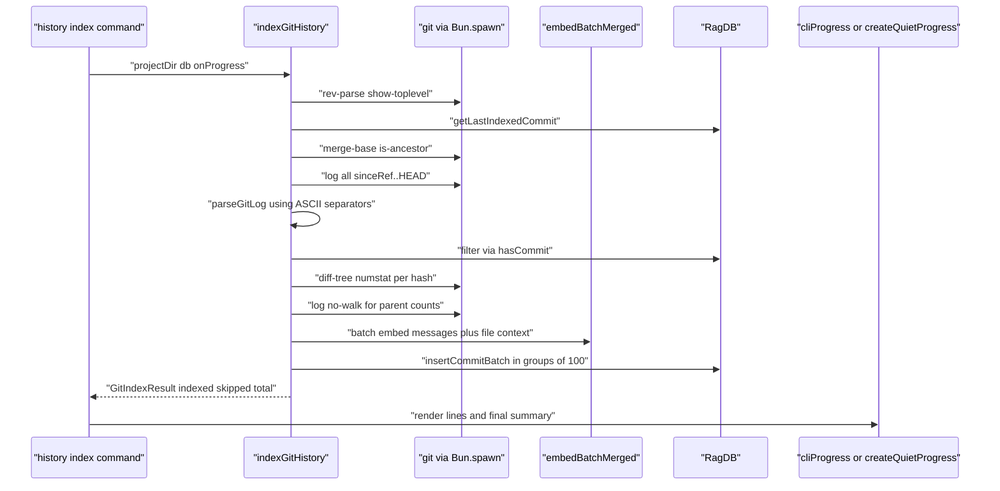
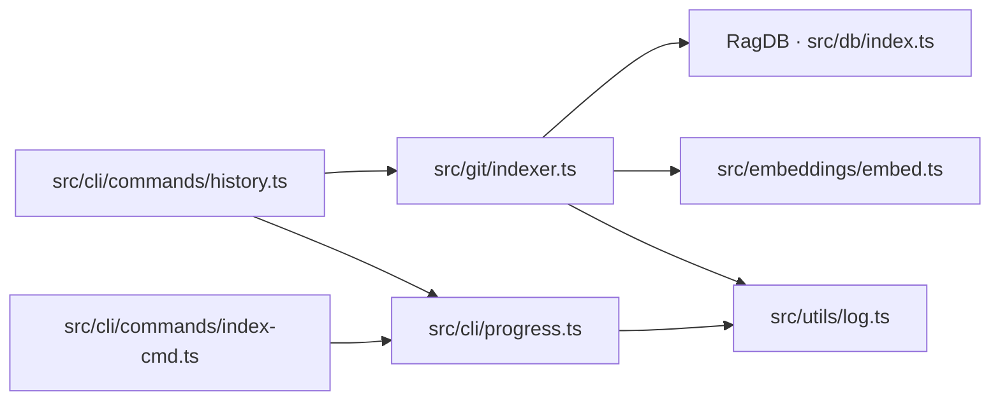

# Git History Indexer & CLI Progress

> [Architecture](../architecture.md)
>
> Generated from `b47d98e` · 2026-04-26

Two small files that always run together: `src/git/indexer.ts` ingests commit history into the DB, and `src/cli/progress.ts` is the progress reporter every long-running indexing operation calls back through.

## How it works

`indexGitHistory` finds the git root via `git rev-parse --show-toplevel`, then determines the range. With no explicit `since`, it asks `db.getLastIndexedCommit()` and runs `git merge-base --is-ancestor <last> HEAD`: when that succeeds, the last indexed hash becomes `sinceRef`; when it fails (force push, branch rewrite), control passes to `handleForcePush`, which lists every reachable hash via `git log --format=%H --all`, calls `db.purgeOrphanedCommits(reachable)` to drop indexed commits that no longer exist, and resumes from the latest survivor — or, if none survive, calls `db.clearGitHistory()` and rebuilds. The internal `FIELD_SEP = "\x1f"` and `RECORD_SEP = "\x1e"` ASCII separators are used in the `git log --format` template so commit messages containing newlines, pipes, or quotes parse cleanly. `getFileChanges` runs `git diff-tree --numstat` per hash in batches of 50; `getParentCounts` runs one `git log --format="%H %P" --no-walk <hashes>` for the whole batch and counts space-separated parent hashes. The internal `buildEmbeddableText` concatenates the commit message with a `Files changed: ...` and `Modules affected: ...` summary so vector retrieval can match against module-level intent. `buildDiffSummary` caps at 20 files and appends `... and N more files`. Inserts run through `db.insertCommitBatch` in groups of 100 (the internal `DB_BATCH` constant).

`cliProgress` and `createQuietProgress` are the two progress callbacks. `cliProgress` writes transient messages with `\r` and a column-truncated, padded line so the next persistent message doesn't leave artefacts; persistent messages clear the transient line first via `clearTransient()`, then call `cli.log`. The `file:start` and `file:done` bookkeeping prefixes used by the file indexer are silently dropped in verbose mode. `createQuietProgress(totalFiles)` is the closure factory: it tracks `processed`, `currentFile`, `fileChunksProcessed`, `fileChunksTotal`, parses `file:start <name>` and `Embedded N/M chunks` messages, and renders a single updating `Indexing: P/T files (X%) | a/b — file` line. Only `Found `, `Pruned `, and `Resolved ` summary messages are allowed through as persistent output; everything else is suppressed.

## Dependencies and consumers

`indexGitHistory` reaches the DB layer (`RagDB.getLastIndexedCommit`, `hasCommit`, `purgeOrphanedCommits`, `clearGitHistory`, `insertCommitBatch`), the embedder (`embedBatchMerged`), and the diagnostic logger. `cliProgress` only depends on `cli` from `src/utils/log.ts`. The two CLI commands that import them are `history` (calls `indexGitHistory` directly) and `index` (uses `cliProgress` / `createQuietProgress` to surface file-indexing progress).

## Entry points

`indexGitHistory(projectDir, db, options?)` is the one async function callers invoke. The optional `since` overrides the auto-detected `sinceRef`; `onProgress` receives every status message; `threads` is forwarded to `embedBatchMerged` for parallel embedding. The return type `GitIndexResult` carries `indexed`, `skipped`, and `total` so callers can print a summary.

`cliProgress(msg, opts?)` is the verbose-mode callback. Pass `opts: { transient: true }` for an over-writable line; omit it for a persistent line. `createQuietProgress(totalFiles)` returns a callback with the same signature but suppresses per-file output and renders a single rolling progress line. The CLI picks one or the other from the `-v` / `--verbose` flag.

## Internals

Incremental indexing is the default. With no `since` argument, `db.getLastIndexedCommit()` returns the most recent indexed hash and `merge-base --is-ancestor` decides whether the index can be extended (linear history) or has to be repaired (force push). The repair path is `handleForcePush`: it calls `db.purgeOrphanedCommits(reachable)` with the set of hashes still reachable from any ref, then trusts `getLastIndexedCommit` to return the latest survivor — there is no separate "find fork point" walk because `purgeOrphanedCommits` plus `getLastIndexedCommit` already converge on the right answer.

Quiet mode interprets `file:start <name>`, `Embedded N/M chunks for ...`, and the bare `file:done` token as control messages. Anything else that doesn't match the `Found `/`Pruned `/`Resolved ` prefix is silently dropped — verbose-only chatter never leaks into the quiet rendering. The `Indexing ` (no colon) legacy prefix is also recognised so older callers keep working.

The `\r` line trick in `writeTransient` reads the current `process.stdout.columns` (default 80) and truncates with `...` when the message exceeds the available width minus one. The padding to `cols - 1` is what prevents a long previous line from showing through a short replacement.

## Failure modes

`runGit(args, cwd)` swallows every error and returns `null` — every git invocation in this module checks for null and degrades. A missing `git` binary, an invalid commit range, a permission failure on `.git`: each surfaces as `null` and is handled by the caller. `findGitRoot` returning `null` short-circuits `indexGitHistory` to a no-op with a `Not a git repository` progress message.

`handleForcePush` returns `null` when no commits are reachable (a freshly orphaned index), and the caller responds by clearing the entire git history and rebuilding from scratch. This is the only path that drops indexed data.

`getFileChanges` tolerates the binary-file `-` marker in numstat output by treating it as zero insertions/deletions. A line that fails to parse is dropped silently.

The embed step runs against the entire `newCommits` text array; a failure inside `embedBatchMerged` propagates up and aborts the run before any rows are written. Partial-progress recovery happens on the next run because `db.insertCommitBatch` uses `INSERT OR IGNORE` and re-running picks up where the previous attempt failed.

## See also

- [Architecture](../architecture.md)
- [CLI Commands](cli-commands.md)
- [CLI Entry & Core Utilities](cli-entry-core.md)
- [Config & Embeddings](config-embeddings.md)
- [Data flows](../data-flows.md)
- [Getting started](../getting-started.md)
