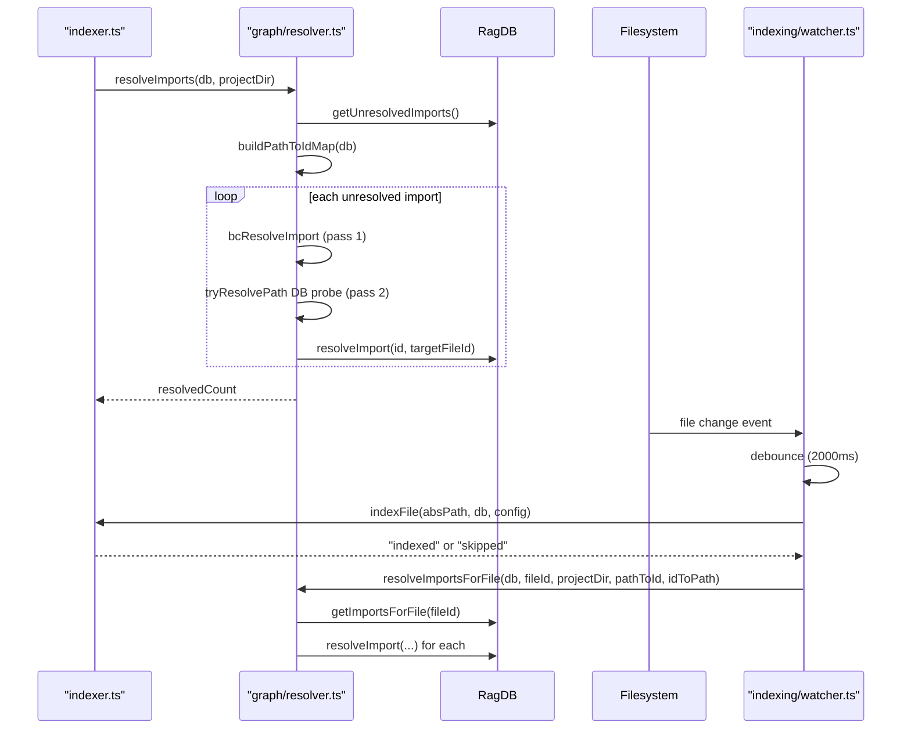
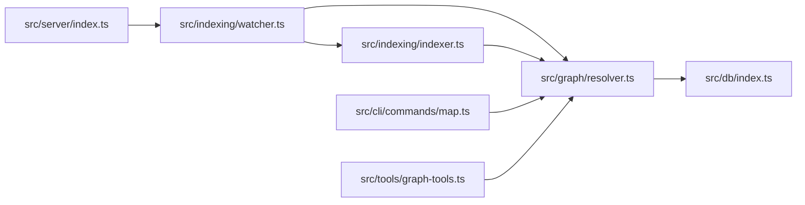

# Import Graph & File Watcher

> [Architecture](../architecture.md)
>
> Generated from `79e963f` · 2026-04-26

This community covers two tightly coupled concerns: `src/graph/resolver.ts` resolves import edges between indexed files and can render the full dependency graph as text or JSON, and `src/indexing/watcher.ts` watches the filesystem for changes and triggers incremental re-indexing and import resolution. Together they keep the DB's import graph accurate as the codebase evolves, both at initial index time and during live development.

## How it works

The batch `resolveImports` runs at the end of every `indexDirectory` call. The single-file `resolveImportsForFile` runs after each watcher-triggered re-index. Both follow the same two-pass algorithm but the single-file variant accepts pre-built `pathToId`/`idToPath` maps so the watcher can reuse them across multiple simultaneous events without redundant full-table scans.

## Dependencies and consumers

`src/graph/resolver.ts` has a single external dependency — `src/db/index.ts` — making it easy to test in isolation. The watcher depends on both the resolver and the indexer. The server is the only production caller of `startWatcher`. `generateProjectMap` is consumed by the CLI `map` command and the `project_map` MCP tool.

## Internals

**Two-pass import resolution.** `resolveImports` and `resolveImportsForFile` share the same algorithm. Pass 1 delegates to `bcResolveImport` from `@winci/bun-chunk`, which handles TypeScript path aliases (via `loadTsConfig`), Python relative imports, and Rust `crate::` specifiers. Pass 2 probes the DB's path map by appending `RESOLVE_EXTENSIONS = [".ts", ".tsx", ".js", ".jsx"]` then index file suffixes `["/index.ts", "/index.tsx", "/index.js", "/index.jsx"]`. Bare specifiers (no leading `.` or `/`) are skipped for TypeScript/JS but allowed through for Python and Rust, where relative imports can omit the `./` prefix.

**Path-to-ID map construction.** `buildPathToIdMap` calls `db.getAllFilePaths()` and builds a `Map<string, number>` keyed by absolute path. `buildIdToPathMap` inverts it. These maps are rebuilt at the start of each `resolveImports` call (full batch) or passed in as parameters for `resolveImportsForFile` (single-file path). The watcher pre-builds both maps once per batch cycle and reuses them across all files in that batch.

**Watcher debounce mechanics.** `startWatcher` wraps `fs.watch` with a per-file `DEBOUNCE_MS = 2000` millisecond debounce: each file path has its own `NodeJS.Timeout` in the `pending` map. An event resets the timer for that path. When the timer fires, the file is added to `nextBatch` with action `"index"` or `"remove"`. A serial processing queue (`processing` flag + `nextBatch` accumulator) ensures that while one batch is running, new events accumulate into a fresh batch rather than interleaving with the in-flight DB writes.

**Include/exclude glob pre-compilation.** Globs from `config.exclude` and `config.include` are compiled once at watcher startup via Bun's `Glob` class and stored in `excludeGlobs`/`includeGlobs`. Per-event matching uses these pre-compiled objects, avoiding repeated glob compilation for every file-system event.

**Import resolution after re-index.** After `indexFile` succeeds, the watcher builds the path→id and id→path maps once, then calls `resolveImportsForFile` for the newly indexed file. This ensures that any new `import` statements in the file are wired immediately, and that other files which import the changed file can be re-resolved (the changed file's path still maps to the same DB id).

**`generateProjectMap` output modes.** The function supports four output paths: `{ zoom: "file", format: "text" }` (human-readable adjacency list), `{ zoom: "file", format: "json" }` (structured JSON with fanIn/fanOut), `{ zoom: "directory", format: "text" }` (directory-level summary with edge counts), and `{ zoom: "directory", format: "json" }` (structured directory graph). The `focus` option restricts the graph to a subgraph centred on a specific file, walking up to `maxHops = 2` hops in each direction.

## Entry points

The public surface that external code reaches first:

| Export | File | Purpose |
|---|---|---|
| `resolveImports` | `src/graph/resolver.ts` | Batch-resolve all unresolved imports in the DB |
| `resolveImportsForFile` | `src/graph/resolver.ts` | Resolve imports for a single file (watcher path) |
| `buildPathToIdMap` | `src/graph/resolver.ts` | Build path → fileId lookup |
| `buildIdToPathMap` | `src/graph/resolver.ts` | Invert a path-to-id map |
| `generateProjectMap` | `src/graph/resolver.ts` | Render dependency graph as text or JSON |
| `startWatcher` | `src/indexing/watcher.ts` | Start a live FS watcher for incremental re-indexing |
| `Watcher` | `src/indexing/watcher.ts` | Interface with a single `close()` method |
| `GraphOptions` | `src/graph/resolver.ts` | Configuration type for `generateProjectMap` |

## Failure modes

**Unresolvable imports.** If neither bun-chunk nor the DB probe can match an import specifier to an indexed file, the import is left unresolved in the DB. This is normal for external packages (npm modules, standard library). Stale unresolved imports accumulate until a full re-index or until the target file is indexed.

**`fs.watch` reliability.** On macOS, `fs.watch` uses the FSEvents API, which can miss rapid rename-then-write sequences (e.g. atomic saves). The 2-second debounce mitigates false negatives by waiting for the filesystem to settle. On Linux, inotify is used, which is more reliable but can drop events under high write load.

**Watcher and `indexDirectory` concurrency.** The watcher's serial queue prevents watcher-internal concurrency, but it does not synchronize with a concurrent `mimirs index` run. Both can be writing chunks to the DB at the same time. SQLite WAL mode prevents data corruption but may produce momentarily inconsistent import graphs (some edges resolved by the CLI run, some by the watcher) until both finish.

**Large graph memory.** `buildPathToIdMap` loads all indexed file paths into memory. For projects with hundreds of thousands of files this map can be several megabytes. It is rebuilt on every `resolveImports` call. If memory is a concern, `resolveImportsForFile` with pre-built maps avoids redundant allocation for the watcher's per-file updates.

**Deleted files.** When a file deletion event arrives, the watcher calls `db.removeFile(absPath)`. This removes the file's chunks and import records. However, other files that imported the deleted file retain their resolved edge pointing at the (now-missing) target fileId. These dangling edges are cleaned up by the next `resolveImports` pass or full re-index.

## See also

- [Architecture](../architecture.md)
- [CLI Commands](cli-commands.md)
- [Data flows](../data-flows.md)
- [Database Layer](db-layer.md)
- [Getting started](../getting-started.md)
- [Indexing Pipeline](indexing-pipeline.md)
