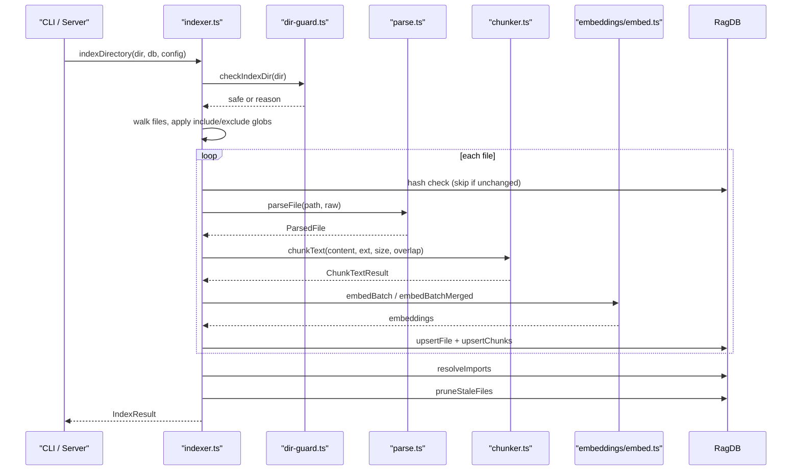

# Indexing Pipeline

> [Architecture](../architecture.md)
>
> Generated from `79e963f` · 2026-04-26

The indexing pipeline turns project source files into a searchable vector database. It spans four files: `src/indexing/chunker.ts` (splitting text into chunks), `src/indexing/parse.ts` (file-to-content conversion), `src/indexing/indexer.ts` (orchestration and DB upsert), and `src/utils/dir-guard.ts` (safety guard against accidentally indexing system directories).

## Per-file breakdown

### `src/indexing/chunker.ts` — text splitting

`chunkText` is the single public entry point for splitting file content. It selects a strategy based on the file extension:

1. **AST-aware** — for extensions in `AST_SUPPORTED`, delegates to `@winci/bun-chunk` via tree-sitter. If `filePath` is provided, `astChunkFile` is tried first (reads from disk, more accurate for language-specific resolution); if the file does not exist on disk (tests with inline code), it falls back to `astChunk` using the in-memory text.
2. **Markdown** — splits on heading boundaries (`##` or `###`), then by size.
3. **Makefile / Dockerfile / YAML / TOML / JSON / SQL / Bru** — each has a dedicated splitter tuned to the file format's natural boundaries (targets, FROM stages, top-level keys, semicolons, block headers).
4. **Heuristic code** — extensions in `HEURISTIC_CODE` split on blank-line-separated blocks.
5. **Plain text / other** — paragraph splitting.

After all strategies, `mergeTinyParts` absorbs consecutive sections shorter than 100 characters to prevent near-empty embeddings. If a section still exceeds `chunkSize`, `splitBySize` applies an overlapping sliding window with `chunkOverlap` characters of overlap.

`assignLineNumbers` runs after chunking for every strategy: it locates each chunk's text inside the full source via `indexOf` with a forward cursor, converting byte offsets to 1-based line numbers. AST chunks already carry accurate `startLine`/`endLine` from bun-chunk (converted from 0-indexed to 1-indexed); `assignLineNumbers` fills in line numbers for heuristic and text chunks.

**Constants:**
- `DEFAULT_CHUNK_SIZE = 512` characters
- `DEFAULT_CHUNK_OVERLAP = 50` characters
- `JSON_PARSE_LIMIT = 50 * 1024 * 1024` bytes — files above this skip `JSON.parse` and fall back to paragraph splitting to avoid OOM.

**`KNOWN_EXTENSIONS`** is the exported set that controls which files enter the pipeline at all. It covers markdown, plain text, all AST-supported languages, heuristic code, virtual extensions for basename-detected files (`.makefile`, `.dockerfile`, etc.), `.json`, `.sql`, and `.bru`.

### `src/indexing/parse.ts` — file parsing

`parseFile` converts a raw file path and content into a `ParsedFile`. Its main job is extension detection, which is non-trivial: some files have no extension (`Makefile`, `Vagrantfile`, `Gemfile`) and some have extensions that should be overridden by basename inspection (`Dockerfile.dev` → `.dockerfile`).

The resolution logic applies `PREFIX_NAME_MAP` before falling back to `EXACT_NAME_MAP`. For markdown files it additionally runs `gray-matter` to extract YAML frontmatter. Non-markdown files get `frontmatter: null`. The extension returned is the "virtual" extension (e.g. `.dockerfile`) that downstream code uses for chunking strategy selection.

**Extension maps:**
- `MARKDOWN_EXTENSIONS = new Set([".md", ".mdx", ".markdown"])`
- `EXACT_NAME_MAP` — maps exact lowercase basenames like `"makefile"` → `".makefile"`, `"gemfile"` → `".gemfile"`.
- `PREFIX_NAME_MAP` — maps lowercase prefixes like `["dockerfile", ".dockerfile"]`.

### `src/indexing/indexer.ts` — orchestration

`indexDirectory` is the top-level entry point. Its flow:

1. Calls `checkIndexDir(directory)` — refuses to index system-level directories.
2. Recursively reads all files, applies include/exclude globs compiled via `buildIncludeFilter` and `buildExcludeFilter`.
3. Emits a warning (not abort) when more than `LARGE_PROJECT_WARN_THRESHOLD = 200_000` files are discovered.
4. For each file: computes SHA-256 of content, skips if the hash matches the stored hash (incremental mode), otherwise calls `parseFile` → `chunkText` → `embedBatch`/`embedBatchMerged` → DB upsert.
5. After all files: calls `resolveImports` to wire import edges between indexed files.
6. Prunes stale DB entries (files that were deleted since the last index run).

`indexFile` is the single-file variant used by the watcher and by test fixtures. It performs the same parse-chunk-embed-upsert sequence but skips the directory walk, glob filtering, and post-run import resolution.

`aggregateGraphData` deduplicates imports and exports across all chunks of a single file before the DB upsert, since bun-chunk emits per-chunk import/export lists that can contain duplicates.

### `src/utils/dir-guard.ts` — safety guard

`checkIndexDir` blocks indexing of a hardcoded `DANGEROUS_DIRS` set: the user's home directory, `/`, `/home`, `/Users`, `/tmp`, and `/var`. These are common accident targets when `RAG_PROJECT_DIR` is not set and the process CWD defaults to home or root. The check returns `{ safe: false, reason }` rather than throwing, leaving the caller to decide how to surface the error.

## How it works



## Dependencies and consumers

```mermaid
flowchart LR
    chunker["src/indexing/chunker.ts"]
    parse["src/indexing/parse.ts"]
    idxr["src/indexing/indexer.ts"]
    guard["src/utils/dir-guard.ts"]
    db["src/db/index.ts"]
    embed["src/embeddings/embed.ts"]
    graph["src/graph/resolver.ts"]
    cli["src/cli/commands/*"]
    server["src/server/index.ts"]
    conv["src/conversation/indexer.ts"]

    idxr --> chunker
    idxr --> parse
    idxr --> guard
    idxr --> db
    idxr --> embed
    idxr --> graph
    cli --> idxr
    server --> idxr
    conv --> chunker
```

`src/indexing/indexer.ts` is the most widely imported file in this community — CLI commands, the MCP server, and benchmarks all reach it. `src/indexing/chunker.ts` is imported independently by the conversation indexer (which chunks turn text as markdown) and benchmarks. `src/utils/dir-guard.ts` is also used by the MCP server's startup path.

## Tuning

The behavior of the pipeline is controlled by fields in `RagConfig` (stored in `.mimirs/config.json`):

| Parameter | Default | Effect |
|---|---|---|
| `chunkSize` | `512` | Character budget per chunk before splitting |
| `chunkOverlap` | `50` | Overlap in characters between adjacent sliding-window chunks |
| `include` | `[]` | Glob patterns; empty means index all `KNOWN_EXTENSIONS` files |
| `exclude` | `[]` | Glob patterns to skip |
| `generated` | `[]` | Paths treated as generated (excluded from search but still indexed) |
| `indexBatchSize` | optional | Override embedding batch size |
| `indexThreads` | optional | Override worker thread count |
| `incrementalChunks` | `false` | Skip re-indexing files whose content hash matches the stored hash |
| `embeddingMerge` | `true` | Merge embeddings across chunks of the same symbol for richer vectors |

**`KNOWN_EXTENSIONS`** is the hard gate: files whose extension (or virtual extension from basename detection) does not appear in this set are skipped unconditionally. Adding a new language requires adding its extensions here as well as to `AST_SUPPORTED` or `HEURISTIC_CODE` in `chunker.ts`.

## Internals

**Two-pass import resolution.** After all files are indexed, `resolveImports` runs a batch pass over unresolved imports. It tries bun-chunk's filesystem resolver first (which handles TypeScript path aliases and language-specific resolution for Python/Rust). If that fails, it probes the DB's path map by appending `RESOLVE_EXTENSIONS = [".ts", ".tsx", ".js", ".jsx"]` and index-file suffixes. This two-pass design means import edges become accurate without requiring a per-file resolver per chunk.

**Parent chunk mechanics.** bun-chunk assigns `parentName` to method and field chunks so they can be associated with their enclosing class. The indexer stores `parentName` on the DB chunk record. This enables `read_relevant` to surface class context alongside method bodies.

**Incremental hash check.** When `incrementalChunks` is `true`, the indexer reads the stored SHA-256 for each file and skips the parse-chunk-embed cycle if the content hash matches. This reduces re-index time for large codebases where most files are unchanged. The hash is stored per-file, not per-chunk — any change to a file triggers a full re-chunk.

**Basename detection priority.** `PREFIX_NAME_MAP` entries (e.g. `dockerfile`) win over raw extensions when both could apply. `Dockerfile.dev` has a `.dev` extension, but the prefix check fires first and assigns `.dockerfile`. This is important because `chunkText` uses the extension to select the splitting strategy.

**JSON parse limit.** JSON files above `50 * 1024 * 1024` bytes skip `JSON.parse` and fall back to paragraph splitting. This prevents OOM on very large JSON fixtures (lock files, large data exports). The limit is logged as a warning via `log.warn`.

**AST fallback chain.** If AST chunking produces zero chunks (which can happen for empty files or parse failures), `chunkText` silently falls through to heuristic splitting. If an error is thrown, `log.debug` logs it and the heuristic path takes over. This means bun-chunk parse failures are invisible to the user — an important resilience property.

## Failure modes

**Directory guard refusal.** When `checkIndexDir` returns `{ safe: false }`, the caller receives a string reason and should surface it as an error. The guard does not throw; callers that ignore the return value will proceed to index the directory anyway. The CLI and server both check and abort.

**Large project warning.** Files exceeding `LARGE_PROJECT_WARN_THRESHOLD = 200_000` emit a warning but do not abort. A runaway `RAG_PROJECT_DIR` set to a broad path like `/usr` will produce a very long index run, not an error.

**Partial errors.** `indexDirectory` accumulates per-file errors into `IndexResult.errors` rather than stopping on first failure. If an individual file is unreadable (permissions, encoding issues), it is skipped and added to the errors list. The caller is responsible for reporting these.

**Stale DB entries.** Files deleted from disk since the last index run are pruned at the end of `indexDirectory`. If the process is killed mid-run, stale entries remain until the next full index.

**Concurrent watcher writes.** The watcher uses a serial queue to avoid concurrent `indexFile` and `buildPathToIdMap` calls interleaving on the same DB connection. However, `indexDirectory` and the watcher are not aware of each other — running a manual `mimirs index` while the watcher is active can cause DB contention. In practice, SQLite's WAL mode handles this, but the result may be a momentarily inconsistent import graph.

## See also

- [Architecture](../architecture.md)
- [CLI Commands](cli-commands.md)
- [Config & Embeddings](config-embeddings.md)
- [Conversation Indexer & MCP Server](conversation-server.md)
- [Data flows](../data-flows.md)
- [Getting started](../getting-started.md)
