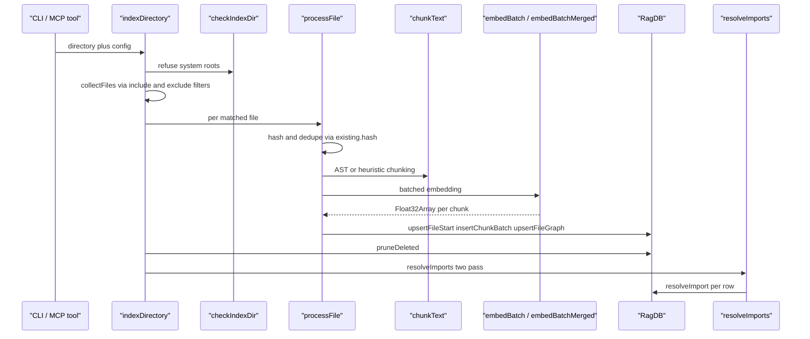
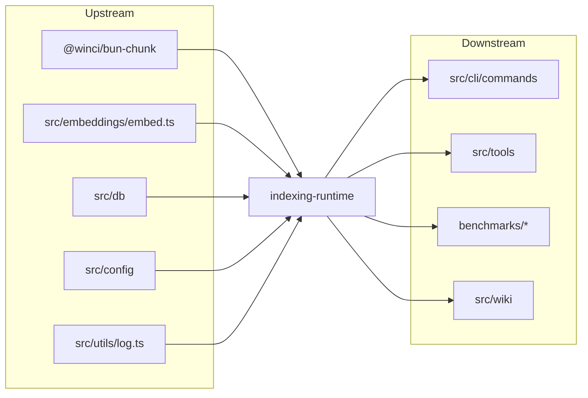

# Indexing runtime

> [Architecture](../architecture.md)
>
> Generated from `b47d98e` · 2026-04-26

The indexing runtime is the loop that turns a directory of files into searchable rows in `RagDB`. Six files cooperate: `src/utils/dir-guard.ts` refuses pathological roots; `src/indexing/parse.ts` produces a `ParsedFile` with a virtual extension; `src/indexing/chunker.ts` splits the text via `@winci/bun-chunk` (AST) or a heuristic fallback; `src/indexing/indexer.ts` hashes, embeds, writes, and reconciles parent groups; `src/graph/resolver.ts` resolves import specifiers to indexed file IDs and renders the project map; `src/indexing/watcher.ts` debounces filesystem events and serializes re-indexes. Together they own every byte that moves between disk and the DB at index time.

## Entry points

- **`indexDirectory(directory, db, config, onProgress?, signal?)`** — the bulk-ingest entry. Walks the tree, calls `processFile` per file, prunes deleted rows, then resolves imports across the project.
- **`indexFile(filePath, db, config)`** — single-file ingest. Returns `"indexed" | "skipped" | "error"`. Used by the watcher and by tools that re-index one path at a time.
- **`startWatcher(directory, db, config, onEvent?)`** — opens a recursive `fs.watch`, debounces events, and re-indexes on a serial queue.
- **`resolveImports(db, projectDir)`** — second pass after a bulk index: walks every unresolved import row and tries to bind it to a file ID.
- **`resolveImportsForFile(db, fileId, projectDir, pathToId?, idToPath?)`** — single-file variant used by the watcher.
- **`generateProjectMap(db, options)`** — text/JSON dependency map (file or directory zoom, optional focus).
- **`buildPathToIdMap(db)` / `buildIdToPathMap(pathToId)`** — shared lookup builders cached across resolver calls.
- **`parseFile(filePath, raw)`** — turns a file into `ParsedFile` (virtual extension + frontmatter for markdown).
- **`chunkText(text, extension, chunkSize, chunkOverlap, filePath?)`** — produces `ChunkTextResult` with chunks and file-level `imports`/`exports`.
- **`checkIndexDir(directory)`** — pre-flight guard against `~`, `/`, `/tmp`, `/var`, `/Users`, `/home`.
- **`KNOWN_EXTENSIONS`** — single source of truth for "is this file indexable?" (used by `processFile` to skip silently).

## Per-file breakdown

### `src/graph/resolver.ts` — import-graph reconciliation and project map

The top-PageRank member of the community. Two responsibilities live here. The first is post-index import resolution: `resolveImports` reads `db.getUnresolvedImports()`, builds a `pathToId` map once, loads `tsConfig` once, and for each import row runs a two-pass resolver. Pass 1 calls `bcResolveImport` from `@winci/bun-chunk` which understands `tsconfig` paths, Python relative imports, and Rust crate paths. Pass 2 is a DB-only fallback that probes `RESOLVE_EXTENSIONS = [".ts", ".tsx", ".js", ".jsx"]` and the four `INDEX_FILES` (built as `RESOLVE_EXTENSIONS.map((ext) => "/index" + ext)`, i.e. the four index-file suffixes for TS/TSX/JS/JSX) against the path-to-id map. Bare/external specifiers are skipped unless the file's language is `rust` or `python` — those have relative-but-not-`./`-prefixed forms (`crate::`, `from .x`) that still need resolving.

The second responsibility is `generateProjectMap`. It builds a graph from `db.getGraph()` (or `db.getSubgraph([fileId], maxHops)` when `--focus` is set with a `maxHops` default of `2`) and emits one of four formats: text file-level, text directory-level, JSON file-level, JSON directory-level. The text file map distinguishes "Entry Points (no importers)" from "Files" and truncates the per-node export list at 8 items with a `+N more` suffix. The directory map deduplicates edges and counts imports per `fromDir -> toDir` pair. `format: "json"` is the structured output used by `mcp__mimirs__project_map`.

### `src/indexing/indexer.ts` — orchestrator: hash, parse, chunk, embed, write

Where the actual ingest loop lives. `indexDirectory` first calls `checkIndexDir(directory)` and throws on system roots, then runs `collectFiles` (which uses `buildIncludeFilter` and `buildExcludeFilter` — fast pattern matchers that pre-classify glob patterns into extension sets, basename sets, and prefix/suffix lists rather than constructing `Glob` objects per file), warns when more than `LARGE_PROJECT_WARN_THRESHOLD = 200_000` files match, and eagerly loads the embedder via `getEmbedder(config.indexThreads, onProgress)` so the user sees model-loading progress before per-file progress starts. Each file goes through `processFile`, which is the load-bearing path.

`processFile` reads once, hashes (sha256 via `hashString`), and short-circuits when `existing.hash === hash`. It then guards against minified files (a max-average-line-length of `1000` chars per line) and oversized files (a per-file size cap of `50 * 1024 * 1024`, i.e. 50 MB), parses, and chunks. With `config.incrementalChunks` enabled and every chunk having a hash, it tries `processFileIncremental`, which keeps unchanged chunks (matched by content hash), updates their positions, and re-embeds only new chunks — but bails to a full re-index when `newCount > chunks.length * 0.5` because beyond that the bookkeeping costs more than re-embedding. Embedding is streamed in batches of `config.indexBatchSize ?? 50` so memory stays at ~one batch worth of chunks.

Two non-obvious post-passes happen before the file is closed. `detectParentGroups` walks the chunks and finds groups of ≥2 chunks sharing a parent — a class declaration plus its method/field children, identified by `parentName` matching or by the bookend's exported name matching the next/previous chunk's `parentName`. `createParentChunks` then concatenates the member text, calls `mergeEmbeddings(memberEmbeddings)`, and inserts the parent at `chunk_index = -1` (the sentinel that distinguishes a parent row from a regular chunk), wiring `parent_id` onto each child. After all chunks are written, `db.upsertFileGraph(fileId, imports, exports)` records the file's import/export edges, preferring `chunkResult.fileImports`/`fileExports` from bun-chunk when present and falling back to `aggregateGraphData(chunks)`.

### `src/indexing/chunker.ts` — AST-aware chunking with heuristic fallback

Wraps `@winci/bun-chunk` and adds project policy. `AST_SUPPORTED` is the runtime list of extensions tree-sitter handles directly (TS/JS, Python, Go, Rust, Java, C/C++, C#, Ruby, PHP, Scala, Kotlin, Lua, Zig, Elixir, Bash, TOML, YAML, Haskell, OCaml, Dart, HTML, CSS family); `HEURISTIC_CODE` covers Swift, Fish, Terraform, Protobuf, GraphQL, Go modfiles, XML, and the named-script files (Jenkinsfile/Vagrantfile/etc.). The single exported `KNOWN_EXTENSIONS` set unions the AST list, the heuristic list, the markdown/text list, plus virtual extensions (`.makefile`, `.dockerfile`, `.jenkinsfile`, `.vagrantfile`, `.gemfile`, `.rakefile`, `.brewfile`, `.procfile`), `.json`, `.sql`, and `.bru`. Defaults are `DEFAULT_CHUNK_SIZE = 512` characters and `DEFAULT_CHUNK_OVERLAP = 50`. `chunkText` is the only entry point callers use; the `Chunk` interface re-exports `ChunkImport` and `ChunkExport` from bun-chunk and adds `parentName`, `name`, `chunkType`, and `hash` fields needed for the parent-group detection above.

### `src/indexing/parse.ts` — virtual extension and frontmatter handling

Tiny but load-bearing. `parseFile` calls `extname`/`basename`, then runs the basename through two maps. `EXACT_NAME_MAP` covers files with no real extension — `Makefile` becomes `.makefile`, `Gemfile` becomes `.gemfile`, and so on for `Vagrantfile`, `Rakefile`, `Brewfile`, `Procfile`, `GNUmakefile`. `PREFIX_NAME_MAP` covers files like `Dockerfile.dev` or `Jenkinsfile.staging` — the basename starts with the prefix and gets a virtual extension. Markdown files (`.md`, `.mdx`, `.markdown`) get `gray-matter` frontmatter parsing; everything else returns `frontmatter: null`. The non-obvious bit is the `PREFIX_NAME_MAP` walk *before* checking `rawExt` — `Dockerfile.dev` keeps `.dockerfile`, not `.dev`, because the prefix wins.

### `src/indexing/watcher.ts` — debounced FS events with serial re-index

Wraps `fs.watch(directory, { recursive: true })` and routes events through three stages. Stage one is the per-event timer: every event for a path resets a `DEBOUNCE_MS = 2000` timer, so a flurry of saves collapses into one re-index. Stage two is the queue: when a timer fires, the path is added to `nextBatch` (`"index"` if the file exists, `"remove"` otherwise) and `processQueue` runs. Stage three is the serial worker: `processQueue` snapshots `nextBatch`, clears it (so new events accumulate into a fresh batch), and processes each entry by calling `indexFile` or `db.removeFile`. After a successful re-index it builds `pathToId` and `idToPath` once and reuses them for `resolveImportsForFile` on the file *and* every importer returned by `db.getImportersOf(file.id)`. The `processing` flag prevents reentrancy; the comment explicitly notes that this is what keeps `indexFile` and `buildPathToIdMap` from interleaving. Globs are pre-compiled once into `excludeGlobs` and `includeGlobs` arrays rather than per-event.

### `src/utils/dir-guard.ts` — refuse-to-index list

Defends against the common misconfiguration where `RAG_PROJECT_DIR` is unset and `cwd` is `~` or `/`. `DANGEROUS_DIRS = new Set([homedir(), "/", "/home", "/Users", "/tmp", "/var"])`. `checkIndexDir` returns `{ safe: false, reason }` for any of those paths with the literal hint `Set RAG_PROJECT_DIR to your actual project path in your MCP server config.` and an example JSON snippet. Any other directory passes. Called only from `indexDirectory`; `indexFile` does not pre-check (callers already know the file path).

## How it works

1. `indexDirectory` (`src/indexing/indexer.ts:603-676`) calls `checkIndexDir(directory)` and rejects any system root before any I/O.
2. `collectFiles` (`src/indexing/indexer.ts:186-225`) walks `readdir(directory, { recursive: true })` once, applying the pre-classified include/exclude filters; warns above `LARGE_PROJECT_WARN_THRESHOLD = 200_000`.
3. `getEmbedder(config.indexThreads, onProgress)` is loaded eagerly so the model-load shows up in progress events before per-file output starts.
4. For each path, `processFile` (`src/indexing/indexer.ts:355-483`) reads, hashes, skips on hash match, then parses via `parseFile` and chunks via `chunkText`. Files above `MAX_FILE_SIZE` (50 MB) or with `avgLineLen > MAX_AVG_LINE_LEN` (1000) are skipped.
5. Embedding streams in `config.indexBatchSize ?? 50`-sized batches; the batch picks `embedBatchMerged` when `config.embeddingMerge !== false`, else `embedBatch`.
6. `detectParentGroups` (`src/indexing/indexer.ts:271-307`) and `createParentChunks` (`src/indexing/indexer.ts:312-345`) materialize parent rows at `chunk_index = -1` with merged embeddings.
7. `db.insertChunkBatch` (in 500-row chunks) and `db.upsertFileGraph` finalize the file.
8. After the loop, `pruneDeleted` removes any DB rows whose paths are no longer in `matchedFiles`.
9. `resolveImports(db, directory)` (`src/graph/resolver.ts:23-61`) finalizes the import graph in two passes: bun-chunk filesystem resolution, then DB-based extension probing.
10. The watcher path is the same per-file pipeline triggered by `fs.watch` debounced at `DEBOUNCE_MS = 2000`, with `resolveImportsForFile` called on the changed file *and* every importer returned by `db.getImportersOf(fileId)`.

## Dependencies and consumers

Depends on:
- `@winci/bun-chunk` (AST chunking, language detection, tsconfig-aware import resolution)
- `src/embeddings/embed.ts` — `embedBatch`, `embedBatchMerged`, `mergeEmbeddings`, `getEmbedder` (see [Config & Embeddings](config-embeddings.md))
- `src/db/index.ts` — every write goes through `RagDB`
- `src/config` — `RagConfig` shape and defaults
- `src/utils/log.ts` — `log.warn` for large-file warnings; `cli` for CLI-side progress

Depended on by 29 files (sample): the CLI command handlers in `src/cli/commands` (see [CLI Commands](cli-commands.md)), MCP tools, and the benchmark harnesses in `benchmarks/`. The wiki pipeline also reads file paths via the same `RagDB` rows this community produces.

## Internals

- **Per-file size cap is `50 * 1024 * 1024` bytes** (declared as a local `const MAX_FILE_SIZE` inside `processFile` in `src/indexing/indexer.ts`). Per-file, not aggregate. A 49 MB file is read whole into memory twice (hash + parse); a 51 MB file is skipped silently with a `Skipped (too large, X.X MB)` progress message.
- **Average-line-length cap is `1000`** (declared as a local `const MAX_AVG_LINE_LEN` inside `processFile`). Computed as `raw.length / lineCount`. A bundled `.js` averaging 5000 chars per line is skipped to prevent the chunker from emitting tens of thousands of useless character-sliced rows.
- **`LARGE_PROJECT_WARN_THRESHOLD = 200_000`** *warns* but does not abort — the comment in `src/indexing/indexer.ts:54-57` notes that monorepos can legitimately exceed this. A noisier threshold is `dir-guard`'s `DANGEROUS_DIRS` list, which throws.
- **Chunk-level dedupe at >50%**: `processFileIncremental` returns `null` when `newCount > chunks.length * 0.5`, kicking the caller back to a full re-index. The reason is that the `deleteStaleChunks` + `updateChunkPositions` path costs more than re-embedding when more than half the file is new.
- **`chunk_index = -1` is a sentinel for parent rows.** Regular chunks use 0…N. Anything reading the chunk table must know that `-1` rows are virtual aggregates whose `embedding` is `mergeEmbeddings(memberEmbeddings)` and whose `snippet` is the concatenated child text.
- **Resolver fallback list is hardcoded TS/JS.** `RESOLVE_EXTENSIONS` and `INDEX_FILES` in `src/graph/resolver.ts` only know `.ts/.tsx/.js/.jsx`. Python and Rust go through `bcResolveImport` in pass 1; their pass-2 fallback is a no-op for non-JS extensions because the probed paths won't match indexed entries.
- **Watcher's `processing` flag is the only synchronization.** There is no mutex; the queue is single-threaded by JavaScript's event loop and the explicit `if (processing) return` at the top of `processQueue`. New events accumulate in `nextBatch` while the current batch runs; the `Map` snapshot is the handoff.
- **Globs are pre-compiled in the watcher only.** `indexDirectory`'s collector uses fast-path string matchers (extension set, basename set, prefix/suffix lists) and never constructs `Glob` objects — those are reserved for the watcher's per-event matching where the pattern semantics matter.
- **`PREFIX_NAME_MAP` wins over the real extension.** `Dockerfile.dev` is given virtual extension `.dockerfile`, not `.dev`. Same for `Jenkinsfile.staging`. The check runs before `rawExt` is returned in `resolveExtension`.
- **Markdown frontmatter is parsed only for `.md`, `.mdx`, `.markdown`.** Other extensions never invoke `gray-matter`; `frontmatter` is always `null` for them.

## Tuning

| Name | Default | Effect | When to change |
|------|---------|--------|----------------|
| `KNOWN_EXTENSIONS` | union of AST, heuristic, virtual, data extensions | Single gate on whether a file is indexable; non-members are skipped silently | Adding support for a new file type — also update `AST_SUPPORTED`/`HEURISTIC_CODE` if applicable |
| `DEFAULT_CHUNK_SIZE` | `512` characters | Target chunk size for heuristic splitting; AST chunker uses semantic boundaries first | Tune when chunks are too coarse (low recall) or too fine (low precision) |
| `DEFAULT_CHUNK_OVERLAP` | `50` characters | Overlap between heuristic chunks to keep cross-boundary context | Increase for prose/markdown; not used by AST splitter |
| `LARGE_PROJECT_WARN_THRESHOLD` | `200_000` | File count above which `collectFiles` emits a one-time warning | Lower for stricter early warning; raise for known monorepos |
| `MAX_FILE_SIZE` (in `processFile`) | `50 * 1024 * 1024` | Per-file size cap; larger files skip with a `Skipped (too large, …)` message | Raise only if the embedder and DB can sustain the memory hit |
| `MAX_AVG_LINE_LEN` (in `processFile`) | `1000` | Skip files whose average line length exceeds this — typically minified bundles | Lower if bundled `.min.js` slips through; raise if a legit codebase has long lines |
| `DEBOUNCE_MS` (in `startWatcher`) | `2000` | Time a file must be quiet before re-indexing | Lower for faster feedback at the cost of redundant re-indexes; raise on flaky filesystems |
| `RESOLVE_EXTENSIONS` | `[".ts", ".tsx", ".js", ".jsx"]` | Pass-2 import-resolution probe extensions | Add language extensions only after confirming bun-chunk's pass 1 can't handle them |
| `INDEX_FILES` | `RESOLVE_EXTENSIONS.map((ext) => `/index${ext}`)` | Pass-2 index-file probes for directory-style imports | Mirrors `RESOLVE_EXTENSIONS` |
| `DANGEROUS_DIRS` | `homedir()`, `/`, `/home`, `/Users`, `/tmp`, `/var` | Pre-flight reject set for `indexDirectory` | Add directories you never want indexed by accident |
| `config.indexBatchSize` | `50` (when undefined in `RagConfig`) | Embedding batch size in `processFile` | Raise on a high-core-count host to amortize embedder overhead; lower if memory is tight |
| `config.indexThreads` | `RagConfig` default | Threads passed to the embedder | Raise on multi-core CPUs; the embedder is CPU-bound |
| `config.embeddingMerge` | `true` (when not `false`) | Picks `embedBatchMerged` instead of `embedBatch` | Disable to compare against the merge-free baseline |
| `config.incrementalChunks` | `RagConfig` default | Enables `processFileIncremental` path | Disable when reproducibility matters (every run produces fresh chunk rows) |

## Failure modes

- **System-root index attempt** — `indexDirectory` is called with `~` or `/`. `checkIndexDir` returns `{ safe: false, reason: "Refusing to index …" }` and `indexDirectory` *throws* the reason. Caller must catch and surface; there is no graceful return.
- **Oversized file** — `processFile` skips with a `Skipped (too large, X.X MB): <path>` progress message and returns `"skipped"`. No row is written; no error is raised. Caller sees `result.skipped` increment.
- **Minified file** — `processFile` skips with `Skipped (minified/obfuscated, avg line N chars): <path>`. Same skipped accounting; file remains in any prior DB state until re-indexed with different content.
- **Unsupported extension** — `processFile` skips after `parseFile` if `parsed.extension` is not in `KNOWN_EXTENSIONS`. Empty file content also triggers a skip via `!parsed.content.trim()`.
- **Embedder failure or chunker exception** — `indexFile` catches in a try/catch, logs `Failed to index <path>: <message>` via `log.warn`, and returns `"error"`. `indexDirectory` catches per-file exceptions and pushes `Error indexing <path>: <message>` into `result.errors` while the loop continues.
- **Large file producing huge chunk count** — when `chunks.length > 10000`, `processFile` logs a `Large file: <path> produced N chunks` warning but proceeds. Memory use is bounded by the streamed embedding loop.
- **Incremental fallback** — `processFileIncremental` returning `null` (more than 50% changed) is not an error; `processFile` falls through to a full re-index transparently.
- **Watcher bouncing during long indexes** — events that arrive while `processing` is `true` accumulate into `nextBatch` and run after the current batch completes. There is no event coalescing across batches; rapid successive saves are coalesced only inside the `DEBOUNCE_MS = 2000` per-path window.
- **Unresolved import** — `resolveImports` leaves the row's `resolvedFileId` null when neither pass 1 nor pass 2 finds a match. The graph is partial; downstream consumers (the project map) must handle null resolutions.
- **Bare/external specifier in non-Rust/Python file** — silently skipped at the top of the resolver loop. `node_modules` imports are never resolved by design; the `if (lang !== "rust" && lang !== "python") continue` line is the gate.
- **Aborted signal** — `signal?.aborted` is checked at the top of `indexDirectory`, before each file in the loop, between batches inside `processFile`, and after the embedding loop. On abort the function returns the partial `IndexResult`; nothing is rolled back, so the DB may contain partially-written files for the in-flight entry.

## See also

- [Architecture](../architecture.md)
- [CLI Commands](cli-commands.md)
- [Config & Embeddings](config-embeddings.md)
- [Conversation Indexer & MCP Server](conversation-server.md)
- [Data flows](../data-flows.md)
- [Getting started](../getting-started.md)
