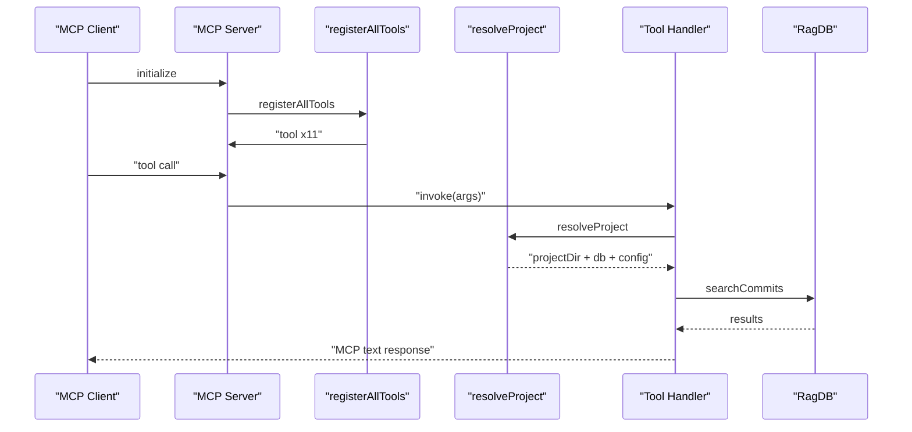
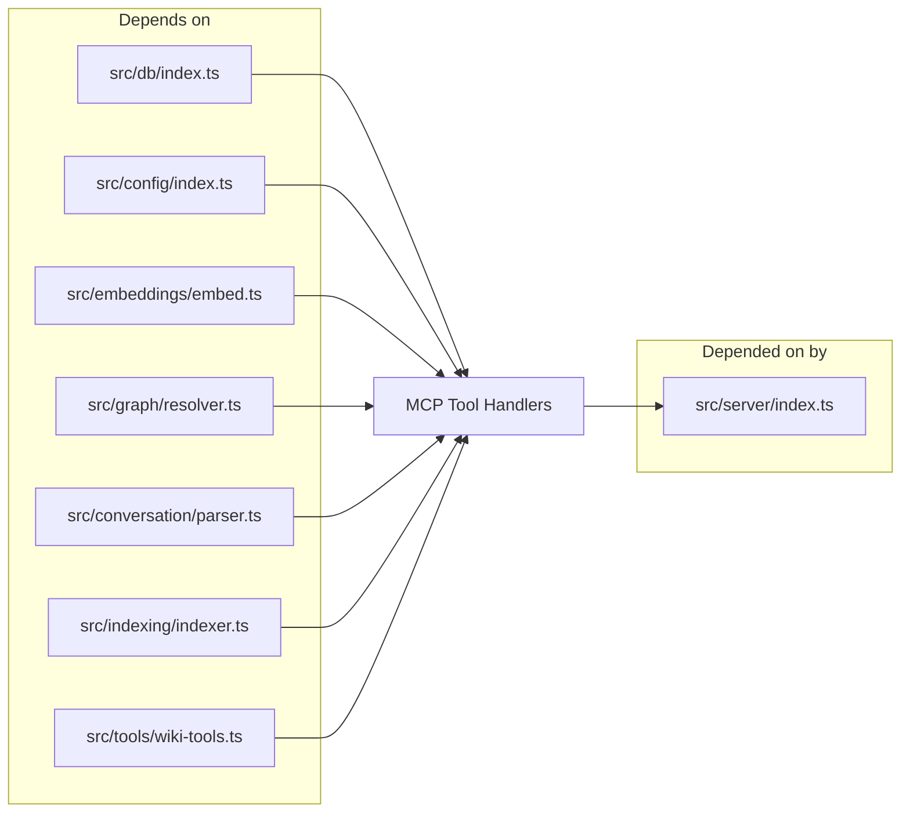

# MCP Tool Handlers

> [Architecture](../architecture.md)
>
> Generated from `79e963f` · 2026-04-26

The MCP Tool Handlers community is the adapter layer between the MCP protocol and every domain capability mimirs exposes. Ten files each register one logical group of tools against the MCP server, and a shared barrel (`src/tools/index.ts`) wires them all together. Nothing in this layer owns business logic — every handler resolves a project directory, hands off to a DB method or business-logic module, and formats the result as MCP text content.

## Per-file breakdown

### `src/tools/index.ts` — Shared infrastructure and registration hub

This file provides two things: the shared helper that every other tool file calls before doing any work, and the `registerAllTools` function that the MCP server calls at startup.

`resolveProject` is the single most important function in the community. It accepts an optional `directory` string, falls back to `RAG_PROJECT_DIR` then `process.cwd()`, resolves to an absolute path, verifies it exists, loads config (creating `.mimirs/config.json` if absent), applies embedding config, and returns a `{ projectDir, db, config }` triple. Path traversal is blocked at the `resolve()` + `existsSync` check — a non-existent path throws immediately rather than silently proceeding. The `GetDB` callback type (`(dir: string) => RagDB`) keeps the DB lifecycle out of tool handlers so the server can share or pool connections across calls.

`registerAllTools` calls all eleven `register*` functions in dependency order. It accepts an optional `getConnectedDBs` for server-info display and an optional `WriteStatus` callback for streaming index progress to the MCP client.

### `src/tools/analytics-tools.ts` — `search_analytics`

Registers a single tool that calls `ragDb.getAnalytics(days)` and formats the result as a plain-text report. The `days` parameter is bounded `[1, 365]` with a default of 30. Zero-result and low-relevance query lists are surfaced separately so callers can see documentation gaps at a glance.

### `src/tools/annotation-tools.ts` — `annotate` and `get_annotations` and `delete_annotation`

`annotate` embeds the note text (prepended with the symbol name when one is given) and calls `ragDb.upsertAnnotation`, which updates in place if the same path+symbol already has a note. `get_annotations` supports two modes: pass `path` to retrieve all notes for a file, or pass `query` to semantic-search across all annotations. `delete_annotation` removes by integer ID returned from `annotate`.

### `src/tools/checkpoint-tools.ts` — `create_checkpoint`, `list_checkpoints`, `search_checkpoints`

`create_checkpoint` resolves the current conversation session from `discoverSessions(projectDir)`, derives a turn index from `ragDb.getTurnCount(sessionId)`, embeds `title + ". " + summary`, and inserts via `ragDb.createCheckpoint`. The `type` enum (`decision`, `milestone`, `blocker`, `direction_change`, `handoff`) is stored for filtering. `list_checkpoints` returns the N most recent; `search_checkpoints` does vector search over the checkpoint embeddings.

### `src/tools/conversation-tools.ts` — `search_conversation`

Performs hybrid search: vector search via `ragDb.searchConversation(queryEmb, top, sessionId)` and BM25 via `ragDb.textSearchConversation`. BM25 failures are swallowed with a `log.debug` warning and fall back to vector-only. The two result sets are merged by `turnId`, scored as `hybridWeight * vecScore + (1 - hybridWeight) * bm25Score`, deduplicated, and re-sorted. The `hybridWeight` comes directly from the loaded project config.

### `src/tools/git-history-tools.ts` — `search_commits` and `file_history`

`search_commits` embeds the query and calls `ragDb.searchCommits` for vector results, then `ragDb.textSearchCommits` for BM25, merges them with the same hybrid scoring pattern used for conversations, and applies optional `author`, `since`, `until`, and `path` filters. `file_history` uses `ragDb.getFileHistory(path, limit)` and returns a chronologically ordered list without semantic scoring — it's a deterministic lookup, not a relevance search.

### `src/tools/git-tools.ts` — `git_context`

`runGit(args, cwd)` is a thin `Bun.spawn` wrapper that returns `null` on any non-zero exit rather than throwing — callers treat null as "not a git repo" or "command unsupported". `findGitRoot` calls `runGit(["rev-parse", "--show-toplevel"], dir)` and is exported for reuse by `src/tools/wiki-tools.ts`. The `git_context` tool assembles uncommitted changes (with optional full diff truncated to 200 lines), recent commits since a configurable ref, and per-file index status from the DB.

### `src/tools/graph-tools.ts` — `project_map`

Delegates entirely to `generateProjectMap(ragDb, { projectDir, focus, zoom, format })` from `src/graph/resolver.ts`. The `json` format returns structured fan-in/fan-out metrics; the default `text` format appends a tip footer pointing at `search` and `depends_on`. The `focus` parameter scopes the graph to a single file's neighborhood.

### `src/tools/index-tools.ts` — `index_files`

Calls `indexDirectory(projectDir, ragDb, config, progressCallback)`. When `writeStatus` is provided (the MCP server supplies this), the callback parses `"Found N files to index"` messages to establish a total, then counts `"file:done"` events to emit `"X/N files (pct%)"` progress updates. The optional `patterns` parameter overrides `config.include` so callers can re-index only specific glob patterns without touching config on disk.

### `src/tools/server-info-tools.ts` — `server_info`

Calls `ragDb.getStatus()` for file/chunk counts and last-indexed timestamp, `getModelId()` and `getEmbeddingDim()` for the active embedding model, and reads the resolved config for all tuning parameters. When `getConnectedDBs` is provided, it lists all currently open database handles with their `projectDir`, `openedAt`, and `lastAccessed` timestamps.

## How it works

1. At startup, `src/server/index.ts` creates a `getDB` factory and calls `registerAllTools`, which calls all eleven `register*` functions. Each function calls `server.tool(name, description, schema, handler)` once per MCP tool.
2. When a tool is invoked, the MCP SDK validates the input against the Zod schema, then calls the handler.
3. Every handler's first action is `resolveProject(directory, getDB)`. This canonicalizes the directory, opens (or retrieves) the DB connection, and loads config — including applying any embedding model from config via `applyEmbeddingConfig`.
4. The handler executes domain logic (embed a query, call a DB method, invoke a business-logic module) and returns a `{ content: [{ type: "text", text }] }` MCP response.

## Dependencies and consumers

Depends on: `src/db/index.ts` (all DB calls), `src/config/index.ts` (config loading and embedding apply), `src/embeddings/embed.ts` (query embedding), `src/graph/resolver.ts` (project map), `src/conversation/parser.ts` (session discovery), `src/indexing/indexer.ts` (file indexing), and `src/tools/wiki-tools.ts` (wiki generation).

Depended on by: `src/server/index.ts` exclusively — the MCP server is the sole consumer of `registerAllTools`.

## Internals

**`resolveProject` behavior.** The `directory` parameter is optional in every tool schema. When omitted, `resolveProject` reads `RAG_PROJECT_DIR` from the environment, then falls back to `process.cwd()`. This means an agent running in a project directory doesn't need to pass `directory` on every call — the env var or working directory is the default. Path traversal is blocked by resolving to absolute (`resolve(projectDir)`) and checking existence with `existsSync` before returning.

**`GetDB` and `WriteStatus` conventions.** `GetDB` is a `(dir: string) => RagDB` factory, not a single shared DB instance. The server may maintain a cache of open DBs keyed by directory — `getDB` is called inside `resolveProject` after the path is canonicalized, so the cache key is always an absolute path. `WriteStatus` is a `(status: string) => void` callback wired to the MCP server's streaming progress mechanism. Only `registerIndexTools` uses it; all other handlers produce their full response before returning.

**Silent fallbacks.** `runGit` returns `null` on non-zero exit instead of throwing — `git_context` treats this as "not a git repository" and returns a graceful message. `search_conversation`'s BM25 path is wrapped in try/catch; a FTS query failure degrades to vector-only with a debug log entry rather than surfacing an error to the caller.

**Hybrid scoring.** Both `search_conversation` and `search_commits` use the same merge pattern: build a score map keyed by record ID, accumulate `vecScore` and `txtScore`, then compute `hybridWeight * vec + (1 - hybridWeight) * txt`. The weight comes from `config.hybridWeight` (default `0.7`), making vector search dominant while BM25 breaks ties on exact term matches.

## Why it's built this way

Each tool group is a separate file rather than one large file because the domain boundaries are real: analytics, annotations, checkpoints, and git history are independent subsystems that share only the `resolveProject` helper and the DB interface. Keeping them separate lets you read, test, or replace one group without touching the others.

`registerAllTools` exists as the single assembly point so the MCP server (`src/server/index.ts`) doesn't need to know about individual groups. Adding a new tool group means writing one `register*` file and adding one call to `registerAllTools` — the server itself doesn't change.

`GetDB` is a factory rather than a passed-in instance because mimirs supports multi-project MCP servers. The server can open different databases for different project directories within the same process; passing a factory lets `resolveProject` remain the single place that maps a directory to a DB.

## Trade-offs

The current design means every tool call pays the cost of `resolveProject` — config loading, path resolution, and (on first call) DB open. The DB is memoized by the `getDB` factory so repeated calls to the same directory are cheap, but config is re-read every time. This is intentional: it means config changes take effect on the next tool call without restarting the server.

The BM25 silent fallback in conversation and commit search means a corrupted FTS index produces degraded results rather than an error. This is acceptable for a developer tool where false negatives (missing results) are less disruptive than errors, but a caller who needs guaranteed recall should watch for degraded behavior in the log.

## Common gotchas

**`directory` must be an absolute path or omitted.** Relative paths that don't resolve to an existing directory on disk throw `"Directory does not exist: ..."` immediately. If you're calling from a test, pass the absolute project root or set `RAG_PROJECT_DIR`.

**`writeStatus` is optional but silently skipped when absent.** Index progress is only streamed to the MCP client when `writeStatus` is provided. If you're building a non-streaming consumer, you won't see per-file progress — the tool still completes correctly.

**`runGit` returning `null` is not an error.** Functions that call `runGit` treat `null` as "git command failed or not a repo". Don't wrap `runGit` results in a null check and throw — the callers already handle it gracefully.

**Hybrid scoring requires both BM25 and vector results to get maximum recall.** If FTS is not built (empty index), `textSearchConversation` throws and the fallback to vector-only activates. This is logged at `debug` level, not `warn`, so it may be invisible in production log levels.

## See also

- [Architecture](../architecture.md)
- [Config & Embeddings](config-embeddings.md)
- [Conversation Indexer & MCP Server](conversation-server.md)
- [Data flows](../data-flows.md)
- [Getting started](../getting-started.md)
- [Wiki Orchestrator & MCP Tools](wiki-orchestrator.md)
