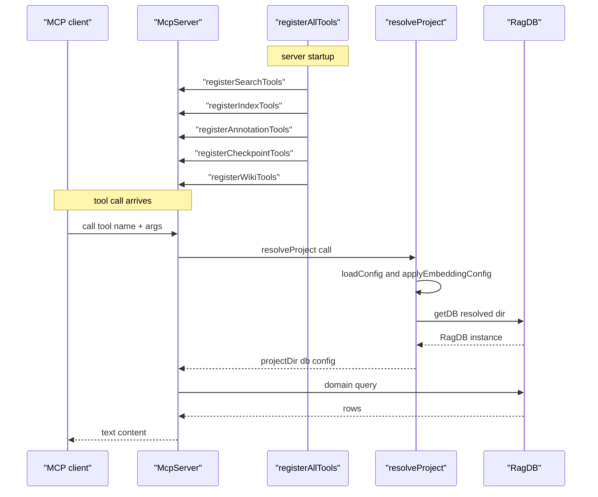
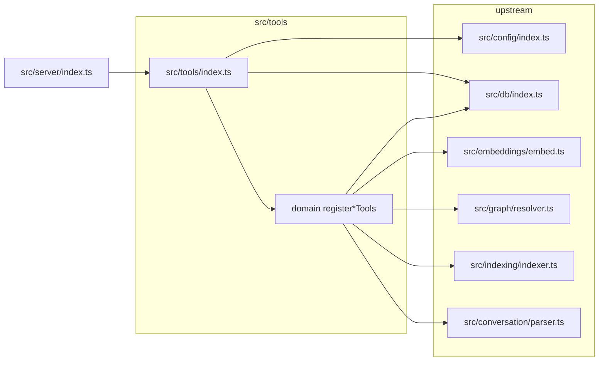

# MCP Tool Handlers

> [Architecture](../architecture.md)
>
> Generated from `b47d98e` · 2026-04-26

The MCP tool layer is the surface that an LLM client (Claude Code, Cursor, anything speaking the Model Context Protocol) actually calls. Every public capability of mimirs — search, indexing, graph queries, checkpoints, annotations, analytics, git context, server info, wiki generation — is exposed by exactly one `register*Tools` function in `src/tools/`. A single coordinator, `registerAllTools` in `src/tools/index.ts`, wires them all to a fresh `McpServer` instance during server startup. The community is intentionally shallow: each file owns one thematic group, holds no state, and delegates the real work to `RagDB`, the embeddings layer, and the wiki/graph/indexing subsystems.

## Per-file breakdown

### `src/tools/index.ts` — coordinator and `resolveProject`

This file is the single entry point for tool registration and the home of the helper every other file in the community depends on. It defines two type aliases — `GetDB`, a `(dir: string) => RagDB` factory, and `WriteStatus`, a `(status: string) => void` progress sink — then exports `resolveProject` and `registerAllTools`. `resolveProject` is the convergence point: it takes an optional `directory` argument, falls back to `process.env.RAG_PROJECT_DIR` and finally `process.cwd()`, calls `path.resolve` to get an absolute path, throws `Directory does not exist: <resolved>` if the directory is missing, then calls `loadConfig` and `applyEmbeddingConfig` from `src/config/index.ts` before returning `{ projectDir, db: getDB(resolved), config }`. Every tool handler in the community begins with `const { projectDir, db: ragDb, config } = await resolveProject(directory, getDB);` — the trust boundary is the MCP transport itself, since the path-traversal check is limited to `resolve` plus `existsSync`. `registerAllTools` calls eleven `register*Tools` functions in fixed order; the order does not matter for correctness, but it is the canonical listing of what the server exposes.

### `src/tools/server-info-tools.ts` — `server_info`

Registers `server_info`, the diagnostic tool that prints the resolved project directory, database location, embedding model and dimension, full `RagConfig`, and the list of currently connected databases. It exports `ConnectedDBInfo` (a `{ projectDir, openedAt, lastAccessed }` triple) and `registerServerInfoTools(server, getDB, getConnectedDBs?)`. The handler reads `getModelId()` and `getEmbeddingDim()` from `src/embeddings/embed.ts`, formats `chunk_size`, `chunk_overlap`, `hybrid_weight`, `search_top_k`, `incremental`, and the include/exclude pattern counts directly from `RagConfig`, and dynamically imports the project's package manifest for the version string. The optional `getConnectedDBs` callback is what lets the host server (which manages multiple project DBs in one process) report cross-project state.

### `src/tools/analytics-tools.ts` — `search_analytics`

Registers `search_analytics`. The handler accepts `days` (1–365, default `30`) and calls `ragDb.getAnalytics(days)`, then formats the resulting `totalQueries`, `avgResultCount`, `avgTopScore`, zero-result rate (computed inline as `(zeroResultQueries.reduce(s+count) / totalQueries) * 100`), top searched terms, zero-result queries, and low-relevance queries (top score `< 0.3`) into a plain-text report. The whole file is 62 LOC and contains no business logic — it is the canonical example of "a tool is a Zod schema plus a stringly-formatted DB readout".

### `src/tools/annotation-tools.ts` — `annotate`, `get_annotations`, `delete_annotation`

Registers the three annotation tools. `annotate` requires `path` (1–500 chars) and `note` (1–2000 chars), with optional `symbol` and `author` (default `"agent"`). The handler builds an embedding text — `${symbol}: ${note}` when `symbol` is present, otherwise the note alone — calls `embed(embText)` from `src/embeddings/embed.ts`, then `ragDb.upsertAnnotation(path, note, embedding, symbol ?? null, author ?? "agent")`. The `upsert` semantics are critical: re-calling `annotate` with the same `path + symbol` updates the existing row instead of creating a duplicate. `get_annotations` and `delete_annotation` follow the same pattern and read `AnnotationRow` from `src/db`.

### `src/tools/checkpoint-tools.ts` — `create_checkpoint`, `list_checkpoints`, `search_checkpoints`

Registers the checkpoint tools. `create_checkpoint` validates `type` against `["decision", "milestone", "blocker", "direction_change", "handoff"]`, then does something subtle: it calls `discoverSessions(projectDir)` from `src/conversation/parser.ts` to find the current Claude Code session, takes the first session's `sessionId` (or `"unknown"` if none), reads `ragDb.getTurnCount(sessionId)`, and stores `turnIndex = Math.max(0, turnCount - 1)`. The checkpoint is therefore tied to a specific point in the conversation transcript, which is what later lets `search_checkpoints` correlate decisions with the turn that produced them. The embedding text is `${title}. ${summary}`.

### `src/tools/conversation-tools.ts` — `search_conversation`

Registers `search_conversation`. The handler embeds the query, calls `ragDb.searchConversation(queryEmb, top, sessionId)` for the vector hits, then attempts `ragDb.textSearchConversation(query, top, sessionId)` inside a `try/catch`; on FTS failure it logs a debug message via `log` from `src/utils/log.ts` and falls back to vector-only results. It then merges and deduplicates by `turnId` using `config.hybridWeight`. This is the only tool in the community that performs hybrid scoring locally — most search lives in `src/tools/search.ts`, which is a separate community.

### `src/tools/git-history-tools.ts` — `search_commits`, `file_history`

Registers commit-search tools. The file declares two private formatter helpers, `formatCommitResult` (for ranked semantic search results — prints `**${shortHash}** (${score.toFixed(2)}) — ${date} — @${authorName}` plus a one-line message and truncated file list capped at the first 5) and `formatCommitRow` (for chronological history, no score). Both annotate merges with `[merge]` and refs with `(refs...)`. The semantic tool, `search_commits`, accepts `query`, `top` (default `10`), and optional `author`, `since`, and `until` filters; `file_history` takes a path and returns chronological commits via `formatCommitRow`. Result types come from `GitCommitSearchResult` and `GitCommitRow` in `src/db/types.ts`.

### `src/tools/git-tools.ts` — `git_context`, `runGit`, `findGitRoot`

Registers `git_context` and exports two helpers used elsewhere in the community: `runGit(args, cwd)` and `findGitRoot(dir)`. `runGit` spawns `git` via `Bun.spawn` with `stdout: "pipe"` and `stderr: "pipe"`, awaits `proc.exited`, returns trimmed stdout when the exit code is `0` and `null` otherwise; the entire call is wrapped in `try/catch` returning `null`, so a missing `git` binary or non-repo directory produces a graceful `null` rather than a thrown error. `findGitRoot` is a one-liner: `runGit(["rev-parse", "--show-toplevel"], dir)`. The `git_context` handler bails early with `"Not a git repository."` when `findGitRoot` returns `null`. The `since` parameter defaults to `"HEAD~5"` and the `include_diff` truncation is fixed at 200 lines.

### `src/tools/graph-tools.ts` — `project_map`

Registers `project_map`. The handler delegates to `generateProjectMap(ragDb, { projectDir, focus, zoom: zoom ?? "file", format: format ?? "text" })` from `src/graph/resolver.ts`. `format` accepts `"text"` (default) or `"json"`; `zoom` accepts `"file"` (default) or `"directory"`. Text output appends a hardcoded footer that points readers to `search` and `depends_on`/`depended_on_by`. JSON output is returned verbatim with no footer.

### `src/tools/index-tools.ts` — `index_files`, `remove_file`

Registers indexing tools. `index_files` accepts an optional `patterns: string[]` that overrides `config.include` for the call (`config = patterns ? { ...baseConfig, include: patterns } : baseConfig`). It calls `indexDirectory(projectDir, ragDb, config, callback)` from `src/indexing/indexer.ts` and routes progress messages through the optional `writeStatus` callback. The callback parses two specific message shapes: `"Found <N> files to index"` (regex `/^Found (\d+) files to index$/`) sets the total file count, and `"file:done"` increments `processedFiles` and emits `${processedFiles}/${totalFiles} files (${pct}%)`. Anything starting with `"scanning files"` is forwarded verbatim. The handler returns `indexed`, `skipped`, and `pruned` counts in its final status line.

## How it works

The runtime flow has three distinct phases. First, the host server (`src/server/index.ts`) constructs an `McpServer`, builds a `getDB: (dir) => RagDB` factory that lazily opens a per-directory database, and calls `registerAllTools(server, getDB, getConnectedDBs, writeStatus)`. `registerAllTools` invokes every `register*Tools` function in sequence; each one calls `server.tool(name, description, zodSchema, handler)` to wire its handlers and then returns. No I/O happens during registration.

Second, when a tool call arrives over the MCP transport, the server validates arguments against the Zod schema, then invokes the handler. Almost every handler's first line is `const { projectDir, db: ragDb, config } = await resolveProject(directory, getDB);`. This is the only place where directory resolution, config loading, and database opening happen — there is no per-tool override. `applyEmbeddingConfig(config)` runs on every tool call, which is what allows a config edit to take effect without restarting the server.

Third, the handler does its domain-specific work — usually a single DB call (`ragDb.getAnalytics`, `ragDb.searchConversation`, `ragDb.upsertAnnotation`) plus formatting — and returns `{ content: [{ type: "text" as const, text: <output> }] }`. Long-running tools like `index_files` call `writeStatus` to push progress strings back to the host server, which surfaces them on the wire as MCP notifications.

## Dependencies and consumers

`src/server/index.ts` is the sole consumer of `registerAllTools`; everything inside the community then re-imports `resolveProject`, `GetDB`, and `WriteStatus` from `src/tools/index.ts`. Upstream, the community pulls from `src/config/index.ts` (config loading), `src/db/index.ts` (the DB facade and row types), `src/embeddings/embed.ts` (`embed`, `getModelId`, `getEmbeddingDim`), `src/graph/resolver.ts` (`generateProjectMap`), `src/indexing/indexer.ts` (`indexDirectory`), and `src/conversation/parser.ts` (`discoverSessions` for checkpoint turn alignment).

## Internals

Several conventions are not visible from the signatures and matter when extending the community.

`resolveProject` is the only sanctioned way to obtain a `RagDB`. The `GetDB` factory it consumes is a closure owned by the host server; calling `getDB` twice with the same directory returns the same cached instance, but tool handlers should not rely on that — treat `db` as ephemeral and never close it from a handler. The `applyEmbeddingConfig(config)` side-effect is intentional: it lets a config change pick up a new embedding model on the next tool call, which is why every handler funnels through `resolveProject` rather than caching the project resolution at registration time.

`writeStatus` is opt-in and only the indexer wires it. Every other handler returns its full result in the MCP response and ignores `writeStatus` entirely. The progress protocol is fragile-looking but stable: the indexer emits a sentinel string `"Found <N> files to index"` matched by `/^Found (\d+) files to index$/`, then a literal `"file:done"` per processed file. Anything else starting with `"scanning files"` is forwarded as-is. New progress events must conform to one of those three shapes or they are silently dropped.

`runGit` and `findGitRoot` are the only place in the codebase that shells out to `git`. They use `Bun.spawn` (not Node's `child_process`) and unconditionally swallow errors, returning `null`. This is intentional — `git_context` must work in non-repo directories, so a missing repo, a missing `git` binary, or a non-zero exit are all collapsed into a single `null` signal that the handler converts into the user-facing `"Not a git repository."` message. Anywhere else in the codebase that needs to run `git`, import `runGit` from `src/tools/git-tools.ts` rather than re-implementing the spawn.

## Why it's built this way

The one-file-per-domain split is the obvious-in-hindsight reaction to a previous monolith: any other shape forces every tool change to land in one giant file, churns the diff, and makes ownership unclear. Splitting by capability lets a contributor reason about a single file (`annotation-tools.ts`, 116 LOC; `analytics-tools.ts`, 62 LOC) without holding the rest of the surface in their head, and it makes the registration order in `registerAllTools` the canonical capability list.

`resolveProject` is the load-bearing abstraction that justifies the split. Without it, every tool would need to repeat path resolution, env-var fallback, existence checking, config loading, and embedding configuration — twelve copies of the same five-line ritual. With it, every handler is one line away from `(projectDir, ragDb, config)`. The implementation deliberately throws on a missing directory rather than returning `null`, because at that point the entire request is unrecoverable; converting the throw into MCP error content happens at the handler's boundary, not inside the resolver.

The `GetDB`/`WriteStatus` indirection looks like over-engineering until you remember the host server (`src/server/index.ts`) holds a pool of per-directory DBs. A direct import of `RagDB` would force every tool to know the pool's caching policy. The factory closure hides it, and the alternative — passing the host's `getConnectedDBs` callback to every tool — was rejected because most tools genuinely don't need cross-project state. Only `server_info` opts into `getConnectedDBs`.

## Trade-offs

The thin-handler discipline is a deliberate constraint. Every tool is essentially "decode args, call `resolveProject`, make one DB call, format text". Business logic lives in `RagDB`, the embeddings layer, the indexer, the graph resolver, and the wiki orchestrator. The trade-off is that handlers cannot unit-test their formatting in isolation from a real DB, and complex behaviors that span multiple DB calls (hybrid scoring in `search_conversation`, progress parsing in `index_files`) bleed into the handler because there is no intermediate domain layer to hold them.

The Zod-schema-as-source-of-truth pattern means every parameter description appears twice — once in `.describe(...)` and once in MCP's tool listing for the LLM. Keeping them in sync is manual, and there is no test that asserts the description matches what the prose-style tool documentation sees. The benefit is that a contributor reads the schema and immediately knows the contract; the cost is that long descriptions (`create_checkpoint` in particular) sit inline in the handler file rather than in a docs source.

`resolveProject` runs `applyEmbeddingConfig` on every call, which costs a config load per tool invocation. For small projects the cost is negligible, but it does mean a misconfigured project config produces an error on every tool call rather than once at server startup. The alternative — caching at registration time — would require a server restart to pick up config changes, which the project explicitly wants to avoid.

## Common gotchas

A handler that forgets to call `resolveProject` and instead calls `getDB(directory!)` directly will skip the env-var fallback, the existence check, the config load, and the embedding config side-effect. The unit tests will pass, the tool will appear to work, and configuration changes will be silently ignored. Always start a handler with `resolveProject`.

`writeStatus` is `undefined` outside the indexer's calling context. Any code reaching for `writeStatus` must either guard with `if (!writeStatus) return;` (as `index_files` does in its progress callback) or accept that nothing happens. New tools that want to stream progress must thread `writeStatus` through their `register*Tools(server, getDB, writeStatus?)` signature; `registerAllTools` only passes it to `registerIndexTools`.

`runGit` returning `null` is the success-or-quiet-failure signal — it does not throw, even when `git` is missing entirely. Code that checks `if (output)` is correct; code that wraps `runGit` in another `try/catch` will catch nothing because the swallowing happens inside.

`upsertAnnotation` updates on the `(path, symbol)` key. Calling `annotate` twice with the same path and symbol replaces the note instead of producing two rows; calling it with `symbol: undefined` writes a file-level note and is a different key than `symbol: "fnName"` on the same path. Tests that expect duplicates will fail.

`create_checkpoint`'s session-detection step degrades silently. If `discoverSessions(projectDir)` returns an empty array, the checkpoint stores `sessionId = "unknown"` and `turnIndex = 0`, which means later session-scoped queries will not find it. This is by design (the alternative is failing the call), but tooling that relies on session correlation should check for `"unknown"` before treating the result as authoritative.

## See also

- [Architecture](../architecture.md)
- [Config & Embeddings](config-embeddings.md)
- [Data flows](../data-flows.md)
- [Getting started](../getting-started.md)
- [Indexing runtime](indexing-runtime.md)
- [Wiki orchestration](wiki-orchestration.md)
