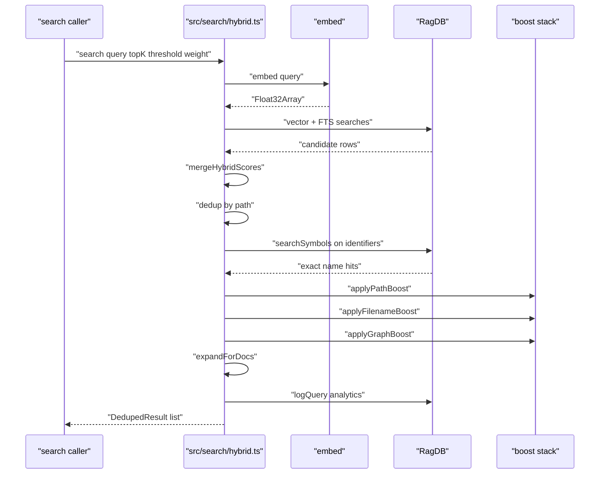
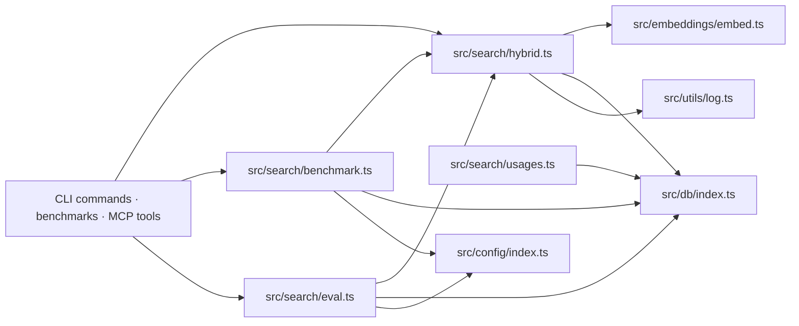

# Search Runtime

> [Architecture](../architecture.md)
>
> Generated from `b47d98e` · 2026-04-26

The search runtime is the query-time engine that turns a natural-language string into a ranked list of files (or chunks). It owns the hybrid vector-plus-FTS merge, the symbol expansion path, the path/filename/graph boost stack, the parent-chunk grouping logic, and the benchmark and eval harnesses that measure all of it. It depends on the database layer for the underlying vec/FTS queries and on the embeddings module for the query embedding; everything else — scoring, deduplication, demotion of generated and test files, doc expansion, analytics logging — lives here.

## Per-file breakdown

### `src/search/hybrid.ts` — the engine

This is the highest-PageRank file in the community and the one every search caller (`searchCommand`, `readCommand`, the demo, the MCP tools, every benchmark) reaches into. Two functions are exported as the public surface — `search` (file-level dedup) and `searchChunks` (no dedup, parent-grouping) — plus `mergeHybridScores`, the `DedupedResult` type, and the `ChunkResult` type.

`search` runs in seven stages. (1) Embed the query and run two SQL queries in parallel: `db.search(queryEmbedding, topK * 4, filter)` for vectors and `db.textSearch(query, topK * 4, filter)` for FTS. The 4x over-fetch is the head room for the post-merge dedup and boost passes. (2) `mergeHybridScores` — fuse the two result lists by `path:chunkIndex` key, applying `score = hybridWeight * vectorScore + (1 - hybridWeight) * textScore`. (3) File-level deduplication: for every fused result, keep the highest score per `path` and append unique snippets. (4) Symbol expansion: extract identifier-shaped tokens via the `IDENTIFIER_RE` regex, drop those in `STOP_WORDS`, run `db.searchSymbols(id, true, undefined, 5)` for each, then `mergeSymbolResults` either boosts an existing entry by `Math.max(score, score * 1.3)` or seeds a new one at score `0.75`. (5) Boost stack — `applyPathBoost` (test 0.85x, source 1.1x), `applyFilenameBoost` (which also handles boilerplate and generated demotion), `applyGraphBoost`. (6) Sort, then `expandForDocs` adds a doc bonus when docs are pushing code out of the top-K. (7) `db.logQuery` records the query, the result count, the top score and path, and `durationMs`.

`searchChunks` follows the same shape but skips file-level dedup, applies the boosts inline (no separate helper passes), and finishes with `groupByParent`. Parent grouping is the chunk-tier story: when two or more child chunks of the same `parentId` end up in the candidate set, they are consolidated into the parent chunk (fetched from `db.getChunkById`, cached locally) carrying the best child score. The `chunkIndex: -1` marker on the promoted parent disambiguates it from a regular chunk hit. The default chunk-level `threshold = 0.3` filters noise that the file-level path tolerates because of dedup.

`mergeHybridScores` is generic over `T extends { score: number; path: string; chunkIndex: number }` so it serves both `SearchResult` (file-level) and `ChunkSearchResult` (chunk-level) shapes. The `path:chunkIndex` key is what makes the same chunk in both lists fuse rather than appear twice. Records present in only one list keep `vectorScore = 0` or `textScore = 0` and still emerge — the merge does not require both sides.

The internal helpers below the exports are where the tuning lives. `applyPathBoost` runs `TEST_PATTERNS` and `SOURCE_PATTERNS` regex sets against the path: any test-style segment multiplies score by `0.85`, otherwise an `src|lib|app|pkg|packages|internal|cmd` segment multiplies by `1.1`. `applyFilenameBoost` extracts query words (3+ chars, lower-cased, after splitting on `[\s_/.-]+`, minus the `STOP_WORDS` set), demotes basenames in the `BOILERPLATE_BASENAMES` set (the literal Go and TypeScript boilerplate names — types, doc, index.d.ts, constants, defaults, conversion variants) by `0.8x`, demotes paths that match the `generatedPatterns` glob set by the constant `GENERATED_DEMOTION = 0.75`, and otherwise computes a multiplicative bonus of `1 + 0.1 * stemMatchCount + 0.05 * pathMatchCount`. `applyGraphBoost` pulls `db.getImportersOf(file.id)` and adds `0.05 * Math.log2(importerCount + 1)` — additive, not multiplicative, so a heavily-imported file gets a fixed top-up rather than a runaway score.

`buildGeneratedMatcher` parses the `generated` glob list from `.mimirs/config.json` into four buckets — `dirPrefixes` (`generated/**`), `anyDepthDirs` (`applyconfigurations/**` matched anywhere in the path), `filenameSuffixes` (`**/*_generated.go`), and `filenamePatterns` (`**/zz_generated*` and the regex fallback). The matcher returns a `(path) => boolean` closure consumed by `applyFilenameBoost`. The internal `escapeForRegex` helper exists to defuse user-supplied glob characters when they fall through to the regex bucket.

`expandForDocs` is a small but load-bearing helper. When the initial top-K slice contains both docs (`.md` / `.mdx`) and code, it returns `topK + docCount` — the docs are added as bonus context without displacing code. When all results are docs (or zero are), no expansion happens; the function avoids exceeding `topK` for free.

`matchesFilter` mirrors `buildPathFilter` from `src/db/search.ts` but in JS, because symbol expansion adds candidates that bypassed the SQL filter. It applies `extensions`, `dirs`, and `excludeDirs` against the path string the same way the SQL builder does.

The only constant exported as a tunable is `DEFAULT_HYBRID_WEIGHT = 0.7` (70% vector, 30% BM25). It is used as the default when `search`/`searchChunks` are called without an explicit `hybridWeight`. Callers that want to tune the mix pass a different number directly.

### `src/search/usages.ts` — FTS-safe helpers

A 28-line module with two exports. `escapeRegex` runs the standard regex meta-character escape and is the single safe way to interpolate user input into a JS regex elsewhere. `sanitizeFTS` is the more interesting one: FTS5 treats bare `+`, `-`, `*`, `AND`, `OR`, `NOT`, `NEAR`, `(`, and `)` as operators, so handing a user query straight to `MATCH ?` will throw on anything that resembles those tokens. The fix is to split on whitespace, drop empties, double-quote each token (escaping internal `"` as `""`), and join with spaces — every token becomes a literal phrase. An empty input collapses to `'""'` so the SQL query still parses.

The header comment explains the design of the `find_usages` feature: FTS finds chunks containing the symbol name, defining files are excluded via `file_exports`, a word-boundary regex finds the exact line within each chunk, and absolute line numbers are computed from the chunk's stored `start_line`. There is no pre-indexing pass — usages are computed on demand. `sanitizeFTS` is also used by `src/db/conversation.ts` and `src/db/git-history.ts` for their respective FTS searches.

### `src/search/benchmark.ts` — quality measurement harness

`BenchmarkQuery` is a `{ query, expected }` pair where `expected` lists the file paths a correct retrieval should surface. `BenchmarkResult` is the per-query outcome (`recall`, `reciprocalRank`, `hit`); `BenchmarkSummary` aggregates them into `recallAtK`, `mrr`, and `zeroMissRate`.

`loadBenchmarkQueries(path)` parses a JSON file and validates the shape (must be an array; every entry needs `query` string and a non-empty `expected` array). `runBenchmark` calls `loadConfig(projectDir)` once, then runs `search(...)` per query at a fixed `topK = 5` (or whatever the caller passes) using `hybridWeight ?? config.hybridWeight`. The internal `normalizePath` resolves relative `expected` paths against the project root so authors can write either form. `formatBenchmarkReport` renders the results into the human-readable text the `bun run benchmark` and `bun run benchmark-models` commands print.

### `src/search/eval.ts` — A/B agent harness

`EvalTask` carries a `task` string, a `grading` rubric, and an optional `expectedFiles` array. `EvalTrace` records what an agent run looked like (`condition`, `searchResults`, `filesReferenced`, `searchCount`, `durationMs`); `EvalSummary` aggregates `with-rag` against `without-rag` so the eval can answer "did RAG help".

`runEval` iterates tasks, calls `runEvalTask` once with `condition: "with-rag"` and once with `"without-rag"`, accumulates traces, and computes the two-sided summary. `runEvalTask` simulates an agent's lookup behaviour: in `with-rag` it runs `search(...)` against the task description and returns what was found; in `without-rag` it returns empty results. `saveEvalTraces(traces, outputPath)` writes the full trace JSON to disk for later replay or post-hoc grading. `formatEvalReport` is the matching pretty-printer used by `bun run eval`.

## How it works

The flow above is the file-level path. The chunk-level path (`searchChunks`) is identical through the merge, then differs in the score-adjust stage (boosts inlined into one map per chunk), uses `groupByParent` instead of file dedup, and shares the same `expandForDocs` and `logQuery` tail. Every search — file or chunk — costs one embed call plus two SQL queries plus N symbol-expansion lookups (one per identifier extracted from the query) plus one `getImportersOf` per result. The bulk of the time is the embed call; the SQL path is sub-millisecond on a warm WAL.

## Dependencies and consumers

Internally `benchmark.ts` and `eval.ts` both import `search` from `hybrid.ts`, so the harness measures the production query path rather than a fork. `usages.ts` is leaf-level — its consumers are the three DB modules that need FTS sanitisation (`src/db/search.ts`, `src/db/conversation.ts`, `src/db/git-history.ts`). On the consumer side, 24 external files reach into this community (the search/read CLI commands, every quality benchmark in `benchmarks/`, the MCP search tools, and the demo runner).

## Internals

The over-fetch factor is `topK * 4` for both the vector and FTS legs. The headroom is consumed by file-level dedup (which collapses many sibling chunks into a single per-file entry), the boost-driven re-sort, and the doc expansion. Without it, a top-5 query would routinely return three or four results because dedup removed the rest.

The merge uses a `Map<string, ...>` keyed by `path:chunkIndex`. That key is sufficient because `chunkIndex` is unique within a file in the chunks table. Two chunks with the same `chunkIndex` from the same path is a database invariant violation, not a query-time concern.

`mergeHybridScores` does not weight separately — both `vectorScore` and `textScore` are already on the `0..1` axis (`1 / (1 + distance)` and `1 / (1 + abs(rank))` from `src/db/search.ts`), so the linear interpolation `hybridWeight * v + (1 - hybridWeight) * t` is meaningful. Setting `hybridWeight = 1` collapses to vector-only; `hybridWeight = 0` collapses to FTS-only. The default `0.7` was chosen to favour semantic similarity but keep keyword matches above the noise floor.

Symbol expansion runs `db.searchSymbols(id, true, undefined, 5)` — the `exact = true` flag is critical. Prefix matches at the symbol expansion stage produce too many false positives (typing "search" matches every `*search*` symbol in the project); requiring an exact case-insensitive match is what lets the score `0.75` and the `1.3x` boost be aggressive without pulling unrelated files into the top results.

The path-boost regexes (`TEST_PATTERNS`, `SOURCE_PATTERNS`) are deliberately Unix-flavoured but tolerate `\\` separators so Windows paths still match. Tests demote by `0.85x`; source by `1.1x`. A path that matches both — for example a file living under a `__tests__` directory beneath `src` — gets only the test demotion because the `if (isTest) ... else if (isSource)` branch order is fixed.

`applyGraphBoost` is additive (`score + boost`), not multiplicative, because importer counts are heavy-tailed. Multiplying would let a `RagDB`-imported `src/db/index.ts` dominate every query; adding `0.05 * log2(N + 1)` keeps the bonus capped (e.g. ~`0.30` for 64 importers) regardless of how widely a module is used.

`STOP_WORDS` covers more than English filler — it deliberately includes coding noise like `class`, `function`, `path`, `query`, `result`. Without these, identifier extraction would expand "find the search query handler" into `["find", "search", "query", "handler"]` and run four symbol lookups, three of which would be noise.

`searchChunks` runs the same boost math inline rather than via the helper functions. That is partly performance (one map pass instead of three) and partly because the helpers operate on `DedupedResult` (which has `snippets: string[]`), while chunk-level results are `ChunkSearchResult` (`content: string`, plus line range).

## Invariants

`mergeHybridScores` requires both inputs to have already-normalised scores. The DB layer guarantees this — every `SearchResult` and `ChunkSearchResult` from `src/db/search.ts` carries `1 / (1 + distance)` or `1 / (1 + abs(rank))`. New search backends must produce scores on the same axis or the linear interpolation becomes meaningless.

Path filters must be applied at the SQL layer *and* at the symbol-expansion layer. `matchesFilter` exists for the second — without it, an `excludeDirs: ["node_modules"]` filter would still leak symbol-expanded results from there.

`db.searchSymbols(..., exact = true)` is the only mode used in production search. The non-exact mode exists for the `search_symbols` MCP tool and listings; using it in `search()` would saturate the candidate pool with prefix noise.

Every query path that lands in a result is logged via `db.logQuery`. This is what powers `mimirs analytics` and the `search_analytics` MCP tool — analytics gaps are caused by callers reaching into `RagDB.search` directly instead of through `hybrid.search`.

`expandForDocs` returns at most `topK + docCount` results and never fewer than the original `topK` slice. If both `docCount` and `codeCount` are zero (impossible in practice — empty pool would never reach this branch), it falls through to the `slice(0, topK)` early return.

## Failure modes

The FTS branch is wrapped in `try/catch` in both `search` and `searchChunks`. When `db.textSearch` throws (typically because `sanitizeFTS` was bypassed and a raw user query hit the FTS5 parser), the error is logged via `log.debug` with context `"search"` and the merge proceeds with an empty `textResults` — i.e. vector-only. The caller never sees an error from FTS issues; the trade-off is that BM25 contributions silently drop until someone notices the score profile change.

Symbol expansion swallows zero results gracefully. When `extractIdentifiers` returns an empty array (queries with no identifier-shaped tokens, e.g. a pure prose question), the symbol-merge loop is skipped entirely. The `mergeSymbolResults` call also tolerates an empty `symbolPaths` argument and is a no-op in that case.

`applyGraphBoost` calls `db.getFileByPath(r.path)` per result. When the path is not in the index (rare — would mean the search returned a file the index does not know about), the helper returns the result unchanged. The same is true of `applyGraphBoost` in `searchChunks`: a missing file leaves `boost = 0`.

`groupByParent` caches `db.getChunkById` per parent in `parentCache` and tolerates `null` returns: a missing parent (chunk deleted between query and parent fetch — race against re-indexing) is replaced by keeping the children individually. The function never returns fewer chunks than it received, only the same set re-shaped.

`runBenchmark` validates the shape of the input file at load time and throws an `Error` with the offending JSON inlined when an entry is malformed. The CLI command handles this by printing the message and exiting non-zero — no partial benchmark runs survive a bad input file.

`db.logQuery` failures are not caught here. The DB layer is expected to handle write failures internally; a thrown exception from `logQuery` would propagate up to the caller, which in the CLI is fine but in the MCP path is wrapped at a higher layer.

## See also

- [Architecture](../architecture.md)
- [CLI Commands](cli-commands.md)
- [Config & Embeddings](config-embeddings.md)
- [Data flows](../data-flows.md)
- [Database Layer](db-layer.md)
- [Getting started](../getting-started.md)
