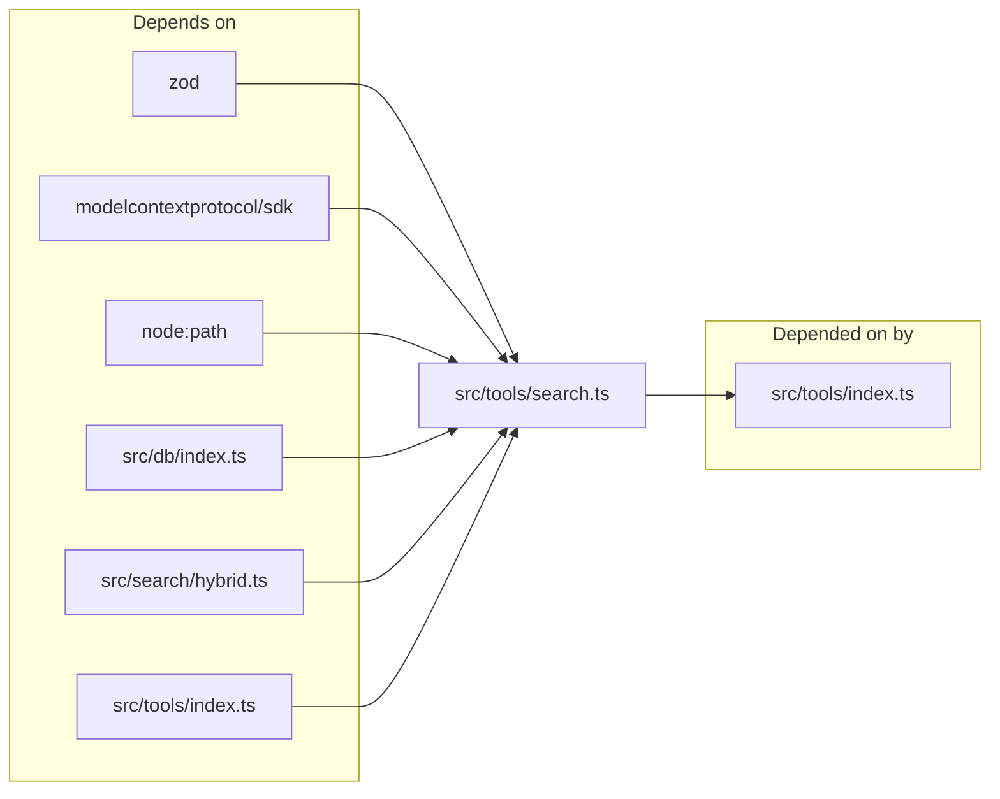
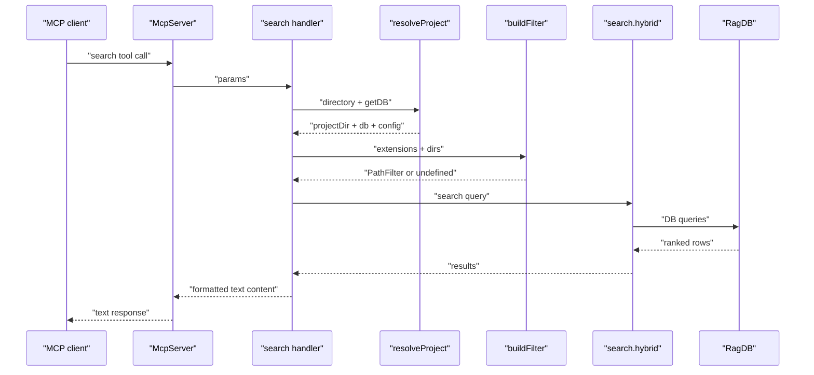

# Search MCP Tool

> [Architecture](../architecture.md)
>
> Generated from `b47d98e` · 2026-04-26

The Search MCP Tool community is a single-file adapter (`src/tools/search.ts`) that registers four MCP tool handlers — `search`, `read_relevant`, `search_symbols`, and `write_relevant` — against an `McpServer` instance. It owns no algorithm; the heavy lifting lives in the [Search Runtime](search-runtime.md). Its job is to translate MCP tool calls into `search`, `searchChunks`, or `searchSymbols` invocations and to format the textual response the agent sees.

## Dependencies and consumers

The module imports `z` from `zod` (for input schemas), the `McpServer` type from the `@modelcontextprotocol/sdk` package, `relative` and `resolve` from `node:path`, the `AnnotationRow` and `PathFilter` types from `src/db/index.ts`, the `search` and `searchChunks` functions from `src/search/hybrid.ts`, and `GetDB` plus `resolveProject` from `src/tools/index.ts`. Downstream, the tool registry under `src/tools/index.ts` calls `registerSearchTools` to wire the four handlers into the MCP server.

## Entry points

`registerSearchTools(server: McpServer, getDB: GetDB)` is the only export. It registers four `server.tool(...)` handlers in sequence and returns nothing — calling it once is the entire setup. The four tools are:

- **`search`** — natural-language or symbol-name query against the hybrid lexical+semantic index. Returns ranked file paths with snippet previews. Inputs: `query` (1–2000 chars), optional `directory`, `top`, `extensions`, `dirs`, `excludeDirs`. Default `top = config.searchTopK`.
- **`read_relevant`** — like `search` but returns full chunk contents with entity names and line ranges. Inputs add a `threshold` knob (default `0.3`); default `top = 8`. Surfaces matching annotations inline as `[NOTE]` blocks.
- **`search_symbols`** — name-based lookup against the pre-built symbol index. Inputs: optional `symbol`, optional `exact` (default false → substring), optional `type` (one of `function | class | interface | type | enum | export`), optional `directory`, optional `top` (default 20 when searching, 200 when listing). Returns each symbol's path, type, child count, reference counts, and re-export flag.
- **`write_relevant`** — semantic insertion-point finder. Inputs: `content` (1–5000 chars), optional `directory`, `top` (default 3), `threshold` (default 0.3). Internally fetches `topN * 3` chunks from `searchChunks` then dedupes to the highest-scoring chunk per file before slicing to `topN`.

Every handler resolves the project directory through `resolveProject(directory, getDB)`, which threads the optional `directory` arg through `RAG_PROJECT_DIR` env and `cwd()` and returns `{ projectDir, db, config }`. None of the handlers are exported individually — they're only reachable through MCP after `registerSearchTools` has run.

## How it works

The `search` handler measures wall time with `performance.now()`, calls `search(query, ragDb, top ?? config.searchTopK, 0, config.hybridWeight, config.generated, filter)`, and formats `results.length` rows as `score.toFixed(4)  path` followed by the first snippet (sliced to 400 chars). The header reports total indexed file count via `ragDb.getStatus().totalFiles` and the elapsed milliseconds. Empty results return a friendly message that suggests calling `index_files` first.

`read_relevant` calls `searchChunks` with the same hybrid weight and config, defaults `top = 8` and `threshold = 0.3`, then enriches the response with annotations. It batch-fetches `ragDb.getAnnotations(relPath)` for every unique result path (avoiding an N+1 query loop) and surfaces matching annotations as `[NOTE]` blocks above each chunk — an annotation matches when its `symbolName` is null (file-wide) or equals the chunk's `entityName`. The footer's tip pulls the first non-empty `entityName` from the result set so the suggestion (`call find_usages("<name>")`) is concrete rather than placeholder.

`search_symbols` is a thin wrapper over `ragDb.searchSymbols(symbol, exact, type, top)`. The result formatter shows the symbol's type plus optional child counts, reference counts, and a "re-export" tag, and slices any attached snippet to 300 characters. The footer's `find_usages` and `read_relevant` tips use the first result's symbol name.

`write_relevant` runs `searchChunks(content, ragDb, topN * 3, threshold ?? 0.3, hybridWeight, config.generated)` — the 3× over-fetch lets the per-file dedupe (a `Map<path, chunk>` keeping the highest-scoring chunk per path) still return `topN` distinct files. For each candidate it builds an "Insert after `<entityName>`" or "Insert after chunk N" hint and trails the last 150 chars of the chunk content as an anchor.

`buildFilter(projectDir, extensions, dirs, excludeDirs)` is the only private helper. It returns `undefined` when none of the three filter fields are populated (so the underlying search isn't slowed by an empty filter object), otherwise it resolves each `dirs` and `excludeDirs` entry against `projectDir` so the filter's absolute paths line up with what's stored in the index.

## See also

- [Architecture](../architecture.md)
- [Data flows](../data-flows.md)
- [Getting started](../getting-started.md)
- [MCP Tool Handlers](mcp-tools.md)
- [Search Runtime](search-runtime.md)
