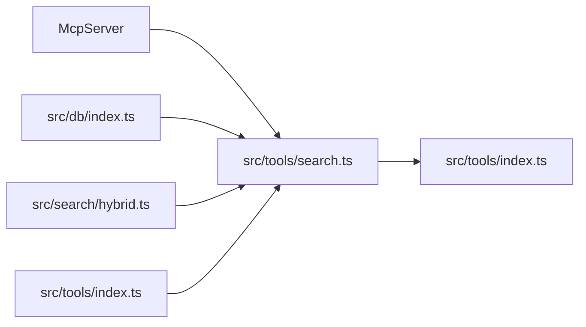

# Search MCP Tool

> [Architecture](../architecture.md)
>
> Generated from `79e963f` · 2026-04-26

The Search MCP Tool community is a single-file adapter between the MCP protocol and the Search Runtime community. It registers four search-related MCP tools — `search`, `read_relevant`, `search_symbols`, and `write_relevant` — by wiring their schemas and handlers to `src/search/hybrid.ts` and the DB layer. The file contains no retrieval logic of its own; its job is input validation, filter construction, and response formatting.

## Dependencies and consumers



`src/tools/search.ts` is consumed by `src/tools/index.ts`, which calls `registerSearchTools(server, getDB)` once at startup alongside the other tool registration functions. Its only dependencies are the MCP SDK, the DB facade, `src/search/hybrid.ts` (for `search` and `searchChunks`), and `src/tools/index.ts` (for `resolveProject` and the `GetDB` type).

## Entry points

`registerSearchTools` is the single export:

```ts
export function registerSearchTools(server: McpServer, getDB: GetDB)
```

It takes the live MCP server instance and a `GetDB` factory function (a closure that returns the `RagDB` singleton for a given project directory). All tool registrations happen synchronously inside the function body — there is no async initialization.

## How it works

`registerSearchTools` calls `server.tool(name, description, schema, handler)` four times. Each handler follows the same pattern: call `resolveProject(directory, getDB)` to obtain `projectDir`, `db`, and `config`, then build a `PathFilter` if scoping parameters are present, then delegate to the search layer.

### `search` — File-level semantic search

The `search` tool calls `search(query, ragDb, top ?? config.searchTopK, 0, config.hybridWeight, config.generated, filter)` and formats results as `score  path\n  snippet...` lines, capped at 400 characters per snippet. The threshold is hardcoded to `0` (no minimum score), so all returned results appear regardless of quality. The tool appends a footer tip suggesting `read_relevant` as the next step.

### `read_relevant` — Chunk-level semantic search

The `read_relevant` tool calls `searchChunks(query, ragDb, top ?? 8, threshold ?? 0.3, config.hybridWeight, config.generated, filter)`. Unlike `search`, it has a default threshold of `0.3` to filter low-quality matches. The response includes exact line ranges (`path:startLine-endLine`) when available, the entity name (function or class), and any annotations stored for the file/symbol. Annotations are batch-fetched for all unique result paths using `ragDb.getAnnotations(relPath)` — one query per unique path rather than per chunk — and filtered to chunks matching the entity name. The footer suggests `find_usages` for the top entity name.

### `search_symbols` — Exact symbol lookup

The `search_symbols` tool delegates to `ragDb.searchSymbols(symbol, exact ?? false, type, top)`. It formats results with enrichment metadata: symbol type, child count (for classes/interfaces), reference count and module count (for widely-used symbols), and re-export flag. The tool supports listing all exports by omitting the `symbol` parameter, filtered by `type` — which is how the wiki bundle builder discovers all symbols in a community.

### `write_relevant` — Insertion point finder

The `write_relevant` tool calls `searchChunks(content, ragDb, topN * 3, threshold ?? 0.3, ...)` with the content to insert (not a search query), deduplicates to the best-scoring chunk per file, and returns the top N candidates. Each result includes the chunk's entity name and the last 150 characters of its content as an anchor for the insertion point. This tool is used by developers to find the right file and position before adding new code.

### Filter construction

`buildFilter` (a module-private function) constructs a `PathFilter` from the optional `extensions`, `dirs`, and `excludeDirs` parameters. Directory paths are resolved to absolute using `resolve(projectDir, d)` because the DB stores absolute paths — passing relative dirs would produce empty results silently. If none of the three parameters are populated, `buildFilter` returns `undefined` and no filtering is applied.

## See also

- [Architecture](../architecture.md)
- [Data flows](../data-flows.md)
- [Getting started](../getting-started.md)
- [MCP Tool Handlers](mcp-tools.md)
- [Search Runtime](search-runtime.md)
